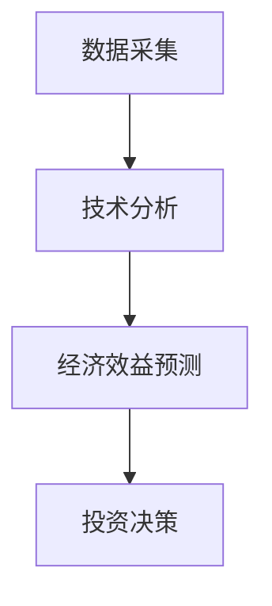

                 


# 价值投资中的太空垃圾回收技术发展前景

---

## 关键词：
- 太空垃圾回收
- 价值投资
- 技术评估
- 金融市场
- 可持续发展

---

## 摘要：
太空垃圾回收技术的发展前景与价值投资的结合，为我们提供了一个全新的视角来评估这一领域的投资潜力。本文从太空垃圾回收技术的背景与现状出发，分析其核心概念与价值投资的联系，探讨技术评估的算法原理与数学模型，结合系统架构设计与项目实战案例，深入剖析太空垃圾回收技术的市场潜力与投资策略。通过本文的分析，读者可以全面了解太空垃圾回收技术的未来发展方向及其在价值投资中的应用潜力。

---

## 第1章: 太空垃圾回收技术的背景与现状

### 1.1 太空垃圾的现状与问题
#### 1.1.1 太空垃圾的定义与分类
太空垃圾是指在地球轨道上运行的所有不再起作用的人造物体，包括卫星、火箭部件、碎片等。根据轨道高度，太空垃圾可分为低地球轨道（LEO）、中地球轨道（MEO）和高地球轨道（GEO）垃圾。

| 分类标准 | 分类内容                          |
|----------|----------------------------------|
| 轨道高度  | LEO (200-2000 km)、MEO (2000-35,000 km)、GEO (35,000 km以上) |
| 产生原因  | 卫星失效、火箭发射后遗弃部件、碰撞产生的碎片 |

#### 1.1.2 太空垃圾带来的问题与挑战
太空垃圾对卫星运行、航天器安全以及人类太空探索活动构成了严重威胁。具体问题包括：
- 卫星碰撞风险增加，导致通信中断。
- 航天器运行成本上升，威胁人类太空探索活动。
- 太空环境恶化，影响全球通信和导航系统。

#### 1.1.3 太空垃圾回收的重要性与必要性
回收太空垃圾不仅可以减少碰撞风险，还能降低太空环境的污染，为未来的太空探索活动创造更安全的环境。此外，回收技术的进步将推动相关产业的发展，为投资者带来新的机遇。

---

### 1.2 价值投资的基本概念
#### 1.2.1 价值投资的定义与核心理念
价值投资是一种以内在价值为导向的投资方法，强调以低于内在价值的价格购买优质资产。其核心理念是寻找市场低估的公司，长期持有，获得超额收益。

#### 1.2.2 价值投资与太空垃圾回收技术的结合
太空垃圾回收技术的市场潜力巨大，但目前尚未被市场充分认知。通过价值投资的方法，可以发现那些技术领先、估值合理的公司，提前布局这一领域。

#### 1.2.3 太空垃圾回收技术的市场前景与投资机会
随着太空探索活动的增加，太空垃圾的数量也在快速增长。回收技术的研发和商业化应用将带来巨大的经济价值和社会效益，为投资者提供丰厚的回报。

---

## 第2章: 太空垃圾回收技术的核心概念与联系

### 2.1 太空垃圾回收技术的原理与方法
#### 2.1.1 太空垃圾回收的主要技术手段
目前，太空垃圾回收的主要技术包括机械抓取、激光清理、磁性吸附等。每种技术都有其优缺点，适用于不同的场景。

| 技术手段 | 优点                     | 缺点                       |
|----------|--------------------------|---------------------------|
| 机械抓取 | 精准度高                 | 成本高，操作复杂           |
| 激光清理 | 非接触式，效率高         | 受天气条件限制             |
| 磁性吸附 | 成本低，适合大规模应用     | 仅适用于特定材质的垃圾     |

#### 2.1.2 各种技术的优缺点对比
通过对比不同技术的优缺点，我们可以更好地选择适合特定场景的回收方法。

#### 2.1.3 技术的未来发展与创新方向
未来，太空垃圾回收技术将朝着智能化、自动化方向发展，结合人工智能和大数据技术，提高回收效率和降低成本。

---

### 2.2 价值投资与太空垃圾回收技术的关系
#### 2.2.1 技术进步对投资价值的影响
技术进步将降低回收成本，提高回收效率，从而提升相关公司的盈利能力。

#### 2.2.2 市场需求与技术发展的互动关系
市场需求的增长将推动技术的创新，而技术的进步将进一步扩大市场需求。

#### 2.2.3 价值评估中的关键指标与方法
在价值评估中，我们需要关注公司的技术壁垒、市场占有率、成本优势等关键指标。

---

## 第3章: 太空垃圾回收技术的算法原理与数学模型

### 3.1 技术评估的算法流程
#### 3.1.1 数据采集与处理
通过卫星监测和地面观测，获取太空垃圾的位置、速度、轨道等数据。

#### 3.1.2 技术可行性分析
评估不同技术在实际应用中的可行性，包括技术成熟度、成本效益等。

#### 3.1.3 经济效益预测
基于技术可行性分析，预测回收技术的经济效益，包括收入、成本和利润。

#### 3.1.4 投资风险评估
结合市场风险、技术风险和政策风险，评估投资的总体风险。

---

### 3.2 技术评估的数学模型
#### 3.2.1 技术成熟度评估模型
$$ TM = \frac{成功案例数}{总案例数} \times 100\% $$

#### 3.2.2 市场需求预测模型
$$ MD = a \times T + b \times C + c \times R $$
其中，$T$ 表示技术成熟度，$C$ 表示成本，$R$ 表示市场认知度。

#### 3.2.3 投资回报率计算公式
$$ ROI = \frac{Net\ Profit}{Investment} \times 100\% $$

---

### 3.3 技术与投资的关联分析
#### 3.3.1 技术生命周期与投资周期的关系
技术生命周期分为导入期、成长期、成熟期和衰退期，投资周期应与技术生命周期相匹配。

#### 3.3.2 技术壁垒对投资价值的影响
高技术壁垒的公司具有更强的市场竞争力，投资价值更高。

#### 3.3.3 技术创新对投资收益的推动作用
技术创新将提升公司的竞争力，带来超额收益。

---

## 第4章: 太空垃圾回收技术的系统分析与架构设计

### 4.1 系统分析与设计
#### 4.1.1 系统架构设计
系统架构包括数据采集模块、技术分析模块、经济效益预测模块和投资决策模块。



#### 4.1.2 系统功能设计
系统功能模块包括数据采集、技术分析、经济效益预测和投资决策。

---

## 第5章: 太空垃圾回收技术的项目实战

### 5.1 项目实战
#### 5.1.1 环境安装
需要安装卫星监测系统、数据处理软件和投资分析工具。

#### 5.1.2 代码实现
以下是一个技术评估的Python代码示例：

```python
def calculate_return_on_investment(profit, investment):
    return (profit / investment) * 100

# 示例数据
profit = 1000000
investment = 5000000
roi = calculate_return_on_investment(profit, investment)
print(f"投资回报率为：{roi}%")
```

#### 5.1.3 案例分析
以某公司为例，分析其技术前景和投资价值。

---

## 第6章: 太空垃圾回收技术的最佳实践与小结

### 6.1 最佳实践 tips
- 关注技术壁垒高的公司。
- 结合市场认知度和成本因素进行投资决策。
- 保持长期视角，耐心持有优质资产。

### 6.2 项目小结
通过本文的分析，我们可以看到太空垃圾回收技术的巨大潜力和投资机会。投资者应结合技术评估和市场分析，选择具有竞争优势的公司进行投资。

---

## 结论
太空垃圾回收技术不仅是解决太空环境问题的重要手段，也是价值投资的新方向。通过科学的技术评估和合理的投资策略，投资者可以在这一领域获得丰厚的回报。

---

## 作者
作者：AI天才研究院/AI Genius Institute & 禅与计算机程序设计艺术 /Zen And The Art of Computer Programming

