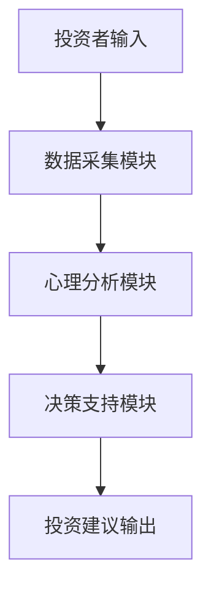
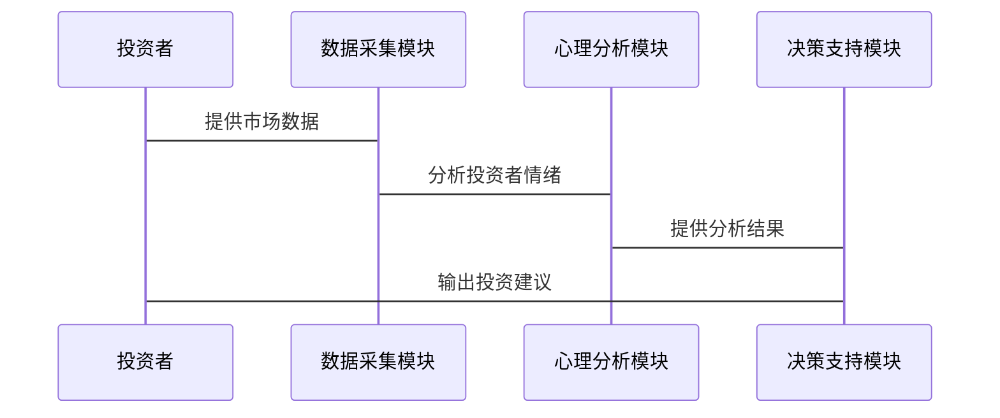

                 


# 《价值投资中的心理学：克服人性弱点》

> **关键词**：价值投资、心理学、人性弱点、投资决策、贪婪、恐惧、理性分析  
> **摘要**：本文深入探讨了价值投资中的心理学因素，特别是如何克服人性中的贪婪与恐惧等弱点，以做出更理性的投资决策。文章从背景介绍、核心概念、算法原理、数学模型、系统架构、项目实战到最佳实践，全面分析了心理学在价值投资中的重要性，并提供了实际案例和系统化的解决方案。

---

## 第一部分：价值投资与心理学基础

### 第1章：价值投资的背景与核心理念

#### 1.1 价值投资的定义与核心理念

**1.1.1 价值投资的定义**

价值投资是一种基于对公司内在价值分析的投资策略，由本杰明·格雷厄姆和戴维·多德提出。其核心在于寻找市场价格低于其内在价值的公司进行投资，长期持有，等待市场价回归其真实价值。这种方法强调安全边际，即买入价格与内在价值之间的差距，以降低投资风险。

**1.1.2 价值投资的核心理念**

- **安全边际**：买入价格低于内在价值，确保即使出现估值偏差，也能获得正收益。
- **长期视角**：关注公司的基本面，如盈利能力、财务健康、行业地位等，而非短期市场波动。
- **逆向思维**：在市场恐慌时寻找低估机会，在市场狂热时保持冷静。

**1.1.3 价值投资与其它投资策略的区别**

与趋势投资、技术分析等策略不同，价值投资强调对公司内在价值的深入研究，而非依赖市场趋势或技术指标。它更注重长期稳健回报，而非短期收益。

---

#### 1.2 投资中的心理学背景

**1.2.1 投资中的心理因素概述**

投资决策不仅受市场数据和基本面分析的影响，还深深植根于心理因素。投资者的心理状态、认知偏差和情绪波动常常导致非理性决策，进而影响投资结果。

**1.2.2 人性中的贪婪与恐惧**

- **贪婪**：市场上涨时，投资者容易过度乐观，追求短期收益，忽视潜在风险。
- **恐惧**：市场下跌时，投资者容易过度悲观，急于卖出，错失长期机会。

**1.2.3 心理学在价值投资中的重要性**

心理学帮助投资者识别和克服人性弱点，如贪婪和恐惧，从而做出更理性的决策。通过自我认知和行为调整，投资者可以更好地遵循价值投资的原则，避免情绪化交易。

---

## 第二部分：人性的弱点与投资决策

### 第2章：人性弱点的具体表现与影响

#### 2.1 认知偏差与投资决策

- **确认偏差**：投资者倾向于寻找支持自己观点的信息，忽略反面证据。
- **损失厌恶**：投资者对损失的恐惧远超过对收益的渴望，导致卖出行为。
- **过度自信**：投资者高估自己的判断能力，忽略不确定性。

#### 2.2 情绪波动与投资行为

- **市场的非理性**：市场情绪常常导致价格偏离内在价值。
- **投资者的行为偏差**：如频繁交易、追涨杀跌，这些行为往往损害投资收益。

#### 2.3 人性弱点如何导致错误决策

通过案例分析，展示人性弱点如何影响投资决策。例如，2008年金融危机期间，投资者的恐慌性抛售导致市场低估，但许多投资者未能坚持价值投资原则，错失复苏机会。

---

## 第三部分：心理学与投资决策的数学模型

### 第3章：数学模型与算法原理

#### 3.1 心理学因素的量化分析

- **均值回归模型**：用于分析市场价格与内在价值的偏离程度。
- **情绪指数模型**：通过市场情绪指标预测市场走势。

#### 3.2 基于心理学的决策算法

- **决策树分析**：帮助投资者在不同情境下做出最优选择。
- **风险管理模型**：通过VaR（在险价值）等指标量化投资风险。

#### 3.3 数学公式与模型解读

**3.3.1 均值回归模型**

$$ \text{回归值} = \mu + \beta(t - T) $$

其中，$\mu$是长期平均值，$\beta$是回归系数，$t$是当前时间，$T$是回归时间。

**3.3.2 情绪指数模型**

$$ \text{情绪指数} = \alpha \cdot \text{成交量} + \beta \cdot \text{波动率} $$

其中，$\alpha$和$\beta$是权重系数，成交量和波动率用于衡量市场情绪。

---

## 第四部分：系统分析与架构设计方案

### 第4章：系统分析与架构设计

#### 4.1 问题场景介绍

- **目标**：构建一个基于心理学的价值投资决策系统。
- **需求**：分析市场数据、评估公司基本面、识别心理偏差，制定投资策略。

#### 4.2 系统功能设计

- **数据采集**：收集市场数据和公司基本面信息。
- **心理分析**：识别投资者的认知偏差和情绪波动。
- **决策支持**：提供基于心理学的投资建议。

#### 4.3 系统架构设计（Mermaid架构图）



#### 4.4 系统接口设计

- **输入接口**：接收市场数据和公司基本面信息。
- **输出接口**：提供投资建议和风险提示。

#### 4.5 系统交互设计（Mermaid序列图）



---

## 第五部分：项目实战

### 第5章：项目实战与案例分析

#### 5.1 项目环境安装

- **工具安装**：安装数据分析工具（如Python、Pandas）、心理分析工具（如情绪指数计算工具）。
- **数据源配置**：获取市场数据和公司基本面数据。

#### 5.2 系统核心实现（Python代码）

```python
import pandas as pd

# 数据采集模块
def collect_data(tickers):
    data = {}
    for ticker in tickers:
        # 获取市场数据
        market_data = pd.read_csv(f'market_{ticker}.csv')
        # 获取基本面数据
        financials = pd.read_csv(f'financial_{ticker}.csv')
        data[ticker] = {'market': market_data, 'financials': financials}
    return data

# 心理分析模块
def analyze_emotion(data):
    emotion_scores = {}
    for ticker, info in data.items():
        # 计算情绪指数
        emotion = info['market']['volume'].mean() * 0.5 + info['market']['volatility'].mean() * 0.5
        emotion_scores[ticker] = emotion
    return emotion_scores

# 决策支持模块
def generate_advice(emotion_scores, threshold=0.6):
    advice = {}
    for ticker, score in emotion_scores.items():
        if score < threshold:
            advice[ticker] = '买入'
        elif score > 1 - threshold:
            advice[ticker] = '卖出'
        else:
            advice[ticker] = '观望'
    return advice

# 主函数
def main():
    tickers = ['AAPL', 'MSFT', 'GOOGL']
    data = collect_data(tickers)
    emotion_scores = analyze_emotion(data)
    advice = generate_advice(emotion_scores)
    print(advice)

if __name__ == '__main__':
    main()
```

#### 5.3 项目小结

通过项目实战，我们展示了如何将心理学因素融入价值投资决策系统。代码实现了数据采集、情绪分析和投资建议生成，帮助投资者克服人性弱点，做出更理性的决策。

---

## 第六部分：最佳实践与总结

### 第6章：最佳实践与小结

#### 6.1 最佳实践

- **制定严格的交易纪律**：避免情绪化交易，坚持价值投资原则。
- **定期复盘与反思**：分析投资决策中的心理偏差，不断改进。
- **保持耐心与纪律性**：长期持有优质资产，避免短期波动干扰。

#### 6.2 小结

心理学在价值投资中起着关键作用。通过识别和克服人性弱点，投资者可以做出更理性的决策，实现长期稳健收益。

#### 6.3 注意事项

- **避免过度自信**：客观评估自己的投资能力，避免高估判断力。
- **保持学习与进化**：市场变化不断，投资策略需与时俱进。

#### 6.4 拓展阅读

- 格雷厄姆《证券分析》
- 克里斯托弗·卡森《心理学与投资》
- 哈佛商学院相关心理学与投资课程

---

## 结语

价值投资不仅需要对公司内在价值的深刻理解，还需要克服人性中的贪婪与恐惧。通过心理学分析和系统化的方法，投资者可以更好地管理情绪，做出更理性的决策。希望本文能为您提供实用的见解，帮助您在投资道路上走得更稳、更远。

---

**作者：AI天才研究院/AI Genius Institute & 禅与计算机程序设计艺术 /Zen And The Art of Computer Programming**

