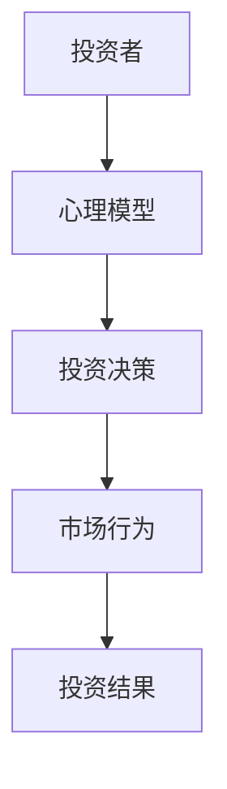

                 

# 价值投资中的心理学：克服人性弱点

---

## 关键词：
价值投资、心理学、人性弱点、情绪管理、投资决策、心理模型

---

## 摘要：
价值投资不仅仅是对市场的分析，更是对人性的深刻洞察。本文将从心理学的角度，分析投资过程中常见的心理偏差和情绪干扰，探讨如何克服人性弱点，制定科学的投资策略，实现长期稳健的收益。

---

## 第一部分：价值投资中的心理学基础

### 第1章：投资中的心理学基础

#### 1.1 价值投资与心理学的关联

##### 1.1.1 价值投资的核心概念
- 价值投资是一种长期投资策略，强调以合理价格买入优质资产。
- 核心理念：市场先生是不可预测的，投资的本质是寻找企业的内在价值。

##### 1.1.2 心理学在投资中的重要性
- 投资决策不仅依赖于逻辑分析，还受到心理因素的深刻影响。
- 心理学帮助投资者理解自己和市场的行为模式，避免情绪化决策。

##### 1.1.3 人性弱点对投资决策的影响
- 人性弱点（贪婪、恐惧等）可能导致投资者做出错误决策。
- 心理学研究这些弱点，帮助投资者克服认知偏差。

**Mermaid图表：心理模型与投资决策的关系**

---

#### 1.2 投资者心理模型

##### 1.2.1 理性决策与感性决策的平衡
- 理性决策：基于数据和逻辑，追求最优解。
- 感性决策：受情绪和直觉影响，可能偏离理性。

##### 1.2.2 心理偏差的分类
| 偏差类型 | 定义 | 示例 |
|----------|------|------|
| 确认偏差  | 过度关注支持自己观点的信息 | 投资者倾向于寻找支持自己判断的信息 |
| 过度自信 | 高估自己判断的准确性 | 过度相信自己的分析能力 |
| 可得性偏差 | 依赖容易获取的信息 | 依赖最近的市场表现做决策 |

##### 1.2.3 心理模型对投资行为的影响
- 心理模型帮助投资者建立对市场的认知框架。
- 正确的心理模型能够减少认知偏差，提高决策质量。

---

### 第2章：人性的弱点与投资决策

#### 2.1 贪婪与恐惧

##### 2.1.1 贪婪的定义与表现
- 贪婪：渴望获得超额收益，可能导致过度投资。
- 表现：在市场上涨时追高，忽视潜在风险。

##### 2.1.2 恐惧的定义与表现
- 恐惧：对损失的害怕，可能导致错失良机。
- 表现：在市场下跌时恐慌性抛售，忽视长期价值。

##### 2.1.3 贪婪与恐惧对投资决策的影响
- 贪婪可能导致高位买入，恐惧可能导致低位卖出。
- 两者都违背了价值投资的长期理念。

---

#### 2.2 过度自信

##### 2.2.1 过度自信的定义
- 过度自信：投资者高估自己对市场的理解能力。
- 表现：过于相信自己的分析能力，忽视外部意见。

##### 2.2.2 过度自信的表现
- 过度自信可能导致过度交易和错误判断。
- 例如，投资者可能认为自己能够准确预测市场走势。

##### 2.2.3 过度自信对投资决策的影响
- 过度自信可能导致投资者忽视风险，做出冒险决策。
- 过度自信的投资者可能对市场变化反应过度。

---

#### 2.3 从众心理

##### 2.3.1 从众心理的定义
- 从众心理：跟随大多数人的行为模式。
- 表现：在市场热点时跟风投资，忽视独立思考。

##### 2.3.2 从众心理的表现
- 从众心理可能导致投资者忽略基本面分析。
- 例如，投资者可能因为市场趋势而买入高估值股票。

##### 2.3.3 从众心理对投资决策的影响
- 从众心理可能导致投资者错失长期收益。
- 例如，投资者可能在市场高点时跟随买入，导致亏损。

---

### 第3章：情绪与决策

#### 3.1 情绪对投资决策的影响

##### 3.1.1 情绪的定义与分类
- 情绪是人类对特定情境的反应，分为积极和消极两类。
- 情绪波动可能导致投资者做出非理性决策。

##### 3.1.2 情绪对理性决策的干扰
- 情绪波动可能导致投资者忽视长期目标。
- 例如，市场下跌时，投资者可能因恐惧而抛售股票。

##### 3.1.3 情绪在投资中的具体表现
- 情绪化的投资者可能在市场波动时频繁交易。
- 例如，投资者可能因市场上涨而贪婪地加仓，因下跌而恐慌性抛售。

---

#### 3.2 理性与感性决策的平衡

##### 3.2.1 理性决策的优势
- 理性决策基于逻辑分析，能够避免情绪干扰。
- 例如，投资者根据基本面分析做出决策，而非市场情绪。

##### 3.2.2 感性决策的劣势
- 感性决策可能导致错误判断，增加投资风险。
- 例如，投资者因贪婪而忽视风险，导致亏损。

##### 3.2.3 如何在投资中实现平衡
- 建立明确的投资策略，避免情绪干扰。
- 例如，投资者可以通过制定严格的买卖规则来约束感性决策。

---

### 第4章：认知偏差与投资决策

#### 4.1 认知偏差的定义与分类

##### 4.1.1 确认偏差
- 确认偏差：投资者倾向于寻找支持自己观点的信息。
- 表现：投资者可能忽视与自己观点相悖的证据。

##### 4.1.2 过度自信偏差
- 过度自信偏差：投资者高估自己对市场的理解能力。
- 表现：投资者可能过度自信地进行交易。

##### 4.1.3 可得性偏差
- 可得性偏差：投资者依赖容易获取的信息。
- 表现：投资者可能根据最近的市场表现做出决策。

---

#### 4.2 认知偏差对投资决策的影响

##### 4.2.1 认知偏差如何影响投资判断
- 认知偏差可能导致投资者做出错误判断。
- 例如，投资者可能因确认偏差而忽略不利信息。

##### 4.2.2 认知偏差如何导致错误决策
- 认知偏差可能导致投资者过度交易或错失良机。
- 例如，投资者可能因过度自信而忽视市场风险。

##### 4.2.3 认知偏差的典型案例分析
- 案例：投资者因可得性偏差而误判市场趋势。

---

### 第5章：克服人性弱点的策略

#### 5.1 建立正确的投资心态

##### 5.1.1 投资心态的定义
- 投资心态是投资者在市场中的心理状态。
- 正确的心态能够帮助投资者避免情绪干扰。

##### 5.1.2 如何培养正确的投资心态
- 培养长期思维，关注企业的内在价值。
- 例如，投资者可以通过学习价值投资理念来建立正确心态。

##### 5.1.3 投资心态对长期收益的影响
- 正确的心态能够帮助投资者坚持长期投资策略。
- 例如，投资者在市场下跌时保持冷静，避免恐慌性抛售。

---

#### 5.2 提高自我认知能力

##### 5.2.1 自我认知的定义
- 自我认知是投资者对自己心理状态的了解。
- 提高自我认知能力能够帮助投资者避免认知偏差。

##### 5.2.2 如何提高自我认知能力
- 通过反思和总结，识别自己的心理偏差。
- 例如，投资者可以记录投资决策的过程，分析自己的心理状态。

##### 5.2.3 自我认知对投资决策的作用
- 自我认知能够帮助投资者识别和纠正认知偏差。
- 例如，投资者通过反思可以发现自己的过度自信问题。

---

#### 5.3 制定科学的投资策略

##### 5.3.1 投资策略的定义
- 投资策略是投资者为实现目标而采取的具体方法。
- 科学的投资策略能够帮助投资者避免情绪干扰。

##### 5.3.2 如何制定科学的投资策略
- 基于基本面分析和长期价值判断。
- 例如，投资者可以制定买入优质企业的策略，避免短期波动的干扰。

##### 5.3.3 投资策略对长期收益的影响
- 科学的投资策略能够帮助投资者实现长期稳健收益。
- 例如，投资者通过长期持有优质股票，避免短期波动的影响。

---

### 第6章：经典案例分析

#### 6.1 投资者人性弱点的经典案例

##### 6.1.1 贪婪导致的崩盘
- 案例：投资者因贪婪而高位买入，导致亏损。
- 分析：贪婪可能导致投资者忽视风险，做出错误决策。

##### 6.1.2 恐惧导致的错失良机
- 案例：投资者因恐惧而恐慌性抛售，错失反弹机会。
- 分析：恐惧可能导致投资者忽视长期价值，做出错误决策。

##### 6.1.3 从众心理导致的跟风投资
- 案例：投资者因从众心理而跟风投资，导致亏损。
- 分析：从众心理可能导致投资者忽视基本面分析，做出错误决策。

---

#### 6.2 如何从案例中吸取教训

##### 6.2.1 案例分析的方法
- 通过分析案例，识别人性弱点的影响。
- 例如，投资者可以分析市场崩盘的原因，识别其中的心理因素。

##### 6.2.2 如何避免案例中的错误
- 建立正确的投资心态，避免情绪干扰。
- 例如，投资者可以通过制定严格的买卖规则来避免从众心理。

##### 6.2.3 案例对投资策略的启示
- 认识到人性弱点对投资决策的影响，制定科学的投资策略。
- 例如，投资者可以通过长期持有优质股票，避免短期波动的影响。

---

## 结语

价值投资不仅是对市场的分析，更是对人性的深刻洞察。通过克服人性弱点，制定科学的投资策略，投资者可以实现长期稳健的收益。记住，投资不是一场与市场的博弈，而是一场与自己内心的较量。

---

## 作者：AI天才研究院/AI Genius Institute & 禅与计算机程序设计艺术 /Zen And The Art of Computer Programming

