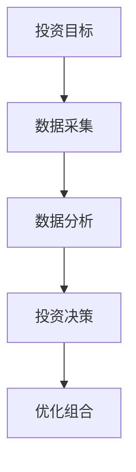
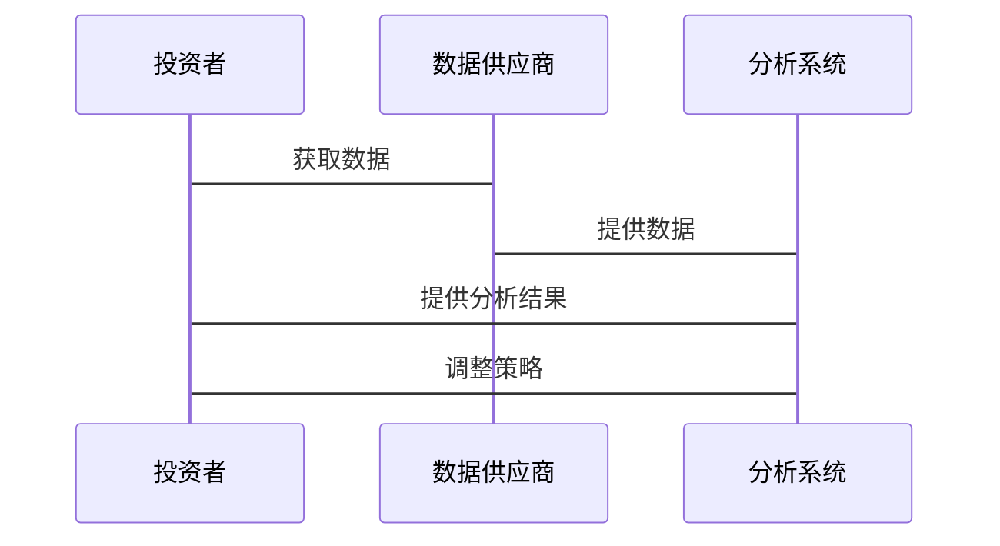

                 


# 价值投资中的新兴市场机会：高风险下的高回报

> 关键词：价值投资，新兴市场，高风险，高回报，投资策略，风险管理

> 摘要：本文深入探讨了在新兴市场中进行价值投资的机会与挑战。通过分析新兴市场的特点、价值投资的核心理念、具体的策略实施和风险管理，本文为投资者提供了在高风险环境下捕捉高回报的详细指南。结合实际案例和系统架构，本文为读者提供了全面的视角和实用的建议。

---

# 第一部分: 新兴市场的定义与特点

## 第1章: 新兴市场的定义与分类

### 1.1 新兴市场的概念与分类

#### 1.1.1 新兴市场的定义
新兴市场是指那些经济发展迅速、但尚未达到发达国家水平的国家的金融市场。这些市场通常位于亚洲、拉丁美洲和东欧等地，具有较高的增长潜力，但也伴随着较高的风险。

#### 1.1.2 新兴市场的分类与分布
新兴市场可以按照经济发展水平、市场规模和地理位置进行分类。主要的新兴市场包括中国、印度、巴西、墨西哥和泰国等。

#### 1.1.3 新兴市场与发达市场的对比
- 经济增长速度：新兴市场通常增长更快，但波动性更大。
- 市场规模：新兴市场的市场规模较小，但增长潜力更大。
- 风险因素：新兴市场面临更多的政治和经济风险。

### 1.2 新兴市场的投资机会

#### 1.2.1 新兴市场的经济增长潜力
新兴市场国家的GDP增长率通常高于发达市场，特别是在制造业和服务业领域。

#### 1.2.2 新兴市场的行业分布特点
新兴市场中，科技、消费、金融和能源等行业具有较高的增长潜力。

#### 1.2.3 新兴市场中的蓝筹股与成长股
蓝筹股：代表新兴市场的成熟企业和行业龙头。
成长股：具有高增长潜力的中小型公司。

### 1.3 新兴市场的风险与挑战

#### 1.3.1 政治风险与政策不确定性
新兴市场的政治不稳定和政策变化可能对投资产生重大影响。

#### 1.3.2 经济波动与货币风险
新兴市场的货币波动较大，容易受到外部经济环境的影响。

#### 1.3.3 市场流动性与信息不对称
新兴市场的流动性较低，投资者可能面临信息不对称的问题。

---

## 第2章: 价值投资的核心理念与方法

### 2.1 价值投资的基本原理

#### 2.1.1 价值投资的定义与核心要素
价值投资是一种长期投资策略，强调以低于内在价值的价格买入优质资产。

#### 2.1.2 价值投资与成长投资的区别
- 价值投资：注重低估值，追求安全边际。
- 成长投资：注重高增长，愿意支付溢价。

#### 2.1.3 价值投资的长期视角
价值投资强调长期持有优质资产，避免短期市场的波动干扰。

### 2.2 价值投资的关键指标与估值方法

#### 2.2.1 市盈率（P/E）的计算与应用
市盈率 = 股价 / 每股净利润
- 低市盈率可能意味着低估。

#### 2.2.2 市净率（P/B）的计算与应用
市净率 = 股价 / 每股净资产
- 低市净率可能意味着资产被低估。

#### 2.2.3 股息率与股息支付率的分析
股息率 = 每股股息 / 股价
- 高股息率可能意味着收益稳定。

### 2.3 价值投资的实施步骤

#### 2.3.1 确定投资目标与策略
- 明确投资目标：收益目标和风险承受能力。
- 制定投资策略：买入低估资产，长期持有。

#### 2.3.2 基本面分析与公司估值
- 评估公司的财务状况：利润、负债、现金流。
- 评估公司的竞争优势：行业地位、核心竞争力。

#### 2.3.3 构建投资组合与风险控制
- 分散投资：避免过度集中。
- 定期调整：根据市场变化和公司情况调整持仓。

---

## 第3章: 新兴市场中的价值投资策略

### 3.1 新兴市场的行业分析与投资机会

#### 3.1.1 新兴市场的周期性行业分析
- 周期性行业：如制造业、房地产。
- 投资机会：周期性行业的低估阶段。

#### 3.1.2 新兴市场的成长性行业分析
- 成长性行业：如科技、消费。
- 投资机会：高增长潜力的公司。

#### 3.1.3 新兴市场的防御性行业分析
- 防御性行业：如公用事业、金融。
- 投资机会：稳定收益。

### 3.2 新兴市场中的个股选择策略

#### 3.2.1 识别低估公司的方法
- 低市盈率、低市净率。
- 高股息率。

#### 3.2.2 公司财务指标分析与估值
- 利润表：收入、利润。
- 资产负债表：资产、负债。
- 现金流量表：现金流。

#### 3.2.3 公司治理与管理层评估
- 公司治理结构：董事会、管理层。
- 管理层素质：经验、声誉。

### 3.3 新兴市场的投资组合构建

#### 3.3.1 投资组合的分散化策略
- 行业分散：避免集中。
- 地区分散：多元化布局。

#### 3.3.2 行业与地区的配置比例
- 根据风险偏好和增长潜力调整比例。

#### 3.3.3 定期调整与再平衡
- 定期审视持仓：根据市场变化调整。
- 再平衡：保持配置比例。

---

## 第4章: 新兴市场投资中的风险管理

### 4.1 风险管理的基本原则

#### 4.1.1 风险与收益的平衡
- 高风险不一定带来高回报。
- 评估风险承受能力。

#### 4.1.2 投资组合的风险度量
- 风险指标：波动率、VaR。
- 风险分散：降低整体风险。

#### 4.1.3 风险偏好与风险承受能力
- 保守型：低风险。
- 进取型：高风险。

### 4.2 新兴市场的特定风险

#### 4.2.1 政治风险的应对策略
- 关注政策变化。
- 选择政治稳定的国家。

#### 4.2.2 经济波动的应对策略
- 分散投资：减少波动影响。
- 灵活调整：根据经济变化调整。

#### 4.2.3 市场流动性风险的应对策略
- 避免集中投资。
- 关注市场深度。

### 4.3 价值投资中的风险管理工具

#### 4.3.1 期权与期货的使用
- 期权：对冲价格波动。
- 期货：锁定价格。

#### 4.3.2 股票质押与融资的风险控制
- 股票质押：作为融资手段。
- 风险控制：避免过度杠杆。

#### 4.3.3 多元化投资的风险分散
- 跨行业、跨地区投资。

---

## 第5章: 新兴市场价值投资的案例分析

### 5.1 新兴市场中的成功案例

#### 5.1.1 某新兴市场的价值投资案例
- 公司名称：XYZ公司。
- 行业：科技。
- 投资策略：低市盈率、高增长。

#### 5.1.2 投资过程与结果
- 投资时间：2015年。
- 投资回报：年化回报率15%。

### 5.2 案例分析总结

#### 5.2.1 成功因素总结
- 识别低估公司。
- 长期持有。

#### 5.2.2 教训与经验
- 风险管理的重要性。
- 行业选择的关键性。

---

## 第6章: 新兴市场投资的系统分析与架构设计

### 6.1 问题场景介绍

#### 6.1.1 投资目标
- 追求高回报。
- 控制风险。

#### 6.1.2 系统功能设计
- 数据采集：市场数据、公司财务数据。
- 数据分析：估值模型、风险评估。
- 投资决策：策略制定、组合优化。

### 6.2 系统架构设计

#### 6.2.1 系统架构图


#### 6.2.2 系统接口设计
- 数据接口：与数据供应商对接。
- 用户接口：投资者使用的界面。

#### 6.2.3 系统交互序列图


---

## 第7章: 项目实战

### 7.1 环境安装

#### 7.1.1 数据获取工具
- Python的pandas库。
- 数据接口API。

#### 7.1.2 数据分析工具
- Python的numpy库。
- 数据可视化工具。

### 7.2 核心实现源代码

#### 7.2.1 数据采集代码
```python
import pandas as pd

# 从API获取数据
def get_data(api_key):
    import requests
    url = "https://api.example.com/data"
    headers = {'Authorization': f'Bearer {api_key}'}
    response = requests.get(url, headers=headers)
    return pd.DataFrame(response.json())
```

#### 7.2.2 估值模型代码
```python
def calculate_value(ticker):
    df = get_data(api_key)
    pe = df['PE'].mean()
    pb = df['PB'].mean()
    return pe, pb
```

### 7.3 应用解读与分析

#### 7.3.1 案例分析
- 公司名称：ABC公司。
- 行业：消费。
- 估值结果：PE=10，PB=1.5。
- 投资决策：买入。

#### 7.3.2 数据模型与结果展示
- 图表：PE和PB分布图。
- 表格：公司估值对比表。

### 7.4 项目小结

#### 7.4.1 成功经验总结
- 数据准确性的重要性。
- 模型的有效性。

#### 7.4.2 经验教训
- 数据获取的挑战。
- 模型的局限性。

---

## 第8章: 总结与展望

### 8.1 总结

#### 8.1.1 核心观点回顾
- 新兴市场的高增长潜力。
- 价值投资的长期视角。

#### 8.1.2 成功经验总结
- 识别低估公司。
- 风险管理的重要性。

### 8.2 展望

#### 8.2.1 未来趋势
- 新兴市场的进一步开放。
- 数字经济的发展。

#### 8.2.2 投资机会展望
- 科技、消费和绿色能源行业的投资机会。

---

## 第9章: 最佳实践 tips、小结、注意事项、拓展阅读

### 9.1 最佳实践 tips

#### 9.1.1 投资前的准备工作
- 了解市场。
- 制定计划。

#### 9.1.2 风险管理的关键性
- 设置止损点。
- 定期评估。

### 9.2 小结

#### 9.2.1 文章核心内容回顾
- 新兴市场的特点。
- 价值投资的策略。
- 风险管理的重要性。

### 9.3 注意事项

#### 9.3.1 投资者需注意的事项
- 避免情绪化决策。
- 保持长期视角。

#### 9.3.2 专业建议的重要性
- 寻求专业意见。
- 不断学习。

### 9.4 拓展阅读

#### 9.4.1 推荐书籍
- 《价值投资入门》。
- 《新兴市场投资指南》。

#### 9.4.2 在线资源
- 投资博客。
- 行业报告。

---

# 作者：AI天才研究院/AI Genius Institute & 禅与计算机程序设计艺术 /Zen And The Art of Computer Programming

