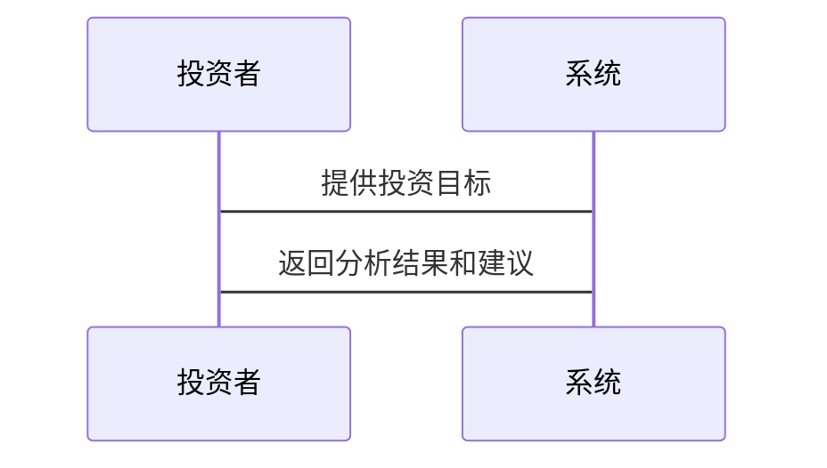

                 


# 价值投资中的新兴市场机遇与风险

---

## 关键词：价值投资、新兴市场、投资风险、投资机会、数学模型、系统设计

---

## 摘要：

本文系统探讨了价值投资在新兴市场中的机遇与风险。通过分析价值投资的核心理论和新兴市场的特点，结合数学模型和系统设计，展示了如何在新兴市场中识别投资机会并规避风险。文章通过具体案例分析和实战指导，帮助投资者在新兴市场中应用价值投资策略，实现长期稳健收益。

---

# 第一部分: 价值投资与新兴市场的背景介绍

## 第1章: 价值投资的基本概念

### 1.1 价值投资的定义与核心理念

价值投资是一种基于对公司内在价值评估的投资策略，由本杰明·格雷厄姆提出。其核心理念是寻找市场价格低于内在价值的公司进行投资，强调安全边际和长期持有的原则。新兴市场作为高增长潜力的地区，为价值投资者提供了丰富的投资机会。

#### 1.1.1 价值投资的起源与发展

价值投资起源于20世纪，格雷厄姆的学生彼得·林奇和沃伦·巴菲特进一步发展了这一理论。价值投资在成熟市场和新兴市场中的应用各有特点，但在本质上都强调基本面分析和长期投资。

#### 1.1.2 价值投资的核心理念

- **内在价值**：公司未来现金流的现值。
- **安全边际**：市场价格低于内在价值的部分，确保投资的安全性。
- **长期持有**：避免短期波动，关注公司长期增长。

#### 1.1.3 价值投资与新兴市场的结合

新兴市场的高增长潜力和高波动性为价值投资提供了独特的机会。投资者需要结合新兴市场的特点，调整价值投资策略，如关注成长型公司和行业龙头。

---

### 1.2 新兴市场的定义与特点

新兴市场是指经济快速发展但尚未完全工业化的国家，如中国、印度等。这些市场的特点包括高增长率、高波动性、不完善的法律体系和较高的政策风险。

#### 1.2.1 新兴市场的定义

新兴市场通常指那些GDP增长迅速、人均收入较低但正在快速提升的国家。这些市场具有较大的增长潜力，但也伴随着较高的风险。

#### 1.2.2 新兴市场的特点

- **高增长率**：新兴市场的GDP增速通常高于发达市场。
- **高波动性**：新兴市场的股市波动较大，受政策和外部环境影响显著。
- **不完善的法律体系**：新兴市场可能存在法律不完善、监管不力的问题。
- **较高的政策风险**：新兴市场政策变化频繁，可能对市场产生重大影响。

#### 1.2.3 新兴市场与发达国家市场的对比

| 特性          | 新兴市场                  | 发达国家市场              |
|---------------|--------------------------|--------------------------|
| GDP增速       | 高                      | 低或中等                 |
| 波动性         | 高                      | 低                      |
| 法律体系       | 不完善                  | 完善                    |
| 政策风险       | 高                      | 低                      |

---

### 1.3 价值投资在新兴市场中的重要性

#### 1.3.1 新兴市场的增长潜力

新兴市场的高增长率意味着更多的投资机会，尤其是那些具有竞争优势和良好治理的公司。

#### 1.3.2 新兴市场的风险与挑战

新兴市场的高波动性和政策风险可能对价值投资策略产生挑战，需要投资者具备较高的风险识别和管理能力。

#### 1.3.3 价值投资在新兴市场中的应用前景

通过深入分析公司基本面，识别低估公司，价值投资在新兴市场中具有广阔的应用前景，尤其是那些处于成长期的行业和公司。

---

## 1.4 本章小结

本章介绍了价值投资的基本概念和新兴市场的定义与特点，强调了价值投资在新兴市场中的重要性。下一章将深入探讨价值投资的理论基础和新兴市场的独特性。

---

# 第二部分: 价值投资的核心概念与理论基础

## 第2章: 价值投资的理论基础

### 2.1 格雷厄姆的价值投资理论

#### 2.1.1 格雷厄姆的定义

格雷厄姆的价值投资理论强调安全边际和内在价值。他认为，市场价格波动是投资的机会，而内在价值是公司未来现金流的现值。

#### 2.1.2 安全边际的概念

安全边际是市场价格与内在价值之间的差额，确保投资的安全性。格雷厄姆建议以低于内在价值的价格买入股票。

#### 2.1.3 内在价值的计算方法

内在价值的计算方法如下：

$$
\text{内在价值} = \sum_{t=1}^{n} \frac{\text{现金流}_t}{(1 + r)^t}
$$

其中，$r$是折现率，$\text{现金流}_t$是第$t$年的现金流。

---

### 2.2 新兴市场的独特性

#### 2.2.1 新兴市场的经济结构

新兴市场的经济结构以制造业和服务业为主，增长速度快，但波动性较大。

#### 2.2.2 新兴市场的行业特点

新兴市场中，科技、消费和金融等行业具有较高的增长潜力。

#### 2.2.3 新兴市场的政策环境

新兴市场的政策环境不稳定，容易受到政策变化的影响，如贸易政策和货币波动。

---

### 2.3 价值投资与新兴市场的结合

#### 2.3.1 新兴市场中的价值投资机会

新兴市场中，许多公司因市场波动被低估，提供了价值投资的机会。

#### 2.3.2 新兴市场中的价值投资风险

新兴市场的高波动性和政策风险增加了价值投资的难度。

#### 2.3.3 价值投资在新兴市场中的策略调整

投资者需要调整价值投资策略，关注行业龙头和具有竞争优势的公司。

---

## 2.4 本章小结

本章详细讲解了格雷厄姆的价值投资理论和新兴市场的独特性，探讨了价值投资在新兴市场中的应用策略。下一章将介绍价值投资中的数学模型与算法。

---

# 第三部分: 价值投资中的数学模型与算法

## 第3章: 价值投资的数学模型

### 3.1 市盈率与市净率的计算

#### 3.1.1 市盈率的定义与计算公式

市盈率（P/E）是市场价格与每股收益的比率：

$$
\text{市盈率} = \frac{\text{股价}}{\text{每股收益}}
$$

#### 3.1.2 市净率的定义与计算公式

市净率（P/B）是市场价格与每股净资产的比率：

$$
\text{市净率} = \frac{\text{股价}}{\text{每股净资产}}
$$

#### 3.1.3 市盈率与市净率的对比分析

| 指标     | 定义                     | 适用场景               |
|----------|--------------------------|------------------------|
| 市盈率   | 股价与每股收益的比率     | 适用于盈利稳定的公司   |
| 市净率   | 股价与每股净资产的比率   | 适用于资产密集型公司   |

---

### 3.2 内在价值的计算模型

#### 3.2.1 内在价值的定义

内在价值是公司未来现金流的现值。

#### 3.2.2 内在价值的计算公式

$$
\text{内在价值} = \sum_{t=1}^{\infty} \frac{\text{现金流}_t}{(1 + r)^t}
$$

其中，$r$是折现率，$\text{现金流}_t$是第$t$年的现金流。

---

### 3.3 价值投资中的相对估值法

#### 3.3.1 相对估值法的定义

相对估值法是通过比较公司与行业平均水平的估值指标来判断其价值。

#### 3.3.2 相对估值法的计算公式

$$
\text{相对市盈率} = \frac{\text{公司市盈率}}{\text{行业市盈率}}
$$

如果相对市盈率小于1，说明公司可能被低估。

---

## 3.4 本章小结

本章介绍了市盈率、市净率和内在价值的计算方法，探讨了相对估值法的应用。这些模型和算法为投资者提供了评估公司价值的重要工具。下一章将介绍系统设计与架构。

---

# 第四部分: 系统分析与架构设计方案

## 第4章: 价值投资决策系统的架构设计

### 4.1 问题场景介绍

新兴市场的复杂性和高波动性使得投资者需要一个高效的投资决策系统。

### 4.2 系统功能设计

#### 4.2.1 数据收集模块

数据收集模块负责收集新兴市场的公司数据，包括财务报表和行业数据。

#### 4.2.2 分析模块

分析模块利用数学模型对收集的数据进行分析，评估公司的内在价值和估值指标。

#### 4.2.3 风险评估模块

风险评估模块识别投资中的潜在风险，如政策风险和市场波动性。

---

### 4.3 系统架构设计

以下是系统架构的Mermaid图：


---

### 4.4 系统接口设计

系统接口设计包括数据输入接口和结果输出接口，确保数据的高效传输和处理。

---

### 4.5 系统交互设计

以下是系统交互的Mermaid序列图：



---

## 4.6 本章小结

本章设计了一个价值投资决策系统的架构，包括数据收集、分析和风险评估模块。下一章将介绍项目实战和具体案例分析。

---

# 第五部分: 项目实战

## 第5章: 价值投资在新兴市场的实战应用

### 5.1 项目介绍

本项目旨在通过价值投资策略，在新兴市场中识别低估公司。

### 5.2 实战案例分析

#### 5.2.1 案例选择

选择新兴市场中的某公司，分析其财务数据和估值指标。

#### 5.2.2 数据收集与分析

收集公司的财务报表和行业数据，计算市盈率和市净率。

#### 5.2.3 投资决策

根据分析结果，判断公司是否被低估，决定是否投资。

---

### 5.3 系统实现

#### 5.3.1 环境安装

需要安装Python和相关库，如Pandas和NumPy。

#### 5.3.2 核心实现代码

以下是Python代码示例：

```python
import pandas as pd

# 数据收集
data = pd.read_csv('emerging_markets.csv')

# 计算市盈率
data['市盈率'] = data['股价'] / data['每股收益']

# 计算市净率
data['市净率'] = data['股价'] / data['每股净资产']

# 筛选低估公司
低估公司 = data[data['市盈率'] < data['市盈率'].mean()]
```

---

### 5.4 案例分析与解读

分析新兴市场中的某公司，判断其是否符合价值投资标准，提出投资建议。

---

## 5.5 本章小结

本章通过具体案例分析，展示了如何在新兴市场中应用价值投资策略。下一章将总结最佳实践和投资建议。

---

# 第六部分: 最佳实践与总结

## 第6章: 价值投资在新兴市场的最佳实践

### 6.1 总结

价值投资在新兴市场中具有广阔的应用前景，但也需要投资者具备较高的风险识别和管理能力。

### 6.2 投资建议

- **长期持有**：避免短期波动，关注公司长期增长。
- **关注行业龙头**：选择具有竞争优势的公司。
- **分散投资**：降低单一投资的风险。

### 6.3 小结

价值投资在新兴市场中的应用需要结合市场特点和公司基本面，通过系统的分析和风险评估，实现长期稳健收益。

---

## 6.4 注意事项

- **市场风险**：新兴市场波动较大，需谨慎操作。
- **政策风险**：关注政策变化，避免政策风险。
- **数据准确性**：确保数据的准确性和及时性。

---

## 6.5 拓展阅读

推荐书籍和文章，进一步深入学习价值投资和新兴市场的相关内容。

---

## 作者信息

作者：AI天才研究院/AI Genius Institute & 禅与计算机程序设计艺术/Zen And The Art of Computer Programming

---

# 结语

通过系统的学习和实践，投资者可以在新兴市场中应用价值投资策略，识别投资机会，规避风险，实现长期稳健收益。

