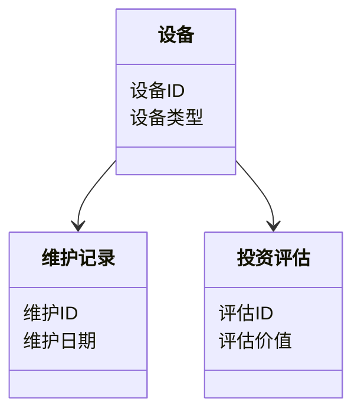
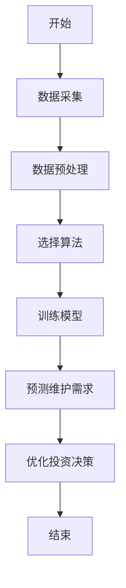
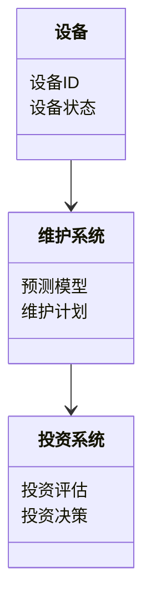
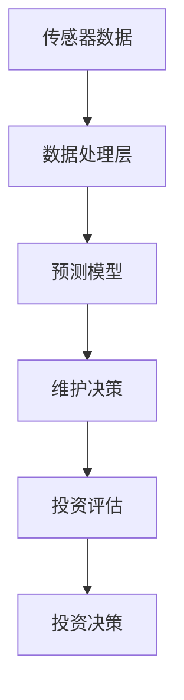

                 


# 价值投资中的智能建筑预测性维护系统分析

## 关键词：智能建筑，预测性维护，价值投资，算法原理，系统架构

## 摘要：本文分析了智能建筑预测性维护系统在价值投资中的应用，详细阐述了系统的背景、核心概念、算法原理和系统架构，通过实例分析展示了系统的实际应用。

---

## 第1章：智能建筑预测性维护系统背景

### 1.1 价值投资与智能建筑的结合

#### 1.1.1 价值投资的核心概念
价值投资是一种长期投资策略，强调通过分析资产的内在价值来做出投资决策。在智能建筑领域，价值投资可以用于评估建筑物或设备的长期经济价值。

#### 1.1.2 智能建筑的定义与特点
智能建筑是指通过集成各种自动化系统（如 HVAC、照明、安全系统）来优化能源使用和运营效率的建筑物。其特点是高度自动化、数据驱动和高效管理。

#### 1.1.3 预测性维护在智能建筑中的作用
预测性维护通过实时监测设备状态，利用数据分析预测设备故障，从而减少维护成本和设备停机时间。在智能建筑中，预测性维护可以显著提高设备的使用寿命和运营效率。

### 1.2 预测性维护系统的基本原理

#### 1.2.1 预测性维护的定义
预测性维护是一种主动维护策略，利用传感器数据和数据分析技术预测设备故障，提前安排维护。

#### 1.2.2 预测性维护的核心要素
- 传感器数据采集
- 数据分析模型
- 维护决策系统

#### 1.2.3 预测性维护与传统维护的区别
预测性维护通过数据分析提前预测故障，而传统维护通常是被动响应故障发生。

### 1.3 价值投资中的预测性维护系统分析

#### 1.3.1 预测性维护在价值投资中的应用
通过预测设备故障，投资者可以优化维护计划，降低运营成本，提高资产价值。

#### 1.3.2 预测性维护系统的经济价值
预测性维护可以降低维护成本、提高设备寿命、优化资源利用，从而提升资产价值。

#### 1.3.3 预测性维护系统的边界与外延
系统的边界包括设备、传感器和数据分析模型，外延则包括维护策略优化和投资决策支持。

---

## 第2章：智能建筑预测性维护系统的核心概念与联系

### 2.1 核心概念原理

#### 2.1.1 预测性维护的数学模型
$$ y = a x + b $$

#### 2.1.2 价值投资的数学模型
$$ P = \sum_{i=1}^{n} w_i x_i $$

#### 2.1.3 两者结合的原理
将设备状态预测与投资评估模型结合，优化维护计划和投资决策。

### 2.2 核心概念属性特征对比

| 特征       | 预测性维护 | 价值投资 |
|------------|------------|-----------|
| 数据来源   | 传感器数据 | 财务数据   |
| 目标       | 预测故障   | 评估价值   |
| 方法       | 数据分析   | 财务分析   |

### 2.3 ER实体关系图架构



---

## 第3章：智能建筑预测性维护系统的算法原理

### 3.1 算法原理概述

#### 3.1.1 预测性维护算法的分类
- 基于回归分析
- 基于时间序列分析

#### 3.1.2 价值投资算法的分类
- 基于财务指标的分析
- 基于机器学习的分析

### 3.2 算法流程图



### 3.3 数学模型与公式

#### 3.3.1 预测性维护的数学模型
$$ P(y|x) = \beta_0 + \beta_1 x $$

#### 3.3.2 价值投资的数学模型
$$ V = \sum_{i=1}^{n} v_i x_i $$

### 3.4 举例说明

#### 3.4.1 预测性维护的简单例子
假设传感器数据为温度，预测设备故障概率。

#### 3.4.2 价值投资的简单例子
评估一栋建筑的投资价值，考虑维护成本和设备寿命。

---

## 第4章：智能建筑预测性维护系统的系统分析与架构设计

### 4.1 问题场景介绍

#### 4.1.1 预测性维护的场景
设备故障导致运营中断和高昂维修成本。

#### 4.1.2 价值投资的场景
投资者需要准确评估建筑资产的价值，优化投资决策。

### 4.2 项目介绍

#### 4.2.1 项目目标
实现智能建筑预测性维护系统，优化维护计划和投资决策。

#### 4.2.2 项目范围
涵盖传感器数据采集、数据分析和投资评估。

### 4.3 系统功能设计

#### 4.3.1 领域模型


#### 4.3.2 系统架构设计


---

## 项目实战

### 环境安装
- 安装Python、传感器设备、数据库等。

### 系统核心实现源代码

```python
import pandas as pd
from sklearn.linear_model import LinearRegression

# 数据预处理
data = pd.read_csv('sensor_data.csv')
data = data.dropna()

# 训练预测模型
model = LinearRegression()
model.fit(data[['temp', 'vibration']], data['fault_probability'])

# 预测维护需求
new_data = pd.DataFrame({'temp': [25], 'vibration': [0.8]})
prediction = model.predict(new_data)
print(prediction)
```

### 代码应用解读与分析
代码展示了如何利用传感器数据训练线性回归模型，预测设备故障概率，从而优化维护计划。

### 实际案例分析
以办公楼电梯为例，通过预测性维护系统，优化电梯维护计划，降低维护成本，提升投资回报。

---

## 小结与最佳实践

### 小结
本文详细分析了智能建筑预测性维护系统在价值投资中的应用，涵盖了背景、核心概念、算法原理和系统架构。

### 最佳实践
- 确保传感器数据的准确性和及时性。
- 定期更新数据分析模型，提高预测精度。
- 结合具体业务需求，优化维护策略和投资决策。

### 注意事项
- 数据隐私和安全问题需重视。
- 模型的可解释性和透明度需关注。

### 拓展阅读
- 推荐阅读《智能建筑技术与应用》和《价值投资实战策略》。

---

## 作者：AI天才研究院 & 禅与计算机程序设计艺术

这篇文章通过详细分析智能建筑预测性维护系统在价值投资中的应用，为投资者提供了优化维护计划和提升资产价值的有效方法。

