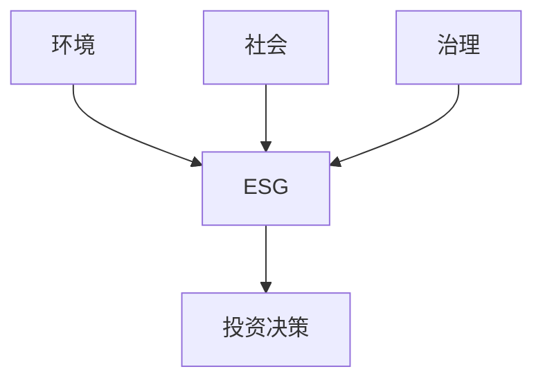
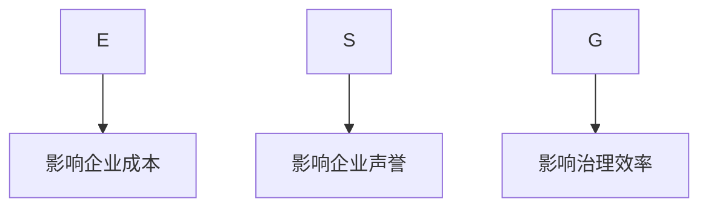
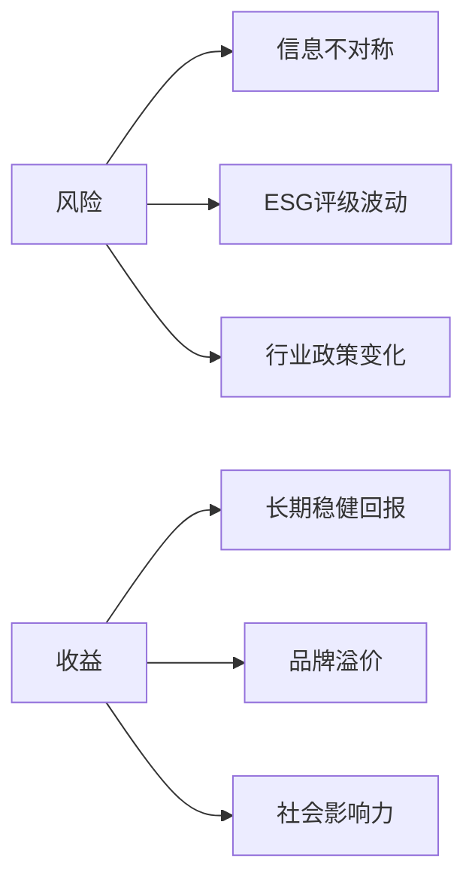
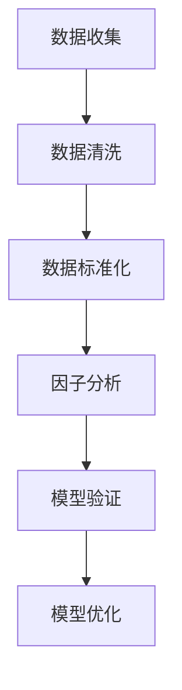
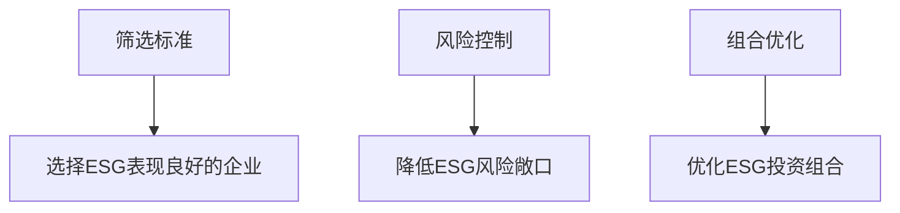
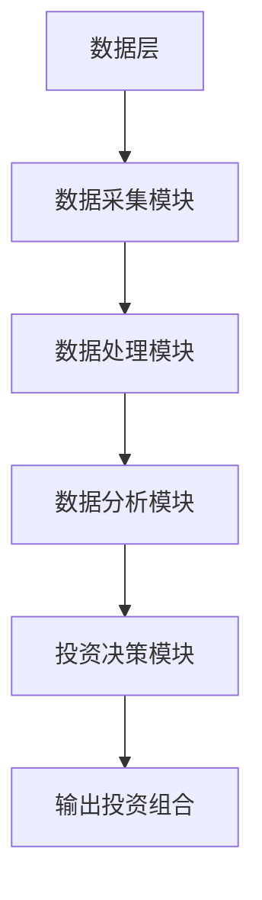

                 


# 价值投资中的环境、社会和治理（ESG）因素

> 关键词：价值投资、环境、社会、治理、ESG、投资策略、可持续发展

> 摘要：本文深入探讨了环境、社会和治理（ESG）因素在价值投资中的重要作用。通过分析ESG的定义、发展历程、对企业价值的影响、量化评估方法、投资策略、实际案例以及系统架构设计，本文为投资者提供了如何将ESG因素纳入投资决策的全面指导。文章结合理论与实践，从技术角度详细阐述了ESG投资的原理、方法和应用，帮助投资者在复杂多变的市场环境中实现长期稳健的投资回报。

---

## 第1章: ESG的背景与概念

### 1.1 ESG的定义与内涵

环境（Environmental）、社会（Social）和治理（Governance）是ESG的三大核心维度。环境因素关注企业在资源利用、碳排放和可持续发展方面的表现；社会因素关注企业对员工权益、社会责任和社区影响的关注程度；治理因素关注企业的治理结构、高管薪酬和董事会多样性等。

以下是环境、社会和治理的详细定义及其相互关系：



### 1.2 ESG投资的发展历程

ESG投资起源于20世纪60年代的“责任投资”理念，随着全球可持续发展意识的增强，ESG投资逐渐成为主流。以下是国际与国内ESG投资的发展历程对比：

```mermaid
timeline
    title 国际与国内ESG投资发展历程
    :1960s: <<起源于美国>> "责任投资理念诞生"
    :1990s: <<国际> "联合国发布《企业社会责任报告》"
    :2000s: <<国际> "UN PRI成立，推动ESG投资"
    :2010s: <<国内> "中国开始关注ESG投资"
    :2020s: <<全球> "ESG投资成为主流"
```

### 1.3 ESG投资的核心价值

ESG投资不仅关注企业的财务表现，还强调其对社会和环境的长期影响。以下是ESG投资的核心价值：

- **企业长期价值**：通过降低风险和提升品牌声誉，增强企业的可持续发展能力。
- **投资者潜在收益**：ESG表现良好的企业通常具有更低的波动性和更高的长期收益。
- **社会与环境意义**：通过投资推动社会公平与环境保护，实现可持续发展目标。

---

## 第2章: ESG因素与企业价值的关系

### 2.1 ESG因素对企业财务表现的影响

环境、社会和治理因素对企业财务表现有显著影响。以下是三者的具体影响：



环境因素通过降低能源消耗和减少碳排放降低成本；社会因素通过提升员工满意度和客户忠诚度增强企业声誉；治理因素通过优化董事会结构和高管薪酬提升治理效率。

### 2.2 ESG评级对企业价值的影响

ESG评级是投资者评估企业的重要指标。以下是主流ESG评级机构及其影响：

```mermaid
graph TD
    M[明晟公司(MSCI)] --> ESG评级
    SRI[社会责任投资评级] --> ESG评级
    标普(S&P) --> ESG评级
    ESG评级 --> 企业融资成本
    ESG评级 --> 企业股价波动
```

ESG评级高的企业通常具有更低的融资成本和更高的股价稳定性。

### 2.3 ESG投资的风险与收益分析

ESG投资的风险主要体现在评级波动和信息不对称，但其潜在收益包括长期稳健回报和品牌溢价。以下是风险与收益的对比：



---

## 第3章: ESG因素的量化与评估方法

### 3.1 ESG因素的量化指标

环境、社会和治理因素可以通过量化指标进行评估。以下是三者的量化指标对比：

```mermaid
table
    |因素 | 定义 | 量化指标 |
    |---|---|---|
    | 环境(E) | 碳排放、能源消耗 | 碳排放强度、可再生能源使用比例 |
    | 社会(S) | 员工权益、社会责任 | 员工满意度、社会公益支出占比 |
    | 治理(G) | 治理结构、高管薪酬 | 董事会多样性、高管薪酬与绩效关联性 |
```

### 3.2 ESG评估模型的构建

ESG评估模型可以通过因子分析方法构建。以下是因子分析模型的步骤：



因子分析模型可以提取出ESG的核心因子，并进行权重分配。

### 3.3 ESG评分系统的应用

ESG评分系统可以通过Python代码实现。以下是基于因子分析的ESG评分系统代码：

```python
import pandas as pd
from sklearn.decomposition import FactorAnalysis

# 数据准备
df = pd.DataFrame({
    '环境': [0.8, 0.6, 0.7],
    '社会': [0.5, 0.4, 0.6],
    '治理': [0.7, 0.6, 0.8]
})

# 因子分析
fa = FactorAnalysis(n_components=1)
df_factors = fa.fit_transform(df)

# 计算因子权重
factor_weights = pd.Series(fa.components_, index=df.columns)
```

---

## 第4章: ESG投资策略与组合管理

### 4.1 ESG投资策略的分类

ESG投资策略主要包括筛选标准、风险控制和组合优化三种类型。以下是三种策略的对比：



### 4.2 ESG投资策略的数学模型

ESG投资组合优化可以通过均值-方差模型实现。以下是数学公式：

$$
\text{目标函数：} \min_w \left( \sigma_p^2 \right) \\
\text{约束条件：} \sum_{i=1}^n w_i = 1, \sum_{i=1}^n w_i E_i \geq \text{ESG目标}
$$

其中，\( \sigma_p^2 \) 为投资组合的波动率，\( w_i \) 为第i只股票的权重，\( E_i \) 为第i只股票的ESG评分。

---

## 第5章: ESG投资的案例分析与系统架构设计

### 5.1 ESG投资的案例分析

以科技行业为例，分析其ESG表现。以下是科技行业的ESG评分与投资组合构建：

```mermaid
graph TD
    A[企业A] --> 评分：环境=85，社会=75，治理=90
    B[企业B] --> 评分：环境=70，社会=85，治理=80
    C[企业C] --> 评分：环境=90，社会=65，治理=75
```

通过因子分析模型，可以筛选出ESG表现优异的企业构建投资组合。

### 5.2 ESG投资系统的架构设计

以下是基于ESG的智能投资系统的架构设计：



系统架构包括数据采集、处理、分析和决策模块，支持实时ESG评分和投资组合优化。

---

## 第6章: 总结与展望

### 6.1 本章总结

本文系统地探讨了ESG因素在价值投资中的应用，从理论到实践，详细分析了ESG的定义、对企业价值的影响、量化评估方法、投资策略以及系统架构设计。通过案例分析和系统设计，为投资者提供了如何在投资中融入ESG因素的全面指导。

### 6.2 未来展望

未来，随着人工智能和大数据技术的发展，ESG投资将更加智能化和精准化。以下是未来的研究方向：

- **人工智能在ESG投资中的应用**：利用机器学习算法预测ESG评分和投资收益。
- **ESG评级标准的动态调整**：随着全球政策和市场环境的变化，ESG评级标准需要不断优化。
- **ESG与可持续发展目标的结合**：通过ESG投资推动联合国可持续发展目标的实现。

---

## 作者：AI天才研究院/AI Genius Institute & 禅与计算机程序设计艺术 /Zen And The Art of Computer Programming

---

通过以上目录结构，您可以逐步展开每个章节的内容，深入了解ESG在价值投资中的应用。

