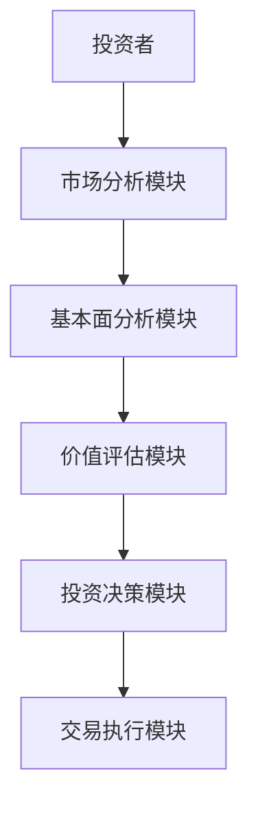

                 


# 价值投资中的耐心：为什么等待是一种美德

> 关键词：价值投资、耐心、心理分析、数学模型、系统设计、项目实战

> 摘要：耐心是价值投资中的核心美德，它不仅帮助投资者克服短期波动的干扰，还能让他们更好地识别长期价值。本文从心理学、数学模型、系统设计等多个角度，深入分析耐心在价值投资中的重要性，并通过实际案例和项目实战，为读者提供可操作的建议。

---

## 目录大纲

1. [背景介绍](#背景介绍)
   - 1.1 价值投资的基本概念
   - 1.2 耐心在投资中的重要性

2. [耐心的心理学分析](#耐心的心理学分析)
   - 2.1 投资者心理与耐心的关系
   - 2.2 耐心的培养与训练

3. [耐心在价值投资中的应用](#耐心在价值投资中的应用)
   - 3.1 耐心与价值发现
   - 3.2 耐心与投资决策

4. [经典案例分析](#经典案例分析)
   - 4.1 巴菲特的耐心投资策略
   - 4.2 其他投资者的耐心故事

5. [耐心的数学模型与系统分析](#耐心的数学模型与系统分析)
   - 5.1 耐心的量化分析
   - 5.2 投资决策的系统设计

6. [项目实战与最佳实践](#项目实战与最佳实践)
   - 6.1 实战环境的安装与配置
   - 6.2 核心实现与代码解读
   - 6.3 案例分析与经验总结

7. [总结与展望](#总结与展望)

---

## 背景介绍

### 1.1 价值投资的基本概念

#### 核心概念术语说明
- **价值投资**：一种以基本面分析为基础的投资策略，旨在通过识别市场价格与内在价值之间的差异，寻找被低估的投资标的。
- **耐心**：在投资过程中，保持冷静和纪律，避免因市场波动或短期压力而做出非理性决策的能力。

#### 问题背景
在当今快速变化的金融市场中，投资者往往面临短期波动的干扰，容易被市场的恐慌或兴奋情绪所左右。然而，真正成功的投资往往需要长期的等待和坚持，这正是耐心的价值所在。

#### 问题描述
许多投资者在市场下跌时急于卖出，或在市场上涨时盲目追涨，这往往导致投资组合的表现不佳。耐心不仅是一种美德，更是一种科学的投资策略。

#### 问题解决
通过分析耐心在投资决策中的作用，本文旨在帮助投资者克服短期情绪的干扰，坚持长期价值投资的策略。

#### 边界与外延
- **边界**：本文主要关注股票市场的价值投资策略，不涉及其他金融工具（如期货、期权）。
- **外延**：耐心的投资理念可以应用于其他领域，如创业、企业战略等。

#### 概念结构与核心要素组成
- **核心要素**：
  1. 市场价格与内在价值的差异
  2. 投资者心理与行为
  3. 长期投资策略
  4. 耐心的定义与特征

---

## 耐心的心理学分析

### 2.1 投资者心理与耐心的关系

#### 心理偏差对投资决策的影响
投资者常见的心理偏差包括：
- **过度自信**：认为自己能够准确预测市场走势。
- **从众心理**：盲目跟随市场趋势，忽视独立思考。
- **损失厌恶**：对潜在损失的恐惧导致决策失误。

#### 耐心如何克服心理偏差
- **冷静分析**：通过基本面分析减少情绪干扰。
- **纪律性**：制定明确的投资计划并严格执行。

#### 心理特征对比表格

| 心理偏差       | 影响                     | 如何通过耐心克服         |
|----------------|--------------------------|--------------------------|
| 过度自信       | 导致错误决策             | 通过长期价值分析纠正     |
| 从众心理       | 跟随市场潮流，忽视独立判断 | 通过耐心等待市场回归理性 |
| 损失厌恶       | 过度关注短期损失         | 通过长期视角减少干扰     |

---

## 耐心在价值投资中的应用

### 3.1 耐心与价值发现

#### 价值发现的定义与过程
- **定义**：通过分析企业的财务状况、行业地位、竞争优势等，识别其内在价值。
- **过程**：
  1. 基本面分析：包括市盈率（P/E）、市净率（P/B）等指标。
  2. 行业分析：了解企业的行业地位和竞争优势。
  3. 财务分析：评估企业的盈利能力、现金流状况等。

#### 耐心在价值发现中的作用
- **等待低估时机**：耐心让投资者能够在市场低估时买入，避免在高估时参与。

### 3.2 耐心与投资决策

#### 投资决策的步骤
- **步骤**：
  1. 确定投资目标：明确投资的长期目标和风险承受能力。
  2. 市场分析：识别市场的周期性波动。
  3. 选择标的：根据基本面分析选择低估资产。
  4. 执行交易：在合适时机买入并持有。
  5. 定期复盘：评估投资组合的表现并调整策略。

---

## 经典案例分析

### 4.1 巴菲特的耐心投资策略

#### 巴菲特的投资理念
- **长期视角**：巴菲特性长期持有优质资产，避免频繁交易。
- **价值发现**：通过深入分析企业的内在价值，寻找低估的投资标的。

#### 经典案例
- **可口可乐**：巴菲持有多年，期间市场波动巨大，但巴菲始终坚持长期持有的策略。

---

## 耐心的数学模型与系统分析

### 5.1 耐心的量化分析

#### 数学模型的建立
- **模型**：通过统计学方法量化耐心的价值。
- **公式**：
  $$ \text{投资回报} = \text{耐心} \times \text{价值发现能力} $$

#### 数据可视化


### 5.2 投资决策的系统设计

#### 系统架构图


---

## 项目实战与最佳实践

### 6.1 实战环境的安装与配置

#### 工具安装
- **Python环境**：安装Anaconda或Miniconda。
- **数据源**：使用Yahoo Finance API获取数据。

### 6.2 核心实现与代码解读

#### Python代码示例
```python
import pandas as pd
import numpy as np
import yfinance as yf

# 下载数据
msft = yf.download('MSFT', start='2020-01-01', end='2023-12-31')

# 计算市盈率和市净率
msft['PE'] = msft['Close'] / msft['Earnings'].rolling(4).mean()
msft['PB'] = msft['Close'] / msft['Book Value'].rolling(4).mean()

# 找出市盈率和市净率低于行业平均水平的股票
# 假设行业平均PE为15，PB为2
low_pe = msft[msft['PE'] < 15]
low_pb = msft[msft['PB'] < 2]
```

#### 代码解读
- **数据获取**：使用`yfinance`下载微软股票数据。
- **指标计算**：计算市盈率（PE）和市净率（PB）。
- **筛选策略**：找出PE和PB低于行业平均水平的股票。

### 6.3 案例分析与经验总结

#### 实际案例分析
- **案例**：假设某股票PE为10，PB为1.5，低于行业平均值，适合长期持有。

#### 经验总结
- **制定明确的筛选标准**：如PE < 15，PB < 2。
- **定期复盘**：评估投资组合的表现并调整策略。

---

## 总结与展望

### 总结
耐心是价值投资中的核心美德，它不仅帮助投资者克服短期波动的干扰，还能让他们更好地识别长期价值。通过心理分析、数学模型和系统设计，我们可以更科学地理解和应用耐心。

### 展望
未来，随着人工智能和大数据技术的发展，耐心的投资策略将更加精准和高效。投资者需要不断学习和适应，以应对市场的变化。

---

## 作者

作者：AI天才研究院/AI Genius Institute & 禅与计算机程序设计艺术 /Zen And The Art of Computer Programming

---

通过以上结构，我们可以系统地分析耐心在价值投资中的重要性，并通过实际案例和代码实现，帮助读者更好地理解和应用这一理念。

