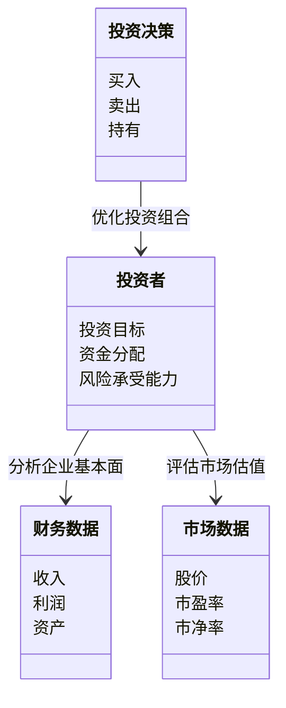

                 


# 价值投资中的耐心：等待好的机会

> 关键词：价值投资、耐心、长期回报、价值评估、安全边际、投资策略、价值发现

> 摘要：耐心是价值投资的核心要素，它不仅是等待好的投资机会，更是对投资标的深入理解与长期持有信心的体现。本文将从耐心在价值投资中的重要性、价值投资的基本原理、耐心投资的策略与实践、价值投资的系统分析与架构设计、项目实战案例以及最佳实践等方面展开，深入剖析耐心在价值投资中的多重角色与应用。

---

## 第一部分：价值投资中的耐心概述

### 第1章：耐心的定义与重要性

#### 1.1 耐心的定义与内涵
- 耐心是投资成功的重要基石，它是指在不确定的市场环境中，投资者能够保持冷静，避免短期波动干扰，专注于长期价值实现的能力。
- 耐心的核心特征包括：时间跨度长、情绪稳定性高、对价值的理解深刻。

#### 1.2 耐心与价值投资的内在联系
- 耐心是价值投资的本质特征，因为价值投资强调对企业内在价值的发现与长期持有。
- 耐心通过时间的积累，能够在市场波动中捕捉到低估的投资机会。

#### 1.3 耐心在投资决策中的作用
- 耐心使投资者能够在市场恐慌时买入低估资产，在市场狂热时卖出高估资产。
- 耐心帮助投资者避免了短期决策的失误，提高了投资组合的整体回报。

---

## 第二部分：价值投资的核心概念与分析框架

### 第2章：价值投资的基本原理

#### 2.1 价值投资的定义与特点
- 价值投资是一种以企业内在价值为基础的投资策略，强调以低于内在价值的价格买入优质资产。
- 其特点包括：注重基本面分析、追求安全边际、长期持有优质资产。

#### 2.2 耐心在价值投资中的具体表现
- 耐心体现为对市场短期波动的忽视，专注于企业的长期盈利能力。
- 耐心通过长期持有优质资产，实现复利效应的最大化。

#### 2.3 价值投资的关键要素
- 企业的基本面分析：包括财务状况、盈利能力、行业地位等。
- 市场情绪与周期的把握：识别市场的非理性波动，抓住投资机会。
- 安全边际：买入价格低于企业内在价值，确保投资的安全性。

---

## 第三部分：价值投资中的耐心策略与实践

### 第3章：耐心投资的数学模型与算法原理

#### 3.1 耐心投资的数学模型
- **现金流折现模型（DCF）**：用于评估企业的内在价值，公式如下：
  $$ V = \sum_{t=1}^{n} \frac{CF_t}{(1+r)^t} + \frac{TV}{(1+r)^n} $$
  其中，$CF_t$ 是第t年的现金流，$r$ 是折现率，$TV$ 是终值。
- **复利公式**：$$ A = P(1 + r)^t $$
  其中，$A$ 是终值，$P$ 是本金，$r$ 是年利率，$t$ 是时间。

#### 3.2 价值投资的算法原理
- **价值发现算法**：通过对企业基本面的分析，识别出具有持续竞争优势和合理估值的企业。
- **投资组合优化算法**：基于耐心投资策略，构建分散化的投资组合，降低风险。

#### 3.3 耐心策略的具体应用
- **长期持有策略**：选择优质企业长期持有，避免频繁交易。
- **价值低估策略**：寻找市场价格低于内在价值的企业进行投资。
- **安全边际策略**：买入价格低于企业内在价值，确保投资的安全性。

---

## 第四部分：价值投资中的系统分析与架构设计

### 第4章：价值投资系统的构建

#### 4.1 价值投资系统的整体架构
- **系统目标**：构建一个能够持续发现价值低估企业、优化投资组合、实现长期稳定收益的投资系统。
- **功能模块划分**：
  1. 数据收集与处理模块
  2. 价值评估模块
  3. 投资决策模块
  4. 风险控制模块

#### 4.2 系统功能设计（领域模型）


#### 4.3 系统架构设计


---

## 第五部分：项目实战

### 第5章：耐心投资的实战案例

#### 5.1 实战环境安装与配置
- 数据获取工具：Python的pandas、requests库。
- 数据分析工具：Excel、Tableau。
- 代码实现：使用Python编写价值评估代码。

#### 5.2 核心代码实现
```python
import pandas as pd
import numpy as np

def calculate_intrinsic_value(enterprise_value, free_cash_flow, discount_rate):
    # 计算终值
    terminal_value = enterprise_value * (1 + discount_rate) ** 10
    # 计算现值
    present_value = 0
    for t in range(1, 11):
        cf = free_cash_flow * (1 + discount_rate) ** (t-1)
        present_value += cf / (1 + discount_rate) ** t
    return present_value + terminal_value / (1 + discount_rate) ** 10

# 示例计算
enterprise_value = 1000000000
free_cash_flow = 100000000
discount_rate = 0.08
intrinsic_value = calculate_intrinsic_value(enterprise_value, free_cash_flow, discount_rate)
print(f"企业内在价值：{intrinsic_value}")
```

#### 5.3 实战案例分析
- **案例1：茅台的投资分析**
  - 茅台的内在价值计算。
  - 投资决策：在股价低于内在价值时买入并长期持有。
- **案例2：亚马逊的投资分析**
  - 使用DCF模型评估亚马逊的内在价值。
  - 投资决策：在市场恐慌时增加仓位。

---

## 第六部分：最佳实践与总结

### 第6章：最佳实践与注意事项

#### 6.1 投资心态管理
- 保持耐心，避免情绪化决策。
- 在市场恐慌时保持冷静，抓住低估机会。

#### 6.2 长期视角的重要性
- 长期持有优质资产，享受复利效应。
- 避免短期波动的干扰，专注于长期价值。

#### 6.3 拓展阅读
- 《证券分析》——本杰明·格雷厄姆
- 《投资学原理》——查尔斯·埃里森

#### 6.4 本章小结
耐心是价值投资的核心要素，它不仅是等待好的投资机会，更是对投资标的深入理解与长期持有信心的体现。通过耐心的投资策略，投资者能够在市场波动中实现长期稳定的回报。

---

## 作者信息

作者：AI天才研究院/AI Genius Institute & 禅与计算机程序设计艺术 /Zen And The Art of Computer Programming

---

以上是基于价值投资中的耐心主题，从概念、算法、系统设计到实战案例的详细目录大纲。接下来将根据上述目录逐步展开内容撰写。

