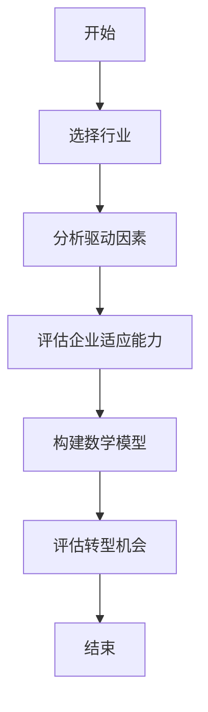
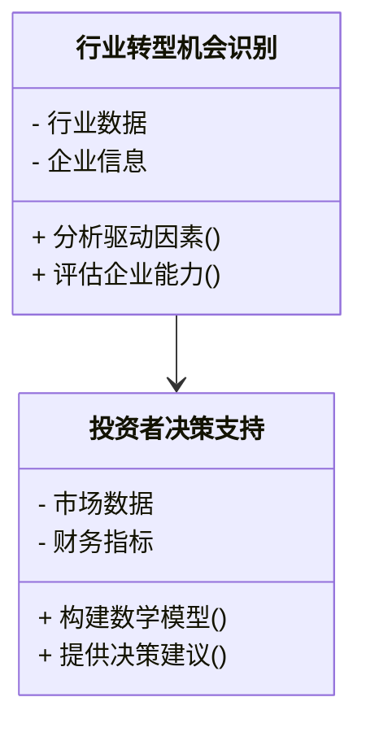

                 


# 价值投资中的行业转型机会识别

## 关键词：价值投资，行业转型，机会识别，驱动因素，分析方法

## 摘要

在价值投资中，识别行业转型机会是投资者获取超额收益的关键。本文系统地介绍了如何通过分析行业转型的驱动因素、评估企业适应能力，以及构建合适的分析模型，来识别和把握这些机会。文章结合了PEST和SWOT分析方法，并通过实际案例展示了如何在不同行业中应用这些方法。同时，文章还探讨了如何利用技术工具，如Mermaid流程图和Latex公式，来辅助分析和决策。

---

## 第1章：价值投资与行业转型的背景

### 1.1 价值投资的基本概念

价值投资是一种长期投资策略，强调通过深入分析企业的基本面，寻找市场价格低于内在价值的股票。其核心在于发现市场中的低估机会，并耐心持有，等待市场回归其真实价值。

### 1.2 行业转型的定义与特征

行业转型是指行业因内外部因素的变化而发生的根本性改变。其特征包括需求结构变化、技术进步、政策调整等，可能导致行业内企业的商业模式、竞争优势发生重大变化。

### 1.3 行业转型与价值投资的结合

价值投资者在行业转型中寻找那些能够适应变化，并在转型中获得竞争优势的企业。识别这些机会需要深入分析行业的驱动因素和企业的适应能力。

---

## 第2章：行业转型机会的识别方法

### 2.1 技术进步对行业转型的影响

技术进步是推动行业转型的重要因素。例如，人工智能技术正在改变多个行业的运作方式。通过PEST分析，投资者可以评估技术进步对行业的影响。

#### 2.1.1 技术进步的定义与特征
- 技术进步是指新技术的出现和应用，可能带来效率提升、成本降低或新产品开发。

#### 2.1.2 技术进步如何推动行业转型
- 技术进步可能改变行业的竞争格局，例如传统制造业向智能化转型。

#### 2.1.3 案例分析：人工智能对传统行业的颠覆
- 案例：AI技术在医疗行业的应用，提高了诊断效率和准确性。

### 2.2 政策变化对行业转型的影响

政策变化，如环保政策的加强，可能导致某些行业需要转型以符合新法规。

#### 2.2.1 政策变化的定义与特征
- 政策变化是指政府出台的新政策或法规，可能对行业产生重大影响。

#### 2.2.2 政策变化如何影响行业转型
- 例如，环保政策可能导致高污染企业转型为绿色生产模式。

### 2.3 市场需求变化对行业转型的影响

市场需求的变化，如消费升级，可能导致行业从传统模式向现代化转型。

#### 2.3.1 市场需求变化的定义与特征
- 市场需求变化是指消费者偏好、购买习惯的变化，可能影响行业的产品和服务。

#### 2.3.2 案例分析：消费升级对零售行业的重塑
- 零售行业从传统门店转向电子商务和线上营销。

---

## 第3章：行业转型机会的评估与选择

### 3.1 行业生命周期分析

行业生命周期分析帮助企业判断行业所处阶段，从而识别转型机会。

#### 3.1.1 行业生命周期的定义与阶段划分
- 行业生命周期分为导入期、成长期、成熟期、衰退期。

#### 3.1.2 不同生命周期阶段的行业转型机会
- 成长期行业可能有较多转型机会，而衰退期行业转型风险较大。

### 3.2 行业竞争结构分析

行业竞争结构分析帮助企业评估行业的竞争状况，判断企业是否能在转型中胜出。

#### 3.2.1 行业竞争结构的定义与分析框架
- 使用五力模型（波特五力分析）评估行业竞争结构。

#### 3.2.2 行业竞争结构对转型机会的影响
- 高竞争行业可能转型困难，而新兴行业可能有更多机会。

---

## 第4章：行业转型机会的数学模型与算法

### 4.1 转型机会评估的数学模型

#### 4.1.1 基于现金流的内在价值模型
- 使用现金流折现模型（DCF）评估企业转型后的内在价值。

$$
V = \frac{CF}{r}
$$

其中，V是内在价值，CF是未来现金流，r是贴现率。

#### 4.1.2 市场地位与竞争优势模型
- 使用市场份额和品牌价值评估企业在转型中的竞争优势。

### 4.2 转型机会识别的算法流程

#### 4.2.1 使用Mermaid流程图展示分析流程


---

## 第5章：系统分析与架构设计方案

### 5.1 问题场景介绍

投资者需要识别行业转型机会，构建系统化的分析框架，以支持决策。

### 5.2 系统功能设计

#### 5.2.1 领域模型Mermaid类图


### 5.3 系统架构设计

#### 5.3.1 使用Mermaid架构图展示系统架构


---

## 第6章：项目实战与案例分析

### 6.1 环境安装

投资者需要收集行业数据、企业财务报表等信息，安装必要的分析工具。

### 6.2 核心实现源代码

#### 6.2.1 使用Python进行数据分析
```python
import pandas as pd

# 示例：计算企业的内在价值
def calculate_intrinsic_value(FCF, WACC):
    return FCF / WACC

CF = 1000000  # 自由现金流
WACC = 0.10   # 加权平均资本成本
IV = calculate_intrinsic_value(CF, WACC)
print(f"企业内在价值为：{IV}")
```

---

## 第7章：总结与展望

### 7.1 总结

识别行业转型机会是价值投资中的重要策略。通过分析驱动因素、评估企业能力、构建数学模型，投资者可以在转型中找到潜在的高收益机会。

### 7.2 展望

随着技术的进步，未来可能有更多工具和方法帮助投资者识别行业转型机会。持续关注行业动态和企业变化，将有助于投资者在市场中获得超额收益。

---

## 作者：AI天才研究院/AI Genius Institute & 禅与计算机程序设计艺术 /Zen And The Art of Computer Programming

