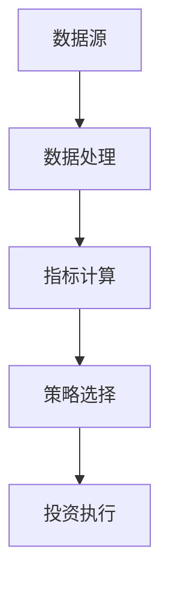

                 


# 价值投资中的质量vs价格：寻找优质便宜的组合

## 关键词：价值投资、质量、价格、优质便宜、投资策略、风险管理

## 摘要：在价值投资中，寻找质量高且价格低的股票是关键。本文从质量与价格的定义、价值投资的背景、寻找优质便宜组合的策略、数学模型与估值方法、投资策略与风险管理等方面进行详细分析。通过案例分析和系统架构设计，帮助投资者更好地理解如何在实际操作中应用这些理论。

---

## 第一章：质量与价格的定义与关系

### 1.1 质量的定义与衡量标准

#### 1.1.1 质量的定义
质量在股票投资中指的是公司的内在价值，包括财务状况、行业地位和管理团队等。优质公司通常具有稳定的收益、健康的财务状况和强大的竞争优势。

#### 1.1.2 质量的衡量标准
- **财务状况**：如净利润率、ROE（净资产收益率）、ROA（资产回报率）等。
- **行业地位**：包括市场份额、品牌影响力和行业排名。
- **管理团队**：管理团队的能力和经验也是衡量公司质量的重要因素。

### 1.2 价格的定义与衡量指标

#### 1.2.1 价格的定义
股票价格是市场对公司价值的反映，通常通过市盈率（P/E）、市净率（P/B）等指标来衡量。

#### 1.2.2 价格的衡量指标
- **市盈率（P/E）**：股价与每股收益的比值。
- **市净率（P/B）**：股价与每股净资产的比值。
- **市销率（P/S）**：股价与每股销售收入的比值。

### 1.3 质量与价格的关系

#### 1.3.1 质量与价格的相互影响
- 质量高的公司通常会吸引更多的投资者，从而推高股价。
- 价格过高的股票可能被市场高估，存在回调风险。

---

## 第二章：价值投资的背景与意义

### 2.1 价值投资的背景

#### 2.1.1 价值投资的起源与发展
价值投资由本杰明·格雷厄姆和戴维·多德提出，强调以低于内在价值的价格买入优质股票。

#### 2.1.2 价值投资的核心理念
- 购买股票时，将其视为企业的一部分。
- 寻找市场低估的股票，长期持有，等待价值回归。

### 2.2 质量与价格在价值投资中的重要性

#### 2.2.1 质量的重要性
- 优质的公司在经济周期波动中表现更稳定。
- 高质量的公司具有持续的盈利能力，能够为股东创造长期价值。

#### 2.2.2 价格的重要性
- 价格是衡量市场是否低估公司价值的关键指标。
- 过高的价格可能导致投资风险。

### 2.3 传统投资方法的不足

#### 2.3.1 质量与价格的割裂
- 很多投资者只关注价格，忽视了公司的质量。
- 另一些投资者只关注质量，忽视了价格是否合理。

#### 2.3.2 价值投资的优势
- 通过同时关注质量和价格，寻找具有长期增长潜力的股票。
- 降低投资风险，提高投资收益。

---

## 第三章：寻找优质便宜组合的策略

### 3.1 筛选标准

#### 3.1.1 质量筛选标准
- 净利润连续增长，ROE保持在较高水平。
- 负债率低，财务状况健康。
- 管理团队稳定，行业经验丰富。

#### 3.1.2 价格筛选标准
- 市盈率低于行业平均水平。
- 市净率低于行业平均水平。
- 市销率低于行业平均水平。

### 3.2 筛选步骤

#### 3.2.1 数据收集
- 收集过去几年的财务数据。
- 获取行业平均水平的估值指标。

#### 3.2.2 计算指标
- 计算ROE、ROA、P/E、P/B等指标。
- 对比行业平均水平，找出质量高且价格低的股票。

#### 3.2.3 质量与价格的综合分析
- 绘制质量与价格分布图。
- 识别质量高且价格低的股票。

### 3.3 实例分析

#### 3.3.1 案例分析
- 以某行业为例，筛选出质量高且价格低的股票。
- 对比其财务数据和估值指标。

---

## 第四章：数学模型与估值方法

### 4.1 基本面分析模型

#### 4.1.1 ROE分析
- 公式：ROE = 净利润 / 净资产
- 解释：ROE越高，公司盈利能力越强。

#### 4.1.2 ROA分析
- 公式：ROA = 净利润 / 总资产
- 解释：ROA衡量公司资产的使用效率。

### 4.2 估值模型

#### 4.2.1 市盈率模型
- 公式：P/E = 股价 / 每股收益
- 应用：用于评估股票是否被高估或低估。

#### 4.2.2 市净率模型
- 公式：P/B = 股价 / 每股净资产
- 应用：适用于银行、房地产等资产密集型行业。

### 4.3 估值方法

#### 4.3.1 相对估值法
- 比较股票与行业平均的估值指标。

#### 4.3.2 绝对估值法
- 使用DCF模型计算股票的内在价值。

---

## 第五章：投资策略与风险管理

### 5.1 投资策略

#### 5.1.1 长期持有策略
- 买入优质股票，长期持有，等待价值回归。

#### 5.1.2 分批买入策略
- 根据股价波动，分批买入，降低平均成本。

### 5.2 风险管理

#### 5.2.1 分散投资
- 不将所有资金投入单一行业或股票。

#### 5.2.2 设定止损点
- 当股价下跌到一定程度，及时止损。

#### 5.2.3 持续监控
- 定期检查投资组合，调整持仓。

---

## 第六章：系统分析与架构设计

### 6.1 系统架构

#### 6.1.1 系统架构图


#### 6.1.2 数据处理
- 数据清洗：处理缺失值、异常值。
- 计算指标：ROE、ROA、P/E等。
- 可视化分析：绘制质量与价格分布图。

### 6.2 项目实战

#### 6.2.1 环境安装
- 安装Python、Pandas、Matplotlib等工具。

#### 6.2.2 核心代码实现
```python
import pandas as pd
import matplotlib.pyplot as plt

# 数据加载
df = pd.read_csv('stock_data.csv')

# 计算ROE
df['ROE'] = df['净利润'] / df['净资产']

# 筛选优质便宜的股票
cheap_qualitative_stocks = df[(df['ROE'] > df['ROE'].mean()) & 
                                 (df['P/E'] < df['P/E'].mean())]

# 可视化分析
plt.scatter(cheap_qualitative_stocks['ROE'], cheap_qualitative_stocks['P/E'])
plt.xlabel('ROE')
plt.ylabel('P/E')
plt.title('Quality vs Price')
plt.show()
```

---

## 第七章：总结与展望

### 7.1 总结
价值投资的关键在于寻找质量高且价格低的股票，通过基本面分析和估值指标筛选出优质股票，制定合理的投资策略，降低投资风险。

### 7.2 展望
未来，随着市场环境的变化，价值投资策略也需要不断优化和调整。投资者需要持续学习，关注市场动态，提升自己的投资能力。

---

## 作者：AI天才研究院/AI Genius Institute & 禅与计算机程序设计艺术 /Zen And The Art of Computer Programming

---

通过以上内容，我们系统地分析了价值投资中的质量与价格的关系，并提供了具体的筛选策略和数学模型。希望读者能够通过本文，掌握价值投资的核心思想，并在实际操作中取得理想的投资效果。

