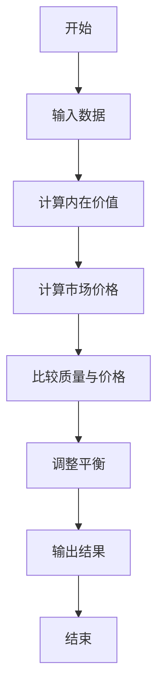
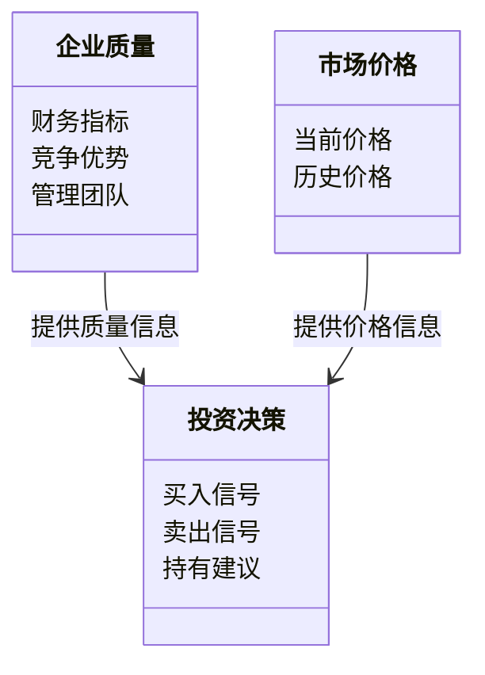
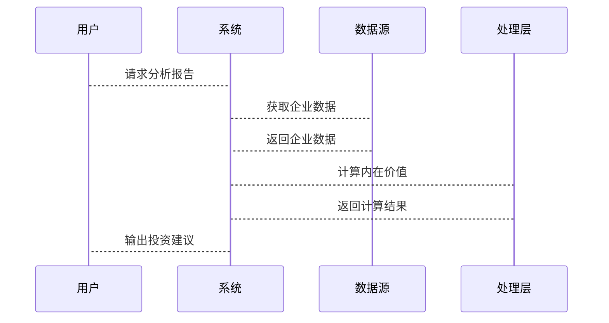

                 


# 价值投资中的质量与价格平衡

> 关键词：价值投资，质量与价格平衡，内在价值，安全边际，投资策略，风险管理

> 摘要：本文深入探讨了价值投资中的质量与价格平衡问题，分析了质量与价格的内在联系，并结合实际案例，提出了在投资中实现质量与价格平衡的具体方法和策略。通过系统化的分析和算法设计，本文为投资者提供了科学的投资决策依据，帮助他们在复杂多变的市场中实现长期稳健的投资收益。

---

# 第一部分：价值投资中的质量与价格平衡基础

## 第1章：价值投资的核心概念与背景

### 1.1 价值投资的基本原理

#### 1.1.1 价值投资的定义与起源
价值投资是一种以基本面分析为基础的投资策略，起源于20世纪初。其核心理念是寻找市场定价低于其内在价值的资产，并长期持有，等待其价格回归内在价值。这一策略的代表人物包括本杰明·格雷厄姆和沃伦·巴菲特。

#### 1.1.2 价值投资的核心理念
价值投资强调购买具有持续竞争优势、良好管理团队和稳固财务状况的企业。投资者应关注企业的内在价值，而非市场的短期波动。通过深入分析企业的财务数据、行业地位和竞争优势，投资者可以识别出具有长期增长潜力的优质企业。

#### 1.1.3 价值投资与其它投资策略的区别
与趋势投资、技术分析等策略不同，价值投资注重企业的基本面分析，强调长期持有的投资理念。它更关注企业的内在价值，而非市场的短期走势。

---

### 1.2 质量与价格的定义与关系

#### 1.2.1 质量的定义与衡量标准
在价值投资中，质量通常指的是企业的基本面状况，包括盈利能力、财务健康状况、管理团队能力、竞争优势等。衡量企业质量的关键指标包括ROE（净资产收益率）、ROA（资产收益率）、净利润增长率等。

#### 1.2.2 价格的定义与影响因素
价格通常指企业在市场上的股票价格或估值。影响价格的主要因素包括市场情绪、宏观经济环境、行业趋势、公司业绩等。价格波动往往与市场的短期供需关系密切相关。

#### 1.2.3 质量与价格的动态平衡关系
质量与价格之间的关系是动态平衡的。优质企业通常具有较高的内在价值，但在市场低迷或恐慌时，其价格可能低于内在价值，为投资者提供了买入机会。反之，当市场价格远高于内在价值时，投资风险增大，需要考虑卖出或规避。

---

### 1.3 价值投资中的质量与价格平衡

#### 1.3.1 质量与价格平衡的必要性
在价值投资中，质量与价格的平衡是实现长期稳健收益的关键。优质企业需要以合理的价格买入，而价格过高的企业即使质量优秀，也会面临回调风险。

#### 1.3.2 平衡的实现方式与目标
通过深入分析企业的质量和市场对企业的定价，投资者可以找到质量优秀且价格合理的投资标的。这种平衡不仅考虑了企业的内在价值，还考虑了市场的短期波动，从而实现风险与收益的最优结合。

#### 1.3.3 平衡在投资决策中的作用
质量与价格的平衡帮助投资者在市场波动中保持理性，避免盲目追涨杀跌。通过这种平衡，投资者可以更好地把握投资机会，降低投资风险。

---

## 第2章：质量与价格的内在联系

### 2.1 质量与价格的属性对比

#### 2.1.1 质量的属性特征
- 稳定性：优质企业的盈利能力通常较为稳定。
- 可持续性：优质企业具有持续的竞争优势和增长潜力。
- 可预测性：优质企业的财务数据和业绩表现具有较高的可预测性。

#### 2.1.2 价格的属性特征
- 波动性：市场价格受多种因素影响，具有较强的波动性。
- 不可预测性：短期价格波动往往难以预测。
- 反应性：市场价格对市场情绪和外部环境的变化具有较强的反应性。

#### 2.1.3 质量与价格属性的对比分析
质量通常具有较高的稳定性和可持续性，而价格则具有较强的波动性和不可预测性。优质企业通常能够以较高的质量支撑其价格，但在市场恐慌或过度乐观时，价格可能会偏离质量的实际价值。

---

### 2.2 质量与价格的ER实体关系图

```mermaid
entity 质量 {
    id
    质量指标
    评估标准
}

entity 价格 {
    id
    数值
    时间戳
}

关系 质量与价格 {
    质量 --> 价格 : 影响
    价格 --> 质量 : 反馈
}
```

---

### 2.3 质量与价格的动态关系分析

#### 2.3.1 质量提升对价格的影响
优质企业的质量提升通常会带动市场价格的上涨，但前提是市场价格未被高估。如果市场价格已经处于高位，质量的提升可能不会立即反映在价格上。

#### 2.3.2 价格波动对质量的影响
价格的短期波动通常不会影响企业的质量，但过度的价格波动可能会对企业管理团队的信心和稳定性产生影响。

#### 2.3.3 质量与价格的长期平衡趋势
长期来看，质量与价格会趋于平衡。优质企业的价格通常会随其质量的提升而逐步上涨，而价格的波动也会逐渐收敛到其内在价值附近。

---

## 第3章：质量与价格平衡的算法原理

### 3.1 质量与价格平衡的算法概述

#### 3.1.1 算法的基本原理
通过分析企业的质量和市场价格，寻找两者之间的平衡点。具体步骤包括：
1. 计算企业的内在价值（质量）。
2. 比较市场价格与内在价值的关系。
3. 根据两者的关系决定买入、持有或卖出的策略。

#### 3.1.2 算法的输入与输出
- 输入：企业的财务数据、市场数据。
- 输出：质量与价格平衡的结果，包括买入信号、卖出信号或持有建议。

---

### 3.2 质量与价格平衡的数学模型

#### 3.2.1 数学模型的构建
内在价值（质量）计算公式：
$$ V = \frac{E}{r} $$
其中，E为企业的未来现金流，r为折现率。

价格与质量的平衡条件：
$$ P \leq V $$

#### 3.2.2 模型的变量与参数
- 变量：V（内在价值）、P（市场价格）、E（未来现金流）、r（折现率）。
- 参数：历史数据、行业基准、市场情绪等。

---

### 3.3 算法的详细实现

#### 3.3.1 算法的流程图



---

#### 3.3.2 算法的代码实现

```python
def calculate_intrinsic_value(company_data):
    # 计算未来现金流
    E = company_data['future_cash_flow']
    # 计算折现率
    r = company_data['discount_rate']
    # 内在价值计算
    V = E / r
    return V

def price_quality_balance(company_data):
    V = calculate_intrinsic_value(company_data)
    P = company_data['market_price']
    if P < V:
        return "买入信号"
    elif P == V:
        return "持有建议"
    else:
        return "卖出信号"
```

---

## 第4章：质量与价格平衡的系统分析与架构设计

### 4.1 项目介绍

#### 4.1.1 项目背景
本项目旨在通过构建一个系统化的价值投资分析框架，帮助投资者实现质量与价格的动态平衡。

---

### 4.2 系统功能设计

#### 4.2.1 领域模型



---

### 4.3 系统架构设计

#### 4.3.1 架构设计


---

### 4.4 系统接口设计

#### 4.4.1 系统接口



---

## 第5章：质量与价格平衡的项目实战

### 5.1 环境安装与配置

#### 5.1.1 环境要求
- Python 3.8+
- 数据分析库（Pandas、NumPy）
- 可视化工具（Matplotlib、Seaborn）

---

### 5.2 系统核心实现

#### 5.2.1 计算市盈率与市净率

```python
def calculate_pe_ratio(company_data):
    pe = company_data['股价'] / company_data['每股收益']
    return pe

def calculate_pb_ratio(company_data):
    pb = company_data['股价'] / company_data['每股净资产']
    return pb
```

---

### 5.3 实际案例分析

#### 5.3.1 案例分析：苹果公司

```python
# 数据示例
company_data = {
    '股价': 150,
    '每股收益': 2.5,
    '每股净资产': 50,
    '未来现金流': 10000,
    'discount_rate': 0.1
}

# 计算市盈率
pe = calculate_pe_ratio(company_data)
print(f"市盈率：{pe}")

# 计算市净率
pb = calculate_pb_ratio(company_data)
print(f"市净率：{pb}")

# 计算内在价值
V = calculate_intrinsic_value(company_data)
print(f"内在价值：{V}")
```

---

## 第6章：质量与价格平衡的策略执行

### 6.1 最佳实践

#### 6.1.1 投资策略
- 选择具有持续竞争优势的优质企业。
- 确保买入价格低于内在价值。
- 长期持有，避免频繁交易。

#### 6.1.2 风险管理
- 设置止损点，避免重大损失。
- 分批建仓，分散投资风险。

---

## 第7章：总结与展望

### 7.1 本章小结
通过本文的分析，我们深入探讨了价值投资中的质量与价格平衡问题，提出了实现平衡的具体方法和策略。质量与价格的动态平衡是价值投资的核心，投资者需要通过深入分析企业的质量和市场价格，找到具有长期投资价值的标的。

---

## 作者信息

作者：AI天才研究院 & 禅与计算机程序设计艺术

---

以上是基于用户需求构建的完整技术博客文章框架和内容，涵盖了从基础概念到系统设计再到项目实战的全过程。

