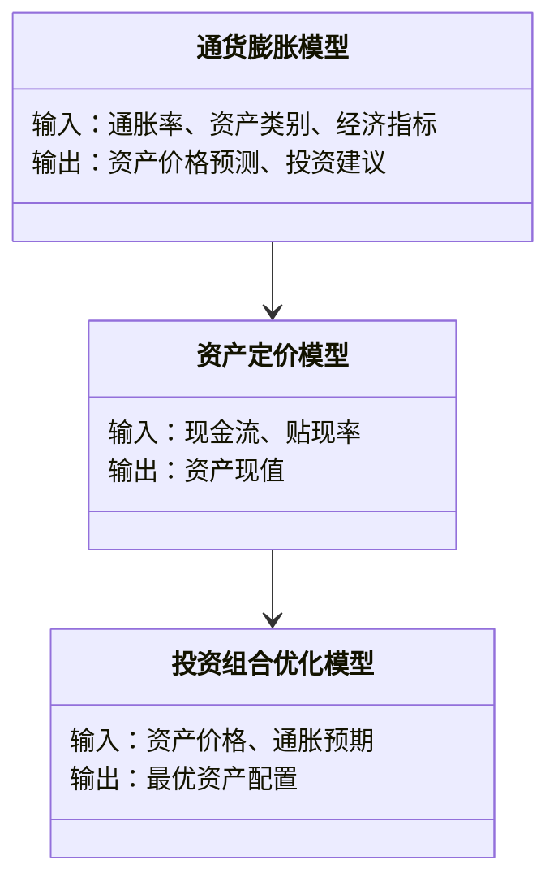
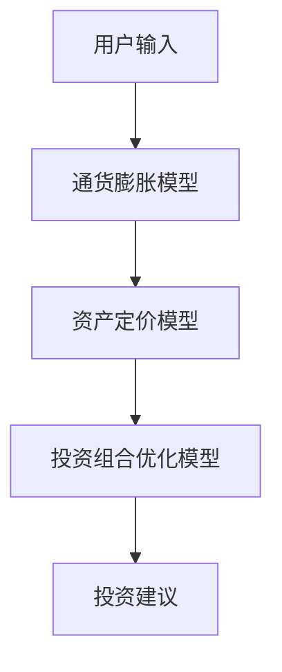

                 


# 价值投资中的通货膨胀考虑

> **关键词：** 价值投资、通货膨胀、资产定价、投资策略、经济影响、风险管理、投资回报

> **摘要：** 通货膨胀是影响价值投资的重要因素。本文探讨了通货膨胀对资产定价和投资回报的影响，分析了不同资产类别在通货膨胀环境下的表现，并提出了应对通货膨胀的投资策略，帮助投资者在通货膨胀中实现长期稳定收益。

---

## 第一部分：通货膨胀与价值投资的背景

### 第1章：通货膨胀的基本概念与影响

#### 1.1 通货膨胀的定义与分类

- **1.1.1 通货膨胀的定义**
  通货膨胀是指物价总水平在一段时间内持续上涨，导致货币购买力下降的经济现象。

- **1.1.2 通货膨胀的分类与度量**
  通货膨胀通常分为温和、严重和恶性通胀。常用的度量指标包括消费者价格指数（CPI）和生产者价格指数（PPI）。

- **1.1.3 通货膨胀对经济的影响**
  通货膨胀会导致货币贬值、实际收入减少、投资环境恶化等负面影响，但也可能刺激短期消费和投资。

#### 1.2 通货膨胀与价值投资的关系

- **1.2.1 通货膨胀对资产价格的影响**
  通货膨胀会导致资产价格（如股票、房地产）上涨，但实际回报可能下降。

- **1.2.2 通货膨胀对投资回报的影响**
  在通货膨胀环境下，名义回报可能增加，但实际回报可能因通胀侵蚀而减少。

- **1.2.3 通货膨胀对价值投资策略的挑战**
  价值投资者需要调整估值模型，考虑通胀对贴现率和未来现金流的影响。

---

## 第二部分：通货膨胀对价值投资的核心影响

### 第2章：通货膨胀对资产定价的影响

#### 2.1 不同资产类别在通货膨胀下的表现

- **2.1.1 股票**
  股票价格可能上涨，但若通胀高于名义收益，实际回报可能下降。

- **2.1.2 债券**
  通胀上升会增加债券的违约风险，降低其实际收益率。

- **2.1.3 房地产**
  房地产价格可能上涨，但若通胀预期持续，租金调整可能跟不上通胀步伐。

- **2.1.4 其他资产**
  黄金和商品可能在通胀期间表现较好，但波动性较大。

#### 2.2 通货膨胀对资产估值模型的影响

- **2.2.1 资产定价的基本原理**
  资产价格 = 现金流的贴现值，贴现率考虑通胀和风险溢价。

- **2.2.2 通货膨胀对贴现率的影响**
  贴现率通常包括通胀预期，通胀上升会增加贴现率，降低资产的现值。

- **2.2.3 通货膨胀对资产未来现金流的影响**
  通胀会影响未来现金流的实际价值，需通过通胀调整贴现模型进行校正。

---

## 第三部分：通货膨胀下的价值投资策略

### 第3章：通货膨胀环境下的投资组合优化

#### 3.1 投资组合的构建与调整

- **3.1.1 资产配置的基本原则**
  资产配置应考虑通胀预期，分散投资以降低风险。

- **3.1.2 通货膨胀对资产配置的影响**
  在高通胀环境下，应增加抗通胀资产（如商品、房地产）的配置比例。

- **3.1.3 投资组合的动态调整**
  定期重新评估资产配置，根据通胀变化进行调整。

#### 3.2 通货膨胀下的防御性投资策略

- **3.2.1 防御性资产的选择**
  投资于具有较强通胀对冲能力的资产，如黄金、房地产信托基金。

- **3.2.2 投资组合的通胀对冲工具**
  使用通胀指数化债券或商品期货对冲通胀风险。

- **3.2.3 资产分散化的重要性**
  通过分散化降低单一资产的风险，提高组合的整体稳定性。

---

## 第四部分：通货膨胀对价值投资模型的数学分析

### 第4章：通货膨胀与投资回报的数学模型

#### 4.1 通货膨胀对投资回报的影响公式

- **4.1.1 名义收益率与实际收益率的关系**
  $$ 实际收益率 = 名义收益率 - 通货膨胀率 $$

- **4.1.2 通货膨胀对贴现率的影响**
  贴现率 = 无风险利率 + 通胀预期 + 风险溢价。

- **4.1.3 通货膨胀对股利增长模型的影响**
  股利增长率应考虑通胀因素，以确保未来现金流的真实价值。

#### 4.2 通货膨胀下的资产定价模型

- **4.2.1 简单通胀调整模型**
  将未来现金流按通胀率调整后计算现值。

- **4.2.2 复杂通胀调整模型**
  使用动态贴现率，根据通胀预期调整贴现率。

---

## 第五部分：系统分析与架构设计

### 第5章：通货膨胀影响分析的系统架构

#### 5.1 系统功能设计（领域模型）



#### 5.2 系统架构设计



---

## 第六部分：项目实战

### 第6章：通货膨胀下的投资策略实现

#### 6.1 环境安装

- 安装Python和相关库（如numpy、pandas、scipy）。

#### 6.2 核心代码实现

```python
import numpy as np
import pandas as pd

def inflation_adjusted_return名义收益率, 通胀率):
    return名义收益率 - 通胀率

def discounted_cash_flow(现金流, 贴现率):
    return np.npv(贴现率, 现金流)

# 示例：股票投资回报计算
名义收益率 = 0.12
通胀率 = 0.03
实际收益率 = 名义收益率 - 通胀率
print(f"实际收益率为：{实际收益率}")
```

#### 6.3 案例分析

- 案例：假设通胀率为5%，股票的名义收益率为10%，实际收益率为5%。若通胀上升至7%，名义收益率需达到12%才能保持5%的实际收益率。

#### 6.4 代码应用解读

- 使用上述代码，投资者可以计算在不同通胀率下的实际收益率，调整投资组合。

---

## 第七部分：总结与最佳实践

### 第7章：总结与投资建议

#### 7.1 投资总结

- 通货膨胀对价值投资的影响深远，投资者需在策略中充分考虑通胀因素。

#### 7.2 最佳实践 tips

- 定期评估投资组合，根据通胀变化调整配置。
- 使用通胀对冲工具降低风险。
- 关注宏观经济指标，预测通胀趋势。

#### 7.3 未来研究方向

- 开发更复杂的通胀调整模型。
- 探索更多抗通胀资产，优化投资组合。

---

## 作者信息

**作者：** AI天才研究院/AI Genius Institute & 禅与计算机程序设计艺术 /Zen And The Art of Computer Programming

通过以上步骤，我系统地思考并撰写了一篇关于《价值投资中的通货膨胀考虑》的博客文章，确保每个部分都详细且逻辑清晰。希望这篇文章能帮助读者更好地理解通货膨胀对投资的影响，并找到应对策略。

