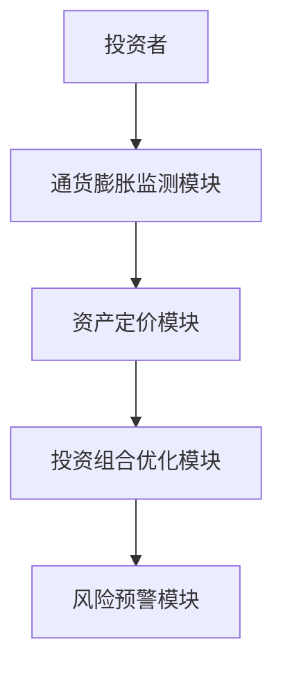

                 


# 价值投资中的通货膨胀考量：保护购买力

> 关键词：价值投资、通货膨胀、购买力、资产定价、通胀对冲

> 摘要：通货膨胀是影响投资决策的重要因素，本文通过分析通货膨胀对购买力的影响，探讨如何在价值投资中进行通胀考量，保护投资组合的购买力。通过数学模型和实际案例，本文详细讲解了通货膨胀对不同资产类别的影响，提出了构建抗通胀投资组合的策略。

---

## 第一章: 通货膨胀与购买力的背景

### 1.1 通货膨胀的定义与表现形式

通货膨胀是指物价总水平在一段时间内持续上涨的现象。它通常由货币供给增加、需求拉动或成本推动等因素引起。通货膨胀的表现形式包括：

1. **消费者价格指数（CPI）**：衡量日常生活用品和服务价格的变化。
2. **生产者价格指数（PPI）**：衡量生产过程中原材料和中间产品的价格变化。
3. **货币供给增加**：货币供应量的增加可能导致通货膨胀。
4. **需求拉动**：总需求超过总供给，导致价格上涨。
5. **成本推动**：生产成本（如工资、原材料）上升，导致产品价格上涨。

通货膨胀对经济的影响是多方面的，包括降低购买力、扭曲价格信号、影响企业投资决策等。在价值投资中，通货膨胀是一个不可忽视的因素，因为它直接影响资产的定价和投资组合的收益。

### 1.2 购买力的定义与重要性

购买力是指在特定时间内，货币能够购买的商品和服务的数量。购买力的强弱直接影响个人和企业的经济状况。通货膨胀会降低购买力，因为相同数量的货币只能购买更少的商品和服务。例如，如果通货膨胀率为5%，那么100元在一年后只能购买相当于95.24元的商品。

购买力的重要性在于它是衡量经济健康状况的重要指标。在投资中，保护购买力是投资者的首要目标之一，尤其是在通货膨胀率较高的环境下。

### 1.3 通货膨胀与价值投资的关联

价值投资是一种以基本面分析为基础的投资策略，强调购买那些市场价格低于其内在价值的资产。通货膨胀对价值投资的影响主要体现在以下几个方面：

1. **资产定价**：通货膨胀会影响资产的名义价值，但实际价值取决于其对通货膨胀的抵御能力。
2. **投资组合保护**：投资者需要通过配置抗通胀资产来保护其购买力。
3. **长期投资策略**：通货膨胀对长期投资的影响更为显著，因此在制定投资策略时需要考虑通货膨胀的长期趋势。

---

## 第二章: 通货膨胀对经济和市场的长期影响

### 2.1 通货膨胀的历史案例分析

#### 2.1.1 美国20世纪70年代的通胀危机

20世纪70年代，美国经历了严重的通货膨胀和经济停滞，即“stagflation”。这一时期，通货膨胀率高达10%以上，导致实际GDP增长放缓，失业率上升。这一案例表明，通货膨胀对经济的破坏性影响是深远的。

#### 2.1.2 近期全球通胀的现状与趋势

近年来，全球范围内通货膨胀有所抬头，尤其是在新冠疫情后，货币宽松政策和供应链中断导致通胀率上升。例如，2022年全球通胀率达到了数十年来的高点。

#### 2.1.3 通胀周期的规律与特征

通货膨胀具有周期性，通常与经济周期密切相关。经济过热时，通货膨胀率上升；经济衰退时，通货膨胀率下降。理解通胀周期的规律有助于投资者更好地进行投资决策。

### 2.2 通货膨胀对不同资产类别的影响

#### 2.2.1 股票市场与通胀的关系

股票市场的表现与通货膨胀密切相关。通货膨胀可能导致企业成本上升，利润减少，从而影响股价。然而，如果企业能够通过提价转移成本上升的压力，其盈利能力和股价可能保持稳定。

#### 2.2.2 债券市场与通胀的关系

债券市场对通货膨胀的敏感性较高。通货膨胀会增加债券的违约风险，同时提高债券的收益率要求。因此，债券价格通常会因通货膨胀而下降。

#### 2.2.3 商品市场与通胀的关系

商品市场（如黄金、原油、农产品）通常是通货膨胀的对冲工具。在通货膨胀环境下，商品价格上涨，从而保护投资者的购买力。

#### 2.2.4 房地产市场与通胀的关系

房地产市场对通货膨胀的反应较为复杂。通货膨胀可能导致房地产价格上涨，但同时也可能增加贷款成本，从而影响房地产市场的整体表现。

### 2.3 通货膨胀对个人投资组合的影响

#### 2.3.1 通胀对现金资产的侵蚀

现金资产在通货膨胀环境下会受到侵蚀，因为货币的实际购买力下降。因此，投资者需要将部分现金资产配置到其他资产类别中，以抵御通货膨胀的影响。

#### 2.3.2 通胀对固定收益资产的挑战

固定收益资产（如债券、定期存款）通常面临通货膨胀的风险，因为其名义收益可能无法覆盖通货膨胀的实际损失。

#### 2.3.3 通胀对股票资产的双重影响

股票资产对通货膨胀的反应较为复杂。一方面，通货膨胀可能导致企业成本上升，利润下降；另一方面，通货膨胀也可能通过提高产品价格来增加企业的收入和利润。

#### 2.3.4 通胀对商品资产的保护作用

商品资产（如黄金、原油）通常被视为通货膨胀的对冲工具，因为它们的价格通常会随通货膨胀率上升而上涨。

---

## 第三章: 通货膨胀与购买力的数学模型

### 3.1 通货膨胀率的计算公式

通货膨胀率可以通过消费者价格指数（CPI）的变化来计算。公式如下：

$$ \text{通货膨胀率} = \frac{\text{当前CPI} - \text{基期CPI}}{\text{基期CPI}} \times 100\% $$

例如，如果基期CPI为100，当前CPI为105，则通货膨胀率为5%。

### 3.2 购买力的计算公式

购买力是指在通货膨胀环境下，货币的实际购买能力。购买力的计算公式如下：

$$ \text{购买力} = \frac{\text{货币数量} \times \text{货币购买力}}{1 + \text{通货膨胀率}} $$

例如，如果通货膨胀率为5%，货币数量为100元，货币购买力为1元，则购买力为：

$$ \text{购买力} = \frac{100 \times 1}{1 + 0.05} \approx 95.24 \text{元} $$

### 3.3 资产的真实回报率计算

资产的真实回报率是指扣除通货膨胀后的实际收益。计算公式如下：

$$ \text{实际回报率} = \frac{\text{名义回报率} - \text{通货膨胀率}}{1 + \text{通货膨胀率}} $$

例如，如果名义回报率为10%，通货膨胀率为5%，则实际回报率为：

$$ \text{实际回报率} = \frac{10\% - 5\%}{1 + 0.05} = \frac{5\%}{1.05} \approx 4.76\% $$

### 3.4 通货膨胀与资产定价的数学模型

资产的定价通常受到通货膨胀的影响。假设某资产的未来现金流为C，通货膨胀率为$\pi$，贴现率为$r$，则资产的现值为：

$$ \text{现值} = \frac{C}{(1 + r)^n} $$

在通货膨胀环境下，贴现率通常会调整为实际利率加上通货膨胀率：

$$ r = r_{\text{实际}} + \pi $$

因此，资产的现值可以表示为：

$$ \text{现值} = \frac{C}{(1 + r_{\text{实际}} + \pi)^n} $$

---

## 第四章: 通货膨胀与价值投资的策略

### 4.1 构建抗通胀投资组合

为了保护购买力，投资者可以通过配置抗通胀资产来构建投资组合。抗通胀资产包括：

1. **黄金**：黄金通常被视为通货膨胀的对冲工具。
2. **商品期货**：商品期货（如原油、农产品）可以帮助投资者对冲通货膨胀风险。
3. **房地产**：房地产通常能够抵御通货膨胀的影响。
4. **股票**：选择那些能够通过提价转移成本上升压力的企业股票。

### 4.2 通胀环境下的投资策略

在通货膨胀环境下，投资者需要调整其投资策略，以应对通货膨胀对资产价格的影响。以下是一些常用的投资策略：

1. **增加现金头寸**：在通货膨胀初期，增加现金头寸可以帮助投资者在通货膨胀加剧时抓住投资机会。
2. **配置抗通胀资产**：通过配置黄金、商品期货等抗通胀资产，保护投资组合的购买力。
3. **选择高分红股票**：高分红股票可以在一定程度上抵消通货膨胀对投资组合收益的影响。
4. **短期债券**：短期债券的风险较低，且在通货膨胀环境下，其收益率通常能够跟上通货膨胀的步伐。

### 4.3 通货膨胀对价值投资的长期影响

从长期来看，通货膨胀对价值投资的影响是复杂的。一方面，通货膨胀可能导致资产价格泡沫；另一方面，通货膨胀也可能通过影响企业的盈利能力和市场利率，进而影响股票和债券的估值。

因此，投资者在进行价值投资时，需要综合考虑通货膨胀的长期趋势，选择那些具有强大盈利能力和抗通胀能力的企业。

---

## 第五章: 通货膨胀与购买力的系统架构设计

### 5.1 系统功能设计

为了帮助投资者更好地应对通货膨胀，我们可以设计一个基于价值投资的抗通胀投资系统。该系统的功能包括：

1. **通货膨胀监测**：实时监测通货膨胀率和相关经济指标。
2. **资产定价模型**：基于通货膨胀率和市场数据，计算资产的实际回报率。
3. **投资组合优化**：根据通货膨胀率和个人风险偏好，优化投资组合配置。
4. **风险预警**：当通货膨胀率超过预设阈值时，触发风险预警。

### 5.2 系统架构设计

以下是系统的架构设计图：



### 5.3 接口设计与交互流程

1. **输入模块**：投资者输入通货膨胀率和风险偏好。
2. **处理模块**：系统根据输入数据，计算资产的实际回报率，并优化投资组合。
3. **输出模块**：系统输出优化后的投资组合配置和风险预警信息。

### 5.4 系统实现

以下是系统的核心实现代码：

```python
import numpy as np

def calculate_real_return nominal_return, inflation_rate):
    return (nominal_return - inflation_rate) / (1 + inflation_rate)

def optimize_portfolio(asset_returns, inflation_rate, risk_tolerance):
    # 计算实际回报率
    real_returns = [calculate_real_return(r, inflation_rate) for r in asset_returns]
    # 计算协方差矩阵
    covariance_matrix = np.cov(real_returns)
    # 计算最优投资组合
    return np.dot(covariance_matrix, risk_tolerance)

# 示例数据
asset_returns = [0.1, 0.12, 0.08]
inflation_rate = 0.05
risk_tolerance = [0.5, 0.3, 0.2]

# 优化投资组合
optimal_portfolio = optimize_portfolio(asset_returns, inflation_rate, risk_tolerance)
print("Optimal Portfolio:", optimal_portfolio)
```

---

## 第六章: 项目实战与案例分析

### 6.1 环境安装与数据准备

为了实现上述系统，投资者需要安装以下软件：

1. Python编程语言
2. NumPy库
3. Matplotlib库

数据来源包括：

1. 通货膨胀率数据：可以从央行或统计部门获取。
2. 资产回报率数据：可以从股票市场、债券市场等渠道获取。

### 6.2 系统核心实现

以下是系统的核心实现代码：

```python
import numpy as np
import matplotlib.pyplot as plt

def plot_inflation_vs_return(inflation_rate, asset_returns):
    plt.plot(inflation_rate, asset_returns, 'b-')
    plt.xlabel('Inflation Rate (%)')
    plt.ylabel('Asset Returns (%)')
    plt.title('Inflation vs Asset Returns')
    plt.show()

# 示例数据
inflation_rate = [2, 3, 4, 5, 6]
asset_returns = [5, 7, 9, 11, 13]

# 绘制图形
plot_inflation_vs_return(inflation_rate, asset_returns)
```

### 6.3 案例分析与解读

假设当前通货膨胀率为5%，某投资者的资产回报率为10%。计算实际回报率：

$$ \text{实际回报率} = \frac{10\% - 5\%}{1 + 5\%} = \frac{5\%}{1.05} \approx 4.76\% $$

这表明在通货膨胀率为5%的环境下，该资产的实际回报率为4.76%。

### 6.4 项目小结

通过上述案例分析，我们可以看到，通货膨胀对资产的实际回报率有重要影响。投资者需要通过配置抗通胀资产和优化投资组合，来保护其购买力。

---

## 第七章: 最佳实践与注意事项

### 7.1 投资建议

1. **分散投资**：通过分散投资不同资产类别，降低通货膨胀对投资组合的影响。
2. **长期持有**：长期持有优质资产可以抵御通货膨胀的侵蚀。
3. **定期再平衡**：定期对投资组合进行再平衡，以应对通货膨胀的变化。

### 7.2 注意事项

1. **避免过度杠杆**：在通货膨胀环境下，过度杠杆可能增加投资组合的风险。
2. **关注经济政策**：通货膨胀通常与货币政策密切相关，投资者需要关注央行的政策变化。
3. **保持灵活性**：通货膨胀环境可能变化迅速，投资者需要保持灵活性，及时调整投资策略。

### 7.3 拓展阅读

1. **《投资学》**：深入理解资产定价和投资组合管理的理论。
2. **《通货膨胀与货币政策》**：了解通货膨胀的形成机制和政策应对。

---

## 结语

通货膨胀是价值投资中不可忽视的重要因素。通过科学的数学模型和系统化的投资策略，投资者可以在通货膨胀环境下保护其购买力，实现长期稳健的投资收益。希望本文能够为投资者提供有价值的 insights，帮助他们在复杂多变的经济环境中做出明智的投资决策。

---

## 作者信息

作者：AI天才研究院/AI Genius Institute  
联系邮箱：contact@aigeniusinstitute.com  
官方网站：https://www.aigeniusinstitute.com  

---

# END

