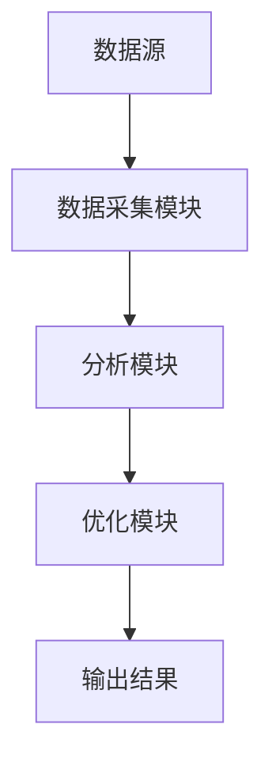

                 


# 价值投资中的风险与回报权衡

## 关键词：价值投资，风险与回报，风险评估，回报预测，投资组合优化

## 摘要

价值投资是一种以基本面分析为基础的投资策略，旨在通过识别市场低估的资产来实现长期收益。在价值投资过程中，风险与回报的权衡是核心问题。本文将从价值投资的基本概念出发，分析风险与回报的类型及其度量方法，构建风险与回报的权衡模型，并通过算法实现和系统设计提供具体的解决方案。最后，本文将通过案例分析展示理论的应用，并总结最佳实践。

---

## 第1章：价值投资的背景与核心概念

### 1.1 价值投资的起源与发展

价值投资起源于20世纪初，由本杰明·格雷厄姆和戴维·多德提出，强调以低于内在价值的价格购买资产。随着金融理论的发展，价值投资逐步形成一套系统的分析框架，广泛应用于股票、房地产等领域。

### 1.2 价值投资的核心要素

#### 1.2.1 安全边际

安全边际是价值投资的核心概念，指资产的市场价格低于其内在价值的部分。通过计算安全边际，投资者可以评估投资的风险和潜在回报。

#### 1.2.2 内在价值计算

内在价值是资产在合理市场条件下的公平价格。计算内在价值通常涉及贴现现金流模型等方法。

### 1.3 价值投资与其他投资策略的区别

- **技术分析**：依赖价格和成交量数据，注重短期趋势。
- **成长投资**：关注高成长性的公司，愿意为未来增长支付较高价格。
- **价值投资**：寻找市场价格低于内在价值的资产，注重安全边际。

---

## 第2章：风险与回报的核心概念

### 2.1 风险的类型与度量

#### 2.1.1 系统性风险与非系统性风险

- **系统性风险**：影响整个市场的风险，如经济衰退、政策变化。
- **非系统性风险**：特定资产或行业面临的风险。

#### 2.1.2 风险的度量方法

- **方差**：衡量资产回报率的波动性。
- **标准差**：方差的平方根，反映资产回报的稳定性。
- **VaR（在险价值）**：特定置信水平下可能的最大损失。

### 2.2 回报的来源与衡量

#### 2.2.1 股息回报

股息是投资者持有股票的直接收益，稳定股息支付的公司通常具有较高的内在价值。

#### 2.2.2 资本增值

资产价格的上涨带来的收益，是价值投资的主要目标。

#### 2.2.3 投资回报的衡量指标

- **夏普比率**：衡量单位风险超额收益。
- **特雷纳比率**：衡量投资组合相对于市场指数的超额收益。

### 2.3 风险与回报的权衡模型

#### 2.3.1 风险-回报权衡框架

通过比较不同资产的风险调整后回报，选择具有更高风险调整后收益的资产。

#### 2.3.2 风险调整后回报模型

$$\text{风险调整后回报} = \text{预期回报} - \text{风险溢价}$$

---

## 第3章：风险评估与回报预测的算法

### 3.1 风险评估算法

#### 3.1.1 方差-协方差矩阵

计算资产回报之间的相关性，构建方差-协方差矩阵。

#### 3.1.2 风险贡献度计算

$$\text{风险贡献度} = \text{权重} \times \text{协方差} \times \text{组合方差}$$

### 3.2 回报预测的数学模型

#### 3.2.1 线性回归模型

$$y = \beta x + \epsilon$$

#### 3.2.2 时间序列分析

使用ARIMA模型预测未来回报。

### 3.3 算法实现

#### 3.3.1 使用Python进行风险评估

```python
import numpy as np

def calculate_variance(matrix):
    return np.var(matrix)
```

---

## 第4章：系统分析与架构设计

### 4.1 投资决策系统的架构设计

#### 4.1.1 系统模块划分

- **数据采集模块**：收集市场数据。
- **分析模块**：计算风险和回报。
- **优化模块**：构建最优投资组合。

#### 4.1.2 系统架构图



---

## 第5章：项目实战

### 5.1 案例分析

#### 5.1.1 数据收集

从金融数据库获取历史价格和财务数据。

#### 5.1.2 内在价值计算

使用贴现现金流模型评估股票的内在价值。

#### 5.1.3 风险与回报分析

计算股票的风险和回报，构建投资组合。

### 5.2 代码实现

```python
import pandas as pd

def calculate_intrinsic_value(fcf, discount_rate):
    return fcf / (1 + discount_rate)
```

---

## 第6章：最佳实践与总结

### 6.1 风险管理技巧

- 定期重新评估投资组合。
- 保持足够的安全边际。

### 6.2 投资策略调整

- 根据市场变化调整投资组合。
- 定期审查投资标的的基本面。

### 6.3 持续学习

- 关注市场动态。
- 更新分析工具和方法。

---

## 结语

价值投资中的风险与回报权衡是一个复杂但 rewarding 的过程。通过深入理解风险和回报的本质，掌握合适的分析工具和方法，投资者可以在长期实现稳健的投资回报。

---

## 作者

作者：AI天才研究院/AI Genius Institute  
& 禅与计算机程序设计艺术 /Zen And The Art of Computer Programming

