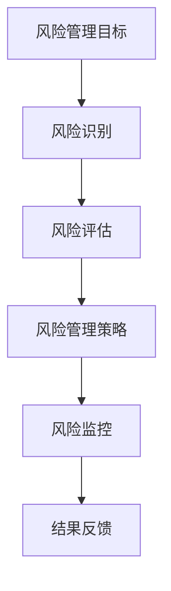

                 


# 价值投资中的风险管理策略

## 关键词：价值投资, 风险管理, 投资策略, 风险评估, 风险控制

## 摘要：  
本文深入探讨了价值投资中的风险管理策略，从背景知识到具体实施，系统性地分析了如何在价值投资中有效管理和控制风险。文章首先介绍了价值投资的基本概念和风险管理的重要性，随后详细分析了风险的分类与特征，并结合实际案例说明了风险管理在价值投资中的具体应用。通过系统化的风险管理策略制定与实施，帮助投资者在价值投资过程中实现长期稳健的收益目标。

---

# 第一部分: 价值投资中的风险管理背景与核心概念

## 第1章: 价值投资的基本概念与风险管理的重要性

### 1.1 价值投资的起源与发展

#### 1.1.1 价值投资的定义与核心理念
- 价值投资是一种以基本面分析为基础的投资策略，旨在通过寻找被市场低估的优质资产，实现长期稳定的收益。
- 核心理念：  
  1. **安全边际**：买入价格低于内在价值，确保足够的安全空间。  
  2. **长期视角**：关注企业的内在价值，而非短期市场波动。  
  3. **逆人性**：在市场恐慌时买入，在市场狂热时卖出。

#### 1.1.2 价值投资与其它投资策略的对比
- **与趋势投资的区别**：  
  - 趋势投资关注市场短期趋势，依赖技术分析。  
  - 价值投资关注企业基本面，注重长期价值。  
- **与成长投资的区别**：  
  - 成长投资追求高增长企业，风险较高。  
  - 价值投资追求低估值企业，注重安全边际。

#### 1.1.3 价值投资在现代金融中的地位
- 价值投资是投资学的重要流派之一，尤其适合长期稳健的投资者。  
- 在现代金融中，价值投资与量化投资、趋势投资等策略形成互补。

### 1.2 风险管理的核心地位

#### 1.2.1 风险管理的基本概念
- 风险管理是指通过识别、评估和控制风险，以最小化潜在损失并优化投资回报的过程。
- 风险管理的核心目标：在可接受的风险范围内，实现最大化的收益。

#### 1.2.2 风险管理在价值投资中的重要性
- 价值投资强调安全边际，风险管理是其核心原则之一。
- 风险管理能够帮助投资者避免重大损失，确保投资组合的长期稳定性。

#### 1.2.3 风险管理与投资收益的关系
- 风险与收益是辩证统一的关系：收益越高，风险越大；风险越小，收益越低。
- 通过科学的风险管理，可以在风险可控的前提下，实现收益的最大化。

## 第2章: 风险的分类与特征分析

### 2.1 风险的分类
- **市场风险**：整体市场波动对投资组合的影响。  
- **信用风险**：债券或股票发行人违约的风险。  
- **流动性风险**：资产难以快速变现的风险。  
- **操作风险**：投资过程中操作失误导致的损失。  
- **其他风险**：包括政策风险、汇率风险等。

### 2.2 风险特征对比表格
| 风险类型 | 描述 | 计量方式 | 管理策略 |
|----------|------|----------|----------|
| 市场风险 | 影响整个市场的波动 | 标准差、波动率 | 多元化、对冲 |
| 信用风险 | 债务人违约风险 | 信用评级、违约概率 | 分散投资、保险 |
| 流动性风险 | 资产变现难度 | 资产流动性比率 | 现金储备、短期资产 |
| 操作风险 | 投资过程中的失误 | 操作失误频率 | 内部控制、流程优化 |

## 第3章: 价值投资与风险管理的关系

### 3.1 价值投资中的风险管理目标

#### 3.1.1 保护本金安全
- 价值投资强调安全边际，风险管理的第一目标是保护投资者的本金不受损失。

#### 3.1.2 控制投资组合波动
- 通过分散投资和选择优质资产，降低投资组合的波动性。

#### 3.1.3 提高投资组合的稳定性
- 风险管理能够帮助投资者在市场波动中保持投资组合的稳定性，实现长期稳健的收益。

### 3.2 价值投资中的风险管理原则

#### 3.2.1 风险与收益的平衡
- 在追求收益的同时，必须考虑风险的承受能力。

#### 3.2.2 长期视角下的风险管理
- 价值投资强调长期持有优质资产，风险管理也应注重长期目标的实现。

#### 3.2.3 风险管理的动态性
- 风险管理是一个动态过程，需要根据市场变化和投资组合的表现不断调整。

---

# 第二部分: 风险管理策略的制定与实施

## 第4章: 风险管理策略的制定

### 4.1 风险管理目标的设定

#### 4.1.1 投资目标与风险承受能力的匹配
- 根据投资者的风险偏好和财务状况，确定可接受的风险水平。
- 例如：保守型投资者的风险承受能力较低，激进型投资者的风险承受能力较高。

#### 4.1.2 风险容忍度的确定
- 风险容忍度是指投资者在追求收益的同时，愿意接受的最大风险水平。
- 风险容忍度的确定需要综合考虑市场环境、投资期限和个人财务状况。

### 4.2 风险评估与工具选择

#### 4.2.1 风险评估的关键指标
- **波动率**：衡量资产价格的短期波动性。  
- **最大回撤**：衡量投资组合在一段时间内的最大亏损幅度。  
- **VaR（在险价值）**：衡量投资组合在一定置信水平下的最大可能损失。

#### 4.2.2 风险管理工具的选择
- **分散投资**：通过投资不同类型资产降低风险。  
- **对冲策略**：利用衍生品对冲市场风险。  
- **止损策略**：设定止损点，避免重大亏损。

### 4.3 风险管理策略的动态调整

#### 4.3.1 风险管理策略的调整原则
- 根据市场环境的变化，定期评估和调整风险管理策略。
- 例如：在市场牛市中，可以适当增加风险敞口；在市场熊市中，减少风险敞口。

#### 4.3.2 动态风险管理的具体步骤
- 定期评估投资组合的表现和风险水平。
- 根据评估结果，调整投资组合的构成和风险管理工具的使用。

## 第5章: 风险管理策略的系统分析与架构设计

### 5.1 风险管理系统的功能设计

#### 5.1.1 风险识别模块
- 通过基本面分析和市场数据，识别潜在风险。

#### 5.1.2 风险评估模块
- 使用数学模型评估风险的严重程度。

#### 5.1.3 风险控制模块
- 制定风险管理策略，如分散投资、对冲等。

### 5.2 风险管理系统的架构设计

#### 5.2.1 系统架构图


#### 5.2.2 关键模块的交互流程
- **风险识别**：通过数据分析和市场研究，识别潜在风险。
- **风险评估**：使用数学模型评估风险的严重程度。
- **风险管理策略**：根据评估结果，制定相应的风险管理策略。
- **风险监控**：实时监控风险的变化，及时调整策略。

---

# 第三部分: 项目实战与最佳实践

## 第6章: 风险管理策略的项目实战

### 6.1 环境配置与工具选择

#### 6.1.1 数据来源
- 使用历史市场数据和公司基本面数据。

#### 6.1.2 工具选择
- 使用Python和相关数据分析库（如Pandas、NumPy）进行数据分析。
- 使用Matplotlib或Seaborn进行数据可视化。

### 6.2 风险管理策略的核心实现

#### 6.2.1 风险评估的Python代码示例
```python
import pandas as pd
import numpy as np

# 假设我们有一个资产组合的回报数据
returns = pd.Series([0.05, -0.02, 0.03, 0.01, -0.04])

# 计算波动率
volatility = returns.std()

# 计算最大回撤
def max_drawdown(returns):
    cumulative = (1 + returns).cumprod()
    max_drawdown = (cumulative.div(cumulative.cummax())).min() - 1
    return max_drawdown

max_dd = max_drawdown(returns)
print(f"波动率: {volatility:.2%}")
print(f"最大回撤: {max_dd:.2%}")
```

#### 6.2.2 风险控制的代码实现
```python
import pandas as pd
import numpy as np

# 假设我们有一个资产组合的回报数据
returns = pd.Series([0.05, -0.02, 0.03, 0.01, -0.04])

# 计算VaR
def calculate VaR(returns, confidence_level=0.95):
    sorted_returns = sorted(returns)
    index = int(len(sorted_returns) * (1 - confidence_level))
    VaR = -sorted_returns[index]
    return VaR

VaR = calculate VaR(returns)
print(f"VaR (95%置信水平): {VaR:.2%}")
```

### 6.3 风险管理策略的案例分析

#### 6.3.1 案例背景
- 假设我们有一个价值投资组合，包含5只股票，每只股票的投资比例为20%。

#### 6.3.2 风险管理策略的实施
- 通过分散投资降低市场风险。
- 使用对冲策略对冲市场波动风险。

### 6.4 项目小结

#### 6.4.1 实施效果
- 投资组合的波动率显著降低。
- 最大回撤得到有效控制。

#### 6.4.2 经验总结
- 风险管理是价值投资成功的关键。
- 动态调整风险管理策略，能够更好地适应市场变化。

## 第7章: 最佳实践与总结

### 7.1 最佳实践 tips

#### 7.1.1 风险管理的注意事项
- 风险管理需要长期坚持，不能因为市场环境变化而放松。
- 风险管理需要结合实际情况，灵活调整策略。

#### 7.1.2 风险管理的误区
- 过度分散投资可能导致收益下降。
- 过度追求安全可能导致错失重大投资机会。

### 7.2 总结

#### 7.2.1 价值投资中的风险管理总结
- 风险管理是价值投资的核心原则之一。
- 通过科学的风险管理，可以在市场波动中实现长期稳健的收益。

#### 7.2.2 风险管理的未来展望
- 随着科技的发展，风险管理将更加依赖于数据和算法。
- 人工智能和大数据技术将为风险管理提供更强大的工具。

---

# 作者：AI天才研究院/AI Genius Institute & 禅与计算机程序设计艺术 /Zen And The Art of Computer Programming

