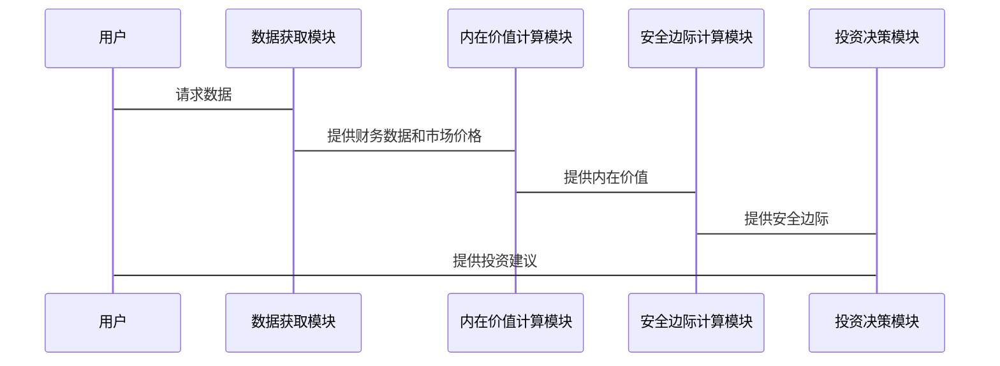

                 


# 价值投资中的风险管理：安全边际的作用

## 关键词：
- 价值投资
- 风险管理
- 安全边际
- 投资策略
- 内在价值
- 数学模型

## 摘要：
本文深入探讨了价值投资中的风险管理，重点分析了安全边际在投资决策中的作用。通过介绍安全边际的定义、计算方法及应用场景，结合数学模型和实际案例，帮助投资者理解和应用这一关键概念。文章还详细讲解了安全边际与其他风险管理方法的对比，以及如何通过系统架构设计和项目实战来实现有效的风险管理。

---

## 第1章：价值投资与风险管理概述

### 1.1 价值投资的核心理念

#### 1.1.1 价值投资的定义与起源
价值投资是一种投资策略，强调以低于内在价值的价格购买优质资产。这一理念由本杰明·格雷厄姆在20世纪初提出，核心在于寻找市场低估的股票，长期持有以实现收益。

#### 1.1.2 价值投资的基本原则
- **安全边际**：买入价格低于内在价值，确保有足够的安全空间。
- **长期视角**：关注企业的长期价值，而非短期市场波动。
- **分散投资**：通过分散投资降低特定风险。

#### 1.1.3 价值投资与成长投资的区别
- **价值投资**：注重低估值，追求安全边际。
- **成长投资**：注重高增长潜力，愿意为未来收益支付更高价格。

### 1.2 风险管理的重要性

#### 1.2.1 风险管理的定义
风险管理是识别、评估和应对可能影响投资收益的不确定性因素的过程。

#### 1.2.2 风险管理在投资中的作用
- **保护资本**：避免重大损失。
- **提高收益稳定性**：通过分散和控制风险，确保收益的持续性。
- **增强决策信心**：基于合理的风险管理策略，做出更明智的投资决策。

#### 1.2.3 风险与收益的平衡
在投资中，收益与风险通常是正相关的。安全边际帮助投资者在追求收益的同时，控制潜在风险。

### 1.3 安全边际的概念与作用

#### 1.3.1 安全边际的定义
安全边际是内在价值与市场价格之间的差额，表示投资者在买入时的保护空间。

#### 1.3.2 安全边际在价值投资中的作用
- **降低风险**：通过安全边际，减少市场价格波动带来的损失。
- **提高投资的安全性**：确保在市场下跌时仍有足够的缓冲空间。
- **增加收益潜力**：当市场价格回归内在价值时，投资者获得超额收益。

---

## 第2章：安全边际的核心概念与计算方法

### 2.1 安全边际的原理

#### 2.1.1 安全边际的数学模型
安全边际的计算公式如下：

$$ \text{安全边际} = \frac{\text{内在价值} - \text{市场价格}}{\text{市场价格}} \times 100\% $$

#### 2.1.2 安全边际与内在价值的关系
- 内在价值是安全边际的基础，决定了安全边际的大小。
- 市场价格的波动影响安全边际的宽窄。

#### 2.1.3 安全边际的保护作用
通过安全边际，投资者可以在市场价格下跌时避免损失，甚至在市场回升时获利。

### 2.2 安全边际与其他风险管理方法的对比

#### 2.2.1 风险价值（VaR）的比较
- VaR关注可能的最大损失，而安全边际关注的是价格与价值的偏离。

#### 2.2.2 现金流贴现法的比较
- 现金流贴现法用于计算内在价值，而安全边际是基于此的保护空间。

#### 2.2.3 风险调整折现率法的比较
- 风险调整折现率法通过调整折现率来反映风险，而安全边际直接反映了价格与价值的差异。

### 2.3 安全边际的计算步骤

#### 2.3.1 确定目标公司的内在价值
使用现金流贴现法计算内在价值：

$$ V = \frac{CF}{(r - g)} $$

其中，\( V \) 为内在价值，\( CF \) 为现金流，\( r \) 为折现率，\( g \) 为增长率。

#### 2.3.2 确定市场的当前价格
市场价格通常通过股票交易所的数据获取。

#### 2.3.3 计算安全边际
使用公式：

$$ \text{安全边际} = \frac{V - P}{P} \times 100\% $$

其中，\( P \) 为市场价格。

---

## 第3章：安全边际的数学模型与公式

### 3.1 内在价值的计算公式

$$ V = \frac{CF}{(r - g)} $$

例如，假设一家公司的现金流为100万元，折现率为10%，增长率为5%，则内在价值为：

$$ V = \frac{100}{0.10 - 0.05} = 2000 \text{万元} $$

### 3.2 安全边际的计算公式

$$ \text{安全边际} = \frac{V - P}{P} \times 100\% $$

例如，如果市场价格为1500万元，则安全边际为：

$$ \text{安全边际} = \frac{2000 - 1500}{1500} \times 100\% = 33.33\% $$

---

## 第4章：系统分析与架构设计

### 4.1 问题场景介绍
为了计算和应用安全边际，我们需要构建一个系统，包括数据获取、内在价值计算、安全边际计算和投资决策功能。

### 4.2 系统功能设计

#### 4.2.1 数据获取模块
- 获取目标公司的财务数据和市场价格。

#### 4.2.2 内在价值计算模块
- 使用现金流贴现法计算内在价值。

#### 4.2.3 安全边际计算模块
- 根据内在价值和市场价格计算安全边际。

#### 4.2.4 投资决策模块
- 根据安全边际做出买入、持有或卖出的决策。

### 4.3 系统架构设计


### 4.4 系统接口设计

#### 4.4.1 数据获取接口
- 输入：公司名称或代码
- 输出：财务数据和市场价格

#### 4.4.2 内在价值计算接口
- 输入：现金流、折现率、增长率
- 输出：内在价值

#### 4.4.3 安全边际计算接口
- 输入：内在价值、市场价格
- 输出：安全边际

### 4.5 系统交互流程



---

## 第5章：项目实战

### 5.1 环境安装

#### 5.1.1 安装Python
- 下载并安装Python 3.8或更高版本。

#### 5.1.2 安装必要的库
- 使用pip安装以下库：
  - `pandas`：数据处理
  - `numpy`：数值计算
  - `scikit-learn`：机器学习（可选）

### 5.2 核心代码实现

#### 5.2.1 数据获取模块

```python
import pandas as pd
import requests

def get_financial_data(ticker):
    url = f"https://api.example.com/financial_data/{ticker}"
    response = requests.get(url)
    data = pd.DataFrame(response.json())
    return data
```

#### 5.2.2 内在价值计算模块

```python
def calculate_intrinsic_value(cash_flow, discount_rate, growth_rate):
    return cash_flow / (discount_rate - growth_rate)
```

#### 5.2.3 安全边际计算模块

```python
def calculate_margin_of_safety(intrinsic_value, market_price):
    return (intrinsic_value - market_price) / market_price * 100
```

#### 5.2.4 投资决策模块

```python
def investment_decision(margin_of_safety):
    if margin_of_safety > 30:
        return "买入"
    elif margin_of_safety > 15:
        return "持有"
    else:
        return "卖出"
```

### 5.3 案例分析

#### 5.3.1 案例背景
假设我们分析一家公司，其现金流为1000万元，折现率为10%，增长率为5%，市场价格为1200万元。

#### 5.3.2 计算内在价值

$$ V = \frac{1000}{0.10 - 0.05} = 20000 \text{万元} $$

#### 5.3.3 计算安全边际

$$ \text{安全边际} = \frac{20000 - 12000}{12000} \times 100\% = 66.67\% $$

#### 5.3.4 投资决策
由于安全边际大于30%，投资决策为“买入”。

### 5.4 项目总结
通过项目实战，我们验证了安全边际在投资决策中的实际应用，帮助投资者做出更明智的投资选择。

---

## 第6章：最佳实践与注意事项

### 6.1 最佳实践

#### 6.1.1 定期评估安全边际
市场波动频繁，需定期重新计算安全边际。

#### 6.1.2 结合其他分析工具
安全边际是价值投资的重要工具，但需结合其他分析方法，如技术分析。

#### 6.1.3 风险控制
设置止损点，避免因市场波动导致的重大损失。

### 6.2 小结
安全边际是价值投资中的关键概念，通过合理的计算和应用，投资者可以在控制风险的同时，实现稳定的收益。

### 6.3 注意事项

#### 6.3.1 数据准确性
确保使用的财务数据准确无误。

#### 6.3.2 模型假设
内在价值计算依赖于假设的现金流、折现率和增长率，需合理评估。

#### 6.3.3 市场变化
市场环境变化可能影响安全边际的有效性，需及时调整策略。

---

## 结束语

通过本文的详细讲解，我们了解了安全边际在价值投资中的重要性及其计算方法。结合系统架构和项目实战，我们能够更好地应用这一概念，做出更明智的投资决策。投资是一项长期的事业，理解和应用安全边际将帮助我们在风险可控的前提下，实现稳健的收益。

---

## 作者：AI天才研究院/AI Genius Institute & 禅与计算机程序设计艺术 /Zen And The Art of Computer Programming

