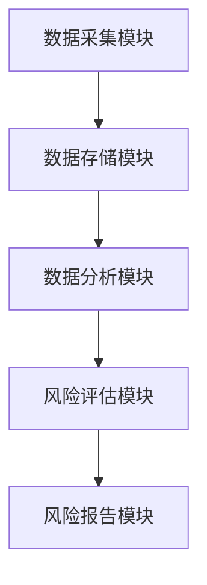

                 


# 价值投资中的风险评估：超越波动性

## 关键词：价值投资、风险评估、波动性、投资策略、风险管理

## 摘要：
价值投资是一种长期有效的投资策略，其核心在于通过深入分析企业的基本面，寻找被市场低估的投资标的。然而，风险评估在价值投资中同样重要，它不仅关乎投资组合的稳定性，也影响着投资决策的科学性。本文将从风险评估的基本概念入手，分析波动性在价值投资中的局限性，探讨如何通过多元化的视角构建更全面的风险评估体系。通过实际案例分析和系统化的解决方案，本文旨在为投资者提供超越波动性的风险管理方法，帮助他们在价值投资中实现稳健的收益。

---

## 第一部分：价值投资与风险评估的背景

### 第1章：价值投资的核心理念

#### 1.1 价值投资的定义与特点
- **定义**：价值投资是一种以基本面分析为基础的投资策略，旨在发现市场价格低于其内在价值的证券。
- **特点**：
  - 长期导向：关注企业的长期价值，而非短期价格波动。
  - 深入分析：通过对公司财务报表、行业地位、竞争优势等的分析，评估其内在价值。
  - 逆向思维：在市场恐慌时买入，在市场狂热时卖出。

#### 1.2 风险评估的重要性
- 投资者在追求超额收益的同时，必须对潜在风险有足够的认识和控制。
- 风险评估是投资决策的核心环节，直接影响投资组合的稳定性和收益能力。
- 传统风险评估往往关注市场的波动性，但波动性只是风险的表象，而非本质。

### 第2章：波动性与风险的关系

#### 2.1 波动性的定义
- 波动性是资产价格在短期内的剧烈波动程度。
- 波动性通常通过统计指标（如标准差）来衡量，是风险的传统量化指标。

#### 2.2 波动性与风险的差异
- **波动性是风险的表象**：波动性反映了资产价格的短期变化，但并非所有波动都代表风险。
- **风险的本质是损失的可能性**：风险关注的是资产价格长期偏离其内在价值的可能性，以及由此带来的损失。
- **波动性与风险的联系**：高波动性可能意味着更高的潜在风险，但并非所有高波动性资产都有高风险。

---

## 第二部分：超越波动性的风险评估方法

### 第3章：风险评估的核心维度

#### 3.1 财务风险
- 企业的财务健康状况直接影响其价值。
- 通过分析资产负债表、利润表和现金流，评估企业的偿债能力、盈利能力和发展潜力。

#### 3.2 市场风险
- 行业竞争格局、宏观经济环境和政策变化对企业价值的影响。
- 通过行业分析和宏观经济指标，评估市场的系统性风险。

#### 3.3 流动性风险
- 资产在短期内转化为现金的能力。
- 流动性不足可能导致资产价格大幅波动，甚至难以变现。

#### 3.4 操作风险
- 投资决策中的操作失误或管理不善带来的风险。
- 包括信息获取不全面、分析方法错误等。

### 第4章：构建多元化的风险评估体系

#### 4.1 多因子模型
- 通过多个因子（如市盈率、市净率、股息率等）评估资产的内在价值。
- 使用多元回归分析，识别影响资产价格的关键因子。

#### 4.2 风险对冲策略
- 利用衍生工具（如期权、期货）对冲特定风险。
- 通过资产配置分散非系统性风险。

#### 4.3 定性与定量分析结合
- 定量分析：通过数学模型量化风险。
- 定性分析：结合行业专家意见和市场情绪分析。

---

## 第三部分：系统化风险评估的实现

### 第5章：系统化风险评估的框架

#### 5.1 数据收集与处理
- 数据来源：历史价格、财务报表、行业数据、宏观经济指标等。
- 数据清洗：处理缺失值、异常值和噪声数据。

#### 5.2 模型选择与实现
- 使用多元回归模型评估各因子对风险的影响。
- 通过主成分分析（PCA）降维，简化模型复杂度。

#### 5.3 模型验证与优化
- 通过回测验证模型的有效性。
- 调整模型参数，优化风险评估的准确性。

### 第6章：系统架构与实现

#### 6.1 系统功能设计
- 数据采集模块：收集相关数据。
- 数据分析模块：进行因子分析和风险评估。
- 风险报告模块：生成可视化报告。

#### 6.2 系统架构设计


#### 6.3 系统接口设计
- 数据接口：与数据库或API对接。
- 报告接口：生成可视化报告并输出。

---

## 第四部分：项目实战与案例分析

### 第7章：项目实战

#### 7.1 环境安装
- 安装Python和相关库（如Pandas、NumPy、Scikit-learn）。
- 安装可视化工具（如Matplotlib、Seaborn）。

#### 7.2 核心代码实现
```python
import pandas as pd
import numpy as np
from sklearn.linear_model import LinearRegression
from sklearn.metrics import mean_squared_error

# 数据加载
data = pd.read_csv('stock_data.csv')

# 特征选择
features = ['市盈率', '市净率', '股息率']
target = '波动率'

# 模型训练
model = LinearRegression()
model.fit(data[features], data[target])

# 模型预测
predictions = model.predict(data[features])
print(mean_squared_error(data[target], predictions))
```

#### 7.3 案例分析
- 选择一个具体行业（如科技行业）进行分析。
- 使用上述模型评估行业风险，并制定相应的投资策略。

---

## 第五部分：总结与展望

### 第8章：总结

#### 8.1 核心观点回顾
- 波动性并非风险的本质，而是风险的表现形式。
- 风险评估需要结合定性与定量分析，构建多元化的评估体系。
- 系统化的方法能够有效降低投资风险，提高收益稳定性。

### 第9章：展望

#### 9.1 未来研究方向
- 结合人工智能技术，进一步优化风险评估模型。
- 探索更多元化的风险因子，提升模型的准确性。

#### 9.2 投资者的注意事项
- 风险评估是长期过程，需要持续关注和调整。
- 在实际投资中，结合市场变化和个人判断，灵活运用风险评估方法。

---

## 作者：AI天才研究院/AI Genius Institute & 禅与计算机程序设计艺术 /Zen And The Art of Computer Programming

