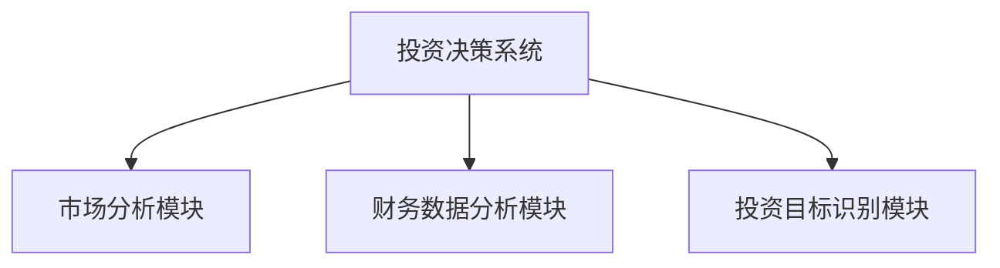

                 


# 价值投资之父本杰明·格雷厄姆的投资哲学

> 关键词：价值投资，本杰明·格雷厄姆，安全边际，市场先生，内在价值，投资哲学

> 摘要：本文深入探讨了价值投资之父本杰明·格雷厄姆的投资哲学，从其核心概念到数学模型，再到系统架构和项目实战，全面分析了格雷厄姆的投资理念及其在现代金融中的应用。文章内容丰富，逻辑清晰，结合实际案例和数学公式，帮助读者更好地理解和应用价值投资的哲学。

---

## 第一部分：价值投资的哲学基础

### 第1章：价值投资的起源与背景

#### 1.1 价值投资的起源
##### 1.1.1 投资领域的传统观念
投资领域 traditionally emphasizes short-term gains and market speculation. 然而，这种传统观念 often leads to irrational decisions and risks. 价值投资 emerged as a response to these limitations.

##### 1.1.2 格雷厄姆与巴菲特的师徒关系
格雷厄姆是投资领域的先驱，他的思想深刻影响了巴菲特。巴菲特曾说："格雷厄姆是我投资理念的老师。"

##### 1.1.3 价值投资在现代金融中的地位
价值投资已成为一种重要的投资策略，尤其是在市场波动加剧的情况下，其长期稳定的回报吸引了越来越多的投资者。

#### 1.2 本杰明·格雷厄姆的生平简介
##### 1.2.1 格雷厄姆的早年经历
格雷厄姆出生于1897年，早年经历了经济大萧条，这为他的投资哲学奠定了基础。

##### 1.2.2 格雷厄姆的投资实践
他在1926年与他人共同创立了格雷厄姆-纽曼公司，专注于低价股票的投资。

##### 1.2.3 格雷厄姆的著作与理论贡献
他最著名的著作是《证券分析》和《聪明的投资者》，这些书籍奠定了价值投资的基础。

#### 1.3 价值投资的核心理念
##### 1.3.1 价值投资的定义与内涵
价值投资强调购买被低估的股票，关注其内在价值而非市场波动。

##### 1.3.2 价值投资与投机的区分
价值投资注重长期稳健的回报，而投机则追求短期暴利，风险较高。

##### 1.3.3 格雷厄姆投资哲学的核心要素
格雷厄姆提出的安全边际、市场先生和内在价值是价值投资的核心要素。

---

### 第2章：价值投资的核心概念与原理

#### 2.1 安全边际
##### 2.1.1 安全边际的定义
安全边际是内在价值与市场价格之间的差额，确保投资的安全性和盈利能力。

##### 2.1.2 安全边际的计算方法
安全边际 = 内在价值 - 市场价格。

##### 2.1.3 安全边际在投资决策中的作用
通过安全边际，投资者可以避免过度支付，降低投资风险。

#### 2.2 市场先生
##### 2.2.1 市场先生的定义
市场先生代表市场波动，投资者应理性应对市场的短期波动。

##### 2.2.2 市场先生的波动性分析
市场先生的短期波动由投资者情绪驱动，长期趋势则由内在价值决定。

##### 2.2.3 如何应对市场先生的短期波动
投资者应避免被短期波动影响，坚持长期投资策略。

#### 2.3 内在价值
##### 2.3.1 内在价值的定义
内在价值是资产的真实价值，不因市场波动而改变。

##### 2.3.2 内在价值的计算方法
使用贴现现金流模型和股息贴现模型进行计算。

##### 2.3.3 内在价值与市场价格的关系
市场价格围绕内在价值波动，长期回归内在价值。

---

### 第3章：价值投资的数学模型与公式

#### 3.1 内在价值计算模型
##### 3.1.1 贴现现金流模型
$$\text{内在价值} = \sum_{t=1}^{n} \frac{CF_t}{(1+r)^t} + \frac{TV}{(1+r)^n}$$
其中，$CF_t$ 是第 t 年的现金流，$r$ 是折现率，$TV$ 是终值。

##### 3.1.2 股息贴现模型
$$\text{内在价值} = \sum_{t=1}^{\infty} \frac{D_t}{(1+r)^t}$$
其中，$D_t$ 是第 t 年的股息。

#### 3.2 安全边际计算公式
##### 3.2.1 安全边际
$$\text{安全边际} = \text{内在价值} - \text{市场价格}$$

#### 3.3 投资组合优化模型
##### 3.3.1 马科维茨投资组合理论
$$\min_w \left( w^T \Sigma w \right)$$
$$\text{subject to } w^T \mu = \text{目标收益}, w^T 1 = 1$$
其中，$w$ 是投资组合权重，$\Sigma$ 是协方差矩阵，$\mu$ 是收益向量。

---

### 第4章：价值投资的系统分析与架构设计

#### 4.1 投资决策系统的功能设计
##### 4.1.1 投资目标识别
确定投资目标，如追求长期稳定收益。

##### 4.1.2 市场分析模块
分析市场趋势和波动，识别投资机会。

##### 4.1.3 财务数据分析模块
评估企业的财务状况，计算内在价值。

#### 4.2 系统架构设计
##### 4.2.1 分层架构图


#### 4.3 系统交互流程
##### 4.3.1 用户需求分析
识别用户的投资目标和风险偏好。

##### 4.3.2 数据采集与处理
收集市场数据和企业财务数据。

##### 4.3.3 投资决策生成
基于数据分析生成投资决策。

---

### 第5章：价值投资的项目实战

#### 5.1 投资组合构建
##### 5.1.1 环境安装
安装必要的金融分析工具和编程环境。

##### 5.1.2 核心实现
使用Python编写投资组合优化代码，如：

```python
import numpy as np
from scipy.optimize import minimize

def portfolio_optimization(weights, returns, covariance):
    def objective(w):
        return (w.T @ covariance @ w).item()
    constraints = [{'type': 'eq', 'fun': lambda w: np.sum(w) - 1}, 
                   {'type': 'eq', 'fun': lambda w: w.T @ returns - target_return}]
    result = minimize(objective, np.ones(weights.shape), constraints=constraints)
    return result.x

weights = portfolio_optimization(...)
```

##### 5.1.3 案例分析
分析一个具体的投资组合，计算其内在价值和安全边际。

---

### 第6章：总结与展望

#### 6.1 总结
价值投资是一种长期稳健的投资策略，格雷厄姆的安全边际、市场先生和内在价值理论为投资者提供了重要的指导。

#### 6.2 未来展望
随着金融市场的变化，价值投资需要不断适应新的挑战，结合技术手段优化投资决策。

---

## 作者：AI天才研究院/AI Genius Institute & 禅与计算机程序设计艺术 /Zen And The Art of Computer Programming

