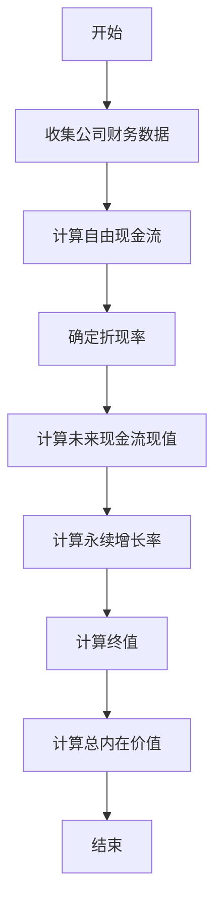

                 


# 价值投资之父格雷厄姆的投资哲学

## 关键词：价值投资、格雷厄姆、投资哲学、内在价值、安全边际、投资策略

## 摘要：本篇文章深入探讨了价值投资之父本杰明·格雷厄姆的投资哲学，从其核心概念、算法原理到系统架构设计，再到项目实战，全面解析其价值投资理念，帮助读者理解如何在当前市场环境中应用格雷厄姆的策略。

---

# 第1章: 投资的基本概念与背景

## 1.1 投资的定义与核心要素

### 1.1.1 投资的定义
投资是指将资金投入到资产中，以期获得未来收益的行为。投资的核心在于通过分析资产的内在价值，做出明智的决策。

### 1.1.2 投资的核心要素
- **资产**：包括股票、债券、房地产等。
- **收益**：投资的回报，包括资本收益和分红等。
- **风险**：投资可能面临的损失或收益波动。

### 1.1.3 投资的目标与意义
投资的目标是实现财富的保值和增值，意义在于通过科学的方法最大化收益并降低风险。

## 1.2 价值投资的背景与现状

### 1.2.1 价值投资的起源
价值投资起源于20世纪初，格雷厄姆是这一领域的先驱，他强调以低于内在价值的价格买入资产。

### 1.2.2 当前市场环境下的价值投资
在当前市场波动加剧的情况下，价值投资强调长期视角，注重基本面分析，帮助投资者在不确定性中寻找安全边际。

### 1.2.3 价值投资的全球视角
价值投资理念已被全球投资者广泛接受，尤其在新兴市场中，其方法论为投资者提供了稳定的投资策略。

---

# 第2章: 格雷厄姆的投资哲学基础

## 2.1 格雷厄姆的生平简介

### 2.1.1 格雷厄姆的早年经历
格雷厄姆出生于伦敦，后移居美国，早期经历使其对金融市场的波动有深刻理解。

### 2.1.2 格雷厄姆的学术与实践
他撰写了许多经典著作，如《证券分析》，并与大卫·多德共同提出了“价值投资”概念。

### 2.1.3 格雷厄姆的影响力
他的理念影响了沃伦·巴菲特等投资大师，成为价值投资领域的权威。

## 2.2 格雷厄姆的价值投资理念

### 2.2.1 价值投资的核心理念
- **安全边际**：买入价格低于内在价值，以降低风险。
- **市场先生**：市场情绪波动会影响价格，但不会长期影响内在价值。

### 2.2.2 投资的三大原则
1. **安全第一**：优先考虑本金的安全。
2. **长期视角**：关注长期收益，而非短期波动。
3. **基本面分析**：通过分析公司财务状况决定投资。

### 2.2.3 格雷厄姆的投资策略
- **买入低估资产**：寻找市场价格低于内在价值的资产。
- **分散投资**：降低单一资产的风险。

---

# 第3章: 价值投资的核心概念与联系

## 3.1 核心概念原理

### 3.1.1 内在价值的定义与计算
内在价值是基于公司未来现金流的现值，计算公式为：
$$
\text{内在价值} = \sum_{t=1}^{n} \frac{\text{自由现金流}_t}{(1 + r)^t} + \frac{\text{永续价值}}{(1 + r)^n}
$$
其中，r为折现率，n为永续增长期。

### 3.1.2 安全边际的定义与作用
安全边际是市场价格与内在价值的差额，确保在市场价格波动时仍能获得收益。

### 3.1.3 市场价格的影响因素
市场价格受市场情绪和短期因素影响，但长期趋近于内在价值。

## 3.2 核心概念对比表格

| 概念       | 定义与特征                 | 示例说明               |
|------------|--------------------------|----------------------|
| 内在价值    | 股票的真实价值，基于基本面分析 | 公司未来现金流的现值计算 |
| 安全边际    | 股票价格低于其内在价值的幅度 | 保护投资者免受市场波动影响 |
| 市场价格    | 市场交易价格，受情绪影响      | 反映市场参与者对股票的预期 |

## 3.3 ER实体关系图
```mermaid
er
  actor 投资者 {
    <外键> 股票: Stock
  }
  entity 股票 {
    <外键> 公司: Company
    <外键> 市场: Market
  }
  entity 公司 {
    属性: 名称, 行业, 财务数据
  }
  entity 市场 {
    属性: 指数, 情绪, 价格
  }
```

---

# 第4章: 价值投资的算法原理与数学模型

## 4.1 内在价值评估算法


## 4.2 内在价值计算公式
$$
\text{内在价值} = \sum_{t=1}^{n} \frac{\text{自由现金流}_t}{(1 + r)^t} + \frac{\text{永续价值}}{(1 + r)^n}
$$

## 4.3 安全边际计算
$$
\text{安全边际} = \text{内在价值} - \text{市场价格}
$$

---

# 第5章: 价值投资的系统分析与架构设计

## 5.1 系统功能设计
- **数据采集**：收集公司财务数据和市场数据。
- **分析模块**：计算内在价值和安全边际。
- **决策支持**：提供投资建议。

## 5.2 系统架构设计


---

# 第6章: 价值投资的项目实战

## 6.1 环境安装
安装Python和相关库（如Pandas、NumPy）。

## 6.2 核心实现
```python
def calculate_intrinsic_value(free_cash_flow, discount_rate, perpetuity_growth):
    # 计算未来现金流现值
    pv = 0
    for year in range(1, 5):
        pv += free_cash_flow / (1 + discount_rate) ** year
    # 计算永续价值现值
    pv += free_cash_flow * (1 + perpetuity_growth) / (discount_rate - perpetuity_growth)
    return pv
```

---

# 第7章: 总结与最佳实践

## 总结
格雷厄姆的价值投资哲学强调内在价值和安全边际，帮助投资者在市场波动中保持稳健。

## 最佳实践
1. **心态调整**：保持耐心，避免短期波动影响。
2. **持续学习**：更新知识，适应市场变化。
3. **风险管理**：合理分散投资，降低风险。

## 拓展阅读
推荐阅读格雷厄姆的《证券分析》和巴菲特的《巴菲特致股东的信》。

---

# 作者：AI天才研究院 & 禅与计算机程序设计艺术

