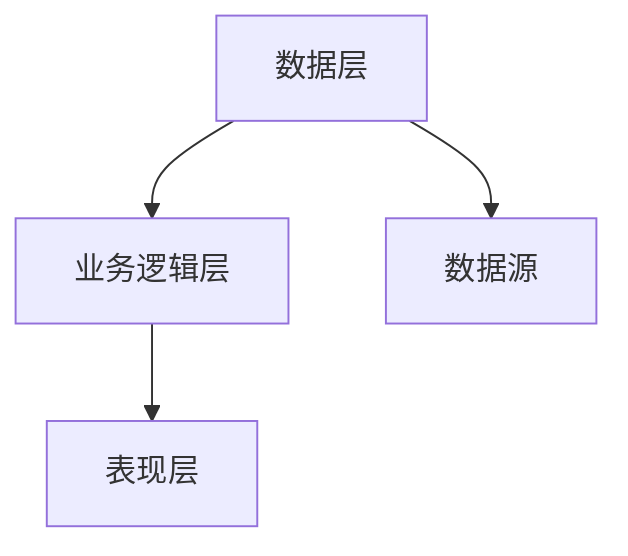

                 

# 价值投资在不同市场环境下的应用

## 关键词：价值投资、市场环境、投资策略、风险控制、财务分析、系统设计

## 摘要：  
价值投资是一种长期、基本面驱动的投资策略，其核心在于识别市场中被低估的资产并长期持有。本文将从价值投资的基本概念和理论出发，结合不同市场环境下的实际案例，分析其在股票、债券等资产类别中的应用。通过系统分析和架构设计，提供一套完整的投资决策框架，并通过实战案例演示如何在实际投资中应用这些策略。最后，本文还将探讨高级投资策略和风险管理方法，帮助投资者在复杂多变的市场环境中实现稳健收益。

---

# 目录

1. 价值投资的背景与基础
   1.1 价值投资概述
   1.2 价值投资的核心理论
   1.3 价值投资的适用范围

2. 价值投资的核心理论
   2.1 安全边际的概念与计算
   2.2 内在价值的计算模型
   2.3 财务报表分析与价值评估

3. 价值投资在不同市场环境下的应用
   3.1 牛市环境下的价值投资策略
   3.2 熊市环境下的价值投资策略
   3.3 震荡市环境下的价值投资策略

4. 投资决策系统的系统分析与架构设计
   4.1 系统功能设计
   4.2 系统架构设计
   4.3 系统接口设计
   4.4 系统交互设计

5. 价值投资实战案例分析
   5.1 实战案例一：股票投资分析
   5.2 实战案例二：债券投资分析
   5.3 实战案例三：多元资产配置分析

6. 高级投资策略与风险管理
   6.1 多因子模型在投资中的应用
   6.2 风险管理与投资组合优化
   6.3 人工智能在价值投资中的应用

7. 总结与展望
   7.1 价值投资的核心思想总结
   7.2 未来投资策略的发展趋势
   7.3 对投资者的建议与启示

---

# 正文

## 第1章 价值投资的背景与基础

### 1.1 价值投资概述

#### 1.1.1 价值投资的定义  
价值投资是一种以基本面分析为基础的投资策略，强调以低于资产内在价值的价格买入并长期持有优质资产，以获取超额收益。其核心思想是“买 cheap，卖 expensive”，即在市场低估时买入，在市场高估时卖出。

#### 1.1.2 价值投资的核心思想  
- **安全边际**：买入价格远低于内在价值，以降低投资风险。
- **长期持有**：关注企业的长期价值，而非短期价格波动。
- **逆向投资**：在市场恐慌时寻找机会，在市场狂热时保持冷静。

#### 1.1.3 价值投资与传统投资的区别  
传统投资策略通常基于技术分析或短期市场波动，而价值投资注重企业的基本面和长期价值。价值投资更强调安全性和稳定性，适合风险厌恶型投资者。

### 1.2 价值投资的历史与发展

#### 1.2.1 价值投资的起源  
价值投资的起源可以追溯到20世纪初，以本杰明·格雷厄姆和戴维·多德为代表的人物提出了“安全边际”和“内在价值”等核心概念。

#### 1.2.2 价值投资的发展历程  
从早期的格雷厄姆学派到后来的巴菲特学派，价值投资不断发展和演变，逐渐融入更多现代金融理论。

#### 1.2.3 价值投资在现代金融中的地位  
价值投资已成为机构投资者和专业投资者的重要策略之一，尤其是在寻找长期稳健收益时。

### 1.3 价值投资的适用范围

#### 1.3.1 股票投资中的价值投资  
股票是价值投资的主要应用领域，通过分析公司财务报表和行业前景，寻找具有竞争优势的公司。

#### 1.3.2 其他资产类别中的价值投资  
除了股票，价值投资还可应用于债券、房地产和其他资产类别，但股票是主要关注点。

#### 1.3.3 价值投资的边界与外延  
价值投资的边界在于其适用性，即在市场无效或部分无效时表现最佳。其外延包括多元化的资产配置和风险管理。

---

## 第2章 价值投资的核心理论

### 2.1 安全边际的概念与计算

#### 2.1.1 安全边际的定义  
安全边际是买入价格与资产内在价值之间的差距，是投资中的“缓冲区”，用以降低投资风险。

#### 2.1.2 安全边际的计算方法  
安全边际 = 内在价值 - 市场价格

#### 2.1.3 安全边际与投资风险的关系  
安全边际越高，投资风险越小，潜在收益越大。

### 2.2 内在价值的计算模型

#### 2.2.1 内在价值的定义  
内在价值是基于企业未来现金流的现值，反映其真实价值，与市场价格无关。

#### 2.2.2 内在价值的计算公式  
$$内在价值 = \frac{CF}{r - g}$$  
其中，CF为现金流，r为折现率，g为增长率。

#### 2.2.3 内在价值与市场价值的对比  
内在价值是资产的真实价值，而市场价值是短期波动的结果。

### 2.3 财务报表分析与价值评估

#### 2.3.1 财务报表分析的基本方法  
分析资产负债表、利润表和现金流量表，评估企业的盈利能力、偿债能力和成长能力。

#### 2.3.2 资产负债表分析  
关注资产质量、负债结构和所有者权益的变化。

#### 2.3.3 利润表与现金流量表分析  
评估企业的收入来源、成本结构和现金流健康状况。

---

## 第3章 价值投资在不同市场环境下的应用

### 3.1 牛市环境下的价值投资策略

#### 3.1.1 牛市环境的特点  
市场情绪高涨，股价普遍高估，投资者容易被市场情绪影响。

#### 3.1.2 投资策略  
寻找被市场低估的股票，避免追高，注重安全边际。

#### 3.1.3 实战案例  
在2007年美国次贷危机前的牛市中，寻找杠杆率过高的金融机构股票。

### 3.2 熊市环境下的价值投资策略

#### 3.2.1 熊市环境的特点  
市场情绪恐慌，股价普遍低估，投资者容易被市场情绪影响。

#### 3.2.2 投资策略  
积极寻找被市场错杀的股票，注重安全边际，增加仓位。

#### 3.2.3 实战案例  
2008年全球金融危机期间，寻找基本面良好但股价大幅下跌的公司。

### 3.3 震荡市环境下的价值投资策略

#### 3.3.1 震荡市环境的特点  
市场波动剧烈，投资者情绪不稳定。

#### 3.3.2 投资策略  
保持投资纪律，避免频繁交易，注重长期价值。

#### 3.3.3 实战案例  
2020年新冠疫情冲击期间，寻找受疫情影响但基本面良好的企业。

---

## 第4章 投资决策系统的系统分析与架构设计

### 4.1 系统功能设计

#### 4.1.1 数据采集模块  
从市场数据源获取实时价格、财务数据等。

#### 4.1.2 数据分析模块  
计算内在价值、安全边际，生成投资信号。

#### 4.1.3 投资策略模块  
根据市场环境调整投资策略。

### 4.2 系统架构设计

#### 4.2.1 采用分层架构  
- 数据层：存储市场数据和分析结果。
- 业务逻辑层：处理投资策略和交易信号。
- 表现层：展示分析结果和投资建议。

#### 4.2.2 使用Mermaid图展示系统架构  

### 4.3 系统接口设计

#### 4.3.1 数据接口  
从第三方API获取市场数据。

#### 4.3.2 用户接口  
提供用户友好的交互界面，显示分析结果和投资建议。

### 4.4 系统交互设计

#### 4.4.1 用户登录与权限管理  
确保用户数据安全。

#### 4.4.2 实时数据更新  
保持市场数据的实时更新。

---

## 第5章 价值投资实战案例分析

### 5.1 实战案例一：股票投资分析

#### 5.1.1 案例背景  
分析某公司的财务报表，计算其内在价值。

#### 5.1.2 分析过程  
- 计算现金流。
- 确定折现率和增长率。
- 计算内在价值。

#### 5.1.3 投资建议  
如果市场价格低于内在价值，建议买入。

### 5.2 实战案例二：债券投资分析

#### 5.2.1 案例背景  
分析某债券的信用评级和市场利率。

#### 5.2.2 分析过程  
- 评估债券的信用风险。
- 计算债券的内在价值。

#### 5.2.3 投资建议  
如果债券价格低于内在价值且信用评级良好，建议买入。

### 5.3 实战案例三：多元资产配置分析

#### 5.3.1 案例背景  
构建一个多元化的投资组合，包括股票、债券和黄金。

#### 5.3.2 分析过程  
- 分析各类资产的风险和收益。
- 确定各类资产的配置比例。

#### 5.3.3 投资建议  
根据市场环境调整各类资产的配置比例。

---

## 第6章 高级投资策略与风险管理

### 6.1 多因子模型在投资中的应用

#### 6.1.1 多因子模型的概念  
通过多个因子（如市值、价值、动量等）来解释资产收益。

#### 6.1.2 实战案例  
使用多因子模型筛选股票组合，优化投资收益。

### 6.2 风险管理与投资组合优化

#### 6.2.1 风险管理的基本原则  
分散投资、控制杠杆、定期调整投资组合。

#### 6.2.2 实战案例  
使用风险管理系统优化投资组合，降低波动性。

### 6.3 人工智能在价值投资中的应用

#### 6.3.1 人工智能的基本概念  
利用机器学习算法分析市场数据和预测价格。

#### 6.3.2 实战案例  
使用神经网络模型预测股票价格，辅助投资决策。

---

## 第7章 总结与展望

### 7.1 价值投资的核心思想总结  
价值投资是一种长期、基本面驱动的投资策略，注重安全边际和内在价值。

### 7.2 未来投资策略的发展趋势  
随着技术的进步，人工智能和大数据分析将在价值投资中发挥越来越重要的作用。

### 7.3 对投资者的建议与启示  
投资者应坚持长期投资，注重基本面分析，合理分散投资风险。

---

# 作者

作者：AI天才研究院/AI Genius Institute & 禅与计算机程序设计艺术 /Zen And The Art of Computer Programming

