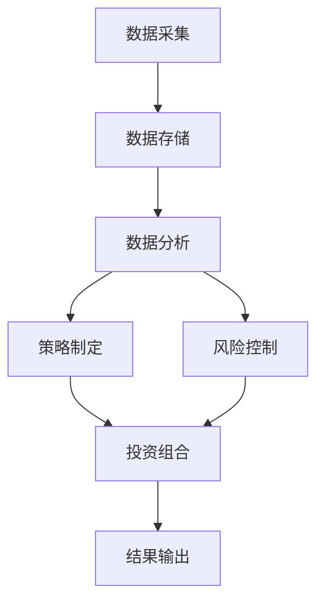

                 


# 价值投资在不同经济周期中的策略调整

> 关键词：价值投资、经济周期、投资策略、资产配置、风险管理

> 摘要：本文通过分析经济周期对价值投资策略的影响，探讨在不同经济周期下如何调整投资策略以实现长期稳健的收益。文章从经济周期的基本概念出发，详细阐述了价值投资的核心理念和核心指标，重点分析了衰退期、复苏期、过热期和滞胀期等不同经济周期下的投资策略，并通过具体案例和数学模型，展示了如何在不同经济环境下优化投资组合和控制风险，帮助投资者更好地应对复杂的市场环境。

---

## 第1章: 价值投资的核心理念

### 1.1 价值投资的基本定义

价值投资是一种以基本面分析为基础的投资策略，其核心思想是购买那些市场价格低于其内在价值的资产。这种方法强调长期投资、价值发现和安全边际，旨在通过持有优质资产来实现超额收益。

#### 1.1.1 投资的三重境界

1. **第一重境界：寻找低估的资产**  
   价值投资者通过分析企业的财务数据，寻找市场价格低于内在价值的资产。这种资产通常被市场忽视或低估，但具有长期增值的潜力。

2. **第二重境界：理解企业的内在价值**  
   投资者需要深入研究企业的商业模式、竞争优势和财务状况，估算其内在价值。这包括对企业未来现金流的预测和折现。

3. **第三重境界：与市场周期共振**  
   在不同的经济周期中，价值投资策略需要灵活调整。例如，在经济衰退期，寻找防御性行业；在经济过热期，寻找低估值的周期性行业。

#### 1.1.2 价值投资的核心原则

1. **长期投资**：价值投资强调长期持有的理念，避免频繁交易以减少成本。
2. **安全边际**：买入价格低于内在价值，留有安全边际以应对市场波动。
3. **逆向思维**：在市场恐慌时买入，在市场狂热时卖出。

#### 1.1.3 价值投资与成长投资的对比

| 对比维度          | 价值投资                | 成长投资                |
|-------------------|-------------------------|-------------------------|
| 投资目标          | 寻找低估资产，追求安全边际 | 寻找高成长企业，追求未来收益 |
| 风险偏好          | 低风险，注重安全边际     | 高风险，注重成长潜力     |
| 投资期限          | 长期                    | 中长期                 |
| 核心指标          | 市盈率（P/E）、市净率（P/B） | 市盈率（P/E）、PEG比率     |

### 1.2 经济周期的基本概念

经济周期是指经济活动的波动，通常分为四个阶段：衰退期、复苏期、过热期和滞胀期。

#### 1.2.1 经济周期的定义与阶段划分

1. **衰退期**：经济增长放缓，企业盈利下降，市场情绪低迷。
2. **复苏期**：经济开始恢复，企业盈利逐步回升，市场情绪改善。
3. **过热期**：经济增长过快，资产价格出现泡沫，市场情绪极度乐观。
4. **滞胀期**：经济增长停滞，通货膨胀高企，市场情绪悲观。

#### 1.2.2 经济周期对投资的影响

经济周期的变化直接影响资产价格和投资回报。例如，在衰退期，股票和房地产可能大幅下跌；在过热期，股票和债券可能面临调整压力。

#### 1.2.3 不同经济周期下的市场特征

| 经济周期阶段       | 市场特征                     |
|--------------------|------------------------------|
| 衰退期             | 资产价格低迷，市场情绪悲观   |
| 复苏期             | 资产价格逐步回升，市场情绪改善 |
| 过热期             | 资产价格泡沫，市场情绪乐观   |
| 滞胀期             | 资产价格波动，市场情绪悲观   |

## 第2章: 价值投资与经济周期的关系

### 2.1 经济周期对价值投资策略的影响

经济周期的变化要求投资者根据市场环境调整投资策略。例如，在衰退期，投资者应注重防御性行业；在过热期，投资者应寻找低估值的周期性行业。

#### 2.1.1 经济周期与资产价格的关系

经济周期通过影响企业的盈利能力和市场情绪，间接影响资产价格。例如，在衰退期，企业的盈利下降，导致股票价格下跌；在过热期，市场情绪乐观，可能导致股票价格被高估。

#### 2.1.2 经济周期对价值投资机会的影响

在衰退期，许多优质资产的价格被市场低估，为投资者提供了买入机会。在过热期，许多资产的价格被高估，投资者应保持谨慎。

#### 2.1.3 经济周期对投资风险的影响

在经济周期的不同阶段，投资风险有所不同。例如，在衰退期，市场风险较高；在过热期，市场波动风险较大。

### 2.2 价值投资在不同经济周期中的表现

#### 2.2.1 衰退期的价值投资策略

在衰退期，市场情绪低迷，许多资产的价格被低估。投资者应寻找具有强大财务实力和竞争优势的企业，进行长期投资。

#### 2.2.2 复苏期的价值投资策略

在复苏期，市场情绪逐步改善，企业盈利开始回升。投资者应关注那些在衰退期被低估的资产，逐步增加仓位。

#### 2.2.3 过热期的价值投资策略

在过热期，市场情绪极度乐观，资产价格可能出现泡沫。投资者应保持谨慎，避免追高，寻找那些估值合理的资产进行投资。

#### 2.2.4 滞胀期的价值投资策略

在滞胀期，经济增长停滞，通货膨胀高企，市场情绪悲观。投资者应注重防御性投资，选择那些具有抗通胀能力的资产。

## 第3章: 价值投资的核心指标与工具

### 3.1 价值投资的关键指标

#### 3.1.1 市盈率（P/E）

市盈率是股票价格与每股收益的比率，用于衡量股票的估值。市盈率越低，通常表示股票越具有投资价值。

$$ P/E = \frac{\text{股票价格}}{\text{每股收益}} $$

#### 3.1.2 市净率（P/B）

市净率是股票价格与每股净资产的比率，用于衡量股票的估值。市净率越低，通常表示股票越具有投资价值。

$$ P/B = \frac{\text{股票价格}}{\text{每股净资产}} $$

#### 3.1.3 股息率

股息率是每股股息与股票价格的比率，用于衡量股票的分红能力。股息率越高，通常表示股票的分红能力越强。

$$ \text{股息率} = \frac{\text{每股股息}}{\text{股票价格}} \times 100\% $$

#### 3.1.4 净资产收益率（ROE）

净资产收益率是净利润与净资产的比率，用于衡量企业的盈利能力。ROE越高，通常表示企业的盈利能力越强。

$$ ROE = \frac{\text{净利润}}{\text{净资产}} \times 100\% $$

### 3.2 经济周期分析工具

#### 3.2.1 财务指标分析

通过分析企业的财务报表，评估企业的财务状况和盈利能力。例如，通过分析企业的收入、利润和现金流，评估企业的成长性和抗风险能力。

#### 3.2.2 宏观经济指标（GDP、CPI、失业率等）

通过分析宏观经济指标，了解经济周期的阶段。例如，通过分析GDP增长率、CPI和失业率，判断经济是否处于衰退期或复苏期。

#### 3.2.3 市场情绪指标（VIX指数等）

通过分析市场情绪指标，了解市场的波动性和风险偏好。例如，VIX指数是衡量市场波动性的指标，指数越高，市场波动性越大。

## 第4章: 价值投资策略在不同经济周期中的调整

### 4.1 衰退期的价值投资策略

在衰退期，市场情绪低迷，许多资产的价格被低估。投资者应寻找具有强大财务实力和竞争优势的企业，进行长期投资。

#### 4.1.1 寻找低估资产

在衰退期，许多优质资产的价格被市场低估。投资者应通过基本面分析，寻找那些具有强大财务实力和竞争优势的企业。

#### 4.1.2 重点关注防御性行业

在衰退期，防御性行业（如公用事业、医疗保健等）通常表现较好，因为这些行业的需求相对稳定。

#### 4.1.3 控制投资风险

在衰退期，市场波动较大，投资者应控制投资风险，避免过度杠杆和集中投资。

### 4.2 复苏期的价值投资策略

在复苏期，市场情绪逐步改善，企业盈利开始回升。投资者应关注那些在衰退期被低估的资产，逐步增加仓位。

#### 4.2.1 寻找困境反转企业

在复苏期，许多企业在衰退期受到冲击，但在复苏期逐步恢复。投资者应关注这些困境反转企业的投资机会。

#### 4.2.2 重点关注周期性行业

在复苏期，周期性行业（如制造业、房地产等）通常表现较好，因为这些行业的需求在经济复苏期间逐步恢复。

#### 4.2.3 逐步增加仓位

在复苏期，市场情绪逐步改善，投资者应逐步增加仓位，把握市场回升的机会。

### 4.3 过热期的价值投资策略

在过热期，市场情绪极度乐观，资产价格可能出现泡沫。投资者应保持谨慎，避免追高，寻找那些估值合理的资产进行投资。

#### 4.3.1 提高警惕，避免追高

在过热期，资产价格可能被高估，投资者应提高警惕，避免追高。

#### 4.3.2 重点关注估值合理的行业

在过热期，许多行业可能被高估，投资者应关注那些估值合理的行业，寻找那些具有长期竞争优势的企业。

#### 4.3.3 减少风险敞口

在过热期，市场波动较大，投资者应减少风险敞口，避免过度集中投资。

### 4.4 滞胀期的价值投资策略

在滞胀期，经济增长停滞，通货膨胀高企，市场情绪悲观。投资者应注重防御性投资，选择那些具有抗通胀能力的资产。

#### 4.4.1 寻找抗通胀资产

在滞胀期，通货膨胀高企，投资者应寻找那些具有抗通胀能力的资产，如黄金、房地产等。

#### 4.4.2 重点关注防御性行业

在滞胀期，防御性行业（如公用事业、医疗保健等）通常表现较好，因为这些行业的需求相对稳定。

#### 4.4.3 控制投资风险

在滞胀期，市场波动较大，投资者应控制投资风险，避免过度杠杆和集中投资。

## 第5章: 价值投资的数学模型与系统架构设计

### 5.1 价值投资的数学模型

价值投资的数学模型主要用于评估资产的内在价值和市场估值。

#### 5.1.1 内在价值模型

内在价值模型用于评估资产的未来现金流的现值。例如，股票的内在价值可以通过现金流折现模型（DCF）进行评估。

$$ V = \sum_{t=1}^{n} \frac{CF_t}{(1 + r)^t} $$

其中，\( V \) 是内在价值，\( CF_t \) 是第 \( t \) 年的现金流，\( r \) 是折现率。

#### 5.1.2 市场估值模型

市场估值模型用于评估资产的市场估值，通常通过市盈率、市净率等指标进行评估。

$$ P/E = \frac{\text{股票价格}}{\text{每股收益}} $$

$$ P/B = \frac{\text{股票价格}}{\text{每股净资产}} $$

### 5.2 价值投资的系统架构设计

价值投资的系统架构设计主要用于实现投资策略的自动化和智能化。

#### 5.2.1 系统功能设计

1. **数据采集**：采集市场数据、财务数据和宏观经济数据。
2. **数据分析**：分析数据，评估资产的内在价值和市场估值。
3. **策略制定**：根据经济周期和市场环境，制定投资策略。
4. **风险控制**：监控市场风险，调整投资组合。

#### 5.2.2 系统架构图



## 第6章: 价值投资的项目实战

### 6.1 案例分析

#### 6.1.1 案例背景

假设当前经济处于衰退期，市场情绪低迷，许多优质资产的价格被低估。

#### 6.1.2 投资策略

1. 寻找低估资产：通过基本面分析，寻找具有强大财务实力和竞争优势的企业。
2. 重点关注防御性行业：如公用事业、医疗保健等。
3. 控制投资风险：避免过度杠杆和集中投资。

#### 6.1.3 实施步骤

1. 数据采集：收集市场数据、财务数据和宏观经济数据。
2. 数据分析：评估资产的内在价值和市场估值。
3. 策略制定：根据经济周期和市场环境，制定投资策略。
4. 风险控制：监控市场风险，调整投资组合。

### 6.2 代码实现

#### 6.2.1 环境安装

需要安装Python、Pandas、NumPy等库。

```bash
pip install pandas numpy matplotlib
```

#### 6.2.2 核心代码

```python
import pandas as pd
import numpy as np
import matplotlib.pyplot as plt

# 示例数据：股票价格与每股收益
data = {
    '股票': ['股票A', '股票B', '股票C', '股票D'],
    '价格': [10, 15, 20, 25],
    '每股收益': [1, 1.5, 2, 2.5]
}

df = pd.DataFrame(data)

# 计算市盈率
df['P/E'] = df['价格'] / df['每股收益']

# 可视化
plt.figure(figsize=(10, 6))
plt.plot(df['股票'], df['P/E'], 'o-')
plt.title('市盈率分析')
plt.xlabel('股票')
plt.ylabel('P/E')
plt.show()
```

## 第7章: 总结与展望

### 7.1 总结

本文通过分析经济周期对价值投资策略的影响，探讨了在不同经济周期下如何调整投资策略以实现长期稳健的收益。文章从经济周期的基本概念出发，详细阐述了价值投资的核心理念和核心指标，重点分析了衰退期、复苏期、过热期和滞胀期等不同经济周期下的投资策略，并通过具体案例和数学模型，展示了如何在不同经济环境下优化投资组合和控制风险。

### 7.2 展望

未来，随着人工智能和大数据技术的发展，价值投资将更加智能化和自动化。投资者可以通过数据分析和算法交易，进一步优化投资策略，提高投资收益。

---

## 附录

### 附录A: 术语表

1. **价值投资**：一种以基本面分析为基础的投资策略，其核心思想是购买那些市场价格低于其内在价值的资产。
2. **经济周期**：经济活动的波动，通常分为四个阶段：衰退期、复苏期、过热期和滞胀期。

### 附录B: 参考文献

1. 《价值投资实战手册》
2. 《投资学原理》
3. 《经济周期与投资策略》

---

## 作者

作者：AI天才研究院/AI Genius Institute & 禅与计算机程序设计艺术 /Zen And The Art of Computer Programming

