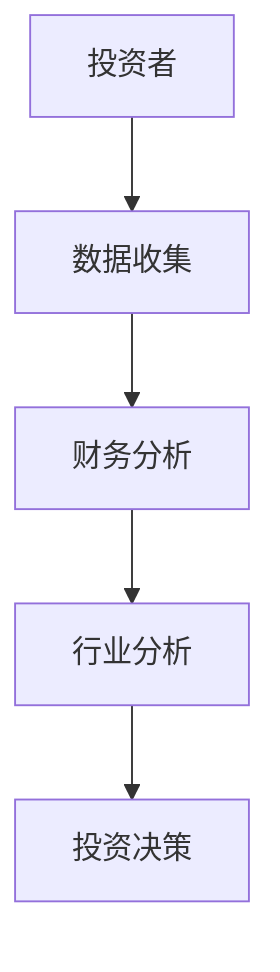
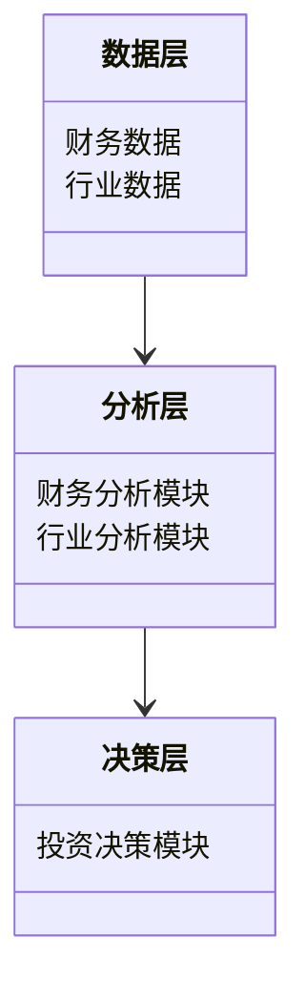

                 


# 价值投资在不同行业的应用

> 关键词：价值投资、行业分析、财务指标、投资策略、系统架构、案例分析

> 摘要：  
价值投资是一种以低于内在价值的价格购买优质资产的投资策略。本文通过分析不同行业的特点，结合数学模型和系统架构设计，详细探讨了价值投资在制造业、科技行业和金融行业中的应用。文章从价值投资的核心概念出发，深入分析了行业的财务指标、竞争优势和投资案例，最后通过系统架构设计和项目实战，展示了如何将价值投资理论应用于实际投资决策。

---

## 第一部分: 价值投资的背景与核心概念

### 第1章: 价值投资的定义与历史发展

#### 1.1 价值投资的起源与发展
价值投资的起源可以追溯到20世纪初，本杰明·格雷厄姆和戴维·多德是这一投资理念的奠基人。他们提出了“安全边际”和“内在价值”的概念，认为市场波动为投资者提供了以低于内在价值的价格买入优质资产的机会。

#### 1.2 价值投资的核心理念与原则
- **内在价值**：资产的真实价值，独立于市场波动。
- **安全边际**：购买价格低于内在价值，以降低风险。
- **长期视角**：关注企业的长期盈利能力，而非短期市场波动。

#### 1.3 价值投资与其他投资策略的区别
- **基本面分析**：不同于技术分析，价值投资注重企业的财务状况和行业地位。
- **长期 vs. 短期**：价值投资强调长期持有，而其他策略可能更注重短期收益。

### 第2章: 价值投资的核心概念与分析框架

#### 2.1 价值投资的核心概念
- **内在价值**：企业未来现金流的现值，计算公式为：
  $$ V = \sum_{t=1}^{n} \frac{CF_t}{(1 + r)^t} $$
  其中，$CF_t$ 是第 $t$ 年的现金流，$r$ 是折现率。

- **安全边际**：购买价格与内在价值的差距，公式为：
  $$ \text{安全边际} = \text{内在价值} - \text{购买价格} $$

#### 2.2 价值投资的分析框架
- **财务报表分析**：通过利润表、资产负债表和现金流量表评估企业的财务健康状况。
- **行业分析**：分析行业竞争格局、市场容量和增长潜力。
- **宏观经济分析**：考虑宏观经济因素如利率、通货膨胀和经济周期对投资的影响。

---

## 第二部分: 价值投资的行业应用分析

### 第3章: 制造业的价值投资分析

#### 3.1 制造业行业的特点与竞争分析
制造业通常具有较高的固定资产投入和规模经济效应。竞争分析需要关注市场份额、生产成本和技术创新能力。

#### 3.2 制造业企业的财务指标分析
- **市盈率（P/E）**：衡量企业盈利能力的指标，计算公式为：
  $$ P/E = \frac{\text{股价}}{\text{每股净利润}} $$
- **市净率（P/B）**：衡量企业资产价值的指标，计算公式为：
  $$ P/B = \frac{\text{股价}}{\text{每股净资产}} $$

#### 3.3 制造业行业的投资案例分析
以某知名制造企业为例，通过财务指标分析和行业竞争分析，评估其是否符合价值投资的条件。

### 第4章: 科技行业的价值投资分析

#### 4.1 科技行业的特点与创新分析
科技行业具有高增长潜力，但也面临高风险和快速变化的技术环境。

#### 4.2 科技企业的研发投入与技术壁垒
研发投入是科技企业的核心竞争力，技术壁垒的高低决定了企业的市场地位。

#### 4.3 科技行业的投资案例分析
以某科技公司为例，分析其研发投入、技术壁垒和市场前景，评估其是否具备投资价值。

### 第5章: 金融行业的价值投资分析

#### 5.1 金融行业的特点与风险分析
金融行业受宏观经济影响较大，风险主要包括信用风险和市场风险。

#### 5.2 金融机构的财务指标分析
- **净息差**：银行盈利能力的重要指标。
- **资本充足率**：衡量银行的资本实力和风险承受能力。

#### 5.3 金融行业的投资案例分析
以某银行为例，分析其净息差、资本充足率和市场地位，评估其投资价值。

---

## 第三部分: 价值投资的系统分析与架构设计

### 第6章: 价值投资的系统分析框架

#### 6.1 投资目标与策略的定义
- **投资目标**：明确投资的目的和预期收益。
- **投资策略**：制定具体的实施计划，包括资产配置和风险控制。

#### 6.2 数据流分析与系统架构设计
使用Mermaid图展示价值投资的分析流程：


#### 6.3 系统架构设计
系统架构包括数据层、分析层和决策层，使用Mermaid图展示：


---

## 第四部分: 项目实战

### 第7章: 项目实战与案例分析

#### 7.1 环境安装与数据收集
- 安装必要的工具和软件，如Excel、Python和数据分析库。

#### 7.2 核心实现与代码解读
使用Python编写价值投资分析的代码，例如计算市盈率和市净率：
```python
import pandas as pd

# 假设df是包含财务数据的DataFrame
df['P/E'] = df['股价'] / df['每股净利润']
df['P/B'] = df['股价'] / df['每股净资产']
```

#### 7.3 实际案例分析与解读
以某行业为例，分析具体公司的财务指标和市场地位，评估其投资价值。

---

## 第五部分: 总结与展望

### 第8章: 总结与最佳实践

#### 8.1 价值投资的核心要点
- 重视内在价值和安全边际。
- 结合行业特点和宏观经济环境进行分析。

#### 8.2 价值投资的未来展望
随着技术的进步和数据的丰富，价值投资将更加依赖于量化分析和人工智能技术。

---

## 作者信息

作者：AI天才研究院/AI Genius Institute & 禅与计算机程序设计艺术 /Zen And The Art of Computer Programming

