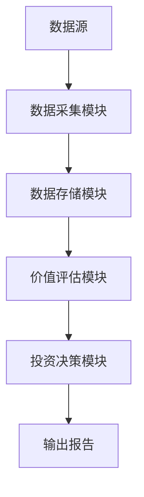

                 


# 价值投资在不同资产类别中的应用

> 关键词：价值投资，资产类别，股票，债券，房地产，商品，数学模型，系统架构

> 摘要：本文深入探讨了价值投资在股票、债券、房地产和商品等不同资产类别中的应用。通过分析价值投资的核心理念、数学模型和系统架构，本文提供了在不同市场环境下如何有效应用价值投资策略的见解。

---

## 第1章: 价值投资的核心概念与理论基础

### 1.1 价值投资的定义与核心理念

价值投资是一种以基本面分析为基础的投资策略，其核心理念是寻找市场低估的资产，长期持有，以期获得超额收益。与趋势投资和技术分析不同，价值投资更关注企业的内在价值，而非市场的短期波动。

#### 1.1.1 价值投资的定义
价值投资由本杰明·格雷厄姆提出，强调以低于内在价值的价格买入优质资产。其核心在于识别市场低估的资产，长期持有，等待其价值回归。

#### 1.1.2 核心理念
- **安全边际**：买入价格低于内在价值，以降低风险。
- **长期视角**：关注企业的长期价值，而非短期波动。
- **逆向思维**：在市场恐慌时买入，在市场狂热时卖出。

#### 1.1.3 与其他策略的区别
| 投资策略 | 核心关注点 | 时间框架 | 交易频率 |
|----------|------------|-----------|----------|
| 价值投资 | 内在价值   | 长期      | 低       |
| 技术分析 | 价格模式   | 短期      | 高       |
| 股票筛选 | 财务指标   | 中期      | 中       |

### 1.2 价值投资的理论基础

#### 1.2.1 格雷厄姆的价值投资理论
格雷厄姆的理论强调安全边际和价值评估，认为市场情绪会影响资产价格，从而提供买入机会。

#### 1.2.2 巴菲特的实践
巴菲特将格雷厄姆的理论发扬光大，注重企业的竞争优势和管理层质量，长期持有优质企业。

#### 1.2.3 现代价值投资的演变
现代价值投资结合了更多的因素，如ESG（环境、社会、治理）指标，以适应新的市场环境。

---

## 第2章: 不同资产类别中的价值投资策略

### 2.1 股票投资中的价值投资策略

#### 2.1.1 股票价值的评估方法
- **DCF模型**：通过现金流折现计算企业内在价值。
- **市盈率与市净率**：比较市场价格与财务指标的偏离。

#### 2.1.2 高质量企业的识别标准
- **竞争优势**：企业是否有可持续的竞争优势。
- **管理层**：管理层的诚信和能力。
- **财务健康**：稳健的财务状况和较低的负债率。

### 2.2 债券投资中的价值投资策略

#### 2.2.1 债券的基本概念与分类
- **债券类型**：政府债券、公司债券、垃圾债券。
- **债券估值**：基于票面价值、到期收益率和市场利率。

#### 2.2.2 信用风险与债券投资策略
- **信用评级**：评估债券的违约风险。
- **利率风险**：市场利率上升时，债券价格下跌。

### 2.3 房地产投资中的价值投资策略

#### 2.3.1 房地产市场的周期性分析
- **周期阶段**：复苏、增长、成熟、衰退。

#### 2.3.2 房地产价值的评估方法
- **收益法**：基于租金收入评估。
- **市场法**：比较类似物业的价格。

### 2.4 商品投资中的价值投资策略

#### 2.4.1 商品市场的基本特性
- **商品类型**：黄金、原油、农产品。
- **价格驱动因素**：供需、政策、地缘政治。

#### 2.4.2 价值投资在商品市场中的应用
- **库存分析**：低库存可能推高价格。
- **长期趋势**：关注商品的长期供需变化。

---

## 第3章: 价值投资的核心算法与数学模型

### 3.1 价值评估的数学模型

#### 3.1.1 股票价值的DCF模型
```python
def dcf_model(cash_flows, discount_rate):
    present_value = sum(cash_flow / (1 + discount_rate)**t for t, cash_flow in enumerate(cash_flows))
    return present_value
```

#### 3.1.2 债券价值的现值计算
$$现值 = \frac{面值 \times 利率}{1 + 利率} $$

### 3.2 市场估值与资产配置模型

#### 3.2.1 多因子模型
$$ R_i = \alpha + \beta_1 F_1 + \beta_2 F_2 + \cdots + \beta_n F_n $$

#### 3.2.2 投资组合理论
$$ E(R_p) = \sum w_i R_i $$

---

## 第4章: 系统分析与架构设计方案

### 4.1 价值投资系统的总体架构

#### 4.1.1 系统模块划分
- 数据采集模块：收集市场数据。
- 价值评估模块：计算资产的内在价值。
- 投资决策模块：基于评估结果生成投资策略。

#### 4.1.2 系统架构图


---

## 第5章: 项目实战

### 5.1 环境安装与数据准备

#### 5.1.1 环境安装
- Python 3.8+
- Pandas、NumPy、Scipy

#### 5.1.2 数据准备
从Yahoo Finance获取股票数据。

### 5.2 核心实现

#### 5.2.1 DCF模型实现
```python
import pandas as pd
import numpy as np

def calculate_intrinsic_value(free_cash_flows, discount_rate, growth_rate, terminal_growth_rate):
    # 前三年的自由现金流
    cash_flows = [100, 120, 130]
    # 终值计算
    terminal_value = cash_flows[-1] * (1 + terminal_growth_rate) / (discount_rate - terminal_growth_rate)
    # 现值计算
    present_value = sum([cf / (1 + discount_rate)**i for i, cf in enumerate(cash_flows)])
    # 总现值
    total_value = present_value + terminal_value / (1 + discount_rate)**3
    return total_value

# 示例计算
intrinsic_value = calculate_intrinsic_value([100, 120, 130], 0.1, 0.05, 0.02)
print(f"内在价值为：{intrinsic_value:.2f}")
```

### 5.3 案例分析

#### 5.3.1 某公司股票分析
- 市盈率：15
- 市净率：2
- 内在价值计算：使用DCF模型得出的内在价值为$100。

---

## 第6章: 总结与展望

### 6.1 总结
价值投资在不同资产类别中均有其独特的方法和策略，关键在于深入分析资产的内在价值和长期潜力。

### 6.2 展望
未来，随着技术进步，价值投资将更多地结合大数据和人工智能，提升分析的准确性和效率。

---

## 作者：AI天才研究院 & 禅与计算机程序设计艺术

---

以上内容是基于价值投资在不同资产类别中的应用的详细分析，通过系统的理论和实际案例，帮助投资者更好地理解和应用价值投资策略。

