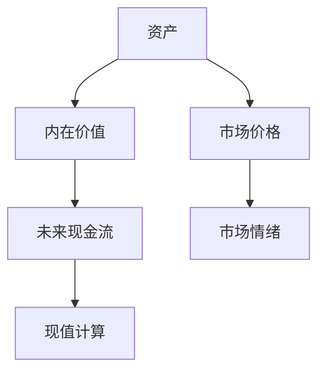
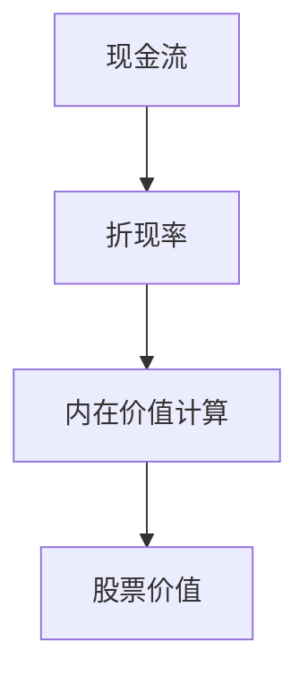
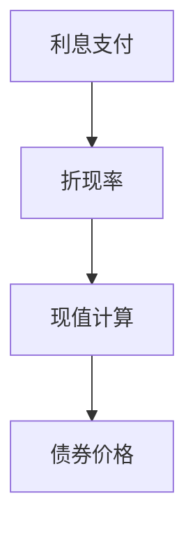
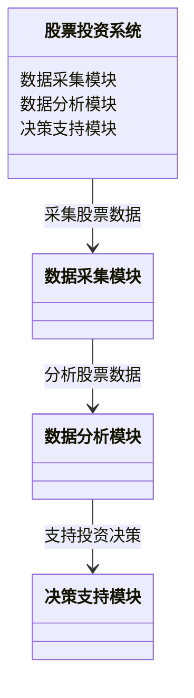
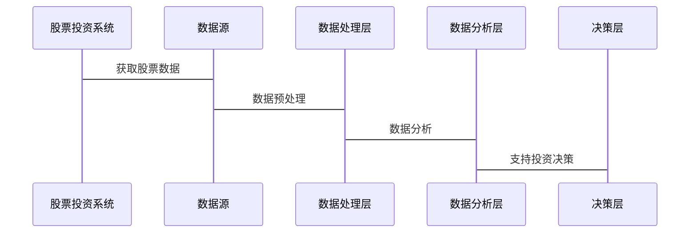
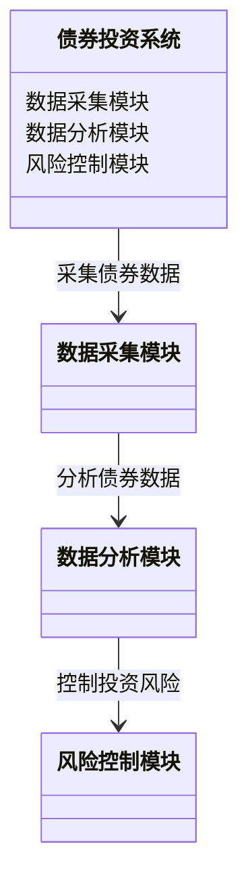
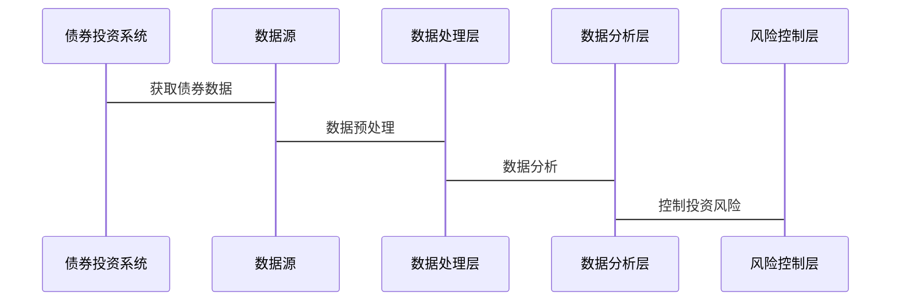

                 

# 价值投资在不同资产类别中的应用：股票、债券及其他

> **关键词**：价值投资，股票投资，债券投资，资产配置，风险管理，投资策略
>
> **摘要**：本文深入探讨了价值投资在股票、债券以及其他资产类别中的应用。通过分析不同资产的核心概念、估值方法和投资策略，本文为投资者提供了全面的视角，帮助他们在多变的市场环境中做出明智的投资决策。文章还结合实际案例，展示了如何在不同资产类别中应用价值投资理念，并通过系统架构设计和数学模型，详细阐述了投资策略的实施过程。

---

## 第1章: 价值投资的概述

### 1.1 价值投资的起源与发展

价值投资是一种基于对公司内在价值的深入分析的投资策略，其核心在于寻找市场价格低于内在价值的资产。这一理念起源于20世纪初，由本杰明·格雷厄姆和戴维·多德提出，并在后来被沃伦·巴菲特发扬光大。

#### 1.1.1 价值投资的起源
- **背景**：20世纪初，市场波动剧烈，投资者急需一种稳定的投资方法。
- **核心思想**：格雷厄姆提出“安全边际”概念，强调以低于内在价值的价格买入资产。

#### 1.1.2 价值投资的核心理念
- **核心概念**：市场价格与内在价值的差异是投资机会的来源。
- **投资策略**：通过分析企业的财务状况、行业地位和竞争优势，寻找被市场低估的资产。

#### 1.1.3 价值投资的适用范围
- **股票**：通过基本面分析评估公司价值。
- **债券**：通过收益率和信用评级评估债券的安全性。
- **其他资产**：如房地产、黄金等，需要结合具体市场环境进行分析。

### 1.2 价值投资的核心概念

价值投资的核心在于对资产内在价值的准确评估。以下是价值投资中的关键概念：

#### 1.2.1 核心概念的定义
- **内在价值**：资产在正常市场条件下所能产生的未来现金流的现值。
- **市场价格**：资产在二级市场上的交易价格。

#### 1.2.2 核心概念的属性特征对比
| 属性      | 内在价值   | 市场价格   |
|-----------|------------|------------|
| 确定性    | 高         | 低         |
| 时间跨度  | 长期       | 短期       |
| 受影响因素| 公司基本面 | 市场情绪   |

#### 1.2.3 实体关系图（ER图）的 Mermaid 流程图

---

## 第2章: 股票投资的价值评估

### 2.1 股票投资的基本原理

股票投资是价值投资的重要组成部分，其核心在于对公司的基本面进行深入分析。

#### 2.1.1 股票的定义与特点
- **定义**：股票是公司所有权的凭证，代表对公司净资产的要求权。
- **特点**：
  - 股东有权参与公司决策。
  - 股票价格受公司盈利能力和市场情绪影响。

#### 2.1.2 股票的价值评估方法
- **基本面分析**：通过分析公司的财务报表、行业地位和竞争优势，评估公司的内在价值。
- **技术分析**：通过分析股票价格的历史走势，预测未来的价格变动。

#### 2.1.3 股票投资的核心要素
- **盈利能力**：通过净利润率、ROE等指标评估公司的盈利能力。
- **成长性**：通过收入增长率和净利润增长率评估公司的成长潜力。

### 2.2 股票估值的数学模型

股票估值的核心在于对未来现金流的现值计算。以下是常用的股票估值模型：

#### 2.2.1 股票估值的公式推导
$$ V = \frac{CF}{r - g} $$

其中：
- \( V \)：股票的内在价值
- \( CF \)：未来现金流
- \( r \)：折现率
- \( g \)：现金流增长率

#### 2.2.2 股票估值的实例分析
假设某公司未来现金流为100万元，折现率为10%，现金流增长率为5%，则其内在价值为：
$$ V = \frac{100}{0.10 - 0.05} = 2000万元 $$

#### 2.2.3 股票估值的数学模型图（Mermaid）

---

## 第3章: 债券投资的价值评估

### 3.1 债券投资的基本原理

债券是一种固定收益证券，其核心在于通过稳定的现金流获取收益。

#### 3.1.1 债券的定义与特点
- **定义**：债券是债务工具，发行人承诺在特定时间内支付利息和本金。
- **特点**：
  - 收益稳定
  - 风险较低

#### 3.1.2 债券的价值评估方法
- **收益率分析**：通过到期收益率和信用评级评估债券的安全性。
- **价格波动**：债券价格受市场利率和信用风险影响。

#### 3.1.3 债券投资的核心要素
- **信用风险**：债券发行人违约的可能性。
- **利率风险**：市场利率变动对债券价格的影响。

### 3.2 债券估值的数学模型

债券估值的核心在于计算其未来现金流的现值。以下是常用的债券估值模型：

#### 3.2.1 债券估值的公式推导
$$ P = \sum_{t=1}^{n} \frac{C}{(1 + r)^t} + \frac{F}{(1 + r)^n} $$

其中：
- \( P \)：债券的市场价格
- \( C \)：每年的利息支付
- \( r \)：市场利率
- \( F \)：债券的面值
- \( n \)：债券的剩余期限

#### 3.2.2 债券估值的实例分析
假设某债券面值为1000元，票面利率为5%，剩余期限为5年，市场利率为6%，则其市场价格为：
$$ P = \sum_{t=1}^{5} \frac{50}{(1 + 0.06)^t} + \frac{1000}{(1 + 0.06)^5} \approx 923.84元 $$

#### 3.2.3 债券估值的数学模型图（Mermaid）

---

## 第4章: 股票投资策略

### 4.1 股票投资的基本策略

股票投资策略的核心在于通过价值评估和市场分析，找到具有投资价值的股票。

#### 4.1.1 基本面分析法
- **财务分析**：通过分析公司的收入、利润和现金流，评估公司的财务健康状况。
- **行业分析**：通过分析行业的发展趋势和竞争格局，评估公司的行业地位。

#### 4.1.2 技术分析法
- **价格走势**：通过分析股票价格的历史走势，预测未来的价格变动。
- **成交量分析**：通过分析成交量的变化，判断市场的买卖力量。

#### 4.1.3 股票投资的组合策略
- **分散投资**：通过投资不同行业和不同公司的股票，降低投资风险。
- **长期投资**：通过长期持有优质股票，获得资本增值和股息收益。

### 4.2 股票投资的系统架构设计

股票投资的系统架构设计需要考虑数据采集、分析和决策支持等多个方面。

#### 4.2.1 系统功能设计（领域模型 Mermaid 类图）

#### 4.2.2 系统架构设计（Mermaid 架构图）

#### 4.2.3 系统接口设计与交互（Mermaid 序列图）

---

## 第5章: 债券投资策略

### 5.1 债券投资的基本策略

债券投资策略的核心在于通过风险管理和收益最大化，实现投资目标。

#### 5.1.1 利率风险分析
- **市场利率变动**：市场利率上升会导致债券价格下跌。
- **债券期限**：长期债券的利率风险高于短期债券。

#### 5.1.2 信用风险分析
- **发行人信用**：债券发行人违约的可能性影响债券的安全性。
- **信用评级**：通过评级机构的评级，评估债券的信用风险。

#### 5.1.3 债券投资的组合策略
- **分散投资**：通过投资不同发行人和不同期限的债券，降低信用风险和利率风险。
- **期限选择**：根据市场预期选择债券的期限。

### 5.2 债券投资的系统架构设计

债券投资的系统架构设计需要考虑数据采集、分析和风险控制等多个方面。

#### 5.2.1 系统功能设计（领域模型 Mermaid 类图）

#### 5.2.2 系统架构设计（Mermaid 架构图）

#### 5.2.3 系统接口设计与交互（Mermaid 序列图）

---

## 第6章: 其他资产类别中的价值投资

### 6.1 房地产投资

房地产投资是价值投资的重要组成部分，其核心在于对房地产市场的深入分析。

#### 6.1.1 房地产市场的特点
- **流动性**：房地产资产流动性较低，变现能力差。
- **周期性**：房地产市场具有较强的周期性，受宏观经济影响较大。

#### 6.1.2 房地产的价值评估方法
- **成本法**：通过评估房地产的建造成本，确定其价值。
- **市场比较法**：通过比较类似房地产的市场价格，确定其价值。

### 6.2 黄金投资

黄金投资是价值投资的另一种形式，其核心在于对通货膨胀和货币风险的对冲。

#### 6.2.1 黄金市场的特点
- **避险功能**：黄金是传统的避险资产，具有保值功能。
- **价格波动**：黄金价格受市场情绪和宏观经济因素影响较大。

#### 6.2.2 黄金的价值评估方法
- **通货膨胀预期**：通过分析通货膨胀预期，评估黄金的投资价值。
- **美元指数**：通过分析美元指数，评估黄金的价格走势。

---

## 第7章: 价值投资的跨资产配置

### 7.1 资产配置的核心理念

资产配置的核心理念在于通过合理分配不同资产的比例，降低投资风险并提高投资收益。

#### 7.1.1 资产配置的原理
- **分散投资**：通过投资不同资产类别，降低投资风险。
- **风险收益匹配**：根据投资者的风险承受能力和收益目标，选择合适的资产配置。

#### 7.1.2 资产配置的策略
- **固定比例策略**：根据资产类别的重要性，设定固定的投资比例。
- **动态调整策略**：根据市场环境的变化，动态调整资产配置比例。

### 7.2 资产配置的数学模型

资产配置的数学模型需要考虑不同资产的风险收益特征和相关性。

#### 7.2.1 资产配置的公式推导
$$ w_i = \frac{i}{\sum_{i=1}^{n} i} $$

其中：
- \( w_i \)：第i种资产的投资比例
- \( i \)：第i种资产的重要性权重
- \( n \)：资产种类数

#### 7.2.2 资产配置的实例分析
假设投资者选择股票、债券和房地产三种资产，分别赋予其重要性权重为3、2和1，则其投资比例为：
$$ w_1 = \frac{3}{3 + 2 + 1} = 3/6 = 50\% $$
$$ w_2 = \frac{2}{3 + 2 + 1} = 2/6 = 33.33\% $$
$$ w_3 = \frac{1}{3 + 2 + 1} = 1/6 = 16.67\% $$

---

## 第8章: 价值投资中的风险管理

### 8.1 风险管理的核心理念

风险管理的核心理念在于通过识别、评估和应对风险，降低投资损失。

#### 8.1.1 风险的分类
- **市场风险**：市场波动对资产价格的影响。
- **流动性风险**：资产变现能力差导致的投资损失。
- **信用风险**：债券发行人违约导致的投资损失。

#### 8.1.2 风险管理的策略
- **风险分散**：通过投资不同资产类别，降低市场风险。
- **风险对冲**：通过衍生品对冲风险，锁定投资收益。

### 8.2 风险管理的数学模型

风险管理的数学模型需要考虑不同资产的风险收益特征和相关性。

#### 8.2.1 风险管理的公式推导
$$ \text{VaR} = \sigma \times z \times \sqrt{n} $$

其中：
- \( \text{VaR} \)：在险价值
- \( \sigma \)：资产收益的标准差
- \( z \)：标准正态分布的分位数
- \( n \)：投资时间窗口

#### 8.2.2 风险管理的实例分析
假设某资产的历史收益率标准差为10%，投资时间窗口为1天，置信水平为95%，则其在险价值为：
$$ \text{VaR} = 0.10 \times 1.645 \times \sqrt{1} \approx 16.45\% $$

---

## 第9章: 价值投资的实际案例分析

### 9.1 股票投资案例

#### 9.1.1 案例背景
- **公司名称**：某制造公司
- **财务数据**：净利润为1000万元，收入增长率为20%，ROE为15%。

#### 9.1.2 估值分析
- **DCF模型**：未来现金流的现值为2亿元。
- **市场价格**：当前股价为每股10元，公司总股本为2000万股，市值为2亿元。

#### 9.1.3 投资决策
- **结论**：市场价格等于内在价值，建议持有观望。

### 9.2 债券投资案例

#### 9.2.1 案例背景
- **债券面值**：1000元
- **票面利率**：5%
- **剩余期限**：5年
- **市场利率**：6%

#### 9.2.2 估值分析
- **市场价格**：通过公式计算，市场价格约为923.84元。

#### 9.2.3 投资决策
- **结论**：市场价格低于面值，建议买入。

---

## 第10章: 价值投资的未来展望

### 10.1 价值投资的未来趋势

价值投资的未来趋势在于与现代金融理论和技术的结合，进一步提升投资效率和收益。

#### 10.1.1 数字化投资
- **大数据分析**：通过大数据技术，提高投资决策的效率和准确性。
- **人工智能**：通过机器学习技术，优化投资策略和风险管理。

#### 10.1.2 全球化投资
- **国际市场**：通过全球化投资，降低市场风险并提高收益。
- **跨市场套利**：通过跨国市场套利，实现收益最大化。

### 10.2 价值投资的挑战与机遇

#### 10.2.1 挑战
- **市场波动**：市场的剧烈波动对价值投资策略的挑战。
- **信息不对称**：信息不对称对价值投资的挑战。

#### 10.2.2 机遇
- **技术创新**：技术创新为价值投资提供了新的工具和方法。
- **市场发展**：市场的不断发展为价值投资提供了新的机会。

---

## 结论

价值投资是一种长期有效的投资策略，其核心在于对资产内在价值的准确评估和对市场风险的有效管理。通过在股票、债券和其他资产类别中的应用，投资者可以在多变的市场环境中实现长期稳定的收益。未来，随着金融技术的进步和市场的不断发展，价值投资将更加精准和高效，为投资者带来更多的机遇和挑战。

---

## 作者：AI天才研究院/AI Genius Institute & 禅与计算机程序设计艺术/Zen And The Art of Computer Programming

