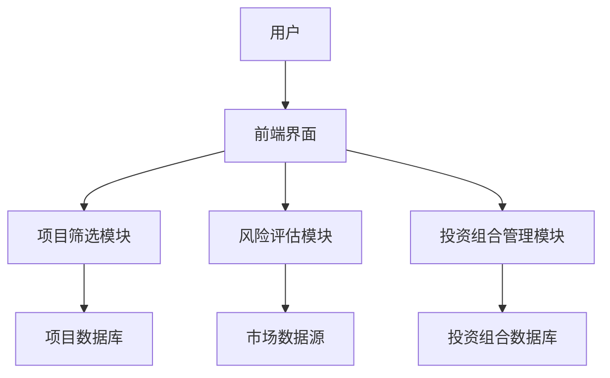
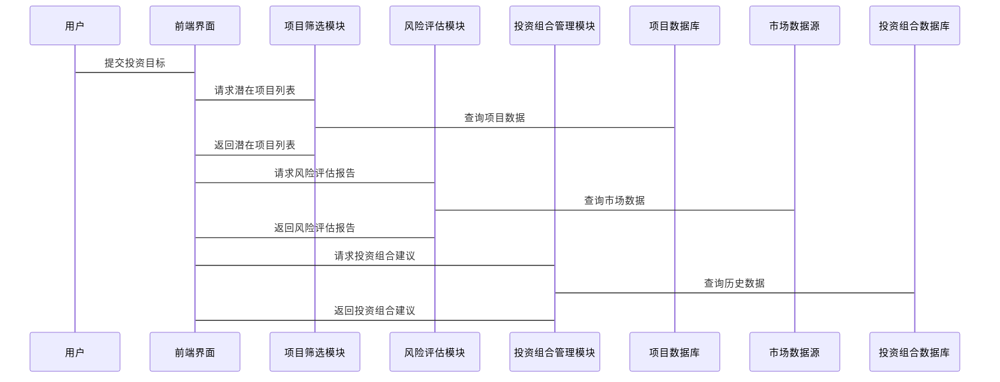

                 


# 价值投资在加密货币市场的应用

> **关键词**：价值投资、加密货币、区块链、投资策略、风险管理

> **摘要**：价值投资是一种长期有效的投资策略，通过深入分析企业的基本面，寻找具有长期竞争优势和合理估值的企业进行投资。本文将探讨如何将价值投资的理念和方法应用到加密货币市场中。通过对加密货币市场的特点、价值投资的核心指标、风险管理和实际案例的分析，本文旨在为投资者提供一套系统化的价值投资策略，帮助他们在加密货币市场中实现长期稳定的收益。

---

## 第1章: 价值投资的核心概念与背景

### 1.1 价值投资的定义与核心原则

#### 1.1.1 价值投资的定义
价值投资是一种以基本面分析为基础的投资策略，强调以低于内在价值的价格买入优质资产，长期持有，等待市场对其价值的重新认识。核心理念是寻找市场先生的错误定价，通过长期持有优质资产实现财富增长。

#### 1.1.2 价值投资的核心原则
- **安全边际**：买入价格低于内在价值，确保有足够安全空间。
- **长期视角**：关注企业的长期竞争优势和持续盈利能力。
- **独立思考**：不被市场情绪左右，坚持自己的分析和判断。

#### 1.1.3 价值投资与投机的区别
- 价值投资：基于基本面分析，追求长期稳定收益。
- 投机：基于市场情绪和短期价格波动，追求短期收益。

### 1.2 加密货币市场的特点

#### 1.2.1 加密货币市场的定义与现状
加密货币市场是以区块链技术为基础，通过去中心化的方式进行交易和价值转移的市场。目前，市场主要由比特币、以太坊等主流币种和数千种小币种组成，市场规模迅速增长，但波动性极高。

#### 1.2.2 加密货币市场的波动性与风险
- **高波动性**：加密货币价格受市场情绪、技术发展和政策监管影响，波动剧烈。
- **高风险**：市场参与者众多，信息不对称严重，存在较高的市场风险和操作风险。

#### 1.2.3 加密货币市场的参与者与生态
- **投资者**：包括机构投资者和个人投资者。
- **开发者**：负责技术开发和改进。
- **矿工/验证者**：通过挖矿或质押参与区块链网络。
- **交易所**：提供交易服务的平台。

---

## 第2章: 价值投资在加密货币市场的可行性

### 2.1 传统价值投资在现代金融市场的应用

#### 2.1.1 传统价值投资的成功案例
- **巴菲特的伯克希尔 Hathaway**：通过长期持有优质股票实现财富增长。
- **彼得·林奇的共同基金**：通过深入研究公司基本面，构建优质投资组合。

#### 2.1.2 传统价值投资的局限性
- **市场有效性**：在成熟市场中，价值投资的超额收益逐渐减少。
- **竞争加剧**：越来越多的投资者采用价值投资策略，导致竞争优势减弱。

#### 2.1.3 传统价值投资的可扩展性
- **全球化**：价值投资理念可以扩展到全球市场，寻找具有竞争优势的企业。

### 2.2 加密货币市场的独特性与挑战

#### 2.2.1 加密货币市场的技术驱动性
- **区块链技术**：去中心化、不可篡改、透明性等特点为加密货币市场提供了技术支撑。
- **技术创新**：加密货币市场的技术发展迅速，新项目层出不穷。

#### 2.2.2 加密货币市场的监管不确定性
- **政策风险**：不同国家对加密货币的监管政策差异大，存在较高的政策风险。
- **合规性**：合规性问题可能影响市场的长期发展。

#### 2.2.3 加密货币市场的信息不对称性
- **市场透明度**：加密货币市场的信息透明度较高，但技术复杂性导致信息不对称依然存在。

### 2.3 价值投资在加密货币市场的可行性分析

#### 2.3.1 价值投资的核心理念与加密货币市场的契合点
- **长期价值**：加密货币市场的技术进步和应用潜力可能带来长期价值。
- **安全边际**：通过深入分析项目基本面，寻找被市场低估的优质项目。

#### 2.3.2 加密货币市场的长期投资潜力
- **技术创新**：区块链技术的持续创新可能带来新的应用场景和商业模式。
- **全球支付**：比特币等加密货币可能成为全球支付和价值存储的工具。

#### 2.3.3 价值投资在加密货币市场的策略差异
- **技术分析**：与传统市场相比，加密货币市场的技术分析更为重要。
- **项目基本面**：需要关注项目的团队、技术实现、应用场景和市场接受度。

---

## 第3章: 加密货币市场的核心指标与分析框架

### 3.1 传统价值投资的核心指标

#### 3.1.1 市盈率（P/E）
- **定义**：市盈率是股票的市场价格与每股收益的比率，用于衡量股票的估值。
- **公式**：$$ P/E = \frac{股票价格}{每股收益} $$
- **应用**：低市盈率可能意味着股票被低估，但需结合行业和公司具体情况分析。

#### 3.1.2 市净率（P/B）
- **定义**：市净率是股票的市场价格与每股净资产的比率，用于衡量股票的估值。
- **公式**：$$ P/B = \frac{股票价格}{每股净资产} $$
- **应用**：低市净率可能意味着股票具有较高的安全边际。

#### 3.1.3 资产负债率
- **定义**：资产负债率是企业总负债与总资产的比率，用于衡量企业的财务健康状况。
- **公式**：$$ 资产负债率 = \frac{总负债}{总资产} $$
- **应用**：低资产负债率表明企业财务风险较低。

### 3.2 加密货币市场的核心指标

#### 3.2.1 市值与流通量
- **市值**：$$ 市值 = 价格 \times 流通量 $$
- **应用**：市值反映市场对项目的整体估值，但需结合流通量和交易量分析。

#### 3.2.2 交易量与换手率
- **交易量**：$$ 交易量 = 价格 \times 数量 $$
- **换手率**：$$ 换手率 = \frac{交易量}{流通量} $$
- **应用**：高交易量和高换手率可能表明市场活跃度高，但也可能暗示短期炒作。

#### 3.2.3 网络活性与社区参与度
- **网络活性**：包括链上交易次数、节点数量等指标。
- **社区参与度**：包括社交媒体关注量、GitHub贡献度等指标。
- **应用**：高网络活性和高社区参与度可能表明项目具有较强的生命力。

### 3.3 价值投资的分析框架

#### 3.3.1 项目基本面分析
- **团队背景**：创始人和技术团队的经验和信誉。
- **技术实现**：区块链技术的创新性和可行性。
- **应用场景**：项目的实际应用场景和市场潜力。

#### 3.3.2 市场定位与竞争优势
- **市场定位**：项目在市场中的定位和目标用户群体。
- **竞争优势**：与竞争对手相比的核心优势。

#### 3.3.3 估值与安全边际
- **内在价值**：通过DCF模型等方法估算项目的内在价值。
- **安全边际**：买入价格与内在价值的折扣率，确保足够的安全空间。

---

## 第4章: 加密货币市场的价值投资策略

### 4.1 价值投资策略的制定

#### 4.1.1 确定投资目标
- **长期目标**：通过长期持有优质项目实现财富增长。
- **短期目标**：通过分散投资降低风险。

#### 4.1.2 构建投资组合
- **资产配置**：将资金分配到不同类型的加密货币项目中，降低风险。
- **分散投资**：避免过度集中于单一项目或市场。

#### 4.1.3 定期复盘与调整
- **定期复盘**：评估投资组合的表现，分析是否偏离投资目标。
- **动态调整**：根据市场变化和个人风险承受能力，调整投资组合。

### 4.2 加密货币市场的风险管理

#### 4.2.1 风险识别
- **市场风险**：价格波动对投资组合的影响。
- **技术风险**：项目技术实现的可行性和安全性。
- **政策风险**：监管政策的变化对市场的影响。

#### 4.2.2 风险控制
- **止损策略**：设定止损点，避免亏损过大。
- **分散投资**：通过投资多样化项目降低风险。

#### 4.2.3 风险评估与应对
- **风险评估**：通过定量和定性分析评估投资组合的风险。
- **应对措施**：根据风险评估结果，采取相应的风险管理措施。

---

## 第5章: 加密货币市场的实际案例分析

### 5.1 比特币的长期投资价值

#### 5.1.1 比特币的基本面分析
- **技术实现**：比特币的区块链技术具有去中心化、不可篡改等特点。
- **应用场景**：比特币作为价值存储和全球支付工具的潜力。

#### 5.1.2 历史表现与未来预期
- **历史表现**：比特币自2009年推出以来，价格总体呈上升趋势。
- **未来预期**：比特币可能成为全球价值存储的重要工具。

### 5.2 以太坊的技术创新与投资机会

#### 5.2.1 以太坊的技术实现
- **智能合约**：以太坊支持智能合约的自动执行，为去中心化应用提供支持。
- **Layer 2解决方案**：以太坊正在推进Layer 2解决方案，提高交易效率和降低成本。

#### 5.2.2 投资机会
- **技术创新**：以太坊的技术创新可能带来新的应用场景和商业模式。
- **生态建设**：以太坊生态系统的发展可能吸引更多开发者和用户。

### 5.3 小币种的投资风险与机会

#### 5.3.1 小币种的特点
- **高波动性**：小币种价格波动剧烈，风险较高。
- **市场流动性**：小币种市场流动性可能较低，影响交易效率。

#### 5.3.2 小币种的投资机会
- **技术创新**：一些小币种可能具有独特的技术创新，带来投资机会。
- **市场空白**：小币种可能填补某些市场空白，具有较大的增长潜力。

---

## 第6章: 价值投资在加密货币市场的系统架构设计

### 6.1 系统功能设计

#### 6.1.1 项目筛选模块
- **功能**：根据项目基本面和技术实现进行筛选，生成潜在投资目标。
- **输入**：项目数据，包括市值、交易量、团队背景等。
- **输出**：潜在投资目标列表。

#### 6.1.2 风险评估模块
- **功能**：评估潜在投资项目的风险，生成风险评估报告。
- **输入**：项目数据和市场数据。
- **输出**：风险评估报告，包括市场风险、技术风险和政策风险。

#### 6.1.3 投资组合管理模块
- **功能**：根据风险评估结果和投资目标，生成投资组合。
- **输入**：风险评估报告和投资目标。
- **输出**：投资组合建议，包括资产配置和分散投资策略。

### 6.2 系统架构设计

#### 6.2.1 系统架构图


#### 6.2.2 系统交互图


### 6.3 项目实战

#### 6.3.1 环境安装
- **工具**：安装Python、Pandas、Matplotlib等工具。
- **数据源**：获取加密货币市场数据，包括价格、交易量、市值等。

#### 6.3.2 核心实现
```python
import pandas as pd
import matplotlib.pyplot as plt

# 数据加载
data = pd.read_csv('crypto_data.csv')

# 市值计算
data['市值'] = data['价格'] * data['流通量']

# 市盈率计算
data['市盈率'] = data['价格'] / data['每股收益']

# 可视化
plt.figure(figsize=(10, 6))
plt.plot(data['日期'], data['市值'], label='市值')
plt.xlabel('日期')
plt.ylabel('市值')
plt.legend()
plt.show()
```

#### 6.3.3 应用解读
- **数据可视化**：通过图表直观展示项目的基本面数据，如市值和市盈率。
- **模型验证**：通过历史数据验证价值投资策略的有效性，调整模型参数。

#### 6.3.4 案例分析
- **案例1**：比特币的长期投资价值分析。
- **案例2**：以太坊的技术创新与投资机会分析。

---

## 第7章: 价值投资在加密货币市场的总结与展望

### 7.1 总结

#### 7.1.1 核心观点回顾
- 价值投资理念可以应用于加密货币市场。
- 加密货币市场的特点和挑战需要在策略中予以考虑。

#### 7.1.2 投资策略总结
- 通过基本面分析和长期视角，寻找具有竞争优势的项目。
- 通过分散投资和风险管理，降低投资风险。

### 7.2 展望

#### 7.2.1 未来趋势
- **技术创新**：区块链技术的持续创新可能带来更多投资机会。
- **市场成熟**：加密货币市场的成熟可能吸引更多机构投资者。

#### 7.2.2 投资者建议
- **持续学习**：关注区块链技术和加密货币市场的最新动态。
- **独立思考**：坚持价值投资理念，避免盲目跟风。

### 7.3 最佳实践 tips

#### 7.3.1 风险管理
- 设定止损点，避免过度亏损。
- 通过分散投资降低风险。

#### 7.3.2 长期视角
- 长期持有优质项目，避免短期波动干扰。

#### 7.3.3 独立思考
- 不被市场情绪左右，坚持自己的分析和判断。

### 7.4 小结

价值投资在加密货币市场的应用具有广阔的前景，但也面临诸多挑战。通过深入分析项目基本面、技术实现和市场环境，投资者可以制定科学的投资策略，实现长期稳定的收益。

---

## 作者：AI天才研究院/AI Genius Institute & 禅与计算机程序设计艺术 /Zen And The Art of Computer Programming

