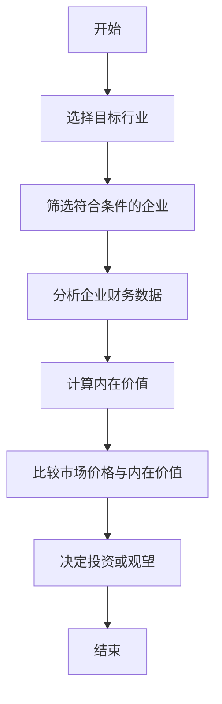
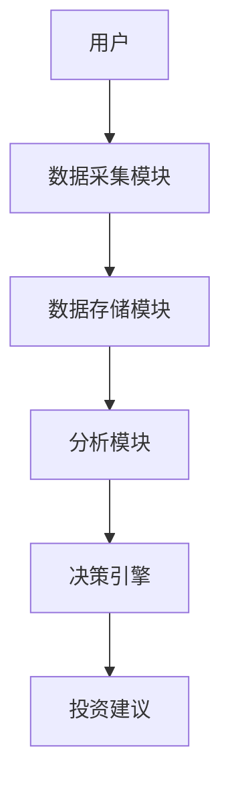

                 


# 价值投资在波动市场中的优势

---

## 关键词：价值投资、波动市场、长期收益、安全边际、基本面分析、量化投资、风险管理

---

## 摘要：

在金融市场中，波动性是一个永恒的主题。投资者在面对市场波动时，常常陷入短期情绪的漩涡，难以保持理性决策。价值投资作为一种长期有效的投资策略，以其独特的视角和方法，在波动市场中展现出显著的优势。本文从价值投资的核心理念出发，结合波动市场的特性，深入分析其在市场波动中的优势，并通过量化方法和实际案例，展示如何在波动中把握长期价值。

---

## 第一部分: 价值投资的背景与核心概念

### 第1章: 价值投资的起源与发展

#### 1.1 价值投资的起源
价值投资的起源可以追溯到20世纪初，由本杰明·格雷厄姆和戴维·多德提出。格雷厄姆是哥伦比亚大学的教授，他提出的“价值投资”理念强调以低于内在价值的价格买入股票。这一理念的核心在于寻找市场中的“烟蒂股”，即那些被市场低估的股票。

#### 1.2 价值投资的核心理念
价值投资的核心理念是基于企业的基本面分析，寻找市场价格低于其内在价值的投资标的。以下是其核心要点：
1. **内在价值**：企业的内在价值是其未来现金流的现值。
2. **安全边际**：买入价格低于内在价值，以降低投资风险。
3. **长期视角**：关注企业的长期盈利能力，而非短期市场波动。

#### 1.3 价值投资与其他投资策略的对比
以下表格展示了价值投资与其他投资策略（如趋势投资、技术分析）的核心区别：

| **策略类型** | **核心思想** | **优缺点** | **适用场景** |
|--------------|--------------|------------|--------------|
| 价值投资    | 买入低于内在价值的资产 | 长期收益稳定，短期波动大 | 市场波动较大时 |
| 趋势投资    | 追踪价格趋势 | 短期收益快，风险高 | 市场趋势明显时 |
| 技术分析    | 基于价格和成交量的模式 | 短期信号多，长期信号弱 | 市场流动性高时 |

### 第2章: 波动市场的定义与特征

#### 2.1 市场波动的来源
市场波动主要来源于以下几个方面：
1. **宏观经济因素**：如利率变化、经济周期、通货膨胀等。
2. **公司基本面**：如盈利状况、管理层变动等。
3. **市场情绪**：投资者的非理性行为放大了市场的波动。

#### 2.2 市场波动的特征
1. **短期性**：市场波动通常在短期内影响价格。
2. **不可预测性**：市场波动往往难以被准确预测。
3. **非理性**：市场情绪的波动常常导致价格偏离内在价值。

#### 2.3 波动市场中的投资机会
尽管市场波动带来不确定性，但也为价值投资者提供了买入优质资产的低价机会。当市场恐慌时，许多优质资产会被超跌，此时买入可以获得超额收益。

### 第3章: 价值投资的核心概念与联系

#### 3.1 核心概念原理
1. **内在价值**：企业未来现金流的折现值，是衡量资产价值的唯一标准。
2. **安全边际**：买入价格低于内在价值，确保投资的安全性。
3. **逆向思维**：在市场恐慌时买入，在市场狂热时卖出。

#### 3.2 核心概念对比表格
以下表格展示了价值投资与其他投资策略在市场波动中的表现对比：

| **策略类型** | **波动市场中的表现** | **优缺点** |
|--------------|-----------------------|------------|
| 价值投资    | 稳定收益，波动中获利 | 短期亏损可能较大 |
| 趋势投资    | 顺势而为，收益快 | 风险较高 |
| 技术分析    | 依赖短期信号 | 易受市场情绪影响 |

---

## 第二部分: 价值投资的算法与数学模型

### 第4章: 价值投资的算法原理

#### 4.1 算法原理概述
价值投资的算法原理基于以下几个步骤：
1. **基本面分析**：通过财务数据评估企业的内在价值。
2. **价格比较**：将市场价格与内在价值进行对比。
3. **投资决策**：当市场价格低于内在价值时，选择买入。

#### 4.2 算法流程图
以下是价值投资算法的流程图：



### 第5章: 数学模型与公式

#### 5.1 资产定价模型
1. **股息贴现模型（DDM）**：
   公式为：
   $$
   V = \frac{D}{r - g}
   $$
   其中，V是内在价值，D是股息，r是贴现率，g是股息增长率。

2. **现金流折现模型（DCF）**：
   公式为：
   $$
   V = \sum_{t=1}^{n} \frac{CF_t}{(1 + r)^t} + \frac{TV}{(1 + r)^n}
   $$
   其中，CF_t是第t年的现金流，r是贴现率，TV是终值。

#### 5.2 实际案例分析
假设某企业未来5年的现金流分别为100、120、140、160、180万元，贴现率为10%，终值为200万元。计算其内在价值：

$$
V = \frac{100}{1.1} + \frac{120}{1.1^2} + \frac{140}{1.1^3} + \frac{160}{1.1^4} + \frac{180}{1.1^5} + \frac{200}{1.1^5}
$$

---

## 第三部分: 系统分析与架构设计方案

### 第6章: 系统分析与架构设计

#### 6.1 问题场景介绍
在波动市场中，投资者需要一个能够快速分析企业基本面、计算内在价值，并提供投资决策支持的系统。

#### 6.2 系统功能设计
1. **数据采集**：获取企业财务数据和市场价格。
2. **分析模块**：计算内在价值，比较市场价格与内在价值。
3. **决策引擎**：根据比较结果，生成投资建议。

#### 6.3 系统架构设计
以下是系统架构图：



---

## 第四部分: 项目实战

### 第7章: 项目实战

#### 7.1 环境安装
安装Python和必要的库（如Pandas、NumPy、Matplotlib）。

#### 7.2 核心实现代码
以下是计算内在价值的Python代码：

```python
import pandas as pd
import numpy as np

def calculate_intrinsic_value(revenue, profit_margin, growth_rate, discount_rate):
    # 计算未来现金流
    cash_flows = []
    for i in range(5):
        cash_flow = revenue * (1 + growth_rate) ** i * profit_margin
        cash_flows.append(cash_flow)
    # 计算终值
    terminal_value = cash_flows[-1] * (1 + growth_rate) / (discount_rate - growth_rate)
    # 计算内在价值
    intrinsic_value = sum([cf / (1 + discount_rate) ** (i + 1) for i, cf in enumerate(cash_flows)]) + terminal_value / (1 + discount_rate) ** 5
    return intrinsic_value

revenue = 10000000
profit_margin = 0.1
growth_rate = 0.05
discount_rate = 0.1

iv = calculate_intrinsic_value(revenue, profit_margin, growth_rate, discount_rate)
print(f"内在价值为：{iv}")
```

#### 7.3 实际案例分析
以某企业为例，分析其内在价值，并与市场价格进行比较，得出投资建议。

---

## 第五部分: 最佳实践与总结

### 第8章: 最佳实践

#### 8.1 小结
价值投资在波动市场中具有显著优势，其核心在于长期视角和安全边际。

#### 8.2 注意事项
1. **避免短期波动干扰**：坚持长期投资。
2. **分散投资**：降低风险。
3. **持续学习**：保持对市场的理解。

#### 8.3 拓展阅读
推荐阅读格雷厄姆的《证券分析》和巴菲特的《巴菲特致股东的信》。

---

## 作者：AI天才研究院 & 禅与计算机程序设计艺术

