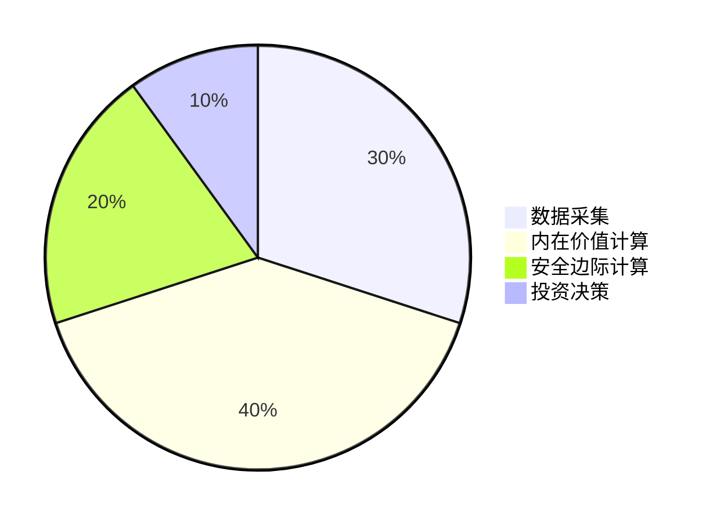

                 


# 价值投资在熊市中的应用：危机中的投资机会

## 关键词：价值投资、熊市、投资机会、风险管理、内在价值、安全边际

## 摘要：熊市往往被视为价值投资者的机遇期。本文详细探讨了在熊市中如何应用价值投资策略，包括识别低估资产、计算内在价值、制定投资计划等。通过数学模型和实际案例，分析了熊市中的投资机会和风险管理策略，帮助投资者在危机中把握投资良机。

---

## 第一部分：价值投资基础与熊市概述

### 第1章：熊市的定义与特点

#### 1.1 熊市的定义与特征

熊市是指市场整体表现低迷，股票指数持续下跌的时期。通常，熊市的特征包括市场情绪低迷、投资者信心不足、成交量萎缩等。

| 特征 | 描述 |
|------|------|
| 市场情绪 | 投资者普遍悲观，交易量减少 |
| 股价表现 | 股价普遍下跌，波动性增大 |
| 经济状况 | 经济增速放缓，企业盈利下降 |

#### 1.2 价值投资的核心理念

价值投资是一种以基本面分析为基础的投资策略，强调以低于内在价值的价格买入优质资产。

| 核心概念 | 定义 |
|----------|------|
| 内在价值 | 资产的未来现金流的现值 |
| 安全边际 | 股价与内在价值的折扣比例 |
| 财务报表分析 | 通过资产负债表、利润表等评估企业价值 |

#### 1.3 熊市中价值投资的机会

熊市中，许多优质资产因市场恐慌而被低估，为价值投资者提供了买入的机会。以下是熊市中价值投资的机会分析：

- **低估资产识别**：通过分析财务报表，识别那些基本面良好但股价被低估的资产。
- **长期持有策略**：在熊市中，长期持有优质资产，等待市场回归理性。
- **分批建仓**：在熊市中分批买入，分散风险，避免一次性投入过大。

---

## 第二部分：价值投资的核心概念与数学模型

### 第2章：价值投资的核心概念与数学模型

#### 2.1 价值投资的核心概念

价值投资的核心在于计算资产的内在价值，并以低于内在价值的价格买入。以下是内在价值和安全边际的详细解释：

- **内在价值计算**：通过现金流折现法计算资产的未来现金流的现值，公式如下：
  $$\text{内在价值} = \frac{\text{现金流}}{\text{折现率}}$$

- **安全边际**：确保买入价格远低于内在价值，公式如下：
  $$\text{安全边际} = \text{市场价格} \times \text{安全边际系数}$$

#### 2.2 价值投资的数学模型

- **现金流折现法**：
  $$\text{内在价值} = \sum_{t=1}^{n} \frac{\text{CF}_t}{(1 + r)^t}$$
  其中，CF_t是第t年的现金流，r是折现率。

- **资产配置优化**：
  $$\text{资产配置比例} = \frac{\text{资产类别权重}}{\text{总权重}}$$

#### 2.3 熊市中价值投资的数学关系

- **熊市中价值投资的收益与风险分析**：
  在熊市中，价值投资的收益主要来自于价格回归内在价值，而风险则来自市场波动和企业基本面的进一步恶化。

---

## 第三部分：熊市中价值投资的策略与算法

### 第3章：熊市中价值投资的策略与算法

#### 3.1 熊市中价值投资的核心策略

- **寻找被低估的资产**：通过分析市盈率、市净率等指标，识别被市场低估的资产。
- **长期持有优质资产**：选择基本面良好、具有竞争优势的企业长期持有。
- **分批建仓与仓位管理**：在熊市中，分批买入，分散风险，避免一次性投入过大。

#### 3.2 熊市中价值投资的算法实现

- **现金流折现算法**：
  ```python
  def calculate_intrinsic_value(cash_flows, discount_rate):
      return sum(cash_flow / (1 + discount_rate)**t for t, cash_flow in enumerate(cash_flows))
  ```

- **安全边际计算算法**：
  ```python
  def calculate_margin_of_safety(market_price, intrinsic_value, margin_coefficient=0.3):
      return market_price * (1 - margin_coefficient)
  ```

- **资产配置优化算法**：
  ```python
  def optimize_asset_allocation(asset_weights):
      total_weight = sum(asset_weights.values())
      return {asset: weight / total_weight for asset, weight in asset_weights.items()}
  ```

#### 3.3 算法的数学模型与流程图

- **现金流折现算法流程图**：
  ```mermaid
  graph TD
  A[开始] --> B[输入现金流数据]
  B --> C[计算折现率]
  C --> D[计算内在价值]
  D --> E[结束]
  ```

---

## 第四部分：项目实战与案例分析

### 第4章：熊市中价值投资的实际应用

#### 4.1 项目背景与目标

本项目旨在通过实际案例，展示如何在熊市中应用价值投资策略，寻找被低估的资产。

#### 4.2 系统功能设计

- **数据采集模块**：采集目标资产的财务数据和市场数据。
- **内在价值计算模块**：使用现金流折现法计算资产的内在价值。
- **安全边际计算模块**：计算资产的安全边际。
- **投资决策模块**：根据计算结果，制定投资策略。

#### 4.3 系统架构设计



#### 4.4 实际案例分析

假设某企业在熊市中的财务数据如下：

- 现金流：100万元
- 折现率：10%
- 市场价格：10元

计算其内在价值和安全边际：

- 内在价值：
  $$\text{内在价值} = \frac{100}{0.1} = 1000\text{元}$$
- 安全边际：
  $$\text{安全边际} = 10 \times 0.3 = 3\text{元}$$
  因此，买入价格应低于97元。

---

## 第五部分：总结与展望

### 5.1 本章小结

熊市是价值投资者的机会，通过计算内在价值和安全边际，选择被低估的资产进行长期持有，可以实现稳健的投资收益。

### 5.2 最佳实践 tips

- **分散投资**：避免将所有资金投入到单一资产中。
- **持续学习**：关注市场动态，不断更新投资策略。
- **耐心等待**：在熊市中，耐心持有优质资产，等待市场复苏。

### 5.3 未来展望

随着市场的发展，价值投资策略将不断完善，投资者需要结合市场环境，灵活调整投资策略。

---

## 作者：AI天才研究院/AI Genius Institute & 禅与计算机程序设计艺术 /Zen And The Art of Computer Programming

---

通过本文的详细分析，读者可以掌握在熊市中应用价值投资策略的方法，识别被低估资产，制定科学的投资计划，实现稳健的投资收益。希望本文能为投资者在熊市中的投资决策提供有价值的参考和指导。

