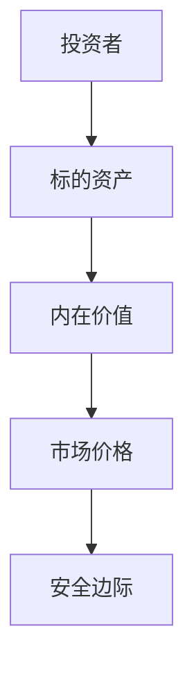
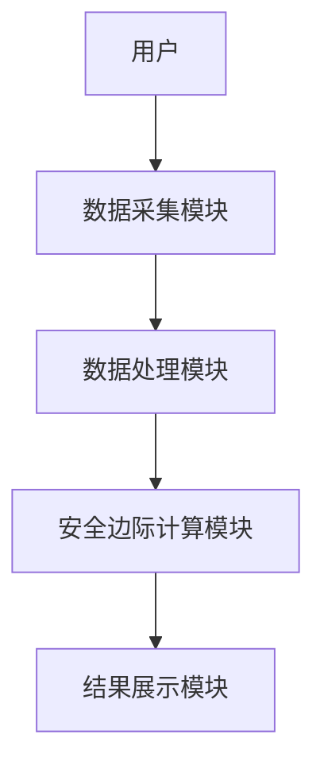
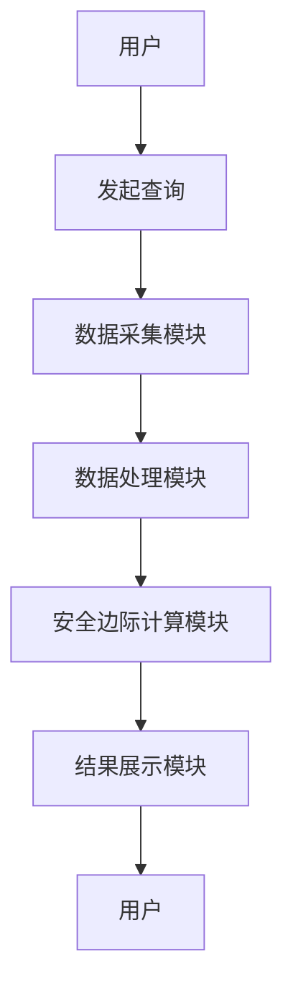

                 


# 价值投资的核心原则：安全边际

## 关键词：价值投资、安全边际、内在价值、投资策略、风险管理

## 摘要：  
价值投资是一种以基本面分析为基础的投资策略，其核心原则在于通过寻找被市场低估的资产，利用安全边际来降低投资风险。本文将深入探讨安全边际的定义、计算方法、应用场景以及在投资决策中的重要性。通过理论分析与实际案例结合，帮助读者理解如何在投资中构建安全边际，从而实现稳健的投资回报。

---

# 第一部分：价值投资的背景与核心概念

## 第1章：价值投资的起源与发展

### 1.1 价值投资的起源与发展
- **1.1.1 价值投资的起源**  
  价值投资的起源可以追溯到20世纪初，本杰明·格雷厄姆和戴维·多德是这一投资理念的鼻祖。他们提出的“安全边际”概念为现代投资理论奠定了基础。

- **1.1.2 格雷厄姆与多德的价值投资体系**  
  格雷厄姆和多德提出，股票的内在价值可以通过对公司财务状况的分析来估算，并通过与市场价格的对比来判断投资的可行性。

- **1.1.3 菲利普·费雪的成长投资理念**  
  菲利普·费雪将成长投资的理念引入价值投资，强调选择具有持续增长潜力的公司，而不仅仅是关注价格与价值的偏差。

### 1.2 价值投资的核心原则
- **1.2.1 价值投资的基本定义**  
  价值投资是一种基于对公司基本面分析的投资策略，旨在通过识别市场价格低于内在价值的资产来实现超额回报。

- **1.2.2 投资的三要素：安全边际、价格与价值**  
  安全边际是价值投资的核心，它通过比较市场价格与内在价值的差异，为投资者提供了一种风险控制的机制。

- **1.2.3 价值投资与成长投资的区别与联系**  
  价值投资关注低估的资产，而成长投资关注高增长的公司。两者都强调基本面分析，但侧重点不同。

### 1.3 安全边际的定义与作用
- **1.3.1 安全边际的定义**  
  安全边际是指资产的内在价值与市场价格之间的差额，反映了市场价格相对于内在价值的折扣程度。

- **1.3.2 安全边际的重要性**  
  安全边际为投资者提供了一个缓冲区，即使市场价格波动，也能确保投资本金的安全。

- **1.3.3 安全边际与投资风险的关系**  
  安全边际越大，投资风险越小。通过构建安全边际，投资者可以在市场波动中保持信心，并避免情绪化决策。

### 1.4 安全边际的边界与外延
- **1.4.1 安全边际的适用范围**  
  安全边际适用于股票、债券等多种资产类别，但其效果可能受到市场环境和公司基本面的影响。

- **1.4.2 安全边际的局限性**  
  安全边际并非万能的，它无法完全消除投资风险，也无法预测市场的短期波动。

- **1.4.3 安全边际与其他投资策略的对比**  
  与技术分析相比，安全边际更注重基本面分析；与指数投资相比，安全边际更强调个股选择。

---

## 第2章：安全边际的核心概念与数学模型

### 2.1 安全边际的数学模型
- **2.1.1 内在价值的计算公式**  
  内在价值是资产在未来现金流的现值，计算公式为：
  $$\text{内在价值} = \sum_{t=1}^{n} \frac{\text{现金流}_t}{(1 + r)^t}$$  
  其中，$r$ 是折现率，$n$ 是现金流的期限。

- **2.1.2 安全边际的计算公式**  
  安全边际可以通过以下公式计算：
  $$\text{安全边际} = \text{内在价值} - \text{市场价格}$$  
  如果安全边际为正，说明资产被市场低估，具有投资价值。

### 2.2 安全边际的属性特征对比
- **2.2.1 安全边际的时间特性**  
  安全边际会随着时间的推移而变化，市场价格會波动，内在价值也会随着公司业绩的变化而调整。

- **2.2.2 安全边际的空间特性**  
  安全边际在不同资产类别和市场环境中表现不同，需要根据具体情况进行调整。

- **2.2.3 安全边际的相对特性**  
  安全边际是相对概念，其价值取决于市场价格与内在价值的差异。

### 2.3 安全边际的ER实体关系图


### 2.4 本章小结
本章通过数学模型和图表分析，深入探讨了安全边际的核心概念及其在价值投资中的重要性。

---

## 第3章：安全边际的算法原理与实现

### 3.1 安全边际的算法原理
- **3.1.1 安全边际的计算流程**  
  1. 收集目标资产的财务数据。  
  2. 估算资产的内在价值。  
  3. 计算市场价格与内在价值的差异，得出安全边际。  

```mermaid
graph TD
    A[开始] --> B[输入数据]
    B --> C[计算内在价值]
    C --> D[计算市场价格]
    D --> E[计算安全边际]
    E -->

```

- **3.1.2 内在价值的估算方法**  
  内在价值的估算需要考虑公司的盈利能力、成长性、行业地位等因素，常用的方法包括DCF模型和可比公司分析。

### 3.2 安全边际的实现代码
以下是一个简单的安全边际计算示例代码：

```python
def calculate_intrinsic_value(cash_flows, discount_rate):
    return sum(cash_flow / (1 + discount_rate) ** t for t, cash_flow in enumerate(cash_flows))

def calculate_margin_of_safety(intrinsic_value, market_price):
    return intrinsic_value - market_price

# 示例数据
cash_flows = [100, 120, 150]
discount_rate = 0.08
market_price = 1000

intrinsic_value = calculate_intrinsic_value(cash_flows, discount_rate)
margin_of_safety = calculate_margin_of_safety(intrinsic_value, market_price)

print(f"内在价值: {intrinsic_value}")
print(f"安全边际: {margin_of_safety}")
```

---

## 第4章：安全边际的系统分析与架构设计

### 4.1 问题场景介绍
在实际投资中，投资者需要通过系统化的分析来计算安全边际。本章将从系统架构的角度，探讨如何构建一个安全边际分析系统。

### 4.2 投资分析系统介绍
- **4.2.1 系统功能设计**  
  该系统包括数据采集、数据处理、安全边际计算、结果展示等功能模块。

### 4.3 系统架构设计


### 4.4 系统接口设计
- 数据接口：与金融数据源对接，获取公司财务数据和市场价格。
- 计算接口：调用安全边际计算函数，返回结果。

### 4.5 系统交互流程


---

## 第5章：基于安全边际的项目实战

### 5.1 环境配置与数据收集
- **5.1.1 环境配置**  
  需要安装Python、Pandas、NumPy等工具库。

### 5.2 核心代码实现
```python
import pandas as pd
import numpy as np

def calculate_margin_of_safety(df):
    df['内在价值'] = df['现金流'] / (1 + df['折现率'])
    df['安全边际'] = df['内在价值'] - df['市场价格']
    return df

# 示例数据
data = {
    '公司': ['A', 'B', 'C'],
    '现金流': [100, 150, 200],
    '折现率': [0.08, 0.08, 0.08],
    '市场价格': [900, 1000, 1100]
}

df = pd.DataFrame(data)
result = calculate_margin_of_safety(df)
print(result)
```

### 5.3 实际案例分析
以公司A为例，计算其安全边际：
- 内在价值：100 / 1.08 ≈ 92.59  
- 安全边际：92.59 - 900 ≈ -807.41  

由于安全边际为负，说明公司A的市场价格高于内在价值，不具有投资价值。

### 5.4 本章小结
通过实际案例分析，展示了如何利用安全边际概念进行投资决策。

---

## 第6章：基于安全边际的最佳实践

### 6.1 关键点总结
- **长期投资**：安全边际在长期投资中表现更优。  
- **避免情绪化决策**：安全边际为投资者提供了纪律性的框架，避免情绪化交易。  
- **持续学习**：市场环境不断变化，投资者需要持续学习和改进。

### 6.2 实用小结
- **定期评估**：定期检查投资组合的安全边际，确保投资组合的稳健性。  
- **关注基本面**：选择具有强大基本面的公司，提高内在价值的准确性。  

### 6.3 拓展阅读
- 格雷厄姆的《证券分析》  
- 费雪的《成长股入门》  

---

## 第7章：总结与展望

### 7.1 本章总结
安全边际是价值投资的核心原则，通过估算内在价值与市场价格的差异，帮助投资者识别低估资产，降低投资风险。

### 7.2 未来展望
随着人工智能和大数据技术的发展，安全边际的计算将更加精准和高效，为投资者提供更好的决策支持。

---

## 作者：AI天才研究院/AI Genius Institute & 禅与计算机程序设计艺术 /Zen And The Art of Computer Programming

