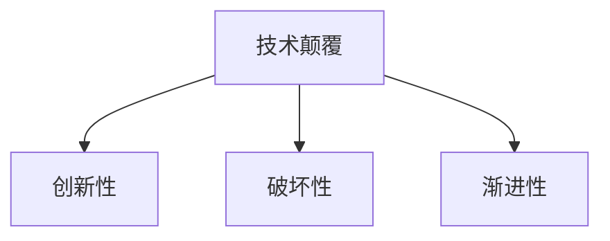

                 

# 价值投资者如何应对技术颠覆和行业变革

**关键词**：价值投资者，技术颠覆，行业变革，投资策略，风险管理，技术影响

**摘要**：随着技术的快速发展，行业格局不断发生变化，价值投资者需要调整策略以应对技术颠覆和行业变革。本文详细探讨了技术如何影响行业，分析了不同行业的技术颠覆现状，并为价值投资者提供了应对策略，包括价值评估方法、投资组合调整和风险管理等。

---

# 第一部分：技术颠覆与行业变革的背景

## 第1章：技术颠覆的核心概念

### 1.1 技术颠覆的定义与特征

技术颠覆是指新技术的出现导致原有行业格局发生变化，传统企业可能被新兴技术取代。其特征包括创新性、破坏性和渐进性。

**图1.1 技术颠覆的特征分析**

### 1.2 数字化转型与新兴技术

#### 1.2.1 数字化转型的定义与目标

数字化转型是指企业利用数字技术改变业务模式、流程、文化等，以提升竞争力。其目标是优化效率、增强客户体验和创新驱动增长。

#### 1.2.2 人工智能、大数据、区块链的影响

人工智能和大数据分析改变了企业的决策方式，区块链技术提高了数据安全性。这些技术推动了商业模式的创新，如订阅服务和共享经济。

### 1.3 技术对企业竞争优势的影响

#### 1.3.1 提高运营效率

技术优化了企业的生产流程，降低了成本，提高了效率。

#### 1.3.2 改变商业模式

技术推动企业从传统销售模式转向订阅制或服务模式，增强了客户粘性。

#### 1.3.3 增强创新能力

技术为企业提供了更多的创新工具和数据支持，促进了产品和服务的快速迭代。

---

## 第2章：技术对企业的影响与价值投资者的应对

### 2.1 技术对企业竞争优势的影响

#### 2.1.1 运营效率提升

技术优化了企业的生产流程，减少了资源浪费，提高了产出效率。

#### 2.1.2 商业模式重塑

新兴技术如区块链和人工智能改变了企业的盈利模式，例如从产品销售转向数据服务。

#### 2.1.3 创新能力增强

技术提供了新的工具和方法，帮助企业更快地推出新产品和服务，增强市场竞争力。

### 2.2 价值投资者的应对策略

#### 2.2.1 核心理念与目标

价值投资者追求长期稳定的回报，注重企业的基本面和内在价值。

#### 2.2.2 技术对企业价值的影响

技术改变了企业的盈利能力和增长潜力，价值投资者需要重新评估企业价值。

#### 2.2.3 在技术变革中的角色

价值投资者应关注技术对企业的影响，及时调整投资策略，抓住技术驱动的投资机会。

### 2.3 技术驱动的投资机会

#### 2.3.1 新兴技术领域

人工智能、大数据等领域有大量投资机会，但需要谨慎评估技术成熟度和市场潜力。

#### 2.3.2 数字化转型的传统行业

传统行业如制造和金融通过数字化转型获得新的增长点，价值投资者可以关注这些领域的龙头企业。

#### 2.3.3 技术驱动的新兴行业

新兴行业如电动汽车和绿色能源依赖技术驱动，价值投资者应关注行业领先企业。

---

## 第3章：行业分析与技术驱动的行业变革

### 3.1 主要行业的技术颠覆现状

#### 3.1.1 信息技术行业

技术颠覆主要来自云技术和人工智能的发展，推动了行业整合和生态重构。

#### 3.1.2 金融服务业

区块链和人工智能的应用改变了金融服务模式，提升了效率和安全性。

#### 3.1.3 制造业

工业4.0和物联网技术推动了制造业的智能化和自动化。

#### 3.1.4 医疗健康行业

大数据和人工智能的应用提升了诊断准确性和治疗效果。

#### 3.1.5 教育行业

在线教育和人工智能个性化教学改变了传统教育模式。

### 3.2 行业整合与生态重构

#### 3.2.1 企业内部管理重构

技术优化了企业的组织结构和管理流程，提升了运营效率。

#### 3.2.2 价值链重构

技术改变了行业价值链，推动企业从传统价值链转向数字化价值链。

#### 3.2.3 生态系统影响

技术促进了企业间的协作和生态系统的形成，推动了资源共享和创新。

### 3.3 投资机会与风险

#### 3.3.1 技术驱动的行业整合中的机会

行业整合带来了并购机会，价值投资者可以关注整合后的龙头企业。

#### 3.3.2 技术变革中的风险

技术不确定性、市场波动和政策变化增加了投资风险。

#### 3.3.3 应对策略

价值投资者应分散投资、持续关注技术和行业动态，制定灵活的投资策略。

---

## 第4章：价值投资者的技术驱动投资策略

### 4.1 价值评估与技术驱动的评估方法

#### 4.1.1 传统价值评估的局限性

传统方法难以准确评估技术对企业未来的影响。

#### 4.1.2 技术驱动的评估新方法

综合考虑技术的成熟度、市场潜力和企业适应能力。

#### 4.1.3 技术对企业未来现金流的影响

评估技术对企业未来现金流的贡献，考虑技术的生命周期和市场接受度。

### 4.2 投资组合的调整与优化

#### 4.2.1 技术驱动下的投资组合调整策略

根据技术发展和行业变化，动态调整投资组合。

#### 4.2.2 新兴技术领域的投资权重

根据技术成熟度和市场潜力，合理分配新兴技术和传统行业的投资比例。

#### 4.2.3 行业平衡配置

在新兴行业和传统行业之间保持平衡，降低投资风险。

### 4.3 长期投资与技术驱动的行业

#### 4.3.1 长期投资策略

技术驱动的行业具有长期增长潜力，价值投资者应关注具有强大研发能力和市场竞争力的企业。

#### 4.3.2 技术驱动行业的未来趋势

人工智能、大数据和区块链等技术将继续推动行业变革，价值投资者应关注这些领域的创新和发展。

---

# 第二部分：行业分析与技术驱动的行业变革

## 第5章：行业整合与生态重构

### 5.1 行业整合的驱动因素

#### 5.1.1 技术驱动的整合

技术的出现促使企业通过整合资源优化运营。

#### 5.1.2 市场竞争的加剧

竞争加剧推动企业寻求合作和整合以增强竞争力。

#### 5.1.3 政策与法规的影响

政策变化和技术标准的统一促使行业整合。

### 5.2 生态系统的重构

#### 5.2.1 企业间的协作

技术驱动下，企业间协作更加紧密，形成新的生态系统。

#### 5.2.2 资源共享与创新

资源整合和技术共享推动了创新，促进了生态系统的形成。

---

## 第6章：风险管理与应对策略

### 6.1 技术风险

#### 6.1.1 技术不确定性的评估

评估技术的成熟度和可行性，避免投资失败。

#### 6.1.2 技术替代的风险

关注技术的生命周期，避免被技术替代影响投资。

### 6.2 市场风险

#### 6.2.1 市场波动的影响

技术变革引发市场波动，投资者需做好风险管理。

#### 6.2.2 市场需求变化

关注技术对企业产品市场需求的影响，及时调整投资策略。

### 6.3 合规风险

#### 6.3.1 技术应用的合规性

确保技术应用符合法律法规，避免合规风险。

#### 6.3.2 数据安全与隐私保护

关注数据安全和隐私保护，避免因数据泄露引发的风险。

### 6.4 风险管理策略

#### 6.4.1 投资组合多元化

通过多元化投资分散风险，降低单一技术或行业带来的影响。

#### 6.4.2 持续监控与评估

定期评估投资组合的技术风险，及时调整投资策略。

---

## 第7章：案例分析与最佳实践

### 7.1 成功案例

#### 7.1.1 亚马逊的数字化转型

亚马逊通过技术驱动实现了从在线零售到云计算的转型，成为行业领导者。

#### 7.1.2 特斯拉的创新模式

特斯拉通过技术创新和垂直整合，推动了电动汽车行业的发展。

### 7.2 失败案例

#### 7.2.1 黑莓的没落

黑莓未能及时适应技术变革，导致市场份额被苹果和安卓系统蚕食。

#### 7.2.2 Kodak的转型失败

柯达在数码相机领域的技术优势未能转化为市场优势，导致企业转型失败。

### 7.3 最佳实践

#### 7.3.1 关注技术创新

价值投资者应关注企业的技术创新能力和研发投入，选择具有持续创新能力的企业。

#### 7.3.2 保持长期视角

技术驱动的行业变革需要时间，投资者应保持长期视角，关注企业的长期增长潜力。

#### 7.3.3 与行业专家合作

与技术专家和行业分析师合作，获取专业意见，降低投资风险。

---

## 第8章：未来展望与投资建议

### 8.1 未来技术趋势

#### 8.1.1 人工智能与自动化

人工智能和自动化技术将继续推动行业变革，特别是在制造业和服务业。

#### 8.1.2 区块链与去中心化

区块链技术将进一步发展，推动去中心化应用的普及。

#### 8.1.3 可持续发展技术

绿色能源和环保技术将成为未来投资的重点领域。

### 8.2 投资建议

#### 8.2.1 关注技术创新型企业

选择具有强大研发能力和市场竞争力的技术创新型企业。

#### 8.2.2 分散投资风险

通过多元化投资降低技术变革带来的风险，避免过度集中于单一技术和行业。

#### 8.2.3 长期投资策略

技术驱动的行业变革需要时间，投资者应保持长期视角，耐心等待投资回报。

---

## 第9章：结论与总结

### 9.1 主要观点总结

技术颠覆和行业变革正在改变投资 landscape，价值投资者需要调整策略，关注技术创新和行业整合。

### 9.2 未来展望

未来，技术将继续推动行业变革，价值投资者应保持敏锐的洞察力，抓住投资机会，应对潜在风险。

---

**作者：AI天才研究院/AI Genius Institute & 禅与计算机程序设计艺术 /Zen And The Art of Computer Programming**

