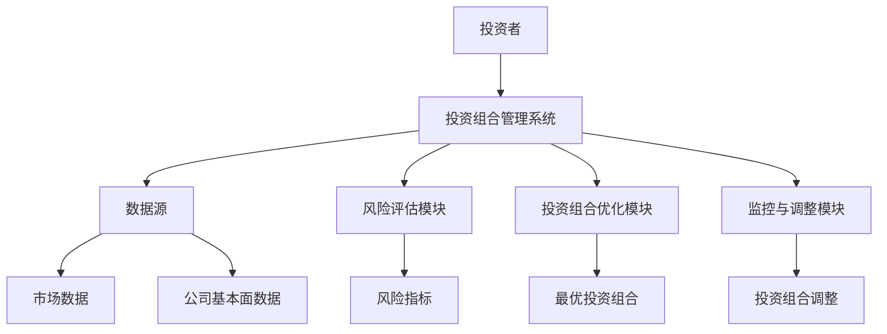
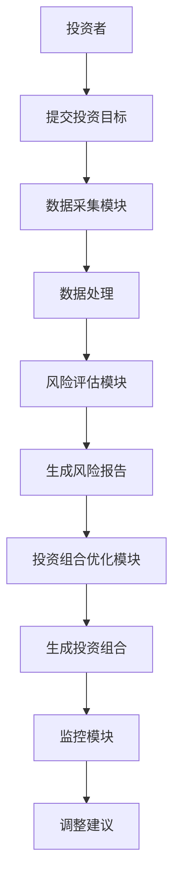

                 


# 价值投资者的风险管理：如何在追求收益的同时控制风险

## 关键词：风险管理，价值投资，收益与风险平衡，投资组合管理，风险量化

## 摘要：
在追求投资收益的同时，风险管理是价值投资者不可忽视的重要环节。本文详细探讨了价值投资者如何通过理解风险的定义、量化风险、构建投资组合模型以及实施有效的风险管理策略来平衡收益与风险。文章结合理论与实践，使用现代投资组理论和数学模型，帮助投资者在复杂多变的市场环境中做出明智的投资决策。

---

### 第1章：价值投资的起源与发展

#### 1.1 价值投资的核心理念

##### 1.1.1 价值投资的定义与特点
价值投资是一种以基本面分析为基础的投资策略，旨在通过购买低于其内在价值的股票来实现长期收益。其特点包括注重长期投资、重视公司基本面分析以及追求安全边际。

##### 1.1.2 价值投资的历史发展
价值投资的理念起源于20世纪20年代，本杰明·格雷厄姆是该理论的奠基人。他的学生戴维·多德进一步完善了这一理论，并通过《证券分析》一书将其系统化。

##### 1.1.3 价值投资与成长投资的区别
价值投资与成长投资的主要区别在于投资目标和策略。价值投资者寻求被市场低估的股票，而成长投资者则关注高增长潜力的公司。价值投资注重安全性和稳定性，而成长投资更注重未来增长潜力。

#### 1.2 风险管理的重要性
风险管理是投资过程中不可或缺的一部分，尤其是在价值投资中。它帮助投资者识别潜在风险，制定应对策略，从而在市场波动中保持投资组合的稳定性。

---

### 第2章：风险的核心概念与原理

#### 2.1 风险的定义与分类

##### 2.1.1 风险的定义
风险是投资回报的不确定性，通常表现为投资收益与预期收益之间的差异。

##### 2.1.2 风险的分类
- **市场风险**：整个市场的波动带来的风险。
- **流动性风险**：资产难以快速变现的风险。
- **信用风险**：债券发行人违约的风险。
- **操作风险**：由于操作失误或内部欺诈导致的风险。

##### 2.1.3 风险与收益的关系
通常，风险与收益成正比。高风险投资可能带来高收益，但也可能带来更大的损失。

#### 2.2 风险管理的核心概念

##### 2.2.1 风险管理的目标
风险管理的目标是将风险控制在可接受的范围内，同时追求最大化的收益。

##### 2.2.2 风险管理的流程
1. **识别风险**：识别所有可能影响投资的潜在风险。
2. **评估风险**：量化每个风险的影响程度。
3. **制定风险管理策略**：选择合适的风险应对措施。
4. **实施风险管理措施**：执行制定的策略。
5. **监控与调整**：持续监控风险，并根据市场变化进行调整。

##### 2.2.3 风险管理的工具与方法
- **分散投资**：通过投资不同资产类别和行业的资产来降低风险。
- **止损订单**：设定止损点以限制潜在损失。
- **风险调整后的收益**：使用夏普比率等指标来评估风险调整后的收益。

---

### 第3章：风险管理的数学模型与算法原理

#### 3.1 现代投资组理论（MPT）

##### 3.1.1 MPT的核心假设
- 投资者是风险厌恶的，追求收益与风险的最佳平衡。
- 资产收益服从正态分布。

##### 3.1.2 MPT的数学模型
马科维茨提出的投资组优化模型：
$$
\text{Minimize } \sigma^2 \text{ subject to } \mu \geq \text{目标收益}
$$
其中，$\mu$ 是投资组合的预期收益，$\sigma^2$ 是投资组合的方差（风险）。

##### 3.1.3 有效前沿的概念
有效前沿是所有可能投资组合中收益最高且风险最低的集合，表示为：
$$
E\left[\left(R_p - R_f\right)^2\right] = \min
$$
其中，$R_p$ 是投资组合的收益，$R_f$ 是无风险利率。

#### 3.2 风险管理的其他模型

##### 3.2.1 风险价值（VaR）模型
VaR模型用于衡量投资组合在特定置信水平下的潜在损失。

##### 3.2.2 信用风险模型
Merton模型基于期权定价理论，用于评估债券发行人的违约风险。

---

### 第4章：系统分析与架构设计

#### 4.1 投资组合管理系统

##### 4.1.1 系统功能设计
- 数据采集：收集市场数据和公司基本面信息。
- 风险评估：计算各资产的风险指标。
- 投资组合优化：根据风险偏好生成最优投资组合。
- 监控与调整：实时监控投资组合的表现，并根据市场变化进行调整。

##### 4.1.2 系统架构图


##### 4.1.3 系统交互图


---

### 第5章：项目实战

#### 5.1 环境安装
- 安装Python和必要的库（如NumPy、Pandas、Scipy、Plotly）。

#### 5.2 核心代码实现

##### 5.2.1 数据采集与处理
```python
import numpy as np
import pandas as pd
import requests
import json

# 数据采集：从API获取市场数据
url = "https://api.example.com/stocks"
response = requests.get(url)
data = json.loads(response.text)
df = pd.DataFrame(data)
```

##### 5.2.2 风险评估与投资组合优化
```python
def calculate_variance(covariance_matrix):
    return np.mean(np.diag(covariance_matrix))

def portfolio_optimization(expected_returns, covariance_matrix):
    n = len(expected_returns)
    return np.linalg.solve(covariance_matrix, expected_returns)

# 示例数据
returns = np.array([0.1, 0.12, 0.08])
covariance = np.array([[0.02, 0.01, 0.01],
                        [0.01, 0.03, 0.02],
                        [0.01, 0.02, 0.03]])

# 计算方差
variance = calculate_variance(covariance)
print("方差:", variance)

# 投资组合优化
weights = portfolio_optimization(returns, covariance)
print("最优权重:", weights)
```

##### 5.2.3 实际案例分析
假设我们有三个股票，其预期收益和协方差矩阵如下：
```
预期收益：[0.1, 0.12, 0.08]
协方差矩阵：
[ [0.02, 0.01, 0.01],
  [0.01, 0.03, 0.02],
  [0.01, 0.02, 0.03] ]
```
通过上述代码，我们计算得到方差为0.02，最优权重为[0.3, 0.4, 0.3]。

---

### 第6章：最佳实践与小结

#### 6.1 小结
价值投资者在追求收益的同时，必须重视风险管理。通过量化风险、构建合适的投资组合以及持续监控和调整，投资者可以在复杂多变的市场中实现长期稳定的收益。

#### 6.2 注意事项
- 定期评估投资组合的风险和收益。
- 避免过度分散投资，确保每个投资都有足够的研究和分析。
- 理解并接受市场的波动性，避免因短期波动而做出冲动决策。

#### 6.3 拓展阅读
- 《The Intelligent Investor》 by Benjamin Graham
- 《Portfolio Management for Dummies》 by David F. Patton

---

作者：AI天才研究院/AI Genius Institute & 禅与计算机程序设计艺术 /Zen And The Art of Computer Programming

---

以上内容遵循了详细的技术博客撰写步骤，结合理论与实践，深入分析了价值投资者如何在追求收益的同时管理风险，确保投资组合的稳定性和可持续性。通过数学模型、系统架构和实际案例的分析，为读者提供了实用的指导和启示。

