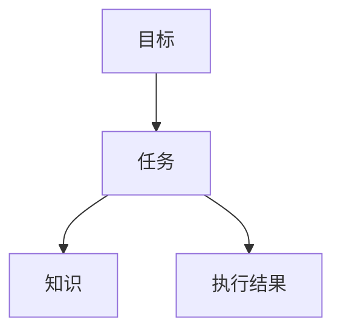
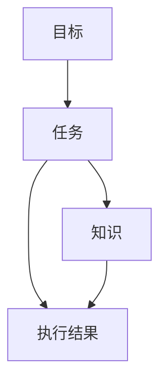
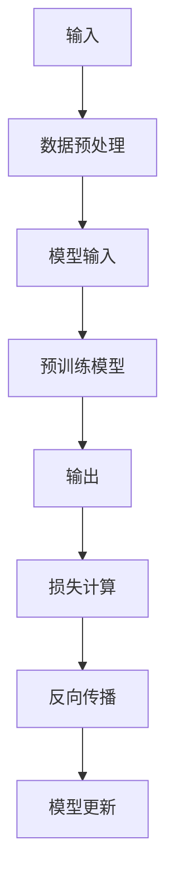
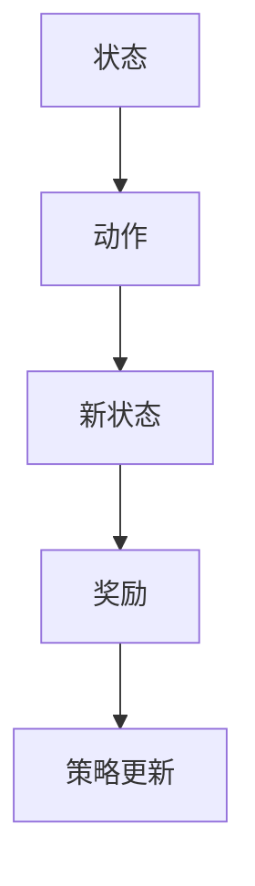
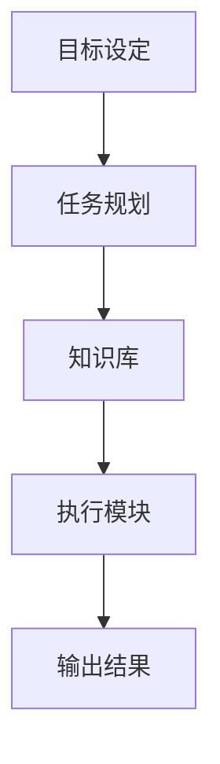
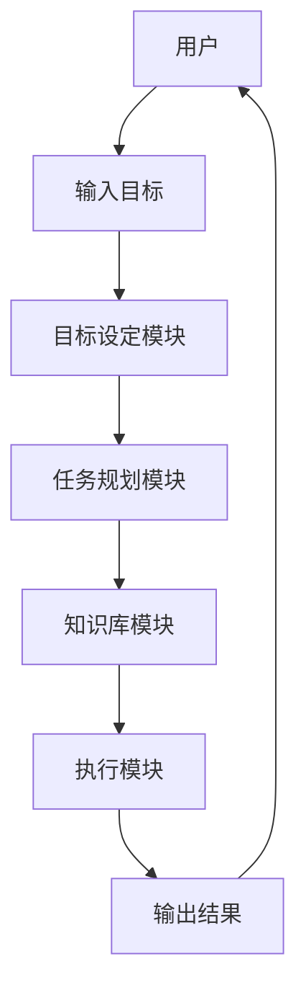

                 


# 任务导向型 AI Agent：基于 LLM 的目标完成系统

## 关键词：
任务导向型 AI Agent, 大语言模型, 目标完成系统, 人工智能, 监督微调, 强化学习

## 摘要：
本文探讨了任务导向型 AI Agent 的核心概念、算法原理及系统架构。通过分析任务导向型 AI Agent 的定义、核心特点及应用场景，结合大语言模型（LLM）的训练方法，深入讲解了其在目标完成系统中的实现过程。文章还通过实际案例展示了系统设计与实现，为读者提供了一种基于 LLM 的任务导向型 AI Agent 的完整解决方案。

---

# 第1章：任务导向型 AI Agent 的概述

## 1.1 任务导向型 AI Agent 的定义与核心特点

任务导向型 AI Agent 是一种基于大语言模型（LLM）的智能系统，旨在通过理解和执行特定任务来实现目标。其核心特点包括：

1. **目标导向性**：以明确的目标为导向，能够分解任务并制定执行计划。
2. **语言模型驱动**：依赖于大语言模型进行理解和生成，具备强大的自然语言处理能力。
3. **适应性**：能够根据任务需求动态调整策略，适应不同场景。
4. **可解释性**：通过语言模型的推理过程，提供可解释的决策依据。

## 1.2 任务导向型 AI Agent 的应用背景

随着 AI 技术的快速发展，任务导向型 AI Agent 在多个领域展现出重要价值，包括：

- **自然语言处理**：通过语言模型实现对话交互和文本生成。
- **自动化任务处理**：在客服、物流等领域实现自动化操作。
- **人机协作**：辅助人类完成复杂任务，提升效率。

## 1.3 任务导向型 AI Agent 的目标与价值

任务导向型 AI Agent 的目标是通过理解和执行任务，实现特定目标。其核心价值体现在以下几个方面：

- **提升效率**：通过自动化处理任务，节省时间和资源。
- **增强决策能力**：利用语言模型的推理能力，提供更优的决策支持。
- **人机协作**：通过与人类协同工作，提升整体工作效率。

---

# 第2章：任务导向型 AI Agent 的核心概念

## 2.1 任务导向型 AI Agent 的核心要素

任务导向型 AI Agent 的核心要素包括：

1. **目标设定**：明确任务目标并进行分解。
2. **任务规划**：制定任务执行的策略和步骤。
3. **知识表示**：通过知识图谱或其他结构化形式表示任务相关知识。
4. **推理与执行**：基于语言模型进行推理，并执行具体操作。

## 2.2 任务导向型 AI Agent 的概念结构

任务导向型 AI Agent 的概念结构可以表示为一个实体关系图，其中核心实体包括：

- **目标**：任务的最终目标。
- **任务**：具体的操作步骤。
- **知识**：任务相关的背景知识。
- **执行结果**：任务执行后的输出。

以下是一个简化的实体关系图：



## 2.3 任务导向型 AI Agent 的实体关系图

任务导向型 AI Agent 的实体关系图展示了各核心要素之间的关系：



---

# 第3章：任务导向型 AI Agent 的算法原理

## 3.1 任务导向型 AI Agent 的算法原理

任务导向型 AI Agent 的实现依赖于大语言模型的训练和优化。以下是其实现过程中的关键算法：

1. **监督微调**：在预训练模型的基础上，通过监督学习任务数据进行微调。
2. **强化学习**：通过强化学习优化模型的策略，使其在任务执行中获得更高的奖励。

## 3.2 监督微调的实现

以下是监督微调的流程：



以下是监督微调的代码示例：

```python
def supervised_fine_tuning(model, optimizer, criterion, train_loader, epochs):
    for epoch in range(epochs):
        for inputs, labels in train_loader:
            outputs = model(inputs)
            loss = criterion(outputs, labels)
            loss.backward()
            optimizer.step()
            optimizer.zero_grad()
    return model
```

## 3.3 强化学习的实现

强化学习的过程如下：



以下是强化学习的代码示例：

```python
def reinforce_learning(policy_network, optimizer, env, episodes):
    for episode in range(episodes):
        state = env.reset()
        reward_sum = 0
        while True:
            action = policy_network.act(state)
            next_state, reward, done, _ = env.step(action)
            policy_network.reinforce(state, action, reward)
            state = next_state
            reward_sum += reward
            if done:
                break
    return policy_network
```

---

# 第4章：任务导向型 AI Agent 的系统架构

## 4.1 系统功能设计

任务导向型 AI Agent 的系统功能设计包括：

1. **目标设定模块**：接收任务目标并进行分解。
2. **任务规划模块**：制定任务执行的策略。
3. **知识库模块**：存储与任务相关的知识。
4. **执行模块**：根据规划执行具体任务。

## 4.2 系统架构设计

以下是系统的架构图：



## 4.3 系统接口设计

系统接口设计包括：

1. **目标输入接口**：接收任务目标。
2. **任务执行接口**：调用执行模块执行任务。
3. **结果输出接口**：返回任务执行结果。

## 4.4 系统交互流程

以下是系统交互流程图：



---

# 第5章：任务导向型 AI Agent 的项目实战

## 5.1 环境安装

以下是项目所需的环境安装步骤：

```bash
pip install transformers torch
```

## 5.2 核心功能实现

以下是任务导向型 AI Agent 的核心功能实现代码：

```python
class TaskAgent:
    def __init__(self, model):
        self.model = model

    def set_goal(self, goal):
        self.goal = goal

    def plan_task(self):
        # 根据目标生成任务计划
        pass

    def execute_task(self):
        # 根据任务计划执行任务
        pass
```

## 5.3 代码应用解读与分析

以下是对代码的解读与分析：

- **TaskAgent 类**：实现了任务导向型 AI Agent 的核心功能。
- **set_goal 方法**：设置任务目标。
- **plan_task 方法**：根据目标生成任务计划。
- **execute_task 方法**：根据任务计划执行任务。

## 5.4 实际案例分析

以下是实际案例分析：

假设目标是“完成报告撰写”，任务导向型 AI Agent 可以分解任务并执行：

1. **收集资料**：从知识库中查找相关资料。
2. **撰写大纲**：根据资料生成报告大纲。
3. **撰写内容**：根据大纲撰写报告内容。
4. **校对与修改**：检查报告并进行修改。

---

# 第6章：任务导向型 AI Agent 的高级主题与最佳实践

## 6.1 当前研究热点

当前任务导向型 AI Agent 的研究热点包括：

- **多任务学习**：同时处理多个任务。
- **实时反馈机制**：基于实时数据进行任务调整。
- **跨模态交互**：结合视觉、听觉等多种模态信息。

## 6.2 最佳实践

以下是任务导向型 AI Agent 实践中的注意事项：

1. **数据质量**：确保训练数据的质量和多样性。
2. **模型选择**：根据任务需求选择合适的模型。
3. **性能优化**：通过优化算法和硬件配置提升性能。

## 6.3 拓展阅读

推荐的拓展阅读资料包括：

- 《Large Language Models for Task-Oriented Dialogue》
- 《A Survey of Task-Oriented Dialog Systems》

---

# 作者：AI天才研究院/AI Genius Institute & 禅与计算机程序设计艺术 /Zen And The Art of Computer Programming

---

以上就是《任务导向型 AI Agent：基于 LLM 的目标完成系统》的完整目录和内容概览。

