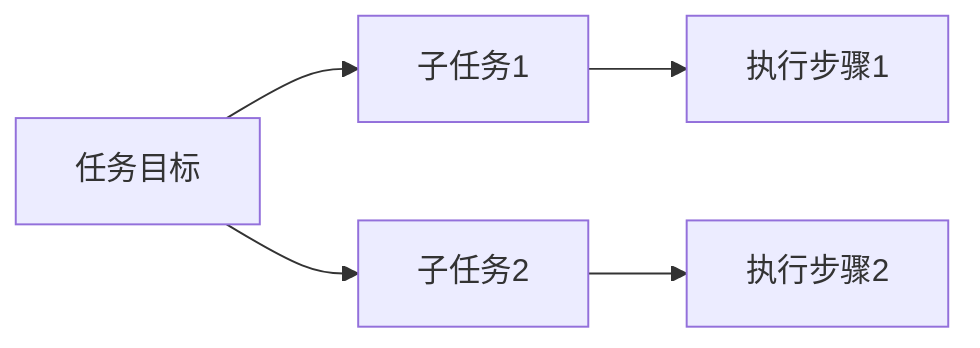
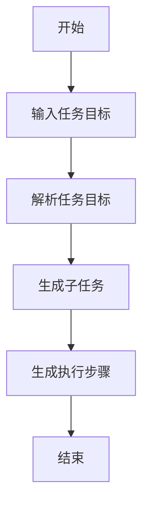
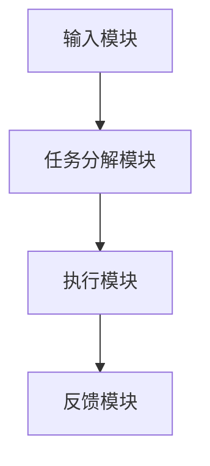
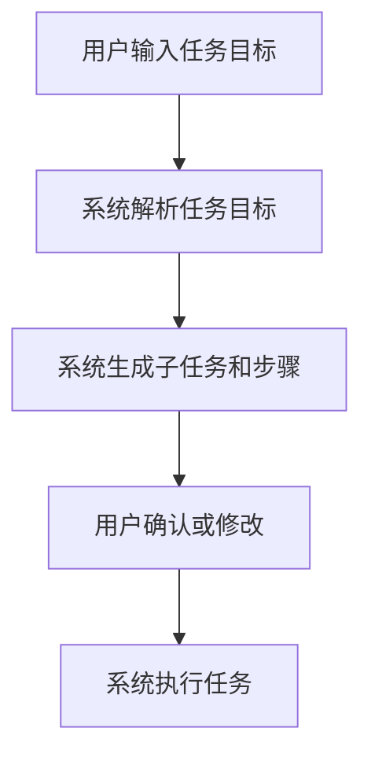

                 


# 任务规划AI Agent：利用LLM进行复杂任务分解

> 关键词：任务规划AI Agent, 大型语言模型, 复杂任务分解, 自然语言处理, 系统架构设计

> 摘要：本文将详细探讨任务规划AI Agent的构建与应用，利用大型语言模型（LLM）进行复杂任务的分解与执行。通过分析任务规划的核心概念、算法原理和系统架构设计，结合实际案例，展示LLM在任务规划中的强大能力。

---

## 第一部分：任务规划AI Agent的背景与概念

### 第1章：任务规划的基本概念

#### 1.1 任务规划的定义与重要性

任务规划是人工智能领域中的一个核心问题，涉及将复杂任务分解为可执行的子任务，并确定执行这些子任务的顺序和方式。任务规划的重要性在于它能够提高任务执行的效率和准确性，尤其是在处理复杂场景时。

- **任务规划的定义**：任务规划是指将目标分解为一系列子任务，并规划这些子任务的执行顺序和方式，以实现最终目标。
- **任务规划的重要性**：在复杂场景中，任务规划能够提高任务执行的效率和准确性，帮助系统更好地应对不确定性。

#### 1.2 传统任务规划方法的局限性

传统任务规划方法在处理复杂任务时存在诸多挑战，主要表现在以下几个方面：

- **任务分解的复杂性**：传统方法难以处理高度动态和不确定的环境，任务分解的粒度难以掌握。
- **计算资源的限制**：传统任务规划方法通常依赖于规则和逻辑推理，计算资源消耗较高。

#### 1.3 引入LLM的优势

引入大型语言模型（LLM）能够显著提升任务规划的能力：

- **自然语言处理能力**：LLM能够理解自然语言输入，准确解析任务需求。
- **动态调整能力**：LLM可以根据反馈动态调整执行策略，适应变化的环境。

---

## 第二部分：LLM在任务规划中的核心概念与联系

### 第2章：LLM的基本原理

#### 2.1 LLM

大型语言模型（LLM）通过大规模数据训练，能够理解和生成自然语言文本。其核心在于其强大的上下文理解和生成能力，这使得LLM能够辅助任务规划。

- **LLM的训练过程**：通过监督学习和强化学习，LLM能够从大量数据中学习语言模式。
- **LLM的应用场景**：LLM广泛应用于自然语言处理、对话生成等领域，任务规划是其重要应用之一。

#### 2.2 任务分解的步骤

任务分解是任务规划的关键步骤，包括以下步骤：

1. **理解任务目标**：通过LLM解析任务目标，明确任务的需求和约束。
2. **生成子任务**：将复杂任务分解为多个子任务，每个子任务具有明确的目标和执行步骤。

#### 2.3 实体关系图和流程图

以下是任务分解的实体关系图和流程图：



---

## 第三部分：算法原理

### 第3章：任务分解算法

#### 3.1 分解方法

任务分解算法通常包括以下步骤：

1. **输入解析**：将任务目标输入LLM进行解析。
2. **生成子任务**：基于解析结果，生成子任务列表。
3. **步骤生成**：为每个子任务生成具体的执行步骤。

以下是一个简单的任务分解算法流程图：



#### 3.2 自然语言处理

LLM通过自然语言处理技术解析任务目标，生成子任务和执行步骤。例如，输入任务目标“安排明天的会议”，LLM会生成子任务如“确定参会人员”、“选择会议时间”等。

#### 3.3 逻辑推理

逻辑推理是任务分解的重要环节，LLM能够根据任务目标和约束条件生成合理的执行步骤。例如，如果任务目标是“安排明天的会议”，LLM会考虑参会人员的可用时间，生成合理的会议时间安排。

---

## 第四部分：系统架构设计

### 第4章：系统架构

#### 4.1 系统架构设计

任务规划AI Agent的系统架构通常包括以下几个部分：

- **输入模块**：接收任务目标输入。
- **任务分解模块**：将任务目标分解为子任务和执行步骤。
- **执行模块**：根据分解后的步骤执行任务。
- **反馈模块**：收集执行结果并提供反馈。

系统架构图如下：



#### 4.2 接口设计

系统接口设计包括：

- **输入接口**：接收任务目标。
- **输出接口**：返回任务分解结果和执行步骤。

#### 4.3 交互流程

交互流程如下：

1. 用户输入任务目标。
2. 系统解析任务目标。
3. 系统生成子任务和执行步骤。
4. 用户确认或修改执行步骤。
5. 系统执行任务。

交互流程图如下：



---

## 第五部分：项目实战

### 第5章：实战项目

#### 5.1 环境安装

需要安装以下工具和库：

- Python 3.x
- LLM模型（如GPT-3）
- NLP库（如spaCy）

#### 5.2 核心代码实现

以下是一个简单的任务分解代码示例：

```python
import openai

def decompose_task(task):
    # 初始化LLM模型
    client = openai.Client()
    # 提交分解任务请求
    response = client.chat.completions.create(
        model="gpt-3.5-turbo",
        messages=[{
            "role": "user",
            "content": f"Decompose the task: {task}."
        }]
    )
    return response.choices[0].message['content']

# 示例：分解任务“安排明天的会议”
task = "安排明天的会议"
result = decompose_task(task)
print(result)
```

#### 5.3 案例分析

以“安排明天的会议”为例，LLM会生成以下子任务和执行步骤：

1. 确定参会人员。
2. 确定会议时间。
3. 发送会议提醒。

---

## 第六部分：总结与展望

### 第6章：总结

#### 6.1 小结

任务规划AI Agent通过利用LLM进行复杂任务分解，显著提升了任务执行的效率和准确性。本文详细探讨了任务规划的核心概念、算法原理和系统架构设计，并通过实际案例展示了LLM的应用。

#### 6.2 注意事项

- 确保LLM模型的准确性和可靠性。
- 在实际应用中，需考虑任务的动态性和不确定性。

#### 6.3 未来展望

随着LLM技术的不断进步，任务规划AI Agent将在更多领域得到广泛应用。未来的研究方向包括提高任务分解的准确性、优化执行效率等。

---

## 作者

作者：AI天才研究院/AI Genius Institute & 禅与计算机程序设计艺术 /Zen And The Art of Computer Programming

