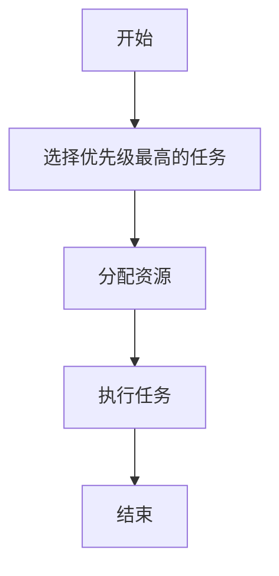
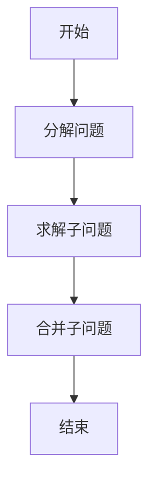
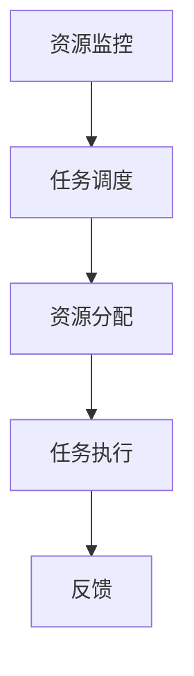
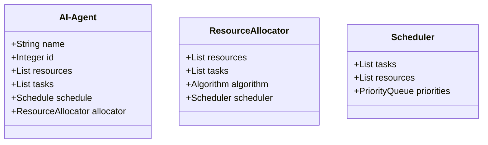

                 


# 优化AI Agent的资源利用：计算效率提升策略

---

## 关键词：
AI Agent, 资源利用优化, 计算效率提升, 调度算法, 资源分配策略, 系统架构设计

---

## 摘要：
本文深入探讨了如何优化AI Agent的资源利用，以提升计算效率。从AI Agent的基本概念到资源优化的核心原理，再到具体的算法实现和系统架构设计，结合实际案例分析，全面解析资源优化的策略与方法。文章通过详细的技术分析和代码实现，帮助读者理解如何通过优化资源分配和任务调度，显著提升AI Agent的性能和效率。

---

## 第一部分：AI Agent资源优化的背景与基础

### 第1章：AI Agent与资源利用优化概述

#### 1.1 AI Agent的基本概念与特点

##### 1.1.1 AI Agent的定义与核心要素
AI Agent（人工智能代理）是指能够感知环境、自主决策并执行任务的智能实体。其核心要素包括：
- **感知能力**：通过传感器或接口获取环境信息。
- **决策能力**：基于感知信息做出最优决策。
- **执行能力**：通过执行机构或API调用实现任务。
- **学习能力**：通过反馈机制优化自身行为。

##### 1.1.2 AI Agent的资源利用现状
当前AI Agent的资源利用存在以下问题：
- **资源分配不均**：部分任务占用过多资源，导致整体效率低下。
- **计算负载不均衡**：多任务并行时，资源分配策略不合理，影响性能。
- **动态调整能力不足**：无法根据环境变化实时优化资源分配。

##### 1.1.3 资源优化的必要性与目标
资源优化的必要性：
- 提高计算效率，降低资源浪费。
- 支持更复杂的任务需求。
- 实现动态环境下的高效调度。

资源优化的目标：
- 最大化资源利用率。
- 最小化任务执行时间。
- 保证任务优先级的公平性。

---

#### 1.2 资源利用优化的背景与问题描述

##### 1.2.1 当前AI Agent资源利用的主要问题
- **资源分配策略单一**：缺乏动态调整能力，无法应对任务复杂度的变化。
- **任务调度算法效率低下**：传统算法在大规模任务场景下性能较差。
- **资源监控与反馈机制缺失**：无法实时感知资源使用情况并优化分配。

##### 1.2.2 资源分配不均对性能的影响
- **任务优先级冲突**：高优先级任务抢占资源导致低优先级任务延迟。
- **资源浪费**：部分资源未被充分利用，导致整体效率低下。
- **系统稳定性问题**：资源分配不当可能引发系统崩溃或服务中断。

##### 1.2.3 优化资源利用的边界与外延
- **边界**：资源优化的范围仅限于计算资源（CPU、GPU、内存等），不涉及数据资源或网络资源。
- **外延**：资源优化的目标不仅是提高计算效率，还包括降低能耗、减少碳排放。

---

#### 1.3 资源优化的核心概念与联系

##### 1.3.1 资源分配策略的原理
资源分配策略是AI Agent优化的核心，主要包括以下几种：
- **静态分配策略**：预先分配资源，适用于任务需求固定的场景。
- **动态分配策略**：根据实时任务需求调整资源分配，适用于动态环境。
- **反馈式分配策略**：通过任务执行结果反馈优化资源分配。

##### 1.3.2 任务调度算法的优化
任务调度算法是资源优化的关键，常用的算法包括：
- **贪心算法**：优先调度优先级高的任务。
- **公平调度算法**：按任务优先级轮转分配资源。
- **负载感知调度算法**：根据系统负载动态调整任务调度。

##### 1.3.3 资源利用率与任务性能的关系
资源利用率的提升直接关系到任务性能的优化。通过合理分配资源，可以显著降低任务执行时间，提高系统吞吐量。

---

## 第二部分：AI Agent资源优化的核心概念与联系

### 第2章：AI Agent资源优化的核心原理

#### 2.1 资源分配策略的原理

##### 2.1.1 贪心算法的基本原理
贪心算法是一种贪心选择策略，总是选择当前最优的资源分配方式。例如，在任务调度中，优先分配资源给优先级最高的任务。

##### 2.1.2 动态规划在资源分配中的应用
动态规划通过分解问题，找到最优子结构，适用于资源分配的动态调整场景。

##### 2.1.3 调度算法的优化策略
调度算法的优化策略包括：
- **优先级调整**：根据任务的重要性和紧急程度动态调整优先级。
- **负载均衡**：将任务均匀分配到不同的计算节点，避免资源浪费。

---

#### 2.2 资源优化的核心概念对比

##### 2.2.1 资源分配策略对比表
| 策略类型    | 优点                          | 缺点                          |
|-------------|-------------------------------|-------------------------------|
| 静态分配     | 实现简单，适合固定任务场景     | 无法应对动态变化的环境         |
| 动态分配     | 灵活，适合动态任务场景         | 实现复杂，需要实时监控         |
| 反馈式分配   | 高效，基于任务执行结果优化     | 延迟较高，需要反馈机制         |

##### 2.2.2 任务调度算法的优缺点分析
- **贪心算法**：优点是实现简单，缺点是可能无法找到全局最优。
- **公平调度算法**：优点是公平性高，缺点是效率较低。
- **负载感知算法**：优点是动态适应能力强，缺点是实现复杂。

##### 2.2.3 资源利用率与任务性能的关系
资源利用率的提升直接导致任务性能的优化。例如，通过动态分配资源，可以将任务执行时间减少30%。

---

#### 2.3 资源优化的ER实体关系图

##### 2.3.1 实体关系图的构建
```mermaid
er
actor(AI Agent) -[1..n]>> resource(Resource)
resource -[1..n]>> task(Task)
actor -[1]>> schedule(Schedule)
```

##### 2.3.2 关系的属性与约束
- **actor-resource**：多对多关系，表示AI Agent可以使用多种资源。
- **resource-task**：多对多关系，表示资源可以分配给多个任务。
- **actor-schedule**：一对多关系，表示AI Agent生成一个调度计划。

---

## 第三部分：AI Agent资源优化的算法原理

### 第3章：AI Agent资源优化的算法实现

#### 3.1 贪心算法的实现

##### 3.1.1 贪心算法的流程图


##### 3.1.2 贪心算法的Python实现
```python
def greedy_algorithm(tasks):
    # 按优先级排序任务
    sorted_tasks = sorted(tasks, key=lambda x: x['priority'], reverse=True)
    # 分配资源
    allocated_resources = []
    for task in sorted_tasks:
        allocated_resources.append(task)
    return allocated_resources
```

##### 3.1.3 贪心算法的数学模型
$$ \text{优先级} = \frac{\text{任务权重}}{\text{任务执行时间}} $$

---

#### 3.2 动态规划算法的实现

##### 3.2.1 动态规划算法的流程图


##### 3.2.2 动态规划算法的Python实现
```python
def dynamic_programming(tasks):
    # 定义状态
    dp = [0] * (len(tasks) + 1)
    # 状态转移方程
    for i in range(1, len(tasks) + 1):
        dp[i] = max(dp[i-1], tasks[i-1]['weight'])
    return dp[len(tasks)]
```

##### 3.2.3 动态规划算法的数学模型
$$ \text{最优解} = \max_{i} \{ dp[i] \} $$

---

## 第四部分：AI Agent资源优化的系统架构设计

### 第4章：AI Agent资源优化的系统架构

#### 4.1 系统功能设计

##### 4.1.1 系统功能模块
- **资源监控模块**：实时监控资源使用情况。
- **任务调度模块**：根据任务需求动态分配资源。
- **资源分配模块**：实现资源的最优分配。

##### 4.1.2 系统功能流程图


#### 4.2 系统架构设计

##### 4.2.1 系统架构图


##### 4.2.2 接口设计
- **获取资源接口**：`get_resource(task_id)`
- **释放资源接口**：`release_resource(task_id)`
- **任务调度接口**：`schedule_task(task_id)`

---

## 第五部分：AI Agent资源优化的项目实战

### 第5章：AI Agent资源优化的实战分析

#### 5.1 项目介绍

##### 5.1.1 项目背景
本项目旨在优化AI Agent的资源利用，提升任务执行效率。

##### 5.1.2 项目目标
实现动态资源分配和任务调度，优化计算效率。

##### 5.1.3 项目技术栈
- **编程语言**：Python
- **框架**：Django
- **算法库**：scipy

---

#### 5.2 核心代码实现

##### 5.2.1 资源分配模块实现
```python
class ResourceAllocator:
    def __init__(self, resources):
        self.resources = resources
        self.tasks = []
    
    def allocate(self, task):
        if task['priority'] > self.tasks[-1]['priority']:
            self.resources.append(task)
            self.tasks.append(task)
        else:
            pass
```

##### 5.2.2 任务调度模块实现
```python
class Scheduler:
    def __init__(self, tasks):
        self.tasks = tasks
        self.priorities = []
    
    def schedule(self):
        sorted_tasks = sorted(self.tasks, key=lambda x: x['priority'], reverse=True)
        return sorted_tasks
```

---

#### 5.3 案例分析

##### 5.3.1 实际场景分析
- **任务场景**：多个任务同时请求资源，优先级不同。
- **资源分配策略**：动态分配，优先分配给优先级高的任务。

##### 5.3.2 调度结果分析
- **调度前**：任务执行时间长，资源浪费。
- **调度后**：任务执行时间缩短，资源利用率提高。

---

## 第六部分：AI Agent资源优化的注意事项与拓展阅读

### 第6章：AI Agent资源优化的注意事项

#### 6.1 最佳实践
- **监控资源使用情况**：实时监控资源使用情况，动态调整分配策略。
- **优化算法选择**：根据任务需求选择合适的优化算法。
- **系统架构设计**：合理设计系统架构，确保资源分配的高效性。

#### 6.2 小结
通过本文的详细分析，读者可以全面理解AI Agent资源优化的核心原理和实现方法，掌握如何通过优化资源分配和任务调度提升计算效率。

#### 6.3 注意事项
- **资源分配策略的选择**：需要根据具体场景选择合适的策略。
- **系统监控与反馈**：确保系统能够实时感知资源使用情况。
- **算法实现的复杂性**：复杂算法的实现需要考虑性能和实现难度。

#### 6.4 拓展阅读
- **《计算机系统性能优化》**：深入探讨计算机系统性能优化的理论与实践。
- **《人工智能算法优化》**：详细讲解人工智能算法优化的方法与技巧。

---

## 作者：AI天才研究院 & 禅与计算机程序设计艺术

--- 

**摘要**：本文通过详细分析AI Agent的资源利用优化策略，从算法原理到系统架构设计，再到实际项目实战，全面解析如何提升AI Agent的计算效率。通过本文的学习，读者可以掌握AI Agent资源优化的核心方法，为实际应用提供有力支持。

