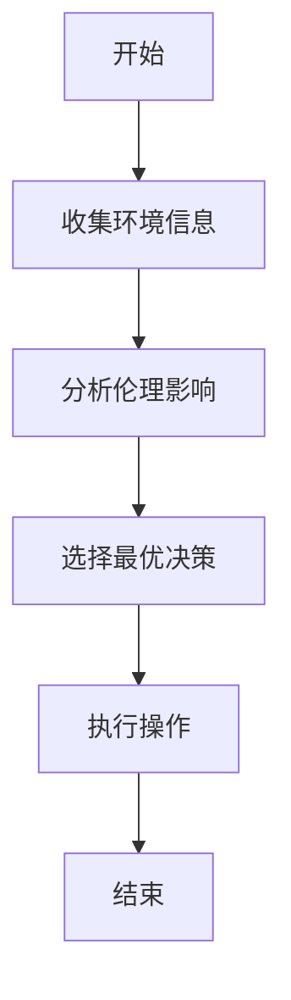
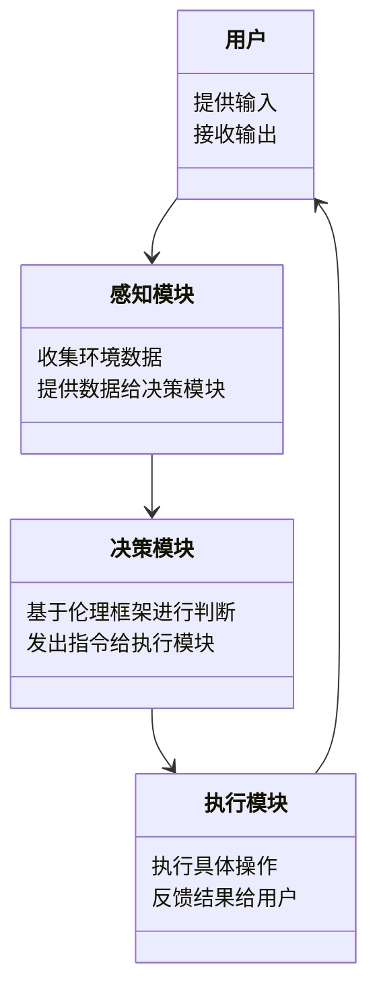

                 


# 伦理设计：构建负责任的AI Agent

> 关键词：伦理设计，AI Agent，责任制，人工智能，伦理框架，系统架构

> 摘要：随着人工智能技术的快速发展，AI Agent在各个领域的应用越来越广泛。然而，AI Agent的伦理设计和责任制问题也随之浮现。本文将详细探讨如何构建负责任的AI Agent，从背景介绍、核心概念、算法原理、系统架构到项目实战，层层深入，帮助读者全面理解并掌握这一重要课题。

---

## 目录

1. **背景介绍**  
   1.1 AI Agent的基本概念  
   1.2 伦理在AI设计中的重要性  
   1.3 负责制AI Agent的背景与现状  

2. **核心概念与联系**  
   2.1 负责制AI Agent的结构与功能  
   2.2 负责制AI Agent的伦理框架  
   2.3 负责制AI Agent的责任分配  

3. **核心概念原理**  
   3.1 负责制AI Agent的伦理决策机制  
   3.2 责任制AI Agent的伦理框架属性特征对比  
   3.3 负责制AI Agent的ER实体关系图  

4. **算法原理讲解**  
   4.1 负责制AI Agent的伦理决策算法  
   4.2 伦理决策的数学模型与公式  
   4.3 伦理决策的实现方式  

5. **系统架构设计**  
   5.1 系统功能设计  
   5.2 系统架构设计图  
   5.3 系统接口与交互设计  

6. **项目实战**  
   6.1 环境安装与配置  
   6.2 核心算法实现  
   6.3 案例分析与解读  

7. **最佳实践与未来展望**  
   7.1 小结  
   7.2 注意事项与建议  
   7.3 拓展阅读与未来趋势  

---

## 正文

### 1. 背景介绍

#### 1.1 AI Agent的基本概念
AI Agent（人工智能代理）是指能够感知环境、自主决策并执行任务的智能体。它可以分为弱AI Agent和强AI Agent，前者专注于特定任务（如语音助手），后者具备与人类相当的通用智能。

#### 1.2 伦理在AI设计中的重要性
随着AI Agent的广泛应用，伦理问题日益凸显。例如，自动驾驶汽车在紧急情况下的决策可能涉及生命伦理。伦理设计确保AI Agent在决策过程中符合道德规范，避免对人类造成伤害或利益损失。

#### 1.3 负责制AI Agent的背景与现状
责任制AI Agent是指在决策过程中明确责任归属，确保出现问题时能够追溯并解决问题。当前，许多AI系统已经开始注重伦理设计，但仍面临技术与法律上的挑战。

---

### 2. 核心概念与联系

#### 2.1 负责制AI Agent的结构与功能
责任制AI Agent的结构包括感知模块、决策模块和执行模块。感知模块负责收集环境信息，决策模块基于伦理框架进行判断，执行模块则执行具体操作。

#### 2.2 负责制AI Agent的伦理框架
伦理框架是责任制AI Agent的核心，通常包括功利主义、义务论和公正理论。每个框架都有其优缺点，实际应用中需要根据场景选择合适的伦理框架。

#### 2.3 负责制AI Agent的责任分配
责任分配涉及明确每个模块在决策中的责任。例如，在自动驾驶中，传感器故障可能导致事故，责任可能在制造商或用户之间分配。

---

### 3. 核心概念原理

#### 3.1 负责制AI Agent的伦理决策机制
伦理决策机制通过多因素分析，权衡不同选项的伦理影响。例如，使用概率论模型计算每个决策的伦理风险。

#### 3.2 责任制AI Agent的伦理框架属性特征对比
通过对比不同伦理框架的特征，可以选择最适合当前场景的框架。例如，义务论注重行为的义务性，而功利主义注重结果的优化。

#### 3.3 负责制AI Agent的ER实体关系图
ER实体关系图展示了责任制AI Agent中的实体及其关系。例如，决策模块与感知模块之间的依赖关系。

```mermaid
er
    actor: 用户
    module: 模块
    decision: 决策
    action: 行动
    relationship: 关系
    user --> module: 传递信息
    module --> decision: 进行判断
    decision --> action: 执行操作
```

---

### 4. 算法原理讲解

#### 4.1 负责制AI Agent的伦理决策算法
伦理决策算法通过分析环境信息，选择最优决策。例如，使用逻辑推理模型进行伦理判断。



#### 4.2 伦理决策的数学模型与公式
伦理决策可以通过数学公式表示，例如：

$$
\text{伦理风险} = \sum_{i=1}^{n} p_i \times r_i
$$

其中，$p_i$ 是风险发生的概率，$r_i$ 是风险的影响程度。

#### 4.3 伦理决策的实现方式
伦理决策可以通过预设规则或机器学习模型实现。例如，使用逻辑回归模型预测伦理风险。

---

### 5. 系统架构设计

#### 5.1 系统功能设计
系统功能包括数据采集、伦理判断、决策执行和结果反馈。例如，自动驾驶汽车需要实时采集路况信息，进行伦理判断后执行转向或刹车操作。

#### 5.2 系统架构设计图
系统架构设计图展示了各个模块之间的关系。



#### 5.3 系统接口与交互设计
系统接口设计包括输入接口、输出接口和反馈接口。例如，自动驾驶汽车的传感器接口和用户交互界面。

---

### 6. 项目实战

#### 6.1 环境安装与配置
安装必要的开发工具和库，例如Python、TensorFlow和Scikit-learn。

#### 6.2 核心算法实现
实现伦理决策算法，例如：

```python
def ethical_decision(ethics_frame, data):
    # 基于伦理框架进行判断
    if ethics_frame == 'utilitarian':
        return utilitarian_decision(data)
    elif ethics_frame == 'deontological':
        return deontological_decision(data)
    else:
        return default_decision(data)
```

#### 6.3 案例分析与解读
通过具体案例分析，例如自动驾驶中的伦理决策，展示如何在实际项目中应用伦理设计。

---

### 7. 最佳实践与未来展望

#### 7.1 小结
本文详细探讨了如何构建负责任的AI Agent，从背景、核心概念到算法实现，为读者提供了全面的指导。

#### 7.2 注意事项与建议
在实际应用中，需注意伦理框架的选择和责任分配的明确性，确保AI Agent的决策符合伦理规范。

#### 7.3 拓展阅读与未来趋势
未来，AI Agent的伦理设计将更加重要，建议读者进一步研究相关领域的最新进展。

---

## 作者

作者：AI天才研究院/AI Genius Institute & 禅与计算机程序设计艺术 /Zen And The Art of Computer Programming

---

通过以上目录和正文内容，您可以开始撰写完整的文章。每一部分都需要详细展开，结合具体案例、数学公式和代码示例，确保内容丰富且易于理解。

