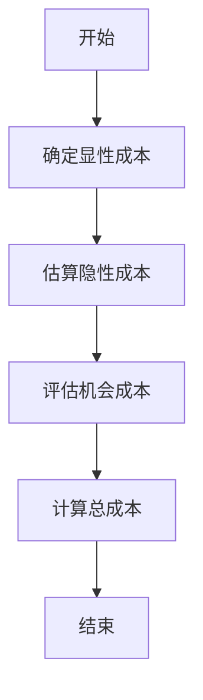
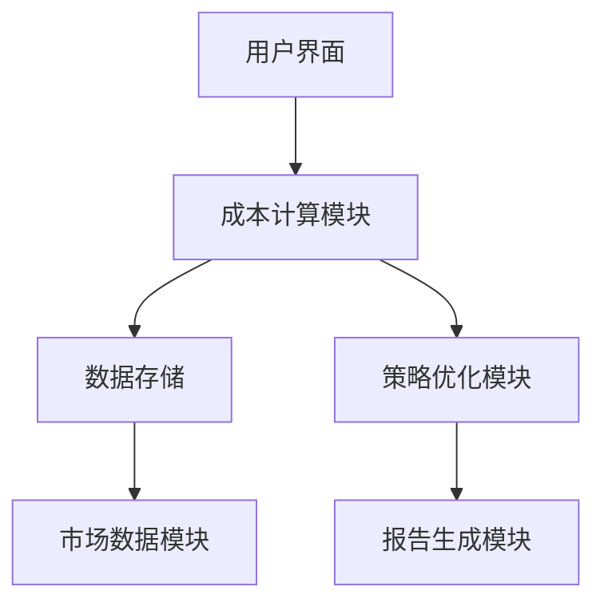
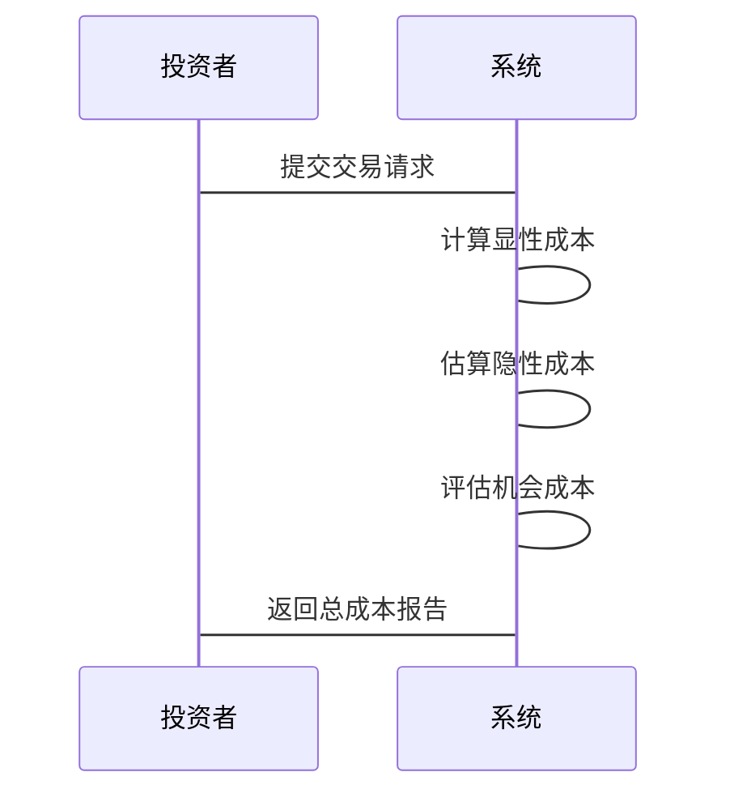

                 


# 伯格的成本意识：在零佣金交易时代的重新定义

## 关键词：
零佣金交易、投资成本、伯格的成本意识、隐性成本、显性成本、成本优化算法、系统架构设计

## 摘要：
在零佣金交易时代，传统佣金模式的转变引发了投资成本意识的重新定义。伯格的成本意识理论在此背景下提出了新的视角，强调隐性成本的重要性。本文通过分析成本意识的核心概念、算法原理、系统架构设计以及实战案例，探讨在零佣金环境下如何优化投资成本，实现收益最大化。

---

## 第一部分: 背景介绍

### 第1章: 零佣金交易时代的投资成本新思维

#### 1.1 零佣金交易的兴起与影响
- **1.1.1 零佣金交易的定义与背景**
  - 零佣金交易是指投资者在买卖股票时无需支付佣金，由平台或券商承担交易费用。
  - 随着互联网技术和金融创新的发展，零佣金交易逐渐普及，降低了投资者的显性成本。

- **1.1.2 零佣金交易对传统佣金模式的冲击**
  - 传统佣金模式依赖于交易手续费，而零佣金模式通过其他方式（如订单流、高频交易）获取收入。
  - 零佣金模式改变了投资者的交易习惯，增加了交易频率，但隐性成本上升。

- **1.1.3 成本意识的重要性**
  - 投资者在零佣金环境下更需关注隐性成本，如买卖价差、市场冲击、机会成本等。
  - 成本意识的重新定义帮助投资者在零佣金时代做出更明智的投资决策。

#### 1.2 伯格的成本意识理论
- **1.2.1 成本意识的核心概念**
  - 成本意识是指投资者对投资过程中所有成本的识别、评估和优化的全过程。
  - 伯格提出，成本意识不仅是显性成本的考量，还涉及隐性成本的评估。

- **1.2.2 伯格成本意识的历史发展**
  - 伯格的成本意识理论最初关注显性成本，如交易佣金和管理费用。
  - 零佣金时代的到来促使伯格重新审视成本结构，扩展了成本意识的内涵。

- **1.2.3 零佣金时代成本意识的重新定义**
  - 零佣金环境下，隐性成本成为影响投资回报的关键因素。
  - 成本意识需要从显性成本扩展到隐性成本，包括交易执行成本、信息不对称成本等。

### 第2章: 零佣金交易与投资成本的复杂性

#### 2.1 零佣金交易的表面优势
- **2.1.1 零佣金交易的吸引力**
  - 投资者无需支付交易佣金，降低了直接成本。
  - 适合小额投资者和高频交易者。

- **2.1.2 零佣金交易的潜在劣势**
  - 平台可能通过其他方式收费，如支付订单流。
  - 频繁交易可能导致隐性成本增加，如买卖价差和市场冲击。

- **2.1.3 投资成本的复杂性**
  - 零佣金时代，显性成本降低，但隐性成本上升。
  - 投资者需全面评估成本结构，避免盲目追求低佣金。

#### 2.2 隐性成本的崛起
- **2.2.1 隐性成本的定义与类型**
  - 隐性成本指未直接体现在交易费用中的成本，如买卖价差、市场冲击、机会成本等。
  - 隐性成本难以量化，但对投资回报影响显著。

- **2.2.2 隐性成本在零佣金交易中的体现**
  - 频繁交易导致买卖价差增加。
  - 平台优先处理订单可能引发市场冲击，影响执行价格。

- **2.2.3 隐性成本对投资回报的影响**
  - 隐性成本的累积效应可能导致收益下降。
  - 投资者需优化交易策略，降低隐性成本的影响。

#### 2.3 投资成本的全周期分析
- **2.3.1 投资成本的时间维度**
  - 短期交易成本较高，长期投资成本相对较低。
  - 隐性成本在高频交易中更为显著。

- **2.3.2 成本在投资决策中的权重**
  - 成本是投资决策的重要因素，但需结合收益进行综合评估。
  - 零佣金时代，成本意识的权重进一步提升。

- **2.3.3 成本与收益的动态平衡**
  - 在零佣金环境下，投资者需平衡显性成本和隐性成本，实现收益最大化。
  - 通过优化交易策略和选择合适的平台，降低总体成本。

---

## 第二部分: 成本意识的核心概念与联系

### 第3章: 成本意识的核心要素解析

#### 3.1 成本意识的构成要素
- **3.1.1 显性成本**
  - 显性成本指直接支付的费用，如交易佣金、管理费用等。
  - 零佣金时代，显性成本接近于零，但隐性成本增加。

- **3.1.2 隐性成本**
  - 隐性成本指未直接体现在交易费用中的成本，如买卖价差、市场冲击、机会成本等。
  - 隐性成本在零佣金交易中变得尤为重要。

- **3.1.3 机会成本**
  - 机会成本是指由于选择某项投资而放弃其他投资机会的成本。
  - 在零佣金环境下，投资者需权衡不同投资机会的成本和收益。

#### 3.2 成本意识的属性特征对比
- **3.2.1 显性成本与隐性成本的对比**
  - 显性成本易于量化，隐性成本难以量化。
  - 隐性成本对投资回报的影响更为深远。

- **3.2.2 短期成本与长期成本的对比**
  - 短期成本波动较大，长期成本相对稳定。
  - 长期投资更关注隐性成本的累积效应。

- **3.2.3 直接成本与间接成本的对比**
  - 直接成本指直接支付的费用，间接成本指其他形式的成本。
  - 隐性成本多属于间接成本。

#### 3.3 成本意识的ER实体关系图

```mermaid
er
actor(投资者) --> CostAwareness(成本意识)
CostAwareness --> 显性成本
CostAwareness --> 隐性成本
CostAwareness --> 机会成本
```

---

## 第三部分: 成本计算的算法原理

### 第4章: 成本计算模型的构建

#### 4.1 成本计算的基本原理
- **4.1.1 成本计算的公式**
  $$总成本 = 显性成本 + 隐性成本 + 机会成本$$

#### 4.2 成本计算的步骤
- **4.2.1 确定显性成本**
  - 识别直接支付的费用，如交易佣金、管理费用等。
  - 在零佣金环境下，显性成本接近于零。

- **4.2.2 估算隐性成本**
  - 分析买卖价差、市场冲击、信息不对称等隐性成本。
  - 通过交易频率和规模评估隐性成本。

- **4.2.3 评估机会成本**
  - 考虑由于选择某项投资而放弃其他机会的成本。
  - 通过比较不同投资的收益和成本进行评估。

#### 4.3 成本计算的流程图



### 第5章: 成本优化算法的实现

#### 5.1 成本优化算法概述
- **5.1.1 算法的目标**
  - 通过优化交易策略和选择合适的平台，降低总体成本。
  - 实现成本与收益的动态平衡。

- **5.1.2 算法的输入**
  - 交易数据：包括买入价、卖出价、交易量等。
  - 平台信息：包括平台的交易费用、订单处理速度等。
  - 投资目标：包括投资期限、风险偏好等。

- **5.1.3 算法的输出**
  - 优化后的交易策略。
  - 总体成本的评估报告。

#### 5.2 成本优化算法的实现

```python
import pandas as pd
import numpy as np

def calculate_cost(txn_data):
    # 计算显性成本
    explicit_cost = 0
    for txn in txn_data:
        explicit_cost += txn['commission']
    
    # 估算隐性成本
    implicit_cost = 0
    for txn in txn_data:
        spread = txn['ask'] - txn['bid']
        implicit_cost += spread * txn['quantity']
    
    # 评估机会成本
    opportunity_cost = 0
    for txn in txn_data:
        opportunity_cost += txn['potential_return'] - txn['actual_return']
    
    total_cost = explicit_cost + implicit_cost + opportunity_cost
    return total_cost

# 示例数据
txn_data = [
    {'commission': 0, 'bid': 100, 'ask': 101, 'quantity': 10, 'potential_return': 5, 'actual_return': 3},
    {'commission': 0, 'bid': 105, 'ask': 107, 'quantity': 5, 'potential_return': 4, 'actual_return': 2}
]

total_cost = calculate_cost(txn_data)
print(f"总成本为：{total_cost}")
```

---

## 第四部分: 系统分析与架构设计方案

### 第6章: 系统分析与架构设计

#### 6.1 问题场景介绍
- 投资者需要在零佣金环境下优化交易成本。
- 需要分析显性成本和隐性成本，制定最优交易策略。

#### 6.2 系统功能设计
- **6.2.1 领域模型图**


- **6.2.2 系统架构图**



- **6.2.3 接口设计**
  - API接口：用于获取市场数据和交易记录。
  - 数据格式：JSON或CSV。

- **6.2.4 交互流程**



---

## 第五部分: 项目实战

### 第7章: 项目实战

#### 7.1 环境安装
- 安装Python和相关库（pandas, numpy, matplotlib）。
- 安装Jupyter Notebook用于数据分析和可视化。

#### 7.2 核心代码实现
```python
import pandas as pd
import numpy as np

def calculate_total_cost(transactions):
    explicit_cost = sum(txn['commission'] for txn in transactions)
    implicit_cost = sum((txn['ask'] - txn['bid']) * txn['quantity'] for txn in transactions)
    opportunity_cost = sum((txn['potential_return'] - txn['actual_return']) for txn in transactions)
    return explicit_cost + implicit_cost + opportunity_cost

# 示例数据
transactions = [
    {'commission': 0, 'bid': 100, 'ask': 101, 'quantity': 10, 'potential_return': 5, 'actual_return': 3},
    {'commission': 0, 'bid': 105, 'ask': 107, 'quantity': 5, 'potential_return': 4, 'actual_return': 2}
]

total_cost = calculate_total_cost(transactions)
print(f"总成本为：{total_cost}")
```

#### 7.3 实际案例分析
- **案例1：买入和卖出成本分析**
  - 买入价：100元，卖出价：105元，交易量：10手。
  - 显性成本：0元（零佣金）。
  - 隐性成本：买卖价差为5元，隐性成本为5 * 10 = 50元。
  - 总成本：50元。

- **案例2：长期投资成本优化**
  - 长期投资中，隐性成本较低，显性成本接近于零。
  - 通过分散投资和长期持有，降低隐性成本的影响。

#### 7.4 项目总结
- 通过优化交易策略和选择合适的平台，投资者可以在零佣金环境下降低总体成本。
- 成本意识的重新定义帮助投资者更好地评估隐性成本，实现收益最大化。

---

## 第六部分: 最佳实践与小结

### 第8章: 最佳实践

#### 8.1 小结
- 零佣金时代，成本意识的重新定义至关重要。
- 隐性成本成为影响投资回报的关键因素。
- 投资者需综合考虑显性成本和隐性成本，制定最优交易策略。

#### 8.2 注意事项
- 隐性成本难以量化，需通过数据分析和经验积累。
- 零佣金平台可能存在其他收费方式，需仔细阅读平台协议。
- 频繁交易可能导致隐性成本增加，需权衡交易频率和成本。

#### 8.3 拓展阅读
- 推荐阅读《伯格的投资哲学》深入理解成本意识。
- 参考相关学术论文，了解隐性成本的量化方法。

---

## 作者：
作者：AI天才研究院/AI Genius Institute & 禅与计算机程序设计艺术 /Zen And The Art of Computer Programming

