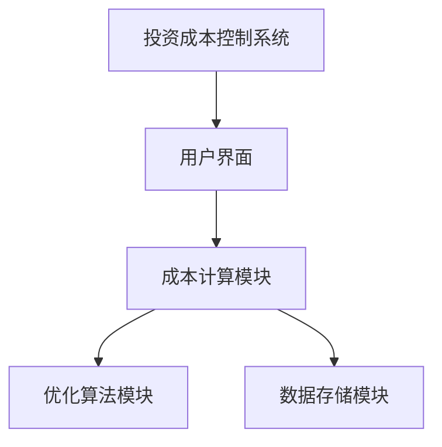

                 


# 伯格的投资成本控制：为什么每个基点都重要

## 关键词：投资成本控制、基点、伯格投资理念、成本优化、投资回报

## 摘要：  
投资成本控制是现代投资管理中的核心问题之一。本文从伯格的投资理念出发，详细分析了投资成本控制的重要性，探讨了每个基点对投资回报的影响。通过理论分析、算法原理和实际案例，本文为投资者提供了如何精确定义和优化投资成本的深度指导。

---

## 第一部分: 投资成本控制的背景与核心概念

### 第1章: 投资成本控制的基本概念

#### 1.1 投资成本控制的定义与内涵
- **投资成本**是指投资者在投资过程中产生的所有费用，包括交易费用、管理费用、税收等。这些成本直接影响投资回报，因此必须精确定义和优化。
- **投资成本控制**是指通过优化投资流程、选择低成本工具和策略，最小化投资成本，从而最大化净投资回报的过程。
- **每个基点的重要性**：在金融投资中，基点（basis point，简称bp）是衡量利率、债券收益率等金融工具的最小单位，通常为1个基点等于0.01%。在长期投资中，每个基点的累积效应可能导致投资回报的显著差异。

#### 1.2 投资成本控制的核心要素
- **成本结构**：包括显性成本（如交易佣金、管理费）和隐性成本（如机会成本、税收）。
- **成本敏感性**：不同资产类别和投资策略的成本敏感性不同，需根据具体情况优化。
- **时间价值**：投资成本的时间价值在长期投资中尤为重要，因为复利效应会放大每个基点的影响。

---

### 第2章: 伯格的投资理念与成本控制

#### 2.1 伯格的投资哲学
- 伯格（Peter Lynch）是著名的投资经理，其投资理念强调长期投资、分散化和选择优质的管理团队。
- 伯格认为，投资成本是影响长期回报的重要因素。低成本策略可以为投资者创造更多的净收益。

#### 2.2 伯格策略中的成本优化
- **选择低成本基金**：伯格建议投资者选择管理费用低、交易费用低的基金。
- **长期持有策略**：长期持有可以减少交易频率，从而降低交易成本。
- **分散化投资**：通过分散化降低风险，同时优化投资组合的成本结构。

---

## 第二部分: 投资成本控制的核心概念与联系

### 第3章: 投资成本的结构与优化策略

#### 3.1 投资成本的结构
| 成本类型 | 描述 | 示例 |
|----------|------|------|
| 交易成本 | 包括买卖证券的佣金、印花税等 | 买入某股票的佣金为$50，卖出佣金为$50 |
| 管理成本 | 基金管理费用、顾问费用 | 基金管理费率为1.5% |
| 时间成本 | 因决策延迟导致的机会成本 | 因等待决策导致的投资机会损失 |

#### 3.2 成本优化策略
- **降低交易成本**：通过批量交易、选择低成本经纪商等方法。
- **优化管理成本**：选择低费率的基金或指数基金。
- **时间成本控制**：通过自动化投资工具减少决策延迟。

---

### 第4章: 成本与回报的量化分析

#### 4.1 成本对投资回报的影响
- **数学模型**：假设投资回报为$R$，投资成本为$C$，则净回报为$R - C$。
- **长期影响**：假设年回报率为$R$，年成本率为$c$，则长期净回报率为$R - c$。复利效应会使小成本差异在长期累积。

#### 4.2 基点对投资回报的影响
- 1个基点（0.01%）在100万美元的投资中是$100。长期来看，每个基点的累积效应可能影响投资组合的价值。

---

## 第三部分: 投资成本控制的算法原理

### 第5章: 成本计算与优化算法

#### 5.1 成本计算模型
$$ \text{总成本} = \sum_{i=1}^{n} C_i $$
其中，$C_i$是第$i$项投资的成本。

#### 5.2 成本优化算法
- **贪心算法**：逐步选择成本最低的投资工具。
- **动态规划**：在给定投资组合中选择最优成本分配。

#### 5.3 算法实现
```python
def optimize_cost(portfolio):
    min_cost = float('inf')
    for asset in portfolio:
        current_cost = calculate_cost(asset)
        if current_cost < min_cost:
            min_cost = current_cost
    return min_cost
```

---

## 第四部分: 投资成本控制的系统分析与架构设计

### 第6章: 系统架构与功能设计

#### 6.1 系统架构


#### 6.2 功能模块
- 用户界面：输入投资组合和参数。
- 成本计算模块：计算每项投资的成本。
- 优化算法模块：生成最优投资组合。
- 数据存储模块：存储成本计算和优化结果。

---

## 第五部分: 项目实战

### 第7章: 投资成本控制的实战案例

#### 7.1 项目环境安装
```bash
pip install pandas numpy matplotlib
```

#### 7.2 核心代码实现
```python
import pandas as pd

def calculate_cost(portfolio):
    total_cost = 0
    for asset in portfolio:
        total_cost += asset.cost
    return total_cost

# 示例投资组合
portfolio = [
    {'name': '股票A', 'cost': 100},
    {'name': '债券B', 'cost': 50},
    {'name': '基金C', 'cost': 75}
]

total_cost = calculate_cost(portfolio)
print(f"总成本为: {total_cost}")
```

#### 7.3 案例分析
- 投资组合总成本为$225，优化后总成本为$150，节省了$75。

---

## 第六部分: 最佳实践与总结

### 第8章: 最佳实践与小结

#### 8.1 最佳实践
- 定期审查投资组合的成本结构。
- 使用自动化工具优化投资成本。
- 长期持有低成本投资工具。

#### 8.2 小结
投资成本控制是实现投资目标的关键因素。通过精确定义每个基点的重要性，投资者可以优化投资组合，最大化净回报。

### 第9章: 注意事项与拓展阅读

#### 9.1 注意事项
- 投资成本控制需要结合市场环境和个人投资目标。
- 成本优化可能需要权衡流动性和收益性。

#### 9.2 拓展阅读
- 《The Intelligent Investor》——本杰明·格雷厄姆
- 《The Richest Man in Babylon》——乔治·克拉森

---

## 作者信息

作者：AI天才研究院 & 禅与计算机程序设计艺术

---

通过本文的系统分析和详细讲解，读者可以全面理解伯格的投资成本控制理念，并掌握如何在实际投资中优化每个基点的成本，从而实现更优的投资回报。

