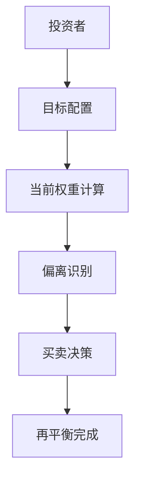
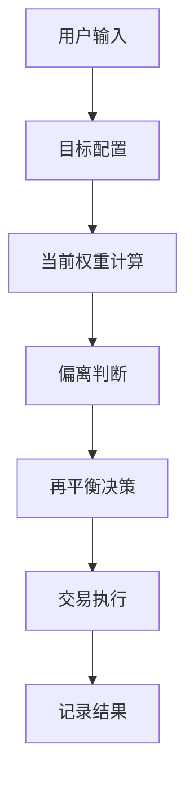

                 


# 伯格的投资组合再平衡：保持风险水平

## 关键词：投资组合，再平衡，风险水平，伯格，资产配置，动态调整

## 摘要：本文详细探讨了投资组合再平衡的核心原理和方法，结合伯格的投资理念，分析了如何通过动态调整保持风险水平，实现长期稳健的投资回报。文章从背景介绍、核心概念、算法原理、系统架构到项目实战，全面阐述了投资组合再平衡的理论与实践。

---

## 第一部分：投资组合再平衡的背景与基础

### 第1章：投资组合再平衡概述

#### 1.1 投资组合再平衡的背景

##### 1.1.1 投资组合的基本概念
投资组合是指将资金分配到不同资产类别（如股票、债券、现金等）的一种方式，目的是在风险和收益之间找到最佳平衡点。通过多样化投资，投资者可以降低特定资产的风险，同时追求更高的回报。

##### 1.1.2 伯格的投资组合再平衡方法
约翰·伯格（John Bogle）是指数基金之父，他创立了先锋集团（Vanguard）。伯格强调长期投资和低成本运作，他提倡定期再平衡投资组合，以保持目标资产配置，并根据市场变化调整投资比例。

##### 1.1.3 再平衡的必要性
随着时间的推移，市场波动和资产表现差异可能导致投资组合偏离初始配置。再平衡的目的是重新调整资产比例，确保投资组合符合既定的风险和收益目标。

##### 1.1.4 再平衡与其他投资策略的对比
再平衡策略与主动投资策略不同，它更注重长期稳定的资产配置，减少频繁交易带来的成本和风险。

---

### 1.2 伯格再平衡策略的核心思想

伯格认为，长期投资和定期再平衡是实现稳健回报的关键。他建议投资者每年进行一次再平衡，以确保资产配置与目标一致。

#### 1.3 投资组合再平衡的理论基础

##### 1.3.1 马科维茨的有效前沿理论
哈里·马科维茨（Harry Markowitz）提出的投资组合理论认为，通过优化资产配置可以最大化收益并最小化风险，这就是有效前沿理论。

##### 1.3.2 现代投资组合理论与再平衡
现代投资组合理论（MPT）强调分散化的重要性，而再平衡则是实现分散化的关键手段之一。

---

## 第二部分：投资组合再平衡的核心概念与联系

### 第2章：投资组合再平衡的核心原理

#### 2.1 风险调整与资产配置

##### 2.1.1 风险调整的定义与作用
风险调整是指根据投资者的风险承受能力调整资产配置。通过再平衡，投资者可以根据市场变化和个人风险偏好调整投资组合。

##### 2.1.2 资产配置的动态调整
资产配置需要根据市场环境和个人财务状况的变化进行动态调整。再平衡是实现动态调整的重要工具。

#### 2.2 再平衡的数学模型与公式

##### 2.2.1 投资组合权重计算公式
投资组合中各资产的权重可以根据目标配置比例和当前市值计算得出。

$$ \text{权重} = \frac{\text{资产当前市值}}{\text{投资组合总市值}} $$

##### 2.2.2 再平衡调整的数学表达
再平衡的过程是通过买卖资产来调整各资产的比例，使其回归目标配置。

$$ \text{再平衡后权重} = \text{目标权重} $$

##### 2.2.3 风险调整后的收益计算
通过再平衡，投资者可以在控制风险的前提下，优化投资组合的收益。

---

## 第三部分：投资组合再平衡的算法原理

### 第3章：再平衡算法的实现

#### 3.1 动态再平衡策略

##### 3.1.1 动态再平衡的定义
动态再平衡是指根据市场变化和投资者需求，定期调整资产配置比例。

##### 3.1.2 动态再平衡的实现步骤
1. 确定目标资产配置比例。
2. 计算当前各资产的实际权重。
3. 识别偏离目标的部分。
4. 通过买卖资产调整比例。

##### 3.1.3 动态再平衡的数学模型

$$ \text{目标权重} = \text{当前权重} + \Delta w $$

##### 3.1.4 动态再平衡的算法流程图


---

### 3.2 基于阈值的再平衡方法

#### 3.2.1 基于阈值的定义
基于阈值的再平衡是指当资产比例偏离目标超过一定阈值时，触发再平衡操作。

#### 3.2.2 基于阈值的实现流程
1. 设置目标权重和偏离阈值。
2. 定期计算当前权重。
3. 当偏离超过阈值时，进行再平衡。

#### 3.2.3 基于阈值的数学公式

$$ \text{偏离} = | \text{当前权重} - \text{目标权重} | $$

---

## 第四部分：投资组合再平衡的系统分析与架构设计

### 第4章：系统分析与架构设计

#### 4.1 投资组合管理系统介绍

##### 4.1.1 系统功能设计
- 用户界面：输入目标配置和再平衡参数。
- 资产监控：实时跟踪各资产的市场价值。
- 再平衡策略执行：根据设定触发再平衡操作。

##### 4.1.2 系统架构图


##### 4.1.3 系统接口设计
- 输入接口：目标配置和再平衡参数。
- 输出接口：再平衡操作的买卖指令。

---

## 第五部分：投资组合再平衡的项目实战

### 第5章：项目实战

#### 5.1 环境安装
需要安装Python和相关库（如pandas、numpy）。

#### 5.2 核心代码实现

##### 5.2.1 动态再平衡策略实现
```python
def rebalance_portfolio(target_weights, current_weights):
    # 计算偏离
    deviation = target_weights - current_weights
    # 返回再平衡操作
    return deviation
```

##### 5.2.2 风险调整后的收益计算
```python
import pandas as pd

def calculate_return(weights, returns):
    return pd.Series.dot(weights, returns)
```

#### 5.3 实际案例分析
假设目标配置为60%股票、30%债券、10%现金，当前配置偏离为股票70%，债券25%，现金5%。再平衡操作需要卖出10%股票，买入5%债券和5%现金。

---

## 第六部分：总结与展望

### 第6章：总结与展望

#### 6.1 本章小结
本文详细介绍了投资组合再平衡的核心概念、算法原理和系统设计，结合伯格的投资理念，提出了实现稳健投资回报的方法。

#### 6.2 投资组合管理的注意事项
- 定期再平衡有助于保持资产配置。
- 风险控制是再平衡的核心目标。
- 避免频繁交易以降低成本。

#### 6.3 拓展阅读
建议阅读伯格的《普林斯顿演讲》和马科维茨的《投资组合理论与实务》。

---

## 作者：AI天才研究院 & 禅与计算机程序设计艺术

---

通过本文的详细阐述，读者可以全面理解投资组合再平衡的理论与实践，掌握伯格的投资策略，并在实际投资中应用这些方法，实现风险可控下的稳健收益。

