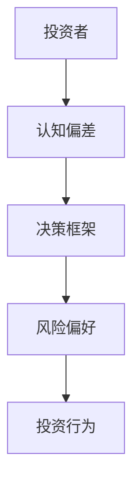
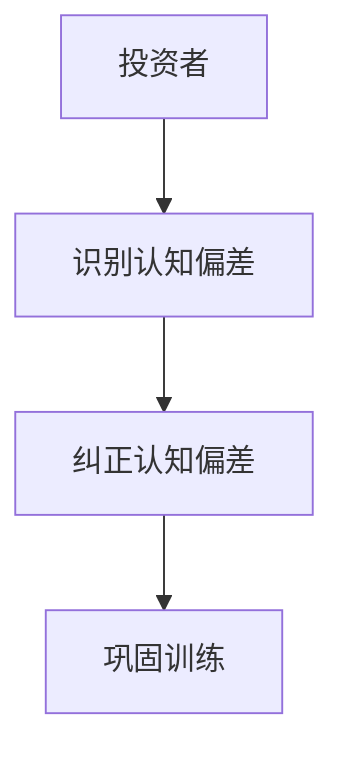
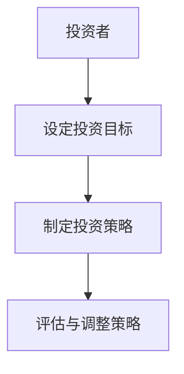
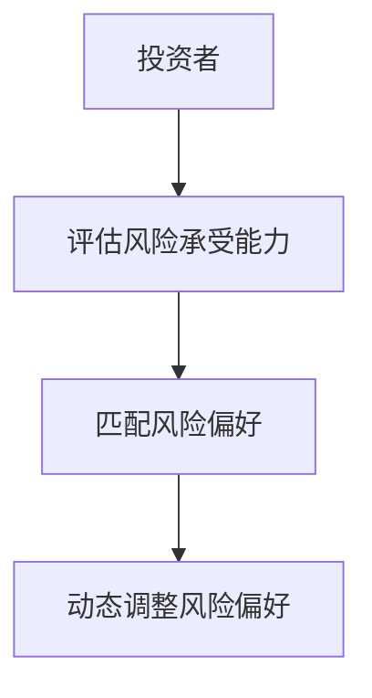
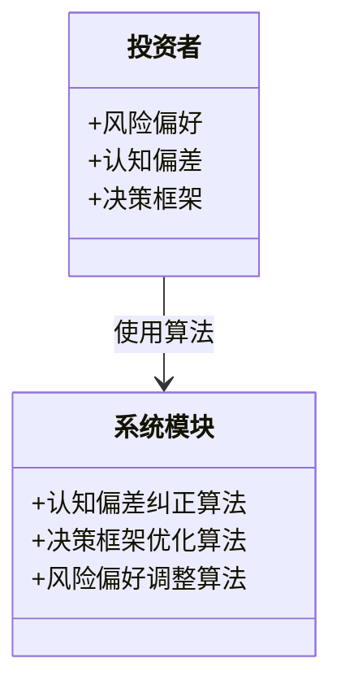
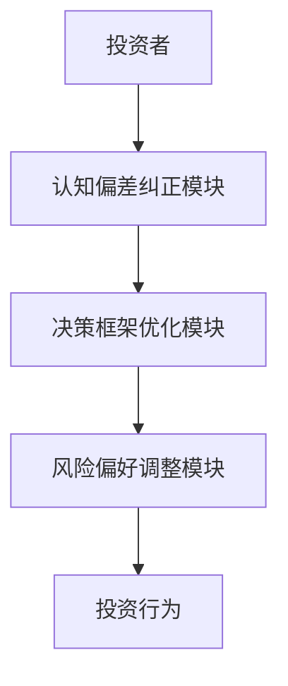

                 


# 伯格的投资者教育理念：应对金融素养差距的挑战

> 关键词：伯格，投资者教育，金融素养，认知偏差，决策框架，风险管理

> 摘要：伯格的投资者教育理念是解决当前金融市场中投资者金融素养差距的重要方法。本文从伯格理念的核心概念出发，详细分析其算法原理，并结合实际案例，展示如何通过系统化的方法提升投资者的金融素养。文章结构清晰，内容详实，语言简洁易懂，适合所有对投资者教育和金融市场感兴趣的专业人士阅读。

---

# 第一部分: 伯格的投资者教育理念背景与核心概念

## 第1章: 投资者教育理念的背景与问题背景

### 1.1 金融素养差距的现状

#### 1.1.1 什么是金融素养
金融素养是指个人在金融知识、技能和态度方面的综合能力，包括理解金融产品、管理个人财务、评估风险和制定合理投资决策的能力。金融素养高的投资者能够更好地规划财务，避免盲目投资和非理性决策。

#### 1.1.2 当前社会的金融素养差距
现代社会中，金融产品的复杂性和金融市场信息的不对称性使得许多投资者难以具备足够的金融素养。许多人在缺乏基本金融知识的情况下进行投资，导致决策失误，甚至蒙受经济损失。

#### 1.1.3 金融素养差距的负面影响
- 个人层面：投资者可能因为缺乏知识而做出错误决策，导致财务损失或长期财富规划失败。
- 市场层面：大量非理性投资者可能导致市场波动加剧，影响金融市场的稳定性和健康发展。
- 社会层面：金融素养差距可能导致社会财富分配不均，加剧贫富差距。

### 1.2 投资者教育的重要性

#### 1.2.1 投资者教育的核心目标
投资者教育的核心目标是提升投资者的金融素养，帮助他们做出理性的投资决策，避免盲目跟风和非理性行为。

#### 1.2.2 投资者教育与金融市场的关系
健康的金融市场需要具备较高金融素养的投资者。通过有效的投资者教育，可以促进市场信息的透明化，减少投资者与金融机构之间的信息不对称，从而提高市场的效率和稳定性。

#### 1.2.3 伯格的投资者教育理念的提出背景
伯格的投资者教育理念是在金融市场日益复杂化和个体投资者金融素养普遍不足的背景下提出的。该理念强调通过系统化的方法，帮助投资者克服认知偏差，建立合理的决策框架，从而做出更理性的投资决策。

---

## 第2章: 伯格的投资者教育理念的核心概念

### 2.1 伯格的教育理念概述

#### 2.1.1 伯格的投资者教育理念的定义
伯格的投资者教育理念是一种系统化的教育方法，旨在通过帮助投资者克服认知偏差、理解市场规律和制定合理的投资策略，从而提升其金融素养和投资能力。

#### 2.1.2 伯格理念的核心要素
- **认知偏差纠正**：识别和纠正投资者的常见认知偏差，如过度自信、从众心理等。
- **决策框架优化**：通过制定明确的投资目标和策略，帮助投资者避免短期情绪化决策。
- **风险管理**：强调风险控制的重要性，帮助投资者在市场波动中保持理性。

#### 2.1.3 伯格理念与传统金融教育的区别
- **目标导向**：伯格理念注重投资者实际决策能力的提升，而不仅仅是知识的传授。
- **系统化方法**：伯格理念强调通过系统化的训练和实践，帮助投资者建立稳定的决策框架。
- **个性化**：伯格理念注重根据投资者的个性特点和风险偏好，制定个性化的教育方案。

---

## 第3章: 伯格理念的核心概念与联系

### 3.1 核心概念的原理分析

#### 3.1.1 投资者的认知偏差
认知偏差是指人在信息处理过程中产生的系统性误差，这些误差会影响投资者的决策。常见的认知偏差包括：
- **过度自信**：投资者往往高估自己的能力，导致冒险行为。
- **从众心理**：投资者倾向于跟随市场潮流，忽视独立判断。
- **确认偏差**：投资者倾向于寻找与自己观点一致的信息，忽视相反的证据。

#### 3.1.2 投资者的决策框架
决策框架是指投资者在面对信息和选择时所采用的决策模式。伯格理念强调建立合理的决策框架，包括：
- **明确投资目标**：投资者需要根据自身财务状况和风险偏好，设定清晰的投资目标。
- **制定投资策略**：根据目标制定相应的投资策略，并在市场波动中坚持执行。
- **定期评估与调整**：根据市场变化和个人情况，定期评估投资策略的有效性，并进行必要的调整。

#### 3.1.3 投资者的风险偏好
风险偏好是指投资者对风险的容忍程度。伯格理念认为，投资者需要根据自身的风险承受能力和财务状况，选择合适的风险水平的投资策略。

---

### 3.2 核心概念属性特征对比表格

| 概念       | 属性1         | 属性2         | 属性3         |
|------------|---------------|---------------|---------------|
| 认知偏差    | 感性驱动       | 主观性         | 短期影响       |
| 决策框架    | 理性主导       | 客观性         | 长期导向       |
| 风险偏好    | 稳定性         | 高风险或低风险| 可调整性       |

---

### 3.3 ER实体关系图（Mermaid流程图）



---

## 第4章: 伯格理念的算法原理讲解

### 4.1 算法原理概述

#### 4.1.1 投资者的认知偏差纠正算法
认知偏差纠正算法的目标是帮助投资者识别和纠正常见的认知偏差。算法步骤如下：
1. **识别偏差**：通过测试和问卷，识别投资者的特定认知偏差。
2. **纠正偏差**：通过教育和案例分析，帮助投资者理解偏差的影响，并提供克服偏差的策略。
3. **巩固训练**：通过模拟投资场景，巩固投资者的纠正效果。

#### 4.1.2 投资者的决策框架优化算法
决策框架优化算法的目标是帮助投资者建立合理的决策框架。算法步骤如下：
1. **设定目标**：帮助投资者明确投资目标和风险承受能力。
2. **制定策略**：根据目标和风险偏好，制定相应的投资策略。
3. **评估与调整**：定期评估策略的执行效果，并根据市场变化进行调整。

#### 4.1.3 投资者的风险偏好调整算法
风险偏好调整算法的目标是帮助投资者找到最适合自己的风险水平。算法步骤如下：
1. **评估风险承受能力**：通过问卷和测试，评估投资者的风险承受能力。
2. **匹配风险偏好**：根据风险承受能力和财务状况，推荐合适的风险水平。
3. **动态调整**：根据市场变化和个人情况，动态调整风险偏好。

---

### 4.2 算法流程图（Mermaid）

#### 4.2.1 认知偏差纠正算法流程图



#### 4.2.2 决策框架优化算法流程图



#### 4.2.3 风险偏好调整算法流程图



---

## 第5章: 伯格理念的数学模型和公式

### 5.1 投资者风险偏好数学模型

伯格理念中，风险偏好可以通过以下公式进行量化：

$$
\text{风险偏好} = \frac{\text{高风险资产比例}}{\text{总资产}}
$$

其中，高风险资产比例是指投资者在投资组合中配置的高风险资产（如股票）的比例。

---

### 5.2 决策框架优化的数学模型

伯格理念的决策框架优化可以通过以下公式进行描述：

$$
\text{最优策略} = \argmax_{i} \left( \text{收益}(i) - \lambda \times \text{风险}(i) \right)
$$

其中，$\lambda$ 是风险厌恶系数，表示投资者对风险的厌恶程度。

---

## 第6章: 系统分析与架构设计方案

### 6.1 问题场景介绍

在金融市场中，投资者的非理性决策和认知偏差可能导致以下问题：
- 投资决策失误，造成经济损失。
- 市场波动加剧，影响金融稳定。
- 投资者信任度下降，影响金融市场健康发展。

---

### 6.2 项目介绍

本项目旨在通过伯格的投资者教育理念，设计一个系统化的投资者教育方案，帮助投资者克服认知偏差，建立合理的决策框架，从而提升整体金融素养。

---

### 6.3 系统功能设计（领域模型 Mermaid 类图）



---

### 6.4 系统架构设计（Mermaid架构图）



---

## 第7章: 项目实战

### 7.1 环境安装

为了实现伯格理念的教育方案，我们需要以下环境：
- Python编程语言
- 数据分析工具（如Pandas、Matplotlib）
- 投资者数据集

---

### 7.2 系统核心实现源代码

以下是一个简单的投资者认知偏差纠正算法的Python实现示例：

```python
# 认知偏差纠正算法实现
def identify_bias(investor_data):
    # 识别认知偏差
    bias_type = determine_bias(investor_data)
    return bias_type

def correct_bias(bias_type):
    # 纠正认知偏差
    correction_strategy = get_correction_strategy(bias_type)
    return correction_strategy

def main():
    investor_data = load_investor_data()
    bias_type = identify_bias(investor_data)
    correction_strategy = correct_bias(bias_type)
    apply_correction(investor_data, correction_strategy)

if __name__ == "__main__":
    main()
```

---

### 7.3 代码应用解读与分析

上述代码实现了一个简单的认知偏差纠正算法。首先，识别投资者的认知偏差类型，然后根据偏差类型选择相应的纠正策略，最后应用纠正策略。这个算法可以作为投资者教育系统的核心模块之一。

---

### 7.4 实际案例分析和详细讲解剖析

假设我们有一个投资者的数据集，其中包含投资者的基本信息、投资行为和市场表现。我们可以使用上述算法对投资者的认知偏差进行识别和纠正，从而帮助他们做出更理性的投资决策。

---

### 7.5 项目小结

通过本项目，我们展示了如何将伯格的投资者教育理念应用于实际投资场景中。通过系统化的算法和工具，可以帮助投资者克服认知偏差，建立合理的决策框架，从而提升整体金融素养。

---

## 第8章: 最佳实践、小结、注意事项、拓展阅读

### 8.1 最佳实践 tips

- **持续学习**：投资者需要持续学习和更新自己的金融知识，以应对不断变化的市场环境。
- **避免情绪化决策**：投资者应避免因市场波动而做出情绪化决策，坚持理性的投资策略。
- **定期评估**：定期评估投资策略的执行效果，并根据市场变化进行必要的调整。

---

### 8.2 小结

伯格的投资者教育理念为我们提供了一种系统化的投资者教育方法，通过纠正认知偏差、优化决策框架和控制风险偏好，可以帮助投资者提升金融素养，做出更理性的投资决策。

---

### 8.3 注意事项

- **个性化**：投资者的教育方案需要根据个人的实际情况进行定制，避免一刀切。
- **实践结合**：投资者教育不仅仅是知识的传授，更需要通过实践来巩固和提升。
- **长期性**：投资者教育是一个长期的过程，需要持续的努力和坚持。

---

### 8.4 拓展阅读

- 伯格的投资者教育理念的相关书籍和论文。
- 金融市场行为学的研究成果。
- 投资者心理学的相关文献。

---

# 作者：AI天才研究院/AI Genius Institute & 禅与计算机程序设计艺术 /Zen And The Art of Computer Programming

---

这篇文章从伯格的投资者教育理念出发，系统地分析了其核心概念、算法原理和实际应用。通过详细的理论分析和实际案例，帮助读者理解如何通过系统化的投资者教育提升金融素养，应对金融市场中的各种挑战。

