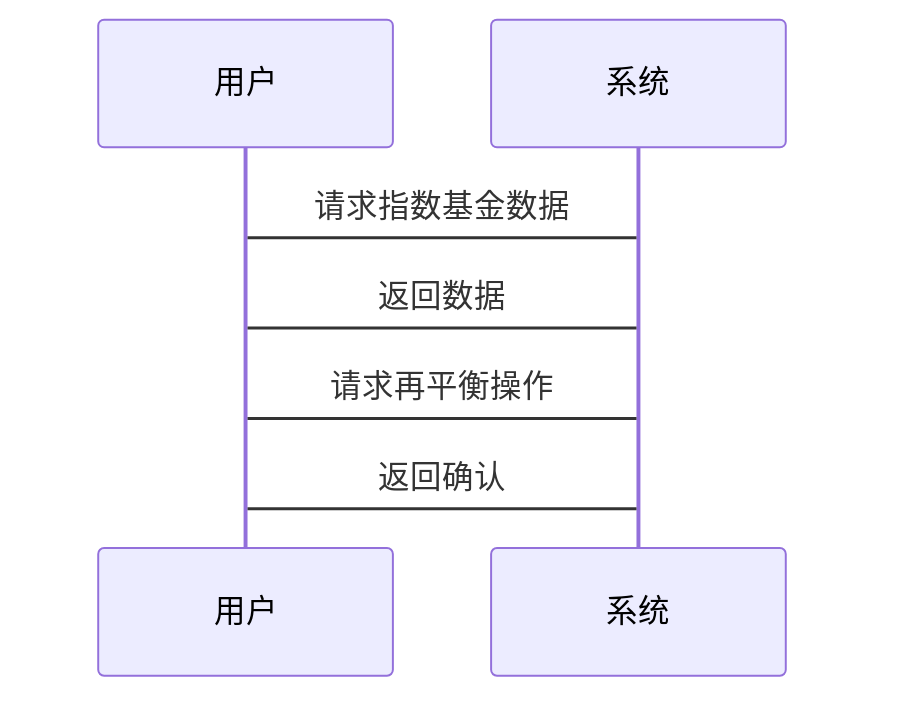

                 


# 伯格的指数基金理念：应对市场集中度上升的挑战

**关键词**：指数基金、市场集中度、投资策略、长期收益、风险管理

**摘要**：本文探讨了伯格的指数基金理念，分析其如何通过分散投资和长期持有应对市场集中度上升的挑战。文章详细介绍了指数基金的核心原理、数学模型、系统架构，并通过项目实战和最佳实践提供具体的指导。通过伯格的理念，读者将理解如何在当前市场环境中有效管理投资风险，实现稳健收益。

---

## 第1章：指数基金的基本概念与背景

### 1.1 指数基金的定义与特点

#### 1.1.1 指数基金的定义
指数基金是一种以特定指数为标的，追踪该指数表现的基金。其投资目标是复制指数的收益，而非超越指数。

#### 1.1.2 指数基金的核心特点
- **分散投资**：通过投资指数成分股，降低单一资产的风险。
- **低成本运作**：管理费用低，适合长期投资。
- **被动管理**：减少人为操作，减少交易成本。

#### 1.1.3 指数基金与主动管理型基金的区别
- **投资目标**：主动型基金追求超越市场，指数基金追求复制市场。
- **管理方式**：主动型基金需要频繁调整持仓，指数基金定期再平衡。
- **费用**：主动型基金费用较高，指数基金费用较低。

### 1.2 伯格的指数基金理念

#### 1.2.1 伯格的投资哲学
- **长期投资**：相信市场有效，长期持有指数基金能获得合理回报。
- **分散投资**：通过投资指数分散风险，避免个股波动的影响。
- **低成本**：降低管理费用，最大化收益。

#### 1.2.2 伯格对市场有效性的观点
- **有效市场假说**：市场已反映所有信息，主动管理难以超越市场。
- **指数基金的优势**：被动投资指数基金是实现超额收益的最佳方式。

#### 1.2.3 伯格对指数基金长期收益的分析
- 长期来看，指数基金的收益接近市场整体表现。
- 通过分散投资，降低非系统性风险。

### 1.3 市场集中度上升的背景与挑战

#### 1.3.1 市场集中度的定义与衡量
- 市场集中度：衡量市场中少数公司占总市场份额的比例。
- 常用指标：赫芬达尔指数（HHI指数）。

#### 1.3.2 近年来市场集中度上升的原因
- 行业整合：大企业并购小企业，提高市场占有率。
- 技术壁垒：技术领先企业占据主导地位。
- 经济全球化：跨国企业在全球范围内扩张，提高集中度。

#### 1.3.3 市场集中度上升对投资者的影响
- 风险集中：少数公司控制市场，增加投资风险。
- 竞争减少：市场垄断可能降低创新动力，影响长期收益。
- 投资难度：集中度过高，投资者难以找到分散投资的机会。

---

## 第2章：指数基金的核心原理与数学模型

### 2.1 指数基金的构建原理

#### 2.1.1 指数基金的构建方法
- 选择指数：如标普500、沪深300等。
- 确定权重：按市值比例分配。
- 定期再平衡：保持投资组合与指数一致。

#### 2.1.2 指数基金的权重分配
- 市值加权：按成分股的市值比例分配权重。
- 等权重：每只股票分配相等的权重。

#### 2.1.3 指数基金的再平衡机制
- 定期调整持仓，使组合与指数一致。
- 减少交易成本，降低管理费用。

### 2.2 指数基金的风险与收益分析

#### 2.2.1 指数基金的风险来源
- 市场风险：整体市场波动影响收益。
- 流动性风险：成分股流动性不足，难以快速买卖。
- 再平衡风险：频繁调整可能增加交易成本。

#### 2.2.2 指数基金的收益来源
- 股息收益：成分股的股息收入。
- 资本增值：股价上涨带来的收益。

#### 2.2.3 指数基金与市场波动的关系
- 随着市场波动，指数基金收益随市场同步变化。
- 通过分散投资，降低非系统性风险。

### 2.3 指数基金的数学模型

#### 2.3.1 指数基金的收益计算公式
$$
R_f = \sum_{i=1}^{n} w_i R_i
$$
其中，$R_f$ 是指数基金的收益，$w_i$ 是第i只股票的权重，$R_i$ 是第i只股票的收益。

#### 2.3.2 指数基金的风险衡量公式
$$
\sigma_f = \sqrt{\sum_{i=1}^{n} w_i^2 \sigma_i^2 + \sum_{i \neq j} w_i w_j Cov(R_i, R_j)}
$$
其中，$\sigma_f$ 是指数基金的风险，$\sigma_i$ 是第i只股票的风险，$Cov(R_i, R_j)$ 是第i和第j只股票的协方差。

#### 2.3.3 指数基金的夏普比率计算
$$
S_p = \frac{E[R_p - R_f]}{\sigma_p}
$$
其中，$S_p$ 是夏普比率，$E[R_p - R_f]$ 是指数基金的超额收益期望，$\sigma_p$ 是指数基金的风险。

---

## 第3章：伯格指数基金理念的系统架构与实现

### 3.1 系统架构设计

#### 3.1.1 系统功能模块
- 数据采集：收集指数成分股的实时数据。
- 权重计算：根据指数成分股的市值比例计算权重。
- 交易执行：根据再平衡策略执行交易指令。
- 风险管理：监控投资组合的风险，调整持仓。

#### 3.1.2 系统架构图


### 3.2 算法实现

#### 3.2.1 再平衡算法
- 定期检查投资组合与指数的偏离。
- 调整持仓，使组合与指数一致。

#### 3.2.2 风险管理算法
- 监控投资组合的波动率。
- 设置止损点，控制最大回撤。

### 3.3 系统接口设计

#### 3.3.1 数据接口
- 从数据源获取指数成分股的实时数据。
- 接口：`get_index_data(index_id)`

#### 3.3.2 交易接口
- 根据策略执行买卖指令。
- 接口：`execute_trade(action, quantity, symbol)`

### 3.4 系统交互流程

#### 3.4.1 交互序列图


---

## 第4章：项目实战与代码实现

### 4.1 项目实战

#### 4.1.1 环境安装
- 安装Python和必要的库：`pandas`, `numpy`, `yfinance`

#### 4.1.2 核心代码实现
```python
import pandas as pd
import numpy as np

def calculate_weights(index_data):
    # 计算市值权重
    market_cap = index_data['Market Cap']
    total = market_cap.sum()
    weights = market_cap / total
    return weights

def rebalance_portfolio(current_portfolio, weights):
    # 调整持仓，使权重与目标一致
    current_weights = current_portfolio['Weight']
    adjustments = weights - current_weights
    return adjustments

# 示例：使用标普500指数
index_data = pd.read_csv('sp500.csv')
weights = calculate_weights(index_data)
adjustments = rebalance_portfolio(current_portfolio, weights)
```

### 4.2 案例分析

#### 4.2.1 投资组合优化
- 选择合适的指数基金，根据市场集中度调整持仓。

#### 4.2.2 风险管理
- 设置止损点，控制最大回撤。

### 4.3 项目小结
通过实战，读者可以理解指数基金的实现过程，并应用到实际投资中。

---

## 第5章：最佳实践、小结与展望

### 5.1 最佳实践

#### 5.1.1 分散投资
通过指数基金分散投资，降低风险。

#### 5.1.2 长期持有
避免频繁交易，降低费用。

#### 5.1.3 定期再平衡
保持投资组合与指数一致。

### 5.2 小结
伯格的指数基金理念强调长期投资和分散投资，通过指数基金应对市场集中度上升的挑战。

### 5.3 展望
随着市场集中度的进一步上升，指数基金的投资策略将更加重要。未来，投资者需要更加注重风险管理，合理配置资产。

---

**作者：AI天才研究院/AI Genius Institute & 禅与计算机程序设计艺术 /Zen And The Art of Computer Programming**

