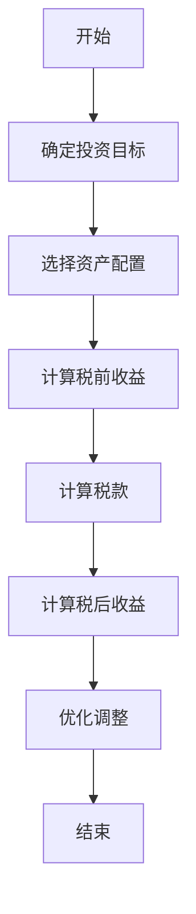
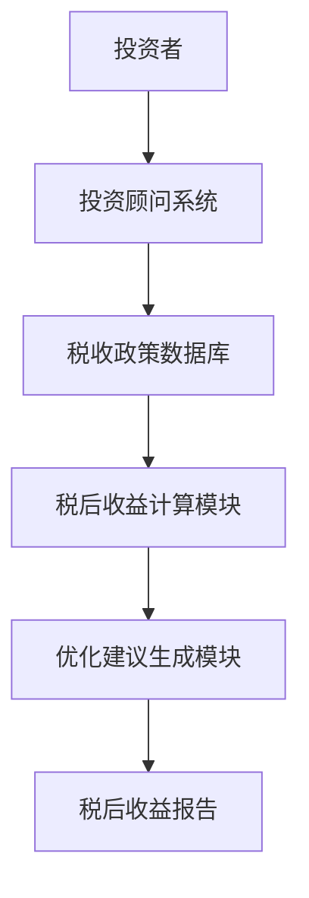
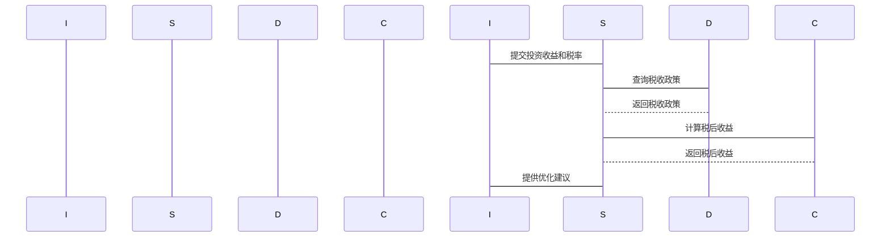

                 


# 伯格的税收效率投资：如何减少投资税负

> **关键词**：税收效率投资、投资税负优化、伯格理论、税务规划、资产配置

> **摘要**：伯格的税收效率投资是一种通过优化投资策略和税务规划来减少税负的有效方法。本文从背景、核心概念、算法原理、系统设计到实际案例，全面解析了如何在投资过程中实现税负最小化，帮助读者掌握伯格的理论和实践方法。

---

# 第一部分: 投资税负优化的背景与核心概念

## 第1章: 投资税负优化的背景与问题描述

### 1.1 税收效率投资的定义与重要性

#### 1.1.1 税收效率投资的定义
税收效率投资是指在投资过程中，通过合理配置资产和优化税务规划，以最小化税负成本的投资策略。其核心在于在实现投资收益的同时，尽可能减少缴纳的税款。

#### 1.1.2 投资税负对企业与个人的影响
- **企业层面**：税负直接影响企业的净利润，合理的税务规划可以提升企业盈利能力。
- **个人层面**：税后收益直接影响个人可支配收入，优化税负可以增加实际收益。

#### 1.1.3 税收效率投资的核心价值
- 通过合理避税，提升投资回报率。
- 遵守税法的前提下，降低税负成本。

### 1.2 投资税负优化的必要性

#### 1.2.1 税收政策对企业投资的影响
- 税收政策直接影响企业的投资决策，例如企业所得税的税率影响投资项目的可行性。
- 税收优惠（如税收减免、抵扣等）可以激励企业进行特定类型的投资。

#### 1.2.2 个人投资者的税负优化需求
- 个人所得税、资本利得税等对投资收益的影响不容忽视。
- 通过资产配置和税务规划，个人可以有效降低税负。

#### 1.2.3 税收效率投资的现实意义
- 在当前经济环境下，税负优化是提升投资效率的重要手段。
- 伯格的理论为投资者提供了科学的优化方法。

### 1.3 伯格的税收效率投资理论

#### 1.3.1 伯格投资理论的起源与发展
- 伯格是投资学领域的权威，其理论强调长期投资和分散化。
- 税收效率投资是伯格理论的重要组成部分，旨在降低投资过程中的税负成本。

#### 1.3.2 伯格税收效率投资的核心思想
- 投资决策应考虑税后收益。
- 合理配置资产以利用税收优惠政策。

#### 1.3.3 伯格理论在现代投资中的应用
- 理论与实践相结合，优化投资组合。
- 通过税收效率投资提升整体投资回报率。

---

## 第2章: 税收效率投资的核心概念与联系

### 2.1 税收效率投资的核心原理

#### 2.1.1 税收效率投资的数学模型
$$ \text{税后收益} = \text{投资收益} - \text{税款} $$

- 投资收益：包括资本利得、股息、利息等。
- 税款：根据投资类型和所在地的税率计算。

#### 2.1.2 投资收益与税负的关系
- 高收益不一定带来高税后收益，合理避税可以提升税后收益。

#### 2.1.3 税收政策对投资决策的影响
- 税收优惠政策可能激励投资者选择特定资产或地区。

### 2.2 核心概念的属性对比

#### 2.2.1 投资类型与税负属性对比表
| 投资类型 | 税率 | 税后收益 |
|----------|------|----------|
| 股票     | 15%  | 收益 × (1 - 0.15) |
| 债券     | 10%  | 收益 × (1 - 0.10) |
| 房地产   | 20%  | 收益 × (1 - 0.20) |

#### 2.2.2 不同资产类别税负差异分析
- 股票和房地产通常税负较高，而债券税负较低。

#### 2.2.3 税收优惠与惩罚机制的对比
- 税收优惠：如税收抵免、减免。
- 税收惩罚：如高税率、附加费。

### 2.3 税收效率投资的ER实体关系图

```mermaid
er
    actor 投资者
    actor 税务部门
    actor 投资顾问
    entity 投资组合
    entity 税收政策
    entity 税负计算
    entity 税后收益

    投资者 --> 投资顾问: 寻求优化建议
    投资顾问 --> 投资组合: 优化配置
    投资组合 --> 税收政策: 受政策影响
    税收政策 --> 税负计算: 计算税款
    税负计算 --> 税后收益: 计算收益
```

---

## 第3章: 税收效率投资的算法原理

### 3.1 税收效率投资的数学模型

#### 3.1.1 投资收益与税负的数学公式
$$ \text{税后收益} = \text{投资收益} \times (1 - \text{税率}) $$

- 投资收益：根据资产类型计算。
- 税率：根据收益类型和投资者身份确定。

#### 3.1.2 税收效率投资的优化模型
$$ \max \text{税后收益} = \text{投资收益} \times (1 - \text{税率}) $$

### 3.2 税收效率投资的算法流程

#### 3.2.1 算法流程图



#### 3.2.2 算法实现的代码示例

```python
def tax_efficient_investment(tax_rate):
    def calculate_tax_post(taxable_income):
        return taxable_income * (1 - tax_rate)
    
    investment_income = 10000  # 示例投资收益
    tax_post = calculate_tax_post(investment_income)
    print(f"税后收益：{tax_post}")

tax_efficient_investment(0.15)  # 示例税率15%
```

### 3.3 税收效率投资的优化策略

#### 3.3.1 优化策略的数学推导
$$ \text{最优税后收益} = \min(\text{税率}) \times \text{投资收益} $$

---

## 第4章: 税收效率投资的系统分析与架构设计

### 4.1 系统分析

#### 4.1.1 问题场景的描述
- 投资者希望优化税后收益，需结合税收政策和投资策略。

#### 4.1.2 系统功能需求分析
- 输入：投资收益、税率。
- 输出：税后收益、优化建议。

#### 4.1.3 系统边界与接口设计
- 输入接口：投资收益数据、税率参数。
- 输出接口：税后收益、优化建议。

### 4.2 系统架构设计

#### 4.2.1 系统架构图



#### 4.2.2 关键模块的功能设计
- 投资顾问系统：接收投资者需求，提供优化建议。
- 税收政策数据库：存储不同地区的税收政策。
- 税后收益计算模块：根据输入计算税后收益。
- 优化建议生成模块：基于计算结果生成优化策略。

### 4.3 系统交互设计

#### 4.3.1 系统交互流程图



---

## 第5章: 税收效率投资的项目实战

### 5.1 环境安装与配置

#### 5.1.1 开发环境的搭建
- 安装Python和相关开发工具。
- 安装必要的库，如`mermaid`、`matplotlib`等。

#### 5.1.2 依赖库的安装与配置
```bash
pip install mermaid4jupyter matplotlib
```

### 5.2 系统核心实现源代码

#### 5.2.1 计算税后收益的代码

```python
def calculate_tax_post(income, tax_rate):
    return income * (1 - tax_rate)

# 示例：股票投资收益税后计算
income_stock = 10000
tax_rate_stock = 0.15
tax_post_stock = calculate_tax_post(income_stock, tax_rate_stock)
print(f"股票投资税后收益：{tax_post_stock}")
```

#### 5.2.2 优化建议生成代码

```python
def generate_optimization建议(taxable_income, tax_rate):
    tax_post = taxable_income * (1 - tax_rate)
    return f"建议：通过配置低税率资产，优化税后收益至{tax_post}"

# 示例：债券投资优化建议
income_bond = 8000
tax_rate_bond = 0.10
opt建议 = generate_optimization建议(income_bond, tax_rate_bond)
print(opt建议)
```

### 5.3 案例分析

#### 5.3.1 股票投资税后收益计算

```python
income = 10000  # 税前收益
rate = 0.15     # 税率
post_tax = income * (1 - rate)
print(f"税后收益：{post_tax}")
```

#### 5.3.2 不同税率下的税后收益对比

```python
def compare_tax后收益(income, rates):
    results = {}
    for rate in rates:
        post_tax = income * (1 - rate)
        results[rate] = post_tax
    return results

income = 10000
rates = [0.10, 0.15, 0.20]
对比结果 = compare_tax后收益(income, rates)
print(对比结果)
```

---

## 第6章: 税收效率投资的最佳实践与总结

### 6.1 最佳实践 tips

1. **定期评估投资组合**：根据税收政策变化调整投资策略。
2. **利用税收优惠政策**：选择有税收优惠的资产或地区。
3. **分散投资**：降低单一投资的税负风险。

### 6.2 小结

通过合理配置资产和优化税务规划，投资者可以有效降低税负成本，提升投资回报率。伯格的税收效率投资理论为实现这一目标提供了科学的方法。

### 6.3 注意事项

- 税收政策变化频繁，需及时调整投资策略。
- 税务规划需遵守相关法律法规，避免税务风险。

### 6.4 拓展阅读

- 《投资学精要》
- 《税务规划与投资策略》
- 伯格的经典投资著作

---

# 结语

伯格的税收效率投资是一种科学而实用的投资方法，通过优化税务规划和资产配置，投资者可以在实现收益的同时，最大限度地降低税负成本。希望本文能为投资者提供有价值的参考和指导。

---

**作者**：AI天才研究院/AI Genius Institute & 禅与计算机程序设计艺术 /Zen And The Art of Computer Programming

