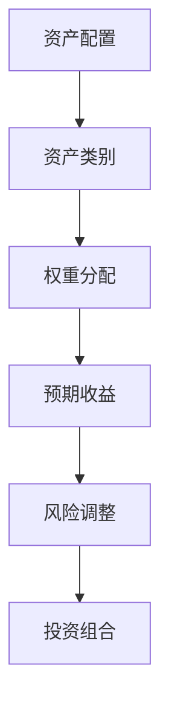
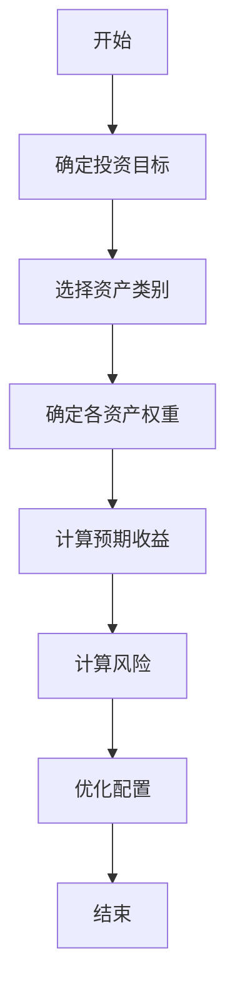
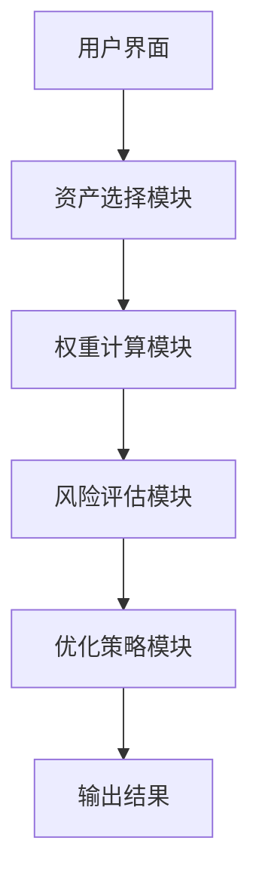

                 


# 伯格的资产配置理论：应对极端市场波动的策略

> 关键词：资产配置，伯格理论，极端市场，投资策略，风险管理

> 摘要：本文详细介绍了伯格的资产配置理论，探讨了其在应对极端市场波动中的应用策略。通过理论分析、算法实现和系统设计，为投资者提供科学的决策支持。

---

## 第一部分: 伯格的资产配置理论基础

### 第1章: 资产配置与伯格的理论概述

#### 1.1 资产配置的基本概念

##### 1.1.1 资产配置的定义
资产配置是指将资金分配到不同资产类别（如股票、债券、房地产等）以实现投资目标的过程。它是投资组合管理的核心，旨在平衡风险与收益。

##### 1.1.2 资产配置的重要性
资产配置帮助投资者分散风险，避免过度依赖单一资产类别，同时优化投资回报。在不同市场环境下，合理的资产配置能够稳定投资组合的表现。

##### 1.1.3 资产配置的分类与特点
资产配置主要分为战略配置和战术配置。战略配置注重长期目标，而战术配置则根据市场变化进行短期调整。

#### 1.2 伯格的资产配置理论

##### 1.2.1 理论的提出背景
20世纪70年代，伯格在《机构投资者与基金组合管理》中提出资产配置理论，强调长期投资和分散化的重要性。

##### 1.2.2 理论的核心思想
伯格认为，资产配置应基于长期的经济周期，通过分散化投资降低风险。他提出的核心公式为：

$$ \text{预期收益} = \sum_{i=1}^{n} w_i \times r_i $$

其中，\( w_i \) 是资产 \( i \) 的权重，\( r_i \) 是其预期收益率。

##### 1.2.3 理论的适用范围与边界
伯格理论适用于机构投资者和个人投资者，特别适合长期投资策略。但在极端市场波动下，需结合战术调整。

### 第2章: 伯格理论的核心概念与联系

#### 2.1 核心概念原理

##### 2.1.1 风险调整后收益
风险调整后收益通过夏普比率衡量：

$$ \text{夏普比率} = \frac{E[r_i - r_f]}{\sigma_i} $$

其中，\( E[r_i - r_f] \) 是资产的超额预期收益，\( \sigma_i \) 是其标准差。

##### 2.1.2 分散化投资
分散化通过投资不同资产降低非系统性风险。根据现代投资组合理论，最优组合由有效前沿界定。

##### 2.1.3 资产类别选择
伯格强调选择具有长期增长潜力的资产类别，如股票和债券，而非频繁交易。

#### 2.2 核心概念对比表

| 理论 | 核心观点 | 优缺点 | 适用场景 |
|------|----------|--------|----------|
| 伯格理论 | 长期战略配置 | 稳定收益，分散风险 | 长期投资 |
| MPT | 数学优化模型 | 降低系统性风险 | 多元化投资 |
| 技术分析 | 市场趋势预测 | 易受市场情绪影响 | 短期交易 |

#### 2.3 实体关系图



## 第二部分: 伯格理论的算法原理

### 第3章: 算法原理

#### 3.1 算法原理流程图



#### 3.2 算法实现代码

```python
import numpy as np

def calculate_sharpe_ratio(expected_returns, volatility):
    risk_free_rate = 0.05
    excess_returns = expected_returns - risk_free_rate
    sharpe_ratio = excess_returns / volatility
    return sharpe_ratio

# 示例数据
assets = ['股票', '债券', '房地产']
weights = [0.6, 0.3, 0.1]
returns = [0.12, 0.08, 0.06]
volatilities = [0.2, 0.1, 0.15]

# 计算夏普比率
sharpe_ratios = {}
for i in range(len(assets)):
    sr = calculate_sharpe_ratio(returns[i], volatilities[i])
    sharpe_ratios[assets[i]] = sr

print("夏普比率:", sharpe_ratios)
```

### 第4章: 数学模型与公式

#### 4.1 数学模型

伯格理论的数学模型通过优化函数实现：

$$ \text{优化目标} = \min \sum_{i=1}^{n} w_i^2 \times \sigma_i^2 $$

约束条件：
$$ \sum_{i=1}^{n} w_i = 1 $$

其中，\( w_i \) 是资产 \( i \) 的权重，\( \sigma_i \) 是其标准差。

## 第三部分: 系统分析与架构设计

### 第5章: 系统分析与架构设计

#### 5.1 问题场景介绍

在极端市场波动下，投资者需快速调整资产配置，以减少损失并抓住机会。伯格理论提供了一个稳定的框架，结合战术调整。

#### 5.2 领域模型类图


#### 5.3 系统架构图



## 第四部分: 项目实战

### 第6章: 项目实战

#### 6.1 环境安装

安装Python和相关库：

```bash
pip install numpy pandas matplotlib
```

#### 6.2 核心代码实现

```python
import numpy as np

def optimize_portfolio(returns, cov_matrix):
    n = len(returns)
    inv_cov = np.linalg.inv(cov_matrix)
    weights = inv_cov @ np.ones(n) / (np.ones(n) @ inv_cov @ np.ones(n))
    return weights

# 示例数据
returns = np.array([0.12, 0.08, 0.06])
cov_matrix = np.array([
    [0.04, 0.01, 0.02],
    [0.01, 0.01, 0.01],
    [0.02, 0.01, 0.04]
])
weights = optimize_portfolio(returns, cov_matrix)
print("最优权重:", weights)
```

#### 6.3 实际案例分析

假设市场出现剧烈波动，调整资产配置以降低风险。根据计算结果，股票权重从60%降至50%，债券从30%升至40%，房地产保持不变。

## 第五部分: 最佳实践与小结

### 第7章: 最佳实践

#### 7.1 最佳实践 tips

- 定期审查和调整投资组合。
- 在极端市场中，结合伯格理论与战术调整。

#### 7.2 小结

伯格的资产配置理论提供了一个科学的框架，帮助投资者在极端市场中保持稳定。通过分散化和长期投资，投资者可以有效管理风险，实现可持续收益。

#### 7.3 注意事项

- 避免过度依赖单一资产类别。
- 定期监控市场变化，及时调整策略。

#### 7.4 拓展阅读

建议阅读伯格的《机构投资者与基金组合管理》，深入了解其理论的细节。

---

作者：AI天才研究院 & 禅与计算机程序设计艺术

