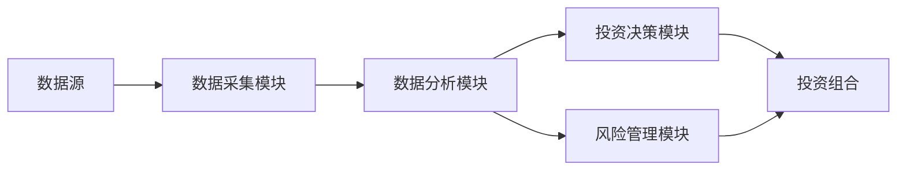

                 


# 伯格的长期投资理念：应对市场短期主义的挑战

> 关键词：长期投资，价值投资，短期主义，伯格，投资策略

> 摘要：本文深入探讨了伯格的长期投资理念，分析了短期主义对市场的挑战，并结合技术方法，提出了应对短期主义的具体策略。文章从背景介绍、核心概念、算法原理、数学模型、系统分析、项目实战到最佳实践，全面解析了长期投资的优势和实现路径。

---

## 第一部分：背景介绍

### 第1章：伯格的生平与投资理念

#### 1.1 伯格的生平简介
- **早年经历**：菲利普·费舍尔（Philip Fisher）是伯格长期投资理念的鼻祖之一。他于1906年出生于美国，早年就读于哈佛大学，后转向法律和金融领域。
- **职业生涯**：费舍尔的职业生涯始于1930年代，当时他开始研究股票市场，并提出了“成长股”概念。
- **投资哲学**：费舍尔强调长期投资的重要性，主张选择具有持续增长潜力的公司，并长期持有。

#### 1.2 长期投资的核心理念
- **定义**：长期投资是指投资者将资金投入优质资产，并在较长时间内持有，以实现复利增长。
- **核心原则**：价值投资、分散投资、长期持有。
- **长期投资与短期投资的对比**：
  - 短期投资：注重市场波动，追求短期收益。
  - 长期投资：注重公司基本面，追求长期增长。

---

### 第2章：短期主义的挑战

#### 2.1 短期主义的定义
- **特征**：投资者倾向于短期交易，追求快速收益。
- **表现形式**：市场波动加剧、投资者情绪化交易、机构投资者短期考核机制。
- **对市场的影响**：短期主义可能导致市场的非理性波动，损害长期投资者的利益。

#### 2.2 短期主义的成因
- **市场波动的加剧**：高频交易、算法交易等加剧了市场的短期波动。
- **投资者心理的短期倾向**：投资者往往倾向于追逐热点，忽视长期价值。
- **机构投资者的短期考核机制**：机构投资者通常以季度或半年为考核周期，导致投资决策短视。

---

### 第3章：长期投资与短期主义的对比

#### 3.1 核心概念对比
- **对比表格**：
| 对比维度 | 长期投资 | 短期投资 |
|----------|----------|----------|
| 投资目标 | 实现复利增长 | 追求短期收益 |
| 投资期限 | 5年以上 | 1年以内 |
| 风险管理 | 强调分散投资 | 侧重短期波动 |

- **ER实体关系图**：
  ```mermaid
  erDiagram
  {
    Investor
    {
      id: int
      name: string
    }
    InvestmentStrategy
    {
      id: int
      name: string
    }
    MarketData
    {
      id: int
      date: string
      value: float
    }
    investor --> investmentStrategy : 采用策略
    investmentStrategy --> marketData : 基于数据
  }
  ```

---

## 第二部分：算法原理

### 第4章：长期投资的算法实现

#### 4.1 算法流程
- **价值投资算法流程图**：
  ```mermaid
  graph TD
    A[开始] --> B[选择优质公司]
    B --> C[评估公司基本面]
    C --> D[确定投资比例]
    D --> E[长期持有]
    E --> F[定期再平衡]
    F --> G[结束]
  ```

- **代码实现**：
  ```python
  def value_investment_strategy(stocks, market_data):
      # 筛选优质股票
      filtered_stocks = [stock for stock in stocks if stock_growth_potential(stock, market_data)]
      # 计算投资比例
      investment_weights = calculate_weights(filtered_stocks)
      return investment_weights
  ```

---

## 第三部分：数学模型

### 第5章：复利模型与风险评估

#### 5.1 复利公式
- **复利计算公式**：
  $$ A = P(1 + r)^n $$
  - \( A \)：最终金额
  - \( P \)：本金
  - \( r \)：年化收益率
  - \( n \)：投资年数

#### 5.2 风险评估模型
- **风险评估公式**：
  $$ risk = \sqrt{\frac{1}{n} \sum_{i=1}^{n} (r_i - \mu)^2} $$
  - \( \mu \)：平均收益率
  - \( r_i \)：第i个时间点的收益率

---

## 第四部分：系统分析与架构设计

### 第6章：投资决策系统设计

#### 6.1 系统功能模块
- 数据采集模块：获取市场数据和公司基本面信息。
- 数据分析模块：评估股票价值，筛选优质公司。
- 投资决策模块：制定投资策略，生成投资组合。
- 风险管理模块：监控市场波动，调整投资组合。

#### 6.2 系统架构图


---

## 第五部分：项目实战

### 第7章：长期投资的实战分析

#### 7.1 环境安装
- 安装Python和相关库（如Pandas、NumPy）。

#### 7.2 核心代码实现
```python
import pandas as pd

def calculate_growth_stock(stocks, market_data):
    # 筛选成长股
    growth_stocks = []
    for stock in stocks:
        # 计算市盈率和市净率
        pe = stock['PE']
        pb = stock['PB']
        if pe < 15 and pb < 2:
            growth_stocks.append(stock)
    return growth_stocks

# 示例代码
stocks = [
    {'name': '苹果', 'PE': 12, 'PB': 1.5},
    {'name': '谷歌', 'PE': 14, 'PB': 1.8},
    {'name': '微软', 'PE': 16, 'PB': 2.0}
]
growth_stocks = calculate_growth_stock(stocks, market_data)
print(growth_stocks)
```

---

## 第六部分：最佳实践与小结

### 第8章：长期投资的最佳实践

#### 8.1 关键点总结
- 长期投资的核心在于选择优质公司，避免短期波动。
- 通过分散投资降低风险，定期再平衡投资组合。

#### 8.2 小结
- 长期投资是一种科学的投资方法，需要结合技术分析和基本面研究。
- 面对短期主义的挑战，投资者应坚持长期价值，避免短期市场的干扰。

---

## 作者：AI天才研究院/AI Genius Institute & 禅与计算机程序设计艺术 /Zen And The Art of Computer Programming

