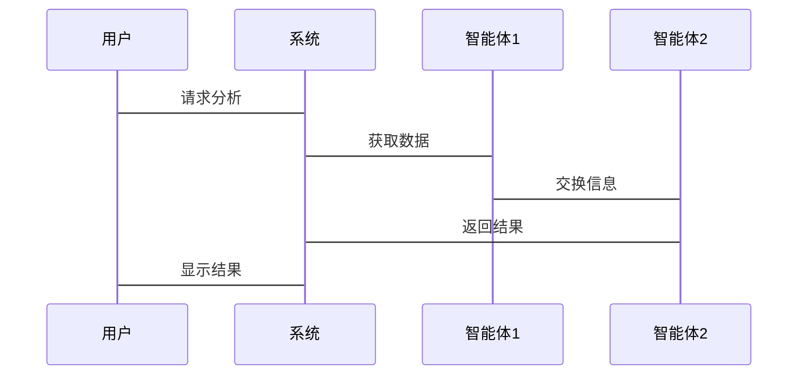

                 


# 使用多智能体系统识别市场异常和投资机会

## 关键词：多智能体系统，市场异常识别，投资机会，机器学习，金融市场分析

## 摘要：本文探讨了如何利用多智能体系统（MAS）来分析金融市场数据，识别市场异常情况，并捕捉投资机会。通过详细讲解MAS的基本概念、算法原理、系统架构设计以及项目实战，本文为读者提供了一个全面的视角，帮助他们理解如何在复杂金融市场中应用MAS技术。

---

## 第一部分: 多智能体系统概述

### 第1章: 多智能体系统概述

#### 1.1 多智能体系统的基本概念

##### 1.1.1 多智能体系统的定义
多智能体系统（Multi-Agent Systems, MAS）是由多个智能体（Agent）组成的分布式系统，这些智能体能够通过协作完成复杂任务。每个智能体都是一个能够感知环境、做出决策并采取行动的实体。

##### 1.1.2 多智能体系统的特征
- **分布性**：多个智能体协同工作，而非集中控制。
- **智能性**：智能体具备一定的感知和决策能力。
- **协作性**：智能体之间通过通信和协作完成共同目标。
- **动态性**：系统能够适应环境的变化。

##### 1.1.3 多智能体系统的优势
- **灵活性**：能够适应不同的市场环境。
- **鲁棒性**：单个智能体故障不影响整体系统。
- **可扩展性**：易于添加新智能体以增强功能。

#### 1.2 金融市场中的问题背景

##### 1.2.1 金融市场的复杂性
金融市场涉及众多参与者和变量，如价格波动、交易量变化、市场情绪等，这些因素使得市场预测和异常识别极具挑战性。

##### 1.2.2 市场异常识别的挑战
- **异常检测**：识别市场中的异常波动，如突然的价格下跌或上涨。
- **欺诈行为**：检测市场操纵和虚假交易。

##### 1.2.3 投资机会的不确定性
在复杂多变的市场中，投资者需要快速识别潜在的投资机会，而传统的单智能体系统难以应对这种复杂性。

#### 1.3 多智能体系统在金融中的应用前景
多智能体系统在金融市场中的应用前景广阔，能够提高市场预测的准确性，优化投资组合，并实时监控市场动态。

---

## 第二部分: 多智能体系统的核心概念与联系

### 第2章: 多智能体系统的核心概念与联系

#### 2.1 智能体的定义与分类

##### 2.1.1 智能体的定义
智能体是一种能够感知环境、做出决策并采取行动的实体。在金融市场中，智能体可以是分析市场数据的算法或模拟交易行为的模型。

##### 2.1.2 智能体的分类
- **简单智能体**：仅能执行预定义任务。
- **反应式智能体**：能够根据环境反馈做出实时反应。
- **认知智能体**：具备复杂推理和决策能力。

##### 2.1.3 智能体的属性对比表

| 属性       | 简单智能体       | 反应式智能体       | 认知智能体       |
|------------|-----------------|-----------------|-----------------|
| 自主性     | 高              | 高              | 高              |
| 反应性     | 低              | 高              | 高              |
| 协作性     | 低              | 中              | 高              |

#### 2.2 多智能体系统的协作机制

##### 2.2.1 通信机制
智能体之间通过消息传递进行通信，例如使用消息队列或发布-订阅模式。

##### 2.2.2 协作协议
定义智能体如何协作，例如通过协商分配任务或共享信息。

##### 2.2.3 协作模型
- **分布式计算模型**：智能体独立计算并共享结果。
- **协商式协作模型**：智能体通过协商决定各自的角色和任务。

#### 2.3 实体关系图

```mermaid
erDiagram
    participant 市场数据
    participant 智能体
    participant 交易行为
    market_data --> 智能体: 提供数据
    智能体 --> transaction_behavior: 指导交易
```

---

## 第三部分: 算法原理

### 第3章: 算法原理

#### 3.1 市场异常检测的强化学习算法

##### 3.1.1 算法流程
1. 数据采集：收集历史市场数据。
2. 特征提取：提取有用的特征，如价格、成交量。
3. 状态定义：定义智能体的状态，如当前价格、市场趋势。
4. 动作选择：智能体根据状态选择交易动作。
5. 奖励机制：根据交易结果给予奖励或惩罚。

##### 3.1.2 代码示例：Q-learning算法

```python
class QLearning:
    def __init__(self, state_space, action_space):
        self.q_table = defaultdict(dict)
        self.state_space = state_space
        self.action_space = action_space
        self.lr = 0.1
        self.gamma = 0.9

    def choose_action(self, state):
        if np.random.random() < 0.9:
            return np.argmax(self.q_table[state])
        else:
            return np.random.randint(self.action_space)

    def update_q_table(self, state, action, reward, next_state):
        self.q_table[state][action] = self.q_table[state][action] * (1 - self.lr) + self.lr * (reward + self.gamma * max(self.q_table[next_state].values()))
```

##### 3.1.3 数学模型
Q-learning算法的目标函数：
$$Q(s, a) = Q(s, a) + \alpha [r + \gamma \max Q(s', a') - Q(s, a)]$$
其中，$\alpha$是学习率，$\gamma$是折扣因子。

#### 3.2 投资机会识别的协作机制

##### 3.2.1 智能体协作策略
智能体之间通过共享市场数据和交易信号，协作识别投资机会。

##### 3.2.2 代码示例：协作机制实现

```python
def collaborate_agents(agents):
    for agent in agents:
        for other_agent in agents:
            if other_agent != agent:
                agent.receive_info(other_agent.send_info())
```

---

## 第四部分: 系统架构设计

### 第4章: 系统架构设计

#### 4.1 功能模块

##### 4.1.1 数据采集模块
负责采集市场数据，如股票价格、交易量。

##### 4.1.2 异常检测模块
利用强化学习算法检测市场异常。

##### 4.1.3 投资机会识别模块
基于协作机制识别潜在投资机会。

#### 4.2 系统架构设计

##### 4.2.1 分层架构
- 数据层：存储原始数据。
- 业务逻辑层：处理数据和执行算法。
- 表现层：展示结果和用户界面。

#### 4.3 接口设计

##### 4.3.1 RESTful API接口
定义智能体之间的通信接口，如`GET /agents`。

#### 4.4 交互流程



---

## 第五部分: 项目实战

### 第5章: 项目实战

#### 5.1 环境搭建

##### 5.1.1 安装必要的库
安装Python的机器学习库（如TensorFlow）、数据处理库（如Pandas）。

#### 5.2 核心功能实现

##### 5.2.1 数据采集
使用API获取股票数据。

##### 5.2.2 特征提取
提取如移动平均线、相对强弱指数等特征。

##### 5.2.3 异常检测
应用强化学习算法识别异常价格波动。

#### 5.3 实际案例分析

##### 5.3.1 案例分析
分析某次市场波动，展示系统如何识别异常并推荐投资策略。

##### 5.3.2 代码解读
详细解释关键代码部分，如异常检测模块的实现。

---

## 第六部分: 最佳实践与总结

### 第6章: 最佳实践与总结

#### 6.1 最佳实践

##### 6.1.1 数据质量
确保数据准确性和完整性。

##### 6.1.2 模型可解释性
确保模型结果易于理解和验证。

##### 6.1.3 系统实时性
保证系统能够实时处理市场数据。

#### 6.2 小结
本文详细探讨了多智能体系统在金融市场中的应用，展示了其在异常检测和投资机会识别中的潜力。

#### 6.3 注意事项

##### 6.3.1 模型局限性
模型的预测能力受数据质量和算法限制。

##### 6.3.2 数据隐私
注意保护用户数据和隐私。

##### 6.3.3 系统维护
定期更新模型和优化系统性能。

#### 6.4 拓展阅读
推荐相关书籍和论文，供读者深入学习。

---

## 作者信息

作者：AI天才研究院/AI Genius Institute & 禅与计算机程序设计艺术 /Zen And The Art of Computer Programming

