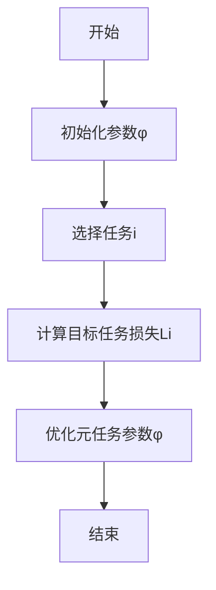
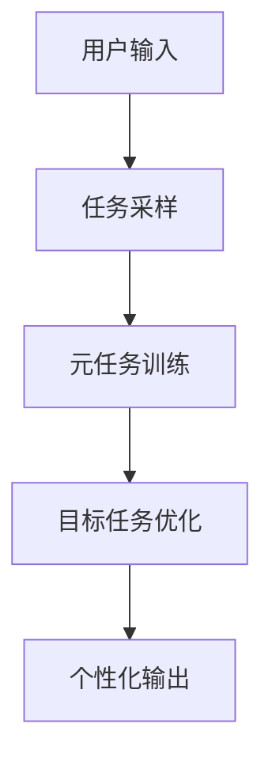
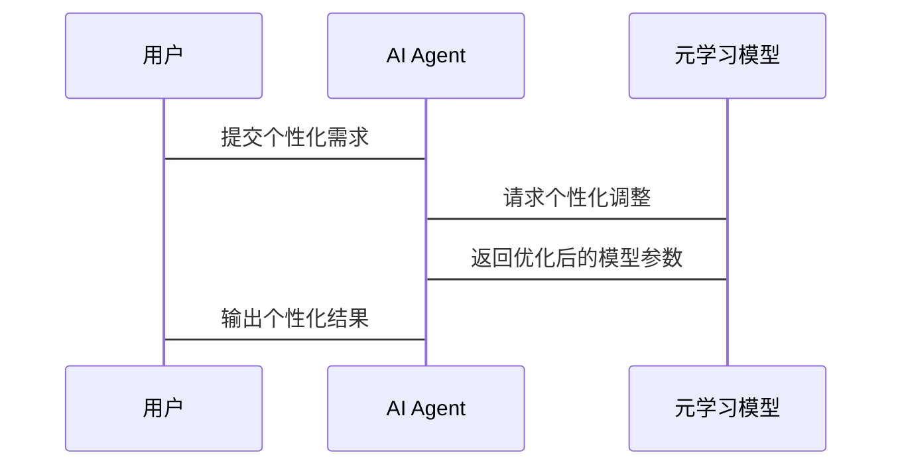

                 


# 元学习在AI Agent个性化定制中的应用

> 关键词：元学习，AI Agent，个性化定制，Meta-Learning，智能体

> 摘要：本文深入探讨了元学习在AI Agent个性化定制中的应用，结合理论分析与实际案例，详细阐述了元学习如何帮助AI Agent实现快速适应和个性化定制。文章从元学习的基本概念出发，逐步分析其在AI Agent中的应用价值，并通过具体项目实战，展示元学习在个性化定制中的实际应用。

---

## 第1章 元学习与AI Agent概述

### 1.1 元学习的基本概念

#### 1.1.1 元学习的定义与核心思想
元学习（Meta-Learning）是一种通过在多个任务上进行预训练，使得模型能够快速适应新任务的学习范式。与传统机器学习不同，元学习的目标是学习如何学习，而非直接解决具体任务。

元学习的核心思想是通过优化模型的参数，使得模型在面对新任务时能够快速调整，而无需从头开始训练。这使得元学习在个性化定制中具有重要价值。

#### 1.1.2 元学习与传统机器学习的区别
| 特性 | 传统机器学习 | 元学习 |
|------|--------------|--------|
| 数据需求 | 需要大量数据 | 数据量小，任务多样 |
| 适应性 | 适应单一任务 | 跨任务适应能力强 |
| 学习目标 | 学习具体任务 | 学习如何学习 |

元学习通过在多个任务上共享参数，能够在新任务上快速收敛，这为AI Agent的个性化定制提供了新的可能性。

#### 1.1.3 元学习的应用场景
元学习适用于需要快速适应新任务的场景，例如：
- **个性化推荐**：不同用户的需求差异大，元学习可以帮助模型快速适应每个用户的偏好。
- **自适应控制系统**：需要在不同环境下快速调整控制策略。
- **多领域NLP任务**：通过元学习可以在不同语言或领域间快速切换。

### 1.2 AI Agent的基本概念

#### 1.2.1 AI Agent的定义与分类
AI Agent（智能体）是指能够感知环境并采取行动以实现目标的实体。根据智能体的复杂程度和应用场景，可以分为：
- **简单反射型Agent**：基于当前输入做出反应。
- **基于模型的反射型Agent**：具有环境模型，能够进行规划。
- **目标驱动型Agent**：基于目标进行决策。
- **实用驱动型Agent**：基于效用函数优化决策。

#### 1.2.2 AI Agent的核心功能与特点
AI Agent的核心功能包括：
- **感知环境**：通过传感器或数据输入获取环境信息。
- **决策与行动**：基于感知信息做出决策并执行行动。
- **自适应能力**：能够根据环境变化调整策略。

AI Agent的特点包括：
- **自主性**：能够在没有外部干预的情况下自主运行。
- **反应性**：能够实时感知并响应环境变化。
- **学习能力**：能够通过学习提升性能。

#### 1.2.3 AI Agent在不同领域的应用实例
- **智能家居**：通过AI Agent实现家电的智能控制。
- **自动驾驶**：自动驾驶系统中的路径规划和决策模块。
- **智能助手**：如Siri、Alexa等，通过对话交互帮助用户完成任务。

### 1.3 元学习在AI Agent中的作用

#### 1.3.1 元学习如何提升AI Agent的个性化能力
元学习能够帮助AI Agent快速适应不同用户的个性化需求。例如，在个性化推荐系统中，元学习可以快速调整模型参数，以适应不同用户的偏好。

#### 1.3.2 元学习在AI Agent自适应中的应用
通过元学习，AI Agent能够在新环境中快速调整策略，无需重新训练整个模型。例如，在多语言对话系统中，元学习可以帮助模型快速适应不同语言的语法和语义规则。

#### 1.3.3 元学习与AI Agent结合的创新点
元学习与AI Agent的结合创新点在于，通过元学习的快速适应能力，使得AI Agent能够在个性化定制中实现高效、灵活的调整。

---

## 第2章 元学习的核心概念与原理

### 2.1 元学习的核心概念

#### 2.1.1 元学习的层次结构
元学习的层次结构包括：
- **元任务**：多个相关任务的集合。
- **目标函数**：用于衡量模型在新任务上的性能。
- **优化目标**：通过优化元任务的性能，使得模型能够快速适应新任务。

#### 2.1.2 元学习的数学模型与公式
元学习的数学模型通常包括两个层次：元任务和目标任务。假设我们有多个目标任务，每个任务都有自己的损失函数$L_i$，元任务的损失函数可以表示为：

$$ L_{meta} = \sum_{i=1}^{N} L_i(\theta_i) $$

其中，$\theta_i$ 是目标任务的参数，$\theta_i$ 通常通过优化元任务的参数$\phi$得到：

$$ \theta_i = f_{\phi}(x_i) $$

$f_{\phi}$ 是基于元任务参数$\phi$的函数。

#### 2.1.3 元学习的特征对比表
元学习的核心特征包括：
- **快速适应能力**：能够在新任务上快速收敛。
- **跨任务泛化能力**：能够在多个任务之间共享参数。
- **可解释性**：通过优化元任务参数，模型的决策过程更加透明。

### 2.2 元学习的原理与算法

#### 2.2.1 元学习的算法框架
元学习的典型算法包括：
- **MAML（Meta-Algorithm for Meta-Learning）**：通过在元任务上优化参数，使得模型能够快速适应新任务。
- **Reptile**：通过迭代更新参数，使得模型在多个任务上共享参数。

#### 2.2.2 基于梯度的元学习算法（如MAML）
MAML的核心思想是通过优化元任务的参数，使得模型在目标任务上能够快速收敛。MAML的优化过程如下：
1. 在元任务上优化参数$\phi$，使得目标任务的损失函数最小。
2. 在目标任务上，通过梯度下降更新参数$\theta$。

MAML的数学表达式如下：
$$ \phi = \phi - \alpha \nabla_{\phi} L_{meta} $$

其中，$\alpha$ 是学习率，$L_{meta}$ 是元任务的损失函数。

#### 2.2.3 元学习的优化策略
元学习的优化策略包括：
- **任务采样策略**：选择具有代表性的任务进行训练。
- **参数更新策略**：通过调整学习率，使得模型能够快速适应新任务。

---

## 第3章 AI Agent的个性化定制需求

### 3.1 个性化定制的核心需求

#### 3.1.1 用户需求的多样性
个性化定制的核心需求在于满足用户的多样性需求。例如，在推荐系统中，不同用户的偏好差异较大，需要模型能够快速适应每个用户的个性化需求。

#### 3.1.2 个性化定制的挑战
个性化定制的挑战包括：
- **数据稀疏性**：某些用户的数据量较少，难以直接训练个性化模型。
- **计算效率**：个性化定制需要快速响应，对计算效率要求较高。
- **模型泛化能力**：个性化模型需要在不同用户之间保持一定的泛化能力。

#### 3.1.3 个性化定制的目标与价值
个性化定制的目标是通过快速适应用户需求，提升用户体验。其价值在于：
- **提升用户满意度**：通过个性化服务，提高用户对AI Agent的满意度。
- **降低计算成本**：通过元学习的快速适应能力，降低个性化定制的计算成本。

### 3.2 元学习在个性化定制中的优势

#### 3.2.1 元学习的快速适应能力
元学习能够通过快速调整模型参数，使得AI Agent能够快速适应用户的个性化需求。

#### 3.2.2 元学习的泛化能力
元学习能够在多个任务之间共享参数，提升模型的泛化能力，从而提高个性化定制的效率。

#### 3.2.3 元学习的可解释性
元学习通过优化元任务参数，使得模型的决策过程更加透明，从而提高个性化定制的可解释性。

---

## 第4章 元学习与AI Agent的结合

### 4.1 元学习在AI Agent中的应用框架

#### 4.1.1 元学习的初始化阶段
元学习的初始化阶段包括：
- **任务采样**：选择具有代表性的任务进行训练。
- **参数初始化**：初始化元任务的参数。

#### 4.1.2 元学习的适应阶段
元学习的适应阶段包括：
- **目标任务训练**：在目标任务上调整模型参数。
- **元任务优化**：通过优化元任务参数，提升模型的适应能力。

#### 4.1.3 元学习的优化阶段
元学习的优化阶段包括：
- **参数更新**：通过梯度下降优化元任务参数。
- **模型评估**：评估模型在目标任务上的性能。

### 4.2 元学习与AI Agent的协同机制

#### 4.2.1 元学习如何指导AI Agent的决策
元学习通过优化模型参数，指导AI Agent在不同任务上的决策过程。

#### 4.2.2 AI Agent如何反馈元学习的优化
AI Agent通过执行任务并提供反馈，帮助元学习优化模型参数。

#### 4.2.3 元学习与AI Agent的联合训练
元学习与AI Agent的联合训练包括：
- **元任务训练**：在多个任务上预训练模型参数。
- **目标任务优化**：在具体任务上调整模型参数。

---

## 第5章 元学习算法的数学模型与公式

### 5.1 元学习的基本数学模型

#### 5.1.1 元学习的优化目标
元学习的优化目标是通过优化元任务参数，使得模型在目标任务上能够快速收敛。数学表达式如下：

$$ \phi = \phi - \alpha \nabla_{\phi} L_{meta} $$

其中，$\alpha$ 是学习率，$L_{meta}$ 是元任务的损失函数。

#### 5.1.2 元学习的损失函数
元学习的损失函数通常包括两个部分：
- **目标任务损失**：$L_i$ 表示目标任务的损失。
- **元任务损失**：$L_{meta} = \sum_{i=1}^{N} L_i(\theta_i)$，表示元任务的总体损失。

#### 5.1.3 元学习的特征对比表
元学习的特征对比表如下：
| 特性 | 元学习 | 传统机器学习 |
|------|--------|--------------|
| 数据需求 | 数据量小，任务多样 | 数据量大，任务单一 |
| 适应性 | 跨任务适应能力强 | 适应单一任务能力强 |

### 5.2 元学习的算法流程图


### 5.3 元学习的代码实现
```python
import torch

def meta_learning_optimizer(phi, Li):
    # 计算元任务损失
    L_meta = sum(Li)
    # 计算梯度
    grad = torch.autograd.grad(L_meta, phi)[0]
    # 更新参数
    phi = phi - alpha * grad
    return phi

# 示例使用
phi = torch.randn(1, requires_grad=True)
Li = [compute_loss(phi) for _ in range(N)]
phi_optimized = meta_learning_optimizer(phi, Li)
```

---

## 第6章 系统分析与架构设计方案

### 6.1 问题场景介绍
在个性化推荐系统中，元学习可以帮助AI Agent快速适应不同用户的个性化需求。

### 6.2 系统功能设计
系统功能设计包括：
- **用户需求分析**：分析用户的个性化需求。
- **任务采样**：选择具有代表性的任务进行训练。
- **模型训练**：在元任务上预训练模型参数。
- **目标任务优化**：在具体任务上调整模型参数。

### 6.3 系统架构设计


### 6.4 系统接口设计
系统接口设计包括：
- **输入接口**：接收用户的个性化需求。
- **输出接口**：输出个性化的推荐结果。

### 6.5 系统交互流程图


---

## 第7章 项目实战

### 7.1 环境安装
需要安装以下环境：
- Python 3.6+
- PyTorch
- Mermaid

### 7.2 系统核心实现源代码
```python
import torch

class MetaLearningModel(torch.nn.Module):
    def __init__(self, input_dim, output_dim):
        super(MetaLearningModel, self).__init__()
        self.linear = torch.nn.Linear(input_dim, output_dim)

    def forward(self, x):
        return self.linear(x)

# 初始化模型
model = MetaLearningModel(input_dim=10, output_dim=5)
optimizer = torch.optim.Adam(model.parameters(), lr=0.001)

# 元学习训练
for epoch in range(100):
    for task in tasks:
        optimizer.zero_grad()
        outputs = model(task.x)
        loss = task.loss(outputs, task.y)
        loss.backward()
        optimizer.step()
```

### 7.3 代码应用解读与分析
上述代码实现了元学习模型的训练过程，包括模型的初始化、前向传播和反向传播。

### 7.4 实际案例分析和详细讲解剖析
以个性化推荐系统为例，元学习可以帮助AI Agent快速适应不同用户的个性化需求。

### 7.5 项目小结
通过元学习，可以在个性化定制中实现高效、灵活的调整。

---

## 第8章 总结与展望

### 8.1 总结
元学习通过快速适应能力，帮助AI Agent实现个性化定制。通过优化元任务参数，元学习能够在新任务上快速收敛，从而提升个性化定制的效率。

### 8.2 展望
未来，元学习在AI Agent中的应用将更加广泛。随着算法的优化和计算能力的提升，元学习将在个性化定制中发挥更大的作用。

### 8.3 注意事项与建议
- **数据质量**：个性化定制需要高质量的数据支持。
- **模型选择**：选择适合具体应用场景的元学习算法。
- **计算效率**：优化计算过程，提升个性化定制的效率。

---

## 作者
作者：AI天才研究院 & 禅与计算机程序设计艺术

---

通过上述章节的详细讲解，我们系统地探讨了元学习在AI Agent个性化定制中的应用。从理论分析到实际案例，本文为读者提供了全面的视角，帮助读者更好地理解和应用这一技术。

