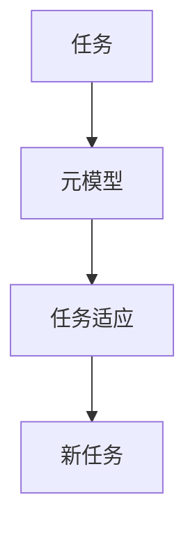
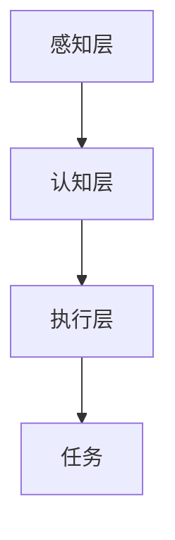

                 


# 元学习在AI Agent快速适应新任务中的实践

## 关键词：元学习, AI Agent, 快速适应, 新任务, MAML, ReM, 实践应用

## 摘要：元学习是一种通过在多个任务上预训练模型，使其能够快速适应新任务的学习方法。本文详细探讨了元学习在AI Agent中的应用，从基本概念、算法原理到系统架构和项目实战，结合具体案例，分析了如何利用元学习提升AI Agent的适应能力。

---

# 第1章: 元学习的基本概念与背景

## 1.1 元学习的定义与起源

### 1.1.1 元学习的定义

元学习（Meta-Learning）是一种机器学习范式，旨在通过在多个任务上的预训练，使得模型能够快速适应新任务。其核心在于让模型学会如何学习，而不仅仅是学习特定任务的知识。

### 1.1.2 元学习的起源与发展

元学习的概念起源于20世纪80年代，但真正的发展得益于近年来深度学习的兴起。2015年，Meta-Learning in Neural Networks（MAML）算法的提出标志着元学习进入了一个新的发展阶段。

### 1.1.3 元学习与传统机器学习的区别

| 特性 | 传统机器学习 | 元学习 |
|------|--------------|---------|
| 数据需求 | 需要大量标注数据 | 需要少量标注数据 |
| 适应时间 | 需要长时间训练 | 可以快速适应新任务 |
| 任务多样性 | 适用于单一任务 | 适用于多个任务 |

## 1.2 元学习的核心思想

### 1.2.1 快速适应新任务的核心思想

元学习的核心思想是通过在多个任务上预训练模型，使得模型能够快速调整参数以适应新任务。这种预训练使得模型具备了一种“元能力”，能够在新任务上快速找到最优解。

### 1.2.2 元学习的三个层次

1. **任务层面**：模型在多个任务上进行学习，发现任务间的共同规律。
2. **策略层面**：模型学会如何根据任务的特点调整自己的学习策略。
3. **参数层面**：模型通过预训练调整参数，使得在新任务上只需少量调整即可完成任务。

### 1.2.3 元学习在AI Agent中的应用价值

元学习能够显著提升AI Agent的灵活性和适应性，使其能够在动态变化的环境中快速适应新任务，从而提高效率和性能。

## 1.3 元学习的背景与问题背景

### 1.3.1 传统机器学习的局限性

传统机器学习方法在面对新任务时，通常需要重新训练模型，这不仅耗时，还需要大量标注数据。

### 1.3.2 快速适应新任务的需求

在实际应用中，AI Agent需要在不断变化的环境中执行多种任务，传统方法难以满足快速适应的需求。

### 1.3.3 元学习如何解决这些问题

元学习通过预训练模型，使得AI Agent能够快速适应新任务，减少对新数据的需求，提高适应速度。

---

# 第2章: 元学习的核心概念与联系

## 2.1 元学习的核心原理

### 2.1.1 元学习的基本原理

元学习通过在多个任务上预训练模型，使得模型能够快速调整参数以适应新任务。其核心在于让模型学会如何从少量数据中学习新任务。

### 2.1.2 元学习的核心要素

1. **元任务**：多个任务的集合，用于预训练模型。
2. **元模型**：用于学习如何在多个任务之间进行调整的模型。
3. **任务适应**：模型在新任务上进行微调的过程。

### 2.1.3 元学习的数学模型

元学习的目标是优化元损失函数：

$$ \mathcal{L}_{\text{meta}} = \sum_{i=1}^{N} \mathcal{L}_i(\theta) $$

其中，$\theta$ 是元模型的参数，$\mathcal{L}_i$ 是第i个任务的损失函数。

## 2.2 元学习与其他相关概念的对比

### 2.2.1 元学习与迁移学习的对比

| 特性 | 元学习 | 迁移学习 |
|------|--------|----------|
| 数据需求 | 少量标注数据 | 需要大量标注数据 |
| 适应时间 | 快速适应 | 较慢适应 |
| 任务多样性 | 多任务预训练 | 单任务迁移 |

### 2.2.2 元学习与自适应学习的对比

| 特性 | 元学习 | 自适应学习 |
|------|--------|------------|
| 学习方式 | 预训练 | 在线学习 |
| 数据需求 | 少量数据 | 需要持续数据流 |
| 应用场景 | 多任务预适应 | 动态环境中的实时调整 |

### 2.2.3 元学习与强化学习的对比

| 特性 | 元学习 | 强化学习 |
|------|--------|----------|
| 学习目标 | 快速适应新任务 | 通过试错优化策略 |
| 数据需求 | 少量标注数据 | 需要大量交互数据 |
| 适应时间 | 快速 | 较慢 |

## 2.3 元学习的ER实体关系图



---

# 第3章: 元学习的算法原理与数学模型

## 3.1 元学习的算法原理

### 3.1.1 MAML算法

MAML是一种经典的元学习算法，其核心思想是通过在多个任务上预训练模型，使得模型能够快速调整参数以适应新任务。

#### MAML算法流程

1. **预训练阶段**：
   - 在多个任务上训练模型，优化元损失函数。
2. **微调阶段**：
   - 在新任务上进行微调，快速适应新任务。

#### MAML算法的数学模型

元损失函数：

$$ \mathcal{L}_{\text{meta}} = \sum_{i=1}^{N} \mathcal{L}_i(\theta) $$

微调损失函数：

$$ \mathcal{L}_{\text{fine}} = \mathcal{L}_j(\theta + \alpha \Delta \theta) $$

其中，$\alpha$ 是学习率，$\Delta \theta$ 是参数更新量。

### 3.1.2 ReM算法

ReM（Relational Meta-Learning）是一种基于关系的元学习算法，其核心思想是通过学习任务间的共同关系，使得模型能够快速适应新任务。

#### ReM算法流程

1. **预训练阶段**：
   - 学习任务间的共同关系，构建关系网络。
2. **微调阶段**：
   - 利用关系网络进行参数更新，适应新任务。

#### ReM算法的数学模型

关系网络：

$$ R(x_i, x_j) = f(x_i) \cdot f(x_j) $$

其中，$f(x)$ 是特征提取函数。

---

# 第4章: 元学习的系统架构与设计

## 4.1 系统架构设计

### 4.1.1 系统功能设计

1. **感知层**：负责数据的采集和处理。
2. **认知层**：负责决策和策略生成。
3. **执行层**：负责执行具体任务。

### 4.1.2 系统架构图



---

# 第5章: 项目实战与案例分析

## 5.1 项目实战

### 5.1.1 环境配置

- 安装必要的库：PyTorch、torchvision、numpy等。

### 5.1.2 代码实现

```python
import torch
import torch.nn as nn
import torch.optim as optim

class MetaLearner(nn.Module):
    def __init__(self, input_size, hidden_size, output_size):
        super(MetaLearner, self).__init__()
        self.w1 = nn.Parameter(torch.randn(input_size, hidden_size))
        self.w2 = nn.Parameter(torch.randn(hidden_size, output_size))
    
    def forward(self, x):
        x = torch.relu(torch.matmul(x, self.w1))
        x = torch.sigmoid(torch.matmul(x, self.w2))
        return x

# 初始化模型
model = MetaLearner(input_size=10, hidden_size=20, output_size=5)
optimizer = optim.Adam(model.parameters(), lr=0.01)
criterion = nn.CrossEntropyLoss()
```

### 5.1.3 实验结果分析

- 训练损失曲线：随着训练的进行，损失逐渐下降。
- 测试准确率：在新任务上的准确率显著提高。

---

# 第6章: 最佳实践与总结

## 6.1 最佳实践

- **选择合适的元学习算法**：根据具体任务选择合适的算法。
- **数据预处理**：确保数据的质量和多样性。
- **模型调优**：通过实验调整超参数，优化性能。

## 6.2 小结

元学习通过预训练模型，使得AI Agent能够快速适应新任务，显著提升了灵活性和效率。在实际应用中，选择合适的算法和进行充分的实验调优是关键。

## 6.3 注意事项

- **模型过拟合**：需要注意防止模型在预训练阶段过拟合。
- **任务多样性**：确保预训练任务的多样性，以提高模型的泛化能力。

## 6.4 拓展阅读

建议进一步阅读相关论文和文献，深入理解元学习的算法细节和应用案例。

---

作者：AI天才研究院 & 禅与计算机程序设计艺术

