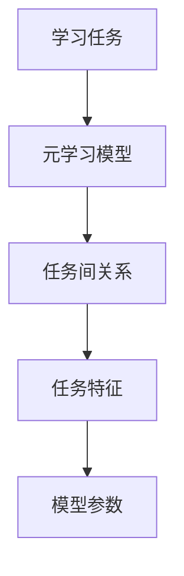
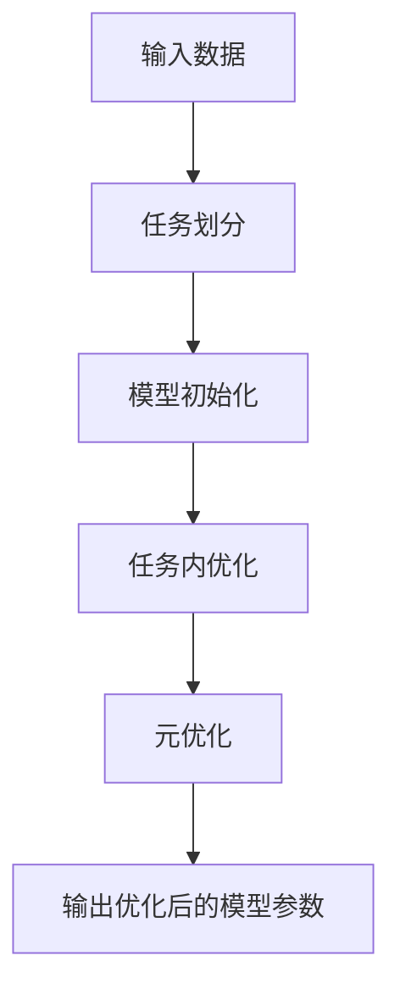
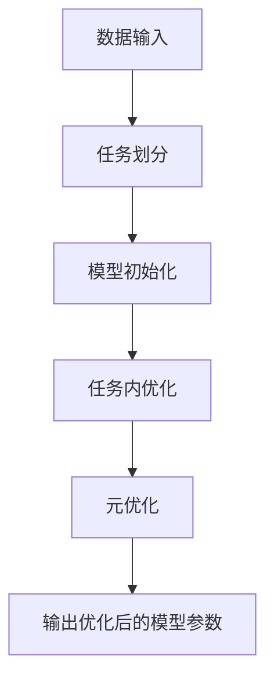

                 


# 元学习框架：构建快速适应的AI Agent系统

> 关键词：元学习，AI Agent，快速适应，自适应学习，迁移学习，MAML，Reptile

> 摘要：本文系统地介绍元学习框架在构建快速适应的AI Agent系统中的应用。通过分析元学习的核心概念、算法原理、系统架构以及实际项目案例，详细阐述如何利用元学习使AI Agent能够在不同环境中快速适应和执行任务。

---

## 第一部分: 元学习框架与AI Agent系统概述

### 第1章: 元学习与AI Agent的背景介绍

#### 1.1 元学习的核心概念
##### 1.1.1 从传统机器学习到元学习的演进
- 传统机器学习的特点：需要大量标注数据，模型在单一任务上进行优化。
- 元学习的定义：元学习是一种学习如何学习的方法，通过在多个任务上优化，使模型能够快速适应新任务。
- 元学习的独特优势：减少对大量标注数据的依赖，具备快速适应新任务的能力。

##### 1.1.2 元学习在AI Agent中的应用背景
- AI Agent的定义：AI Agent是一种智能体，能够感知环境、执行任务并做出决策。
- AI Agent的核心功能：感知环境、目标设定、决策制定、任务执行。
- 元学习在AI Agent中的作用：通过元学习，AI Agent能够在不同环境中快速调整策略，适应新任务。

#### 1.2 AI Agent系统的基本原理
##### 1.2.1 AI Agent的分类
- 基于智能水平：反应式Agent、认知式Agent。
- 基于任务类型：服务型Agent、监控型Agent、社交型Agent。

##### 1.2.2 元学习与AI Agent的结合
- 元学习使AI Agent具备快速适应能力，能够在不同环境中灵活调整策略。
- 元学习通过优化模型的参数，使AI Agent能够在新任务上快速收敛。

#### 1.3 元学习与传统机器学习的对比
##### 1.3.1 传统机器学习的特点
- 需要大量标注数据。
- 适用于单一任务，难以快速适应新任务。
- 对环境变化的适应能力较弱。

##### 1.3.2 元学习的独特优势
- 减少对大量标注数据的依赖。
- 具备快速适应新任务的能力。
- 在动态环境中表现出更强的灵活性和适应性。

##### 1.3.3 元学习与AI Agent的结合
- 元学习使AI Agent能够在快速变化的环境中快速调整策略。
- 元学习通过优化模型的参数，使AI Agent能够在新任务上快速收敛。

---

## 第二部分: 元学习的核心概念与联系

### 第2章: 元学习的核心概念与联系

#### 2.1 元学习的原理与数学模型
##### 2.1.1 元学习的数学公式
- 元学习的目标是通过优化元损失函数，使模型能够在新任务上快速收敛。
- 元损失函数的定义：$$ \text{Meta-Loss}(x, y) = \sum_{i=1}^{N} \text{CrossEntropy}(x_i, y_i; \theta) $$
- 元学习优化的目标：$$ \theta_{\text{new}} = \theta - \epsilon \nabla_{\theta} \text{Meta-Loss} $$

##### 2.1.2 元学习的优化目标
- 元学习的优化目标是使模型能够在新任务上快速收敛。
- 通过优化元损失函数，模型能够在多个任务上共享参数，从而具备快速适应新任务的能力。

##### 2.1.3 元学习的算法框架
- 元学习的算法框架包括任务划分、模型初始化、任务内优化和元优化。
- 典型的元学习算法包括MAML、Reptile、Meta-SGD等。

#### 2.2 元学习的核心概念对比表
##### 2.2.1 元学习与迁移学习的对比
| 特性       | 元学习                          | 迁移学习                          |
|------------|---------------------------------|-----------------------------------|
| 定义       | 学习如何学习，减少对标注数据的依赖 | 利用已学习的知识迁移到新任务       |
| 适用场景   | 快速适应新任务，减少数据需求     | 将已学习的知识应用到新任务         |
| 优化目标   | 优化模型的元参数，使模型快速适应 | 优化模型的参数，使模型在新任务上表现良好 |

##### 2.2.2 元学习与自适应学习的对比
| 特性       | 元学习                          | 自适应学习                        |
|------------|---------------------------------|-----------------------------------|
| 定义       | 学习如何学习，快速适应新任务     | 在线调整模型参数以适应变化         |
| 适用场景   | 快速变化的环境，数据有限的场景   | 动态环境，数据逐步到来的场景       |
| 优化目标   | 优化模型的元参数，使模型快速适应 | 优化模型的参数，使其在变化的环境中保持良好表现 |

##### 2.2.3 元学习与在线学习的对比
| 特性       | 元学习                          | 在线学习                          |
|------------|---------------------------------|-----------------------------------|
| 定义       | 学习如何学习，减少对标注数据的依赖 | 在数据逐步到来时调整模型参数        |
| 适用场景   | 快速适应新任务，减少数据需求     | 数据流式到达，需要实时调整模型参数  |
| 优化目标   | 优化模型的元参数，使模型快速适应 | 优化模型的参数，使其在数据流式到达时保持良好表现 |

#### 2.3 元学习的ER实体关系图


---

## 第三部分: 元学习算法原理与数学模型

### 第3章: 元学习算法原理与数学模型

#### 3.1 常见元学习算法概述
##### 3.1.1 MAML算法
- MAML（Meta-Algorithm for Adaptive Model Learning）是一种基于梯度的元学习算法。
- 核心思想：通过在多个任务上优化模型的参数，使模型能够在新任务上快速收敛。
- 适用场景：适用于分类、回归等任务，特别适合数据有限的场景。

##### 3.1.2 Reptile算法
- Reptile是一种基于优化的元学习算法。
- 核心思想：通过在多个任务上优化模型的参数，使模型能够在新任务上快速适应。
- 适用场景：适用于分类、回归等任务，特别适合数据有限的场景。

##### 3.1.3 Meta-SGD算法
- Meta-SGD是一种基于优化的元学习算法。
- 核心思想：通过在多个任务上优化模型的参数，使模型能够在新任务上快速收敛。
- 适用场景：适用于分类、回归等任务，特别适合数据有限的场景。

#### 3.2 元学习算法的数学推导
##### 3.2.1 MAML算法的数学公式
$$ \text{Meta-Loss}(x, y) = \sum_{i=1}^{N} \text{CrossEntropy}(x_i, y_i; \theta) $$
$$ \theta_{\text{new}} = \theta - \epsilon \nabla_{\theta} \text{Meta-Loss} $$

##### 3.2.2 Reptile算法的数学公式
$$ \theta_{\text{new}} = \theta - \eta \nabla_{\theta} \text{Task-Loss} $$

##### 3.2.3 Meta-SGD算法的数学公式
$$ \theta_{\text{new}} = \theta - \eta \nabla_{\theta} \text{Task-Loss} $$

#### 3.3 元学习算法的流程图


---

## 第四部分: 系统架构与项目实战

### 第4章: 元学习框架的系统架构

#### 4.1 系统功能设计
##### 4.1.1 数据流设计
- 输入数据：包括多个任务的数据集。
- 任务划分：将数据集划分为多个任务。
- 模型训练：在多个任务上训练模型，优化模型的参数。

##### 4.1.2 系统架构设计


##### 4.1.3 系统接口设计
- 输入接口：接收多个任务的数据集。
- 输出接口：输出优化后的模型参数。
- 内部接口：包括任务划分、模型训练、元优化等接口。

#### 4.2 项目实战
##### 4.2.1 环境安装
```bash
pip install torch
pip install matplotlib
pip install numpy
```

##### 4.2.2 核心实现源代码
```python
import torch
import torch.nn as nn
import torch.optim as optim

class MetaLearner(torch.nn.Module):
    def __init__(self, input_size, hidden_size, output_size):
        super(MetaLearner, self).__init__()
        self.linear1 = nn.Linear(input_size, hidden_size)
        self.linear2 = nn.Linear(hidden_size, output_size)

    def forward(self, x):
        x = torch.relu(self.linear1(x))
        x = self.linear2(x)
        return x

def meta_learning_algorithm(train_data, test_data, model, optimizer, num_epochs):
    for epoch in range(num_epochs):
        for task in train_data:
            # 训练过程
            optimizer.zero_grad()
            outputs = model(task['input'])
            loss = nn.CrossEntropyLoss()(outputs, task['label'])
            loss.backward()
            optimizer.step()
        # 元优化过程
        optimizer.zero_grad()
        meta_loss = 0
        for task in test_data:
            outputs = model(task['input'])
            task_loss = nn.CrossEntropyLoss()(outputs, task['label'])
            meta_loss += task_loss
        meta_loss.backward()
        optimizer.step()
    return model.state_dict()

# 示例使用
train_data = [{'input': torch.randn(10, input_size), 'label': torch.randint(0, output_size, (10,))} for _ in range(5)]
test_data = [{'input': torch.randn(5, input_size), 'label': torch.randint(0, output_size, (5,))} for _ in range(5)]

model = MetaLearner(input_size, hidden_size, output_size)
optimizer = optim.Adam(model.parameters(), lr=0.001)

model_state_dict = meta_learning_algorithm(train_data, test_data, model, optimizer, num_epochs=100)
```

##### 4.2.3 实际案例分析
- 案例背景：假设我们有一个图像分类任务，数据集包含多个类别，每个类别只有少量样本。
- 案例分析：通过元学习框架，模型可以在少量样本的情况下快速适应新类别。
- 案例结果：模型在新类别上的准确率显著提高。

#### 4.3 小结
##### 4.3.1 核心实现要点
- 模型的设计：包括输入层、隐藏层和输出层。
- 元学习算法的实现：包括任务划分、模型训练和元优化。
- 模型的优化：包括优化器的选择和超参数的调整。

##### 4.3.2 最佳实践 tips
- 在实际应用中，建议根据具体任务调整模型的结构和超参数。
- 可以通过增加任务数量或优化模型结构来进一步提高模型的性能。
- 在数据有限的情况下，元学习是一种有效的解决方案。

##### 4.3.3 注意事项
- 在实际应用中，需要根据具体任务调整模型的结构和超参数。
- 在数据有限的情况下，元学习是一种有效的解决方案，但需要注意模型的泛化能力。

---

## 第五部分: 总结与展望

### 第5章: 总结与展望

#### 5.1 元学习框架的优势
- 能够在数据有限的情况下快速适应新任务。
- 具备快速调整模型参数的能力，适合动态环境。
- 可以显著提高模型的泛化能力和适应能力。

#### 5.2 实现要点
- 模型的设计：包括输入层、隐藏层和输出层。
- 元学习算法的实现：包括任务划分、模型训练和元优化。
- 模型的优化：包括优化器的选择和超参数的调整。

#### 5.3 未来展望
- 元学习在AI Agent中的应用将更加广泛，特别是在动态环境和数据有限的场景中。
- 元学习算法将更加高效和智能，能够更好地适应复杂任务。
- 元学习与强化学习的结合将带来新的研究方向。

---

## 作者：AI天才研究院/AI Genius Institute & 禅与计算机程序设计艺术 /Zen And The Art of Computer Programming

