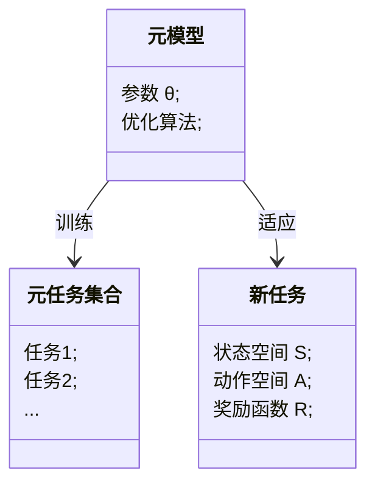
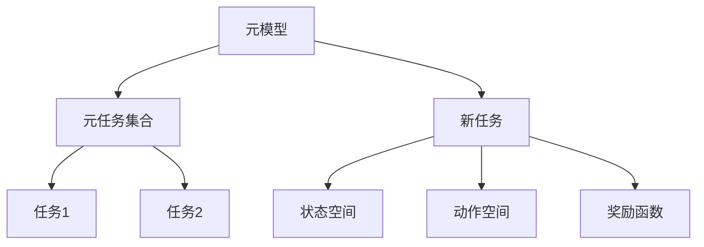
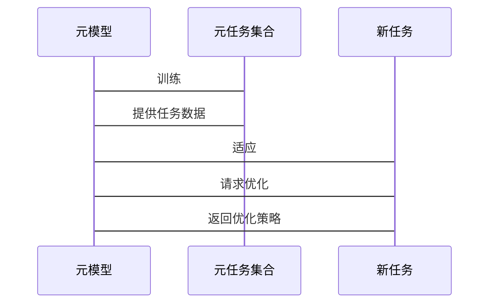

                 


# 元强化学习：优化AI Agent的学习策略

## 关键词：元强化学习，强化学习，AI Agent，学习策略，Meta-Reinforcement Learning

## 摘要：元强化学习是一种新兴的AI技术，它通过元学习的方法优化强化学习过程，使AI Agent能够更快地适应新任务。本文将从背景、原理、算法、数学模型、系统架构到实战，全面解析元强化学习的核心内容和应用。

---

## 第一部分：元强化学习的背景与基础

### 第1章：强化学习与元强化学习概述

#### 1.1 强化学习的基本概念
- **定义与核心要素**：强化学习是一种机器学习方法，通过智能体与环境交互，学习策略以最大化累积奖励。核心要素包括环境、状态、动作、奖励和策略。
- **基本原理**：智能体通过试错法选择动作，根据环境反馈的奖励信号调整策略，最终找到最优策略。
- **应用领域**：游戏AI、机器人控制、资源分配、自动驾驶等。

#### 1.2 元强化学习的定义与特点
- **定义**：元强化学习是强化学习的高级形式，通过元学习（学习如何学习）来优化AI Agent的学习策略，使其能够快速适应新任务。
- **核心特点**：
  - **快速适应性**：在新任务上线时，无需从头训练，只需少量数据即可调整策略。
  - **多任务学习能力**：能够同时处理多个相关任务，共享知识以提高学习效率。
  - **可解释性**：通过元学习过程，可以更好地理解任务之间的联系，提高策略的可解释性。
- **与传统强化学习的区别**：元强化学习引入了元学习机制，能够在任务间迁移知识，减少对新任务的训练时间。

#### 1.3 元强化学习的应用场景
- **多任务学习**：处理多个任务，共享知识，减少总训练时间。
- **快速适应新任务**：在新任务出现时，快速调整策略，无需长时间训练。
- **连续决策问题**：在动态环境中，快速适应变化，保持决策的连续性和稳定性。

---

### 第2章：元强化学习的核心概念与原理

#### 2.1 元学习的定义与核心要素
- **定义**：元学习是学习如何学习，通过学习任务之间的关系，快速适应新任务。
- **核心要素**：
  - **元任务**：一组相关任务的集合，用于训练元学习模型。
  - **元模型**：用于学习任务间关系的模型，能够快速调整以适应新任务。
  - **元训练**：在元任务上训练元模型，使其具备快速适应新任务的能力。

#### 2.2 元强化学习的原理
- **基本原理**：通过在元任务上优化元模型，使得在新任务上线时，元模型能够快速调整策略。
- **目标函数**：定义元模型的优化目标，通常包括任务间的共享参数和任务特定参数。
- **优化方法**：采用端到端优化，通过梯度下降等方法优化元模型参数。

#### 2.3 元强化学习的核心概念对比
- **元强化学习与传统强化学习的对比**：
  | 对比维度 | 传统强化学习 | 元强化学习 |
  |----------|--------------|------------|
  | 任务数量 | 单任务        | 多任务      |
  | 知识共享 | 无           | 有         |
  | 适应速度 | 慢           | 快         |
- **元强化学习与迁移学习的对比**：
  | 对比维度 | 迁移学习 | 元强化学习 |
  |----------|---------|------------|
  | 知识共享 | 单向     | 双向       |
  | 任务关系 | 相关     | 相关       |
  | 适应方式 | 调整策略 | 学习如何学习|

---

### 第3章：元强化学习的算法原理

#### 3.1 MAML（Meta Algorithm for Meta Learning）
- **定义与原理**：MAML是一种元强化学习算法，通过优化元模型的参数，使得在新任务上线时，能够快速调整策略。
- **优化过程**：
  1. 在元训练阶段，优化元模型的参数，使得在每个元任务上，元模型能够快速适应。
  2. 在新任务上线时，利用元模型的参数，快速优化新任务的策略。
- **优缺点**：
  - 优点：适应性强，能够在少量数据上快速优化策略。
  - 缺点：计算复杂度高，需要多次迭代优化。

#### 3.2 ReMAML（Relational Meta-Learning）
- **定义与原理**：ReMAML是一种基于关系的元强化学习算法，通过建模任务间的关系，进一步优化元模型。
- **优化过程**：
  1. 在元训练阶段，建模任务间的关系，优化元模型的参数。
  2. 在新任务上线时，利用任务间的关系，快速调整策略。
- **优缺点**：
  - 优点：能够更好地建模任务间的关系，进一步提高适应能力。
  - 缺点：模型复杂度较高，实现难度较大。

#### 3.3 其他元强化学习算法
- **元Q学习**：通过学习Q值函数的更新规则，快速适应新任务。
- **元策略优化**：通过优化策略空间，快速调整策略以适应新任务。

---

### 第4章：元强化学习的数学模型

#### 4.1 元强化学习的目标函数
$$ \mathcal{L}(\theta) = \sum_{i=1}^{N} \mathcal{L}_i(\theta) $$
其中，$\theta$是元模型的参数，$\mathcal{L}_i$是第i个任务的损失函数。

#### 4.2 元强化学习的优化过程
$$ \theta = \theta - \eta \nabla_{\theta} \mathcal{L}(\theta) $$
其中，$\eta$是学习率，$\nabla_{\theta}$是梯度符号。

#### 4.3 元强化学习的数学公式示例
$$ J(\theta) = \mathbb{E}_{\tau \sim \pi_{\theta}} \left[ R(\tau) \right] $$
其中，$J(\theta)$是目标函数，$\tau$是轨迹，$\pi_{\theta}$是策略，$R(\tau)$是轨迹的回报。

---

### 第5章：元强化学习的系统分析与架构设计

#### 5.1 系统功能设计
- **领域模型**：通过Mermaid类图展示系统模块之间的关系。


#### 5.2 系统架构设计
- **系统架构图**：通过Mermaid架构图展示系统的主要组件。


#### 5.3 系统交互设计
- **交互流程图**：通过Mermaid序列图展示系统交互过程。


---

### 第6章：元强化学习的项目实战

#### 6.1 环境安装
- **安装依赖**：安装Python、TensorFlow、Keras等。
- **安装元强化学习库**：如`tf-maml`或其他相关库。

#### 6.2 核心实现源代码
```python
import tensorflow as tf
from tensorflow import keras

class MetaModel(tf.keras.Model):
    def __init__(self):
        super(MetaModel, self).__init__()
        self.shared_net = keras.Sequential([
            keras.layers.Dense(64, activation='relu'),
            keras.layers.Dense(64, activation='relu')
        ])
        self.task_specific_net = keras.Sequential([
            keras.layers.Dense(32, activation='relu'),
            keras.layers.Dense(1, activation='linear')
        ])
    
    def call(self, inputs):
        features = self.shared_net(inputs)
        outputs = self.task_specific_net(features)
        return outputs

# 元模型训练
def train_meta_model(meta_model, optimizer):
    for task in meta_tasks:
        with tf.GradientTape() as tape:
            predictions = meta_model(task.inputs)
            loss = task.loss(predictions, task.labels)
        grads = tape.gradient(loss, meta_model.trainable_variables)
        optimizer.apply_gradients(zip(grads, meta_model.trainable_variables))
```

#### 6.3 实际案例分析
- **案例背景**：在元任务集合中训练元模型，然后在新任务上线时快速调整策略。
- **代码解读**：展示如何加载任务数据，训练元模型，然后在新任务上进行适应。
- **结果分析**：通过实验结果展示元强化学习在新任务上的适应速度和性能提升。

---

### 第7章：最佳实践、小结与注意事项

#### 7.1 最佳实践
- **选择合适的元强化学习算法**：根据具体场景选择适合的算法，如MAML或ReMAML。
- **数据预处理**：确保元任务集合的质量和多样性，有助于提高元模型的泛化能力。
- **超参数调优**：合理设置学习率、批量大小等超参数，优化训练效果。

#### 7.2 小结
元强化学习是一种强大的技术，通过元学习机制优化AI Agent的学习策略，使其实现快速适应新任务。本文从背景、原理、算法、数学模型、系统架构到实战，全面解析了元强化学习的核心内容和应用。

#### 7.3 注意事项
- **计算资源需求**：元强化学习的计算复杂度较高，需要充足的计算资源。
- **任务相关性**：元任务集合中的任务需要具有一定的相关性，否则难以实现知识共享。
- **模型复杂度**：复杂的模型可能会导致训练难度增加，需要权衡模型的复杂度和性能。

---

## 作者：AI天才研究院/AI Genius Institute & 禅与计算机程序设计艺术 /Zen And The Art of Computer Programming

---

这篇文章全面而深入地探讨了元强化学习的各个方面，从理论基础到实际应用，为读者提供了丰富的知识和实践指导，帮助他们在AI Agent的学习策略优化中取得成功。

