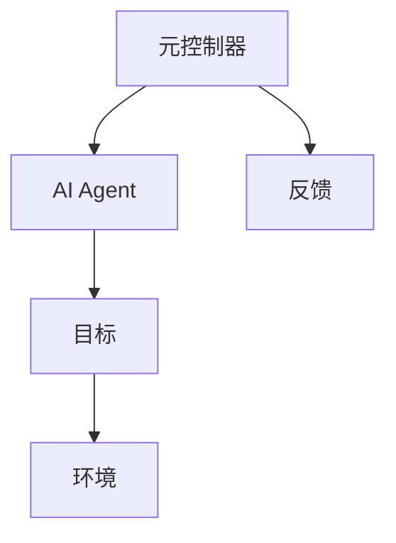
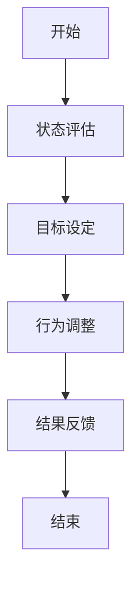

                 


# 元控制技术：AI Agent的自适应行为管理

> 关键词：元控制技术、AI Agent、自适应行为管理、动态目标调整、行为优化

> 摘要：本文详细探讨了元控制技术在AI Agent自适应行为管理中的应用，从背景、核心概念、算法原理到系统架构、项目实战，最后总结了最佳实践，旨在为读者提供全面的指导和深刻的见解。

---

## 第一章: 元控制技术的背景与问题背景

### 1.1 元控制技术的定义与问题背景

#### 1.1.1 元控制技术的定义
元控制技术是一种用于管理AI Agent行为的高级技术，通过动态调整目标、策略和约束条件，使AI Agent能够在复杂多变的环境中自适应地执行任务。

#### 1.1.2 问题背景与问题描述
随着AI Agent应用场景的扩展，传统的行为管理方法在面对动态变化的环境时显得力不从心。例如，在自动驾驶中，AI Agent需要在复杂的交通环境中实时调整策略，以应对突发事件和环境变化。

#### 1.1.3 元控制技术的必要性与目标
元控制技术的引入旨在解决这些动态变化带来的挑战，其目标是通过自适应调整，确保AI Agent能够在复杂环境中高效、安全地完成任务。

### 1.2 元控制技术的核心概念

#### 1.2.1 元控制的定义与特征
元控制是一种多层次的控制机制，通过元控制器对AI Agent的行为进行监控和调整。其特征包括动态性、自适应性和智能化。

#### 1.2.2 AI Agent行为管理的必要性
AI Agent需要在复杂环境中进行决策和行动，行为管理能够确保其行动符合预期目标，避免错误和风险。

#### 1.2.3 元控制与传统控制的对比
| 特性      | 元控制                     | 传统控制                  |
|-----------|--------------------------|--------------------------|
| 目标      | 动态调整目标               | 静态设定目标              |
| 灵活性     | 高                        | 中                        |
| 智能性     | 高                        | 低                        |

---

## 第二章: 元控制技术的核心概念与联系

### 2.1 元控制技术的核心原理

#### 2.1.1 元控制的核心机制
元控制器通过监控AI Agent的状态和环境反馈，动态调整其行为策略。例如，在游戏中，元控制器可以根据对手的策略调整AI Agent的战术。

#### 2.1.2 元控制的系统架构
元控制系统的架构包括元控制器、AI Agent、环境接口等模块。

### 2.2 实体关系图



---

## 第三章: 元控制技术的算法原理

### 3.1 算法概述

#### 3.1.1 算法的目标与输入
算法目标是通过动态调整参数，优化AI Agent的行为。输入包括当前状态、环境反馈等。

#### 3.1.2 算法的实现步骤



### 3.2 数学模型与公式

#### 3.2.1 优化函数
$$ \text{minimize } f(x) $$

#### 3.2.2 约束条件
$$ g(x) \leq 0 $$

---

## 第四章: 系统架构设计

### 4.1 系统构成

#### 4.1.1 元控制器模块
负责监控和调整AI Agent的行为。

#### 4.1.2 AI Agent模块
执行具体任务。

### 4.2 系统架构图


---

## 第五章: 项目实战

### 5.1 环境安装
安装必要的库和工具，如Python和相关框架。

### 5.2 核心代码实现

```python
def meta_controller(agent, state):
    # 状态评估
    current_state = state
    # 目标设定
    target = determine_target(current_state)
    # 行为调整
    adjusted_action = adjust_behavior(agent.action, target)
    return adjusted_action
```

### 5.3 案例分析
通过具体案例分析元控制技术的实际应用，如智能客服系统中的动态调整。

---

## 第六章: 最佳实践

### 6.1 小结
元控制技术通过动态调整，提升了AI Agent的自适应能力。

### 6.2 注意事项
在设计元控制时，需注意系统的实时性和稳定性。

### 6.3 未来趋势
元控制技术将与边缘计算、物联网等技术深度融合。

---

## 总结

元控制技术为AI Agent的自适应行为管理提供了强有力的支持，通过动态调整目标和策略，使其在复杂环境中高效运作。随着技术的发展，元控制将在更多领域发挥重要作用。

---

作者：AI天才研究院/AI Genius Institute & 禅与计算机程序设计艺术 /Zen And The Art of Computer Programming

