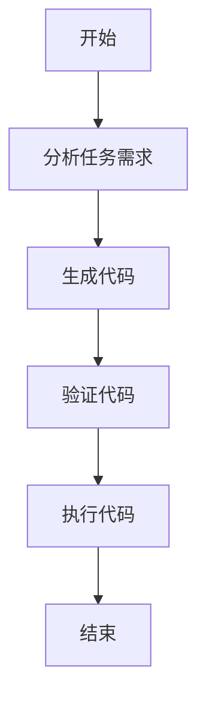
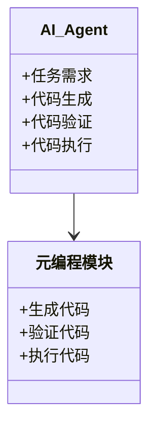
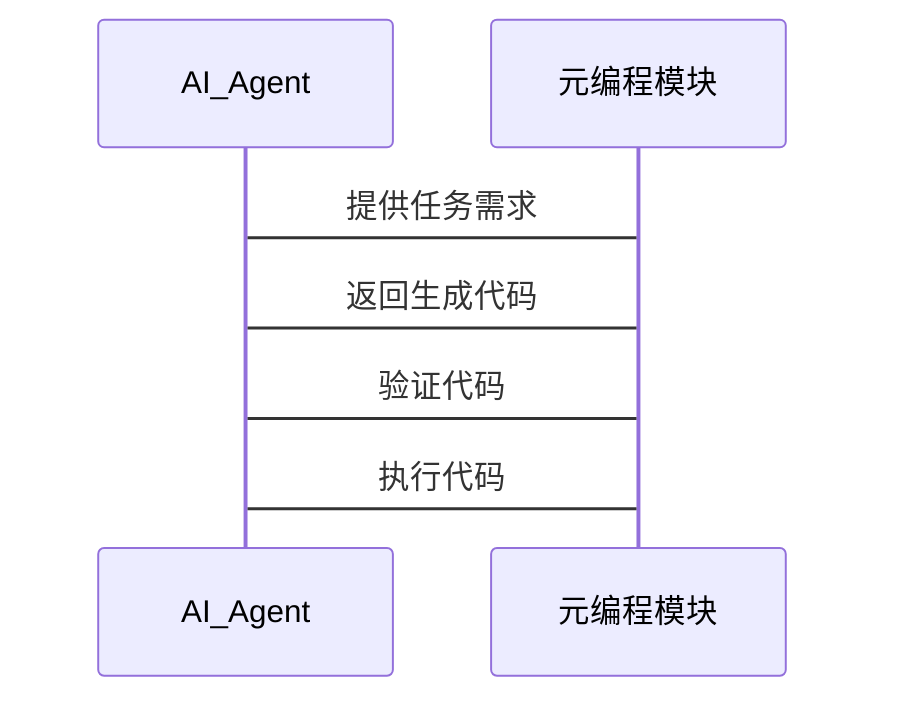

                 


# 元编程技术：使AI Agent具备代码生成能力

> **关键词**：元编程技术、AI Agent、代码生成、生成式AI、自然语言处理、编程语言

> **摘要**：  
本文深入探讨了元编程技术在AI Agent中的应用，详细讲解了如何通过元编程使AI Agent具备代码生成能力。文章从元编程与AI Agent的基本概念出发，分析了两者结合的背景与优势，重点阐述了生成式AI的算法原理、代码生成策略，以及系统的架构设计与实现方案。通过实际案例和项目实战，展示了如何利用元编程技术赋能AI Agent，使其能够自动生成高质量代码。本文还总结了元编程与AI Agent结合的最佳实践，为读者提供了全面的技术指导。

---

# 第1章: 元编程技术概述

## 1.1 元编程的基本概念

### 1.1.1 元编程的定义与特点
元编程（Metaprogramming）是指编写能够生成或操作其他程序的代码。它的核心在于“程序生成程序”。元编程的特点包括：
- **抽象性**：元编程通过抽象语法树（AST）或中间表示（IR）操作代码。
- **动态性**：能够根据运行时环境动态生成代码。
- **高效性**：通过代码生成优化性能，减少运行时计算。

### 1.1.2 元编程的核心概念与实现方式
元编程的核心概念包括：
- **宏（Macro）**：在编译时生成代码（如C语言的`gcc`插件）。
- **反射（Reflection）**：在运行时 inspect 和操作程序结构（如Python的`inspect`模块）。
- **模板（Template）**：编译时生成代码（如C++的`std::template`）。

### 1.1.3 元编程在计算机科学中的地位与作用
元编程是计算机科学中的高级技术，广泛应用于编译器生成、代码优化、自动化测试等领域。它通过自动化代码生成，降低了开发复杂性，提高了开发效率。

---

## 1.2 AI Agent的基本原理

### 1.2.1 AI Agent的定义与分类
AI Agent是一种智能体，能够感知环境、自主决策并执行任务。常见分类包括：
- **简单反射型AI Agent**：基于规则执行任务。
- **基于模型的AI Agent**：使用内部模型进行推理。
- **目标驱动型AI Agent**：根据目标选择行动。

### 1.2.2 AI Agent的核心功能与技术
AI Agent的核心功能包括：
- **感知环境**：通过传感器或API获取信息。
- **决策与推理**：基于信息做出决策。
- **执行任务**：通过动作或代码实现目标。

### 1.2.3 AI Agent在现代计算机系统中的应用
AI Agent在机器人控制、智能推荐、自动化测试等领域有广泛应用。例如，自动驾驶汽车中的AI Agent负责实时决策和控制。

---

## 1.3 元编程与AI Agent的结合背景

### 1.3.1 元编程技术的发展历程
元编程从早期的编译器生成技术发展到现代的生成式AI，经历了多个阶段：
- **传统元编程**：如C语言的`gcc`插件。
- **生成式AI**：如基于Transformer的代码生成模型。

### 1.3.2 AI Agent技术的演进与现状
AI Agent技术从基于规则的简单系统发展到复杂的自主系统，元编程为其提供了强大的代码生成能力。

### 1.3.3 元编程与AI Agent结合的必要性与趋势
随着AI Agent的应用场景越来越复杂，代码生成能力成为其核心竞争力。元编程通过自动化代码生成，使AI Agent能够快速适应新的任务需求。

---

## 1.4 本章小结

本章介绍了元编程和AI Agent的基本概念，分析了它们结合的背景和优势。元编程为AI Agent提供了代码生成能力，使其能够更高效地完成复杂任务。

---

# 第2章: 元编程技术在AI Agent中的应用背景

## 2.1 当前AI Agent代码生成的痛点与挑战

### 2.1.1 AI Agent代码生成的痛点分析
AI Agent在复杂环境中需要快速生成代码，但传统方法存在以下痛点：
- **效率低下**：手动编写代码耗时耗力。
- **错误率高**：人工编写容易出错。
- **适应性差**：难以快速适应新任务。

### 2.1.2 当前技术的局限性与改进方向
传统AI Agent代码生成技术依赖于固定的模板，缺乏灵活性和可扩展性。元编程技术的引入解决了这些问题。

### 2.1.3 元编程技术如何解决这些问题
元编程通过动态生成代码，使AI Agent能够快速响应环境变化，提高了代码生成的效率和准确性。

---

## 2.2 元编程技术的核心优势

### 2.2.1 动态代码生成的优势
动态代码生成能够根据运行时需求快速生成代码，提高了系统的灵活性。

### 2.2.2 元编程对AI Agent的赋能作用
元编程使AI Agent具备了代码生成能力，能够快速实现复杂任务。

### 2.2.3 元编程技术的灵活性与可扩展性
元编程支持多种编程语言和框架，能够适应不同应用场景的需求。

---

## 2.3 元编程与AI Agent结合的潜在价值

### 2.3.1 提高AI Agent的智能化水平
元编程使AI Agent能够自动生成代码，提升了其智能化水平。

### 2.3.2 降低AI Agent的开发门槛
通过元编程，开发者可以更轻松地构建AI Agent，降低了开发门槛。

### 2.3.3 推动AI Agent在更多领域的应用
元编程技术的引入使AI Agent能够应用于更多领域，如自动驾驶、智能机器人等。

---

## 2.4 本章小结

本章分析了元编程技术在AI Agent中的应用背景，强调了其在代码生成方面的优势和潜在价值。

---

# 第3章: 元编程与AI Agent的核心概念与联系

## 3.1 元编程与AI Agent的协同工作原理

### 3.1.1 元编程在AI Agent中的角色
元编程作为AI Agent的“代码生成器”，负责根据需求生成代码。

### 3.1.2 AI Agent如何利用元编程技术
AI Agent通过元编程技术生成代码，实现复杂任务的自动化。

### 3.1.3 元编程与AI Agent的交互流程
1. AI Agent感知环境，确定任务需求。
2. 元编程根据需求生成代码。
3. AI Agent执行生成的代码，完成任务。

---

## 3.2 元编程与AI Agent的核心概念对比

### 3.2.1 元编程的核心概念
- **宏**：在编译时生成代码。
- **反射**：在运行时操作程序结构。
- **模板**：在编译时生成代码。

### 3.2.2 AI Agent的核心概念
- **感知**：获取环境信息。
- **决策**：基于信息做出决策。
- **执行**：通过代码或动作实现目标。

### 3.2.3 两者概念的异同点分析
| 概念 | 元编程 | AI Agent |
|------|--------|----------|
| 核心功能 | 生成代码 | 感知、决策、执行 |
| 依赖性 | 依赖编程语言 | 依赖感知能力和执行能力 |

---

## 3.3 元编程与AI Agent的协同工作模式

### 3.3.1 基于规则的协同模式
通过预定义规则生成代码，适用于简单任务。

### 3.3.2 基于模型的协同模式
基于内部模型生成代码，适用于复杂任务。

### 3.3.3 基于上下文的协同模式
根据上下文信息动态生成代码，适用于动态环境。

---

## 3.4 本章小结

本章详细分析了元编程与AI Agent的核心概念与协同工作模式，强调了它们结合的必要性与优势。

---

# 第4章: 元编程技术与AI Agent的算法原理

## 4.1 生成式AI的算法基础

### 4.1.1 Transformer模型的结构
Transformer模型由编码器和解码器组成，广泛应用于自然语言处理。

### 4.1.2 Transformer模型的代码生成能力
通过调整模型参数，Transformer可以生成任意编程语言的代码。

### 4.1.3 代码生成的数学模型
代码生成基于Transformer的自注意力机制，数学模型如下：

$$
\text{Output} = f(x, y, z)
$$

其中，$x$、$y$、$z$分别表示输入、位置和词表信息。

---

## 4.2 代码生成策略

### 4.2.1 基于上下文的代码生成
通过分析代码上下文，生成符合语法规则的代码。

### 4.2.2 基于规则的代码生成
利用预定义规则生成代码片段。

### 4.2.3 基于模型的代码生成
通过训练模型生成代码，支持多种编程语言。

---

## 4.3 算法流程图



---

## 4.4 本章小结

本章介绍了生成式AI的算法基础，分析了代码生成策略，并通过流程图展示了算法的执行过程。

---

# 第5章: 元编程与AI Agent的系统架构设计

## 5.1 系统整体架构

### 5.1.1 系统功能模块
- **任务需求分析模块**：分析任务需求。
- **代码生成模块**：生成代码。
- **代码验证模块**：验证代码的正确性。
- **代码执行模块**：执行代码。

### 5.1.2 系统架构图


---

## 5.2 系统功能设计

### 5.2.1 领域模型设计


### 5.2.2 系统接口设计
- **输入接口**：接收任务需求。
- **输出接口**：输出生成的代码。
- **验证接口**：验证代码的正确性。

### 5.2.3 系统交互流程


---

## 5.3 本章小结

本章详细设计了系统的整体架构和功能模块，通过类图和序列图展示了系统的交互流程。

---

# 第6章: 元编程与AI Agent的项目实战

## 6.1 环境安装与配置

### 6.1.1 安装Python环境
使用Python 3.8及以上版本。

### 6.1.2 安装必要的库
```bash
pip install transformers
pip install torch
pip install numpy
```

---

## 6.2 系统核心实现

### 6.2.1 代码生成模块的实现
```python
def generate_code(task_description):
    # 使用预训练的Transformer模型生成代码
    pass
```

### 6.2.2 代码验证模块的实现
```python
def verify_code(code):
    # 验证代码的语法和逻辑
    pass
```

### 6.2.3 代码执行模块的实现
```python
def execute_code(code):
    # 执行生成的代码
    pass
```

---

## 6.3 代码应用解读与分析

### 6.3.1 实际案例分析
假设任务需求是生成一个Web爬虫，代码生成模块会生成Python的`requests`库代码。

### 6.3.2 代码解读与分析
生成的代码需要经过验证模块的验证，确保语法正确。

---

## 6.4 本章小结

本章通过实际案例展示了系统的实现过程，强调了代码生成、验证和执行的重要性。

---

# 第7章: 元编程与AI Agent的优化与扩展

## 7.1 系统优化策略

### 7.1.1 提高代码生成的准确率
通过微调模型参数，提高代码生成的准确率。

### 7.1.2 提高系统的运行效率
优化代码生成模块的性能，减少生成时间。

### 7.1.3 提高系统的可扩展性
支持多种编程语言和框架。

---

## 7.2 系统功能扩展

### 7.2.1 支持多语言代码生成
扩展系统，支持Python、Java等多种编程语言。

### 7.2.2 支持代码优化
在生成代码的基础上，优化代码性能。

### 7.2.3 支持代码调试
提供调试功能，帮助用户修复代码错误。

---

## 7.3 本章小结

本章提出了系统的优化策略和功能扩展方向，为后续研究提供了方向。

---

# 第8章: 元编程与AI Agent的未来发展

## 8.1 未来的技术趋势

### 8.1.1 元编程技术的进一步发展
元编程技术将更加智能化，支持自适应代码生成。

### 8.1.2 AI Agent的智能化水平提升
AI Agent将具备更强的自主决策能力和代码生成能力。

### 8.1.3 两者的深度融合
元编程与AI Agent将深度融合，推动AI技术的进一步发展。

---

## 8.2 本章小结

本章展望了元编程与AI Agent的未来发展趋势，强调了它们深度融合的重要性。

---

# 作者

作者：AI天才研究院/AI Genius Institute & 禅与计算机程序设计艺术 /Zen And The Art of Computer Programming

---

通过以上内容，我们详细探讨了元编程技术在AI Agent中的应用，从理论到实践，为读者提供了全面的技术指导。希望本文能为相关领域的研究者和开发者提供有价值的参考。

